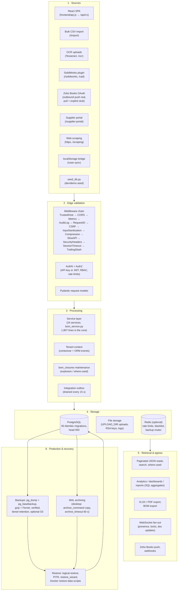

# Data Handling — Blackbox BOM

> **Scope.** This document describes the complete data lifecycle of the Blackbox BOM tool: where data enters the system, how it is validated and processed, how it is stored in PostgreSQL (schema and key relationships), how it is retrieved and aggregated, how it leaves the system (exports and integrations), how it is protected (multi-tenancy, Row-Level Security, security controls, backups, WAL/PITR), how it is recovered after failure, and how integrity, retention, and errors are handled.
>
> **Grounding.** Everything in this document comes from a read-only audit of the actual codebase (backend `app/`, `alembic/`, `seed_db.py`, `desktop/`, `frontend/`, Docker/CI assets). Where a feature is a **stub or mock**, that is stated plainly instead of describing aspirational behavior. Defects that affect data safety are marked inline with ⚠️ and collected in [§19](#19-known-issues-that-affect-data-handling).
>
> **Related documents:** [PROJECT_ARCHITECTURE.md](PROJECT_ARCHITECTURE.md) and [ARCHITECTURE.md](ARCHITECTURE.md) (system architecture), [PROJECT_FEATURES_DOCUMENTATION.md](PROJECT_FEATURES_DOCUMENTATION.md) (feature inventory with REAL/PARTIAL/MOCK status — the sibling doc to check before trusting any screen's data), [UI_UX_DOCUMENTATION.md](UI_UX_DOCUMENTATION.md) (screen-by-screen UI/UX detail), [RECOMMENDED_MAJOR_IMPROVEMENTS.md](RECOMMENDED_MAJOR_IMPROVEMENTS.md) (the gaps this document flags as not-yet-implemented — bulk import record creation, BOM file-import parsing — tracked there as improvement items), [PATCHES_APPLIED.md](PATCHES_APPLIED.md) (the commit-by-commit record of every fix referenced below as ✅), [DEPLOYMENT_GUIDE.md](DEPLOYMENT_GUIDE.md) and [FIRST_TIME_SETUP.md](FIRST_TIME_SETUP.md) (deployment and setup), [SYSTEM_WORKFLOW.md](SYSTEM_WORKFLOW.md) (end-to-end flows), [MODULE_REFERENCE.md](MODULE_REFERENCE.md) (per-module reference), [FEATURE_CATALOG.md](FEATURE_CATALOG.md) (older, broader feature inventory), [DISASTER_RECOVERY_RUNBOOK.md](DISASTER_RECOVERY_RUNBOOK.md) (operational DR procedures), [INSTALL.md](INSTALL.md) (Docker install + backup/restore scripts), [TESTING_AND_VALIDATION.md](TESTING_AND_VALIDATION.md) (test coverage), [SECURITY.md](SECURITY.md), [ISSUES.md](ISSUES.md) and [OPEN_ITEMS.md](OPEN_ITEMS.md) (tracked gaps), `docs/audit-2026-08/FIX_COVERAGE.md` and `docs/audit-2026-08/FINDINGS_FULL_SCAN.md` (this week's line-by-line audit: 43 of 74 findings fixed, 31 deferred — the primary source for every ✅/⚠️ fixed-vs-open call in this document), [desktop/DURABILITY.md](desktop/DURABILITY.md) and [desktop/DESKTOP_PACKAGING.md](desktop/DESKTOP_PACKAGING.md) (desktop durability and packaging), `backend/docs/data-dictionary.md` (column-level dictionary), `backend/docs/API_REFERENCE.md` (endpoint reference).

---

## Table of contents

1. [The data lifecycle at a glance](#1-the-data-lifecycle-at-a-glance)
2. [Data sources — where data enters the system](#2-data-sources--where-data-enters-the-system)
3. [Validation and sanitization](#3-validation-and-sanitization)
4. [Processing — the request pipeline](#4-processing--the-request-pipeline)
5. [Storage — the PostgreSQL schema](#5-storage--the-postgresql-schema)
6. [Core tables and relationships (ER diagram)](#6-core-tables-and-relationships-er-diagram)
7. [Multi-tenancy and Row-Level Security](#7-multi-tenancy-and-row-level-security)
8. [Retrieval — how data is read back](#8-retrieval--how-data-is-read-back)
9. [Aggregation, analytics, and reports](#9-aggregation-analytics-and-reports)
10. [Import and export](#10-import-and-export)
11. [File and document handling](#11-file-and-document-handling)
12. [Real-time data and external sync](#12-real-time-data-and-external-sync)
13. [Backup — logical dumps, physical basebackups, WAL archiving](#13-backup--logical-dumps-physical-basebackups-wal-archiving)
14. [Restore, PITR, and disaster recovery](#14-restore-pitr-and-disaster-recovery)
15. [Data security](#15-data-security)
16. [Data integrity](#16-data-integrity)
17. [Retention and deletion](#17-retention-and-deletion)
18. [Error handling and observability](#18-error-handling-and-observability)
19. [Known issues that affect data handling](#19-known-issues-that-affect-data-handling)

---

## 1. The data lifecycle at a glance

Blackbox BOM is a **local-first** system: a single async FastAPI process (`backend/app/main.py`) owns the entire data plane — the JSON API under `/api/v1`, WebSockets at `/ws/{channel}`, and (in the desktop bundle, opt-in via `SERVE_FRONTEND`) the built React SPA served by a catch-all route. All persistent business data lives in **one PostgreSQL database**:

| Deployment | PostgreSQL | Backend | Frontend |
|---|---|---|---|
| **Windows desktop** (installer, `desktop/launcher.py`) | Bundled PostgreSQL 16.9, loopback-only, port **55432** | `backend.exe` on **127.0.0.1:8756**, also serves the SPA | Same process |
| **Docker** (`docker-compose.yml`) | `postgres:15-alpine`, port 5432 | uvicorn on **:8000** | nginx on **:80**, proxying `/api` and `/ws` |

Redis is used **opportunistically** (rate limits, JWT blacklist, backup mutex) and every Redis-backed feature has an in-memory fallback, so the system keeps functioning without it — consistent with the local-first principle that network connectivity is optional, never required.

The lifecycle, end to end:



**Why this shape?** The product decision (see the locked build decisions and the local-first principle) is that the *primary* copy of all data lives on-premises — inside `%ProgramData%\BlackboxBOM` on desktop or in Docker volumes — with cloud connectivity (S3 backup upload, Zoho Books, update feed) strictly optional. Every stage below is designed so the system degrades gracefully when the network or Redis is absent.

---

## 2. Data sources — where data enters the system

### 2.1 The React SPA (primary source)

Nearly all data originates from users working in the React frontend. `frontend/api.js` (~1,445 lines, ~60 endpoint groups) funnels **every** call through one `apiRequest()` function that:

- targets same-origin `/api/v1` (from `src/config.js`; `window.__BBOX_CONFIG` can override for cross-origin),
- authenticates with **cookies** (`credentials: 'include'` — tokens are never stored in JS),
- attaches a **CSRF double-submit** header (`X-CSRF-Token`) on non-GET requests,
- performs a **deduplicated silent token refresh** on 401 (a single shared `POST /auth/refresh` promise; refreshed → one retry; unauthorized → global logout; transient 429/5xx/network → soft-fail *without* logout),
- applies a **per-resource circuit breaker** (5 failures in 30 s opens the circuit for that path segment) and a bounded retry loop (2 retries, linear backoff, `Retry-After` honored for 429).

⚠️ Three data-entry caveats on this path, all confirmed in `frontend/api.js` / `frontend/src/context/AppCtx.jsx`:

1. **Non-idempotent retries.** The retry loop re-sends POST/PUT/DELETE on network errors with no idempotency keys — a write that succeeded server-side but lost its response can be **submitted twice** (duplicate parts, POs, comments).
2. **4xx counts as failure.** Deterministic client errors (400/404/422) are retried and counted toward the circuit-breaker threshold; five consecutive 404s block a whole resource for 30 s.
3. **Hardcoded BOM id fallback.** `AppCtx.jsx` computes `bomId = project?.id || project?.bomId || data?.project?.id || 1` — structural BOM edits can silently target **bom_id 1** when no real id is threaded through. Once multiple real BOMs exist, this is a cross-BOM write hazard.

### 2.2 Bulk CSV import — staging only, does not create records yet

`POST /api/v1/import` (`app/api/endpoints/bulk_import.py`, 240 lines): `upload` parses the CSV into a `BulkImportJob` + one `BulkImportRow` per line (raw `rowData` JSON, tenant-scoped), `{job_id}/process` remaps each row's keys through the caller-supplied `mappingConfig` (e.g. `{"pn": "Part Number"}`) and marks rows `processed`/`error`, and `{job_id}/status` / `{job_id}/errors` / `jobs` let the UI poll progress and inspect failures.

⚠️ **This is honest staging, not an import pipeline.** `process_import` only rewrites the JSON keys on each `BulkImportRow` — it never constructs a `Part`, never calls `part_service`, and never touches the `parts` table. A "completed" job with `errorRows == 0` means every row's columns were successfully renamed, nothing more; no parts exist afterward that didn't exist before. Turning the staged, remapped rows into real `Part` rows is tracked as a gap in [RECOMMENDED_MAJOR_IMPROVEMENTS.md](RECOMMENDED_MAJOR_IMPROVEMENTS.md) — do not rely on this endpoint to populate the item master today. The frontend BulkImport screen (`root/integration-screens.jsx`) and the shell's drag-and-drop CSV import (`src/screens/App.jsx`) are wired to these real endpoints, so the upload/mapping/status UI works end-to-end — it is the "then the parts appear in the catalog" step that is missing.

Also note `GET /all/status` returns **every tenant's** jobs (not tenant-scoped, kept for backward compatibility) while `GET /jobs` is correctly tenant-scoped — the bulk-import screen must call `/jobs`, never `/all/status`.

### 2.3 OCR ingestion

`app/api/endpoints/ocr.py` (266 lines): `extract` / `extract-file` / `confirm` run **real Tesseract OCR plus regex extraction** against uploaded documents. ⚠️ In the UI, OCRScreen's "Apply to part" button only shows a toast — it never calls `api.parts.update` — so OCR data currently ends at the review stage unless entered manually (PARTIAL implementation).

### 2.4 SolidWorks / CAD

Two overlapping surfaces exist (a known duplication):

- `/solidworks` (`solidworks_integration.py`, 652 lines — the largest endpoint file): bidirectional sync, BOM structure, images, vault stats/tree, attribute extraction, license verify/activate.
- `/cad` (`cad.py`, 211 lines): re-implements sync/apply-sync/extract-attrs/vault routes with its own inline ORM logic.

Persistent CAD data lands in `sw_property_mappings` (CAD property name → part field), `sw_pending_changes` (a **write-back outbox** of changes destined for SolidWorks), and `part_derivatives` (typed links to derived files: `pdf|step|dwg|dxf|other`), all added by migration 047. A third module, `solidworks_contract.py` (property-mapping CRUD + complex part-number generation for the SolidWorks add-in), used to be fully written but never mounted; it is now registered in `api_v1.py` under the same `/solidworks` prefix as `solidworks_integration.py` (§8.1) — reachable over HTTP, though the two-module duplication itself is unchanged.

### 2.5 Zoho Books (partial by design)

`/integrations/zoho_books` (`zoho_books.py`, 395 lines): the OAuth connect flow, organization selection, **outbound push sync**, status, and mappings are implemented. **Pull / reconcile / conflict-resolution endpoints return an explicit "not implemented in this build" response** (stated in the module docstring) — this is increment 2a of the Zoho plan. Sync bookkeeping lives in dedicated tables (`zoho_sync_state`, `zoho_sync_cursor`, `zoho_sync_log`, §6), and the app lifespan runs a 60-second inbound poll tick plus a 15-second integration-outbox drainer.

### 2.6 Supplier portal

`/supplier-portal` (`supplier_portal.py`, 405 lines): supplier login, users, price-update submissions with approve/reject, and RFQ respond/award. This is external-party data entering the system and is fully implemented.

### 2.7 Web scraping

`/scraping` (`scraping.py`, 106 lines): a **real** `httpx` fetch + regex extraction with history. ⚠️ Do not confuse it with the frontend's `InternetScrapeModal`, which is a **MOCK** (a `setTimeout` fake with canned Digi-Key/Mouser results that never calls the API).

### 2.8 localStorage sync bridge

`/user-sync` (`user_sync.py`, 321 lines) migrates browser-local data into Postgres: data-store, preferences, checklist, BOM drafts, scan history, saved searches, plus `sync-all` and `export-all`. This exists because the frontend is mid-migration from a demo-era localStorage architecture; `frontend/src/services/dataService.js` queues writes while offline and replays them when `/health` succeeds.

### 2.9 Seed data (development only)

`backend/seed_db.py` creates a "Blackbox Factories"/"BBF" tenant with 5 parts, 4 vendors, 2 projects, and 1 draft BOM per project. Safety properties: it refuses to seed an admin user unless `SEED_ADMIN_PASSWORD` is set **and** the environment is not production. ⚠️ Two caveats: it bootstraps schema via `Base.metadata.create_all` **without stamping `alembic_version`** (a DB born this way diverges from migration-managed DDL — partial indexes, RLS, and data backfills that exist only in migrations are skipped), and the seed parts' `tags`/`compliance` strings are silently stripped because they are join-table relationships, so seeded parts have no tag/compliance rows.

### 2.10 Frontend demo fixtures (not real data)

When the backend health check fails, the SPA falls back to static fixtures (`BOM_DATA` in `data.js`, `PROJECTS` in `projects.js`). Several legacy screens used to **fabricate** data outright, and a recent patch pass removed a batch of the worst offenders that were reachable from the live app: the permanently-seeded fake comments/approvals in `AppCtx.jsx`, the always-appended 5 fake approval requests on `ApprovalsScreen`, the fake SSO identities on all three "sign in with..." buttons, and the fake "reset link" forgot-password flow are now fixed (see [PATCHES_APPLIED.md](PATCHES_APPLIED.md) and `docs/audit-2026-08/FIX_COVERAGE.md`, commit `dbcab0d`, for the full list). What remains fabricated is now largely confined to **dead-layer** components not mounted from `src/main.jsx` (`AutoScrapeModal`, `ImportRFQsModal`, `QuoteHistoryModal`, `DiffScreen`, `SettingsModal`, `ProfileModal`) plus a handful of still-live screens noted in §9.3 — see [PROJECT_FEATURES_DOCUMENTATION.md](PROJECT_FEATURES_DOCUMENTATION.md) for the current, screen-by-screen REAL/PARTIAL/MOCK inventory. ⚠️ `AppCtx.jsx` pushes `rows` changes back through `dataService.set("parts", rows)` fire-and-forget on *every* change — including fixture rows — relying on dataService to reject bad writes. Treat anything a MOCK screen shows as **not data**: it is never read from and never written to the database.

---

## 3. Validation and sanitization

Data is validated at several distinct layers, each catching a different class of bad input.

### 3.1 Edge middleware

The middleware chain (registration in `app/main.py:326-357`; execution order below) applies before any route code runs:

```
TrustedHost → CORS → Metrics → AuditLog → RequestID → CSRF →
InputSanitization → Compression → SlowAPI (rate limit) →
SecurityHeaders → SessionTimeout → ApiTrailingSlashMiddleware → route
```

- **TrustedHost/CORS** reject requests from unexpected hosts/origins.
- **CSRF** (`app/core/csrf.py`) enforces a double-submit cookie signed with HMAC-SHA256(`SECRET_KEY`) on cookie-authenticated mutating requests; Bearer-token requests and the auth endpoints are exempt.
- **InputSanitizationMiddleware** scrubs request input before it reaches handlers.
- **SlowAPI** applies the default per-IP limit (60/min), keyed by `get_client_ip()` which only trusts `X-Forwarded-For` when `BEHIND_PROXY=True` (spoofing protection).
- **ApiTrailingSlashMiddleware** is a raw-ASGI path rewriter so slash-less API calls hit the right route (needed because the SPA catch-all otherwise recreates a 307 redirect).

⚠️ `SessionTimeoutMiddleware` is misleadingly named: it does **not** implement inactivity timeout (`SESSION_INACTIVITY_MINUTES = 60` is defined but never used); it only re-validates the cookie's `exp` claim in production, which token verification already does.

### 3.2 Schema validation (Pydantic)

Every request body is validated by a Pydantic model before any database work. `RequestValidationError` gets a dedicated exception handler (422 with details). Convention is split, though: only 20 of 73 endpoint files import shared models from `app.schemas`; the other ~53 define **inline** Pydantic models per file. Both validate equally — the debt is maintainability, not safety.

### 3.3 Database-level constraints

The schema itself is the last line of defense (details in §5–§6): `NOT NULL tenantId` on all tenant-scoped tables, tenant-scoped unique keys (`uq(tenantId, pn)`, `uq(tenantId, bom_number)`, …), `CHECK` constraints on statuses/categories/plans, FK integrity with explicit `ON DELETE` behavior, and typed numerics (`Numeric(18,4)` money standard).

⚠️ Known validator/constraint mismatch (`app/models/inventory.py`): the Python event listener for `InventoryTransaction.reference_type` allows `{po, work_order, transfer, adjustment, receipt, issue, return}`, but the DB `CHECK` allows `('po','work_order','transfer','adjustment','sales_order','return')`. `receipt`/`issue` pass the app but **violate the DB CHECK on Postgres** (IntegrityError at flush); `sales_order` is legal in the DB but rejected by the app. `InventoryReservation` has app-side values (`sales_order`, `forecast`) with **no DB CHECK at all**.

---

## 4. Processing — the request pipeline

### 4.1 Authentication resolves identity *and* tenant

`get_current_user` (`app/core/deps.py:197-266`) is the dependency on essentially every route (389 auth-dependency references across the 71 route files). It:

1. Tries **X-API-Key** first: prefix-indexed `ApiKey` lookup → bcrypt verify → expiry check → per-key 120/min rate limit → `last_used_at` commit → production MFA gate for superusers.
2. Otherwise takes the **`access_token` cookie OR Bearer token** (⚠️ the cookie wins if both are present — a stale cookie can shadow a valid Bearer token, and CSRF exempts Bearer-header requests even though auth may actually proceed via the cookie; a latent trap, not directly exploitable cross-origin).
3. Verifies the **JWT** (RS256 by default; an RSA-4096 keypair is auto-generated on first run and PEM-encrypted with an `ENCRYPTION_KEY`-derived passphrase), checks the per-token `jti` blacklist and per-user `revoked_before` in Redis, applies a per-user 300/min limit.
4. **Seeds the tenant contextvar** from the signed JWT claims, optionally pins Postgres RLS via `set_config`, loads the `User` row, and re-pins the tenant from the authoritative row.

Authorization then runs through `RoleChecker`/`PermissionChecker` (`app/core/rbac.py`): a static hierarchy `superadmin > admin > engineering/procurement/finance > viewer` plus fine-grained `resource:action` permission strings resolved from the DB per request. `isSuperuser` bypasses all checks; `get_current_superuser` additionally requires enabled MFA in production.

### 4.2 The service layer

Business processing lives in 24 service modules under `app/services/`. The heart of data processing is **`bom_service.py` (1,807 lines)**: multi-level BOM explosion, quantity/cost/mass rollups, snapshots, compare (`compare_boms`), baselines, variants, where-used, import/export, and template handling. Other substantial services: `auth_service` (549 L), `substance_compliance_service` (754 L), `work_order_service` (437 L), `catalog_service` (418 L), `inventory_service` (358 L), `eco_service` (352 L), `search_service` (291 L), `webhook_service` (265 L). Adoption of the two-layer (endpoint → service) pattern is **partial**: many endpoint files still run inline SQLAlchemy queries.

### 4.3 Derived data: the BOM closure table

BOM structure edits go through `bom_service` CRUD, which **incrementally maintains `bom_closures`** (migration 039) — a transitive-closure table `(tenantId, bom_id, ancestor, descendant, depth)` with a unique constraint and two composite indexes. This is what makes single-query BOM explosion and where-used lookups possible instead of recursive walks. It is derived data: if it ever drifts from `bom_items_master`, explosion/where-used answers will be wrong, which is why all structural writes must go through the service.

### 4.4 Side-effect channels

Mutations can also fan out to:

- **Integration outbox** (`app.integrations.events.emit_integration_event`, e.g. from `procurement.py`) — drained by the lifespan task every 15 s (e.g., toward Zoho Books).
- **Webhooks** — `webhook_service` delivers with retries; failed deliveries can be replayed via `POST /webhooks/retry/{delivery_id}`.
- **Email queue** — `email_service`.
- **Audit log** — every mutating HTTP request is recorded to `audit_logs` by `AuditLogMiddleware` with 3-retry background writes, drained at shutdown (§18).
- **E-signatures** — `part11_service` writes **write-once** 21 CFR Part 11 signature records; the `/esignatures` API is deliberately read-only.
- **WebSocket fan-out** — presence/locks/doc updates on tenant-scoped channels (§12).

### 4.5 Background processing (lifespan tasks)

The FastAPI lifespan (`app/main.py:97-214`) starts: DB engine init with 5-attempt exponential backoff, a job-queue worker, the Redis-backed rate limiter, startup health checks (`scripts/startup_health_check.py`), and three long-lived asyncio tasks — the **backup scheduler** (every `BACKUP_SCHEDULE_HOURS`, default 6 h), the **integration outbox drainer** (15 s), and the **Zoho Books inbound poll** (60 s). Shutdown drains pending audit writes, stops the queue worker, cancels the tasks, and disposes the engine.

⚠️ Lifespan still runs `Base.metadata.create_all` by default (opt-out with `SKIP_CREATE_ALL`) even though it is deprecated after migration 022 — on a fresh DB this creates tables *outside* Alembic and can mask migration drift. The Docker entrypoint correctly sets `SKIP_CREATE_ALL=true` and runs `scripts.init_db` instead; the desktop bundled-exe path does not (§14.4).

---

## 5. Storage — the PostgreSQL schema

### 5.1 Schema management

- **~70 SQLAlchemy model modules** registered on a single `Base` (`app/db/base.py` via `app/models/__init__.py`).
- **50 Alembic migration files** in `alembic/versions`, forming a **single linear chain with exactly one head: `050_rfq_headers_created_by_nullable`** (verified by reconstructing every revision/down_revision pair — `001_initial` is the only root, no branches; chain tail is `...→ 047_solidworks_integration → 048_index_foreign_keys → 049_restore_check_constraints → 050_rfq_headers_created_by_nullable`).
- ⚠️ **Numbering trap:** three files share the `041_` prefix. The real chain order is `040 → 041_compliance_pack_tables → 041_part11_esignatures → 042 → 043 → 044 → 041_zoho_books_sync_tables → 045 → 046 → 047 → 048 → 049 → 050` — `041_zoho_books_sync_tables` actually revises 044. Never infer order from filenames.
- The two previously-tracked Postgres fresh-install bugs are **fixed** in `alembic/env.py`: it now widens `alembic_version.version_num` to `VARCHAR(255)` on Postgres and falls back to `settings.DATABASE_URI` (so `.env` is honored).
- CI has a dedicated fresh-install gate (`.github/workflows/postgres-ci.yml`) proving `scripts.init_db` bootstraps an empty PG16 database and is idempotent — ✅ `EXPECTED_HEAD` is now correctly pinned to `'050_rfq_headers_created_by_nullable'` (previously stale at `041_zoho_books_sync_tables`); this still needs a manual bump on every future head migration, so treat a red fresh-install job after adding a migration as "update EXPECTED_HEAD" before assuming a real regression.
- ✅ **New in 048/049 — schema-drift fixes:** `048_index_foreign_keys` adds indexes to 30 FK columns that had none (including `bom_closures.ancestor_item_id`/`descendant_item_id`, which the BOM explosion/where-used queries join on constantly), closing a gap where migrated databases and fresh `create_all()` databases had silently diverged. `049_restore_check_constraints` is more consequential: the models declare **85 `CHECK` constraints**, but a database that reached its schema through the Alembic chain (rather than a greenfield `create_all()`) had only **3** of them — a migrated install would silently accept data (e.g. `category='Fabricated'` on a part) that a fresh install rejects. 049 adds the other 82, each `NOT VALID` (enforced on all new INSERT/UPDATE, but not retroactively validated against existing rows — an explicit, audited choice so the migration cannot fail on a database that already holds the very rows the constraint is there to prevent). See §16 for what this changes for data integrity.

### 5.2 Table families

| Family | Tables | Tenant-scoped? | Migration(s) |
|---|---|---|---|
| Identity & tenancy | `tenants`, `users`, `user_roles`, roles/permissions, `api_keys`, `user_mfa` | tenants = root; users **tenant-scoped but email/username globally unique** | 001, 021, 026, 036 |
| Item master | `parts`, `part_tags`, `part_compliance`, `part_vendors`, `price_history` | ✅ | multiple; money standardized 033 |
| BOM (current) | `boms`, `bom_items_master`, `bom_closures` | ✅ | 037, 039, 045, 046 |
| BOM (legacy) | `bom_templates`, `bom_items` (JSON `bomData` **deprecated** in favor of `BomItem` rows) | ✅ | early |
| Suppliers & projects | `vendors`, `projects`, `supplier_scorecards`, supplier-portal/RFQ tables | ✅ | — |
| Procurement | `po_headers`, `po_line_items` (`app/models/po_models.py`) | ✅ | — |
| Inventory | `warehouses`, `bin_locations`, `inventory`, `inventory_transactions`, `inventory_reservations` | ✅ | — |
| Catalogs | `catalogs`, `part_catalogs` (M2M) | ✅ | 045 |
| CAD / SolidWorks | `sw_property_mappings`, `sw_pending_changes`, `part_derivatives` | ✅ | 047 |
| Compliance (tenant) | `compliance` (standards), `part_materials`, `part_material_substances`, `substance_declarations`, `exemption_claims`, `compliance_evaluations`, `reach_obligations` | ✅ | 043, 044 |
| Compliance (GLOBAL) | `compliance_packs`, `compliance_pack_items`, `part_certifications` | ❌ deliberately global | 041_compliance_pack_tables |
| Substance reference (GLOBAL) | `substances`, `substance_groups`, `regulation_versions`, `restricted_substance_entries`, `rohs_exemptions` | ❌ system-owned reference data | 042 |
| Regulated records | `esignatures` (21 CFR Part 11, write-once) | ✅ | 041_part11 |
| Integration | `zoho_sync_state`, `zoho_sync_cursor`, `zoho_sync_log`, `integration_connections`, `integration_external_links`, `integration_outbox` | ✅ | 041_zoho |
| Operations | `audit_logs`, `backup_history`, `documents` (+ folders/versions) | audit/documents tenant-scoped; backup_history operational | — |

### 5.3 Key columns and constraints on the core tables

- **`tenants`** — plan/status `CHECK` constraints, `settings` JSON. Root of the tenancy tree.
- **`users`** — `tenantId NOT NULL` (even for superusers; `effective_tenant_id` masks it), lockout fields, reset-token fields, SSO JSON fields, roles via `user_roles`. ⚠️ `email`/`username` are **globally** unique rather than tenant-scoped — this enables login-by-email across tenants but leaks tenant existence via signup collisions and prevents one person having accounts in two tenants.
- **`parts`** — the tenant-scoped item master: `uq(tenantId, pn)`, `uq(tenantId, barcode)`, status/category `CHECK`s, money as `Numeric(18,4)`, RoHS/REACH identity fields (`is_article`, `eee_category`, `part_kind`), `primary_vendor_id` FK → `vendors`, M2M `part_tags`/`part_compliance`. ⚠️ `primary_vendor_id` is declared `ON DELETE CASCADE` — **deleting a vendor hard-deletes every part that names it as primary vendor** (should be `SET NULL`; see §16).
- **`boms`** — BOM header: `uq(tenantId, bom_number)`, `project_id` FK, `created_by` FK → users (⚠️ also CASCADE — deleting a user deletes their BOMs).
- **`bom_items_master`** (`BOMItem`) — the current BOM line table: `bom_id` (CASCADE — correct here: deleting a BOM removes its lines), `part_id`, `quantity Numeric(10,4)`, `find_number` (037), self-referential `parent_item_id` hierarchy, `image_document_id` → `documents` (`SET NULL`, 045), `exclude_from_bom`, custom attribute values (046). ⚠️ `unit_cost_snapshot`/`extended_cost` are `Numeric(10,4)` (max 999,999.9999) — inconsistent with the `Numeric(18,4)` money standard and overflowable for large assemblies.
- **`bom_closures`** — `(tenantId, bom_id, ancestor, descendant, depth)`, unique + two composite indexes; powers one-query explosion/where-used.
- **`inventory`** — `uq(part_id, warehouse_id, bin_location_id, lot_number)` + status `CHECK`. ⚠️ `bin_location_id`/`lot_number` are nullable, and under Postgres default *NULLS DISTINCT* semantics the unique constraint does **not** deduplicate the most common case (un-binned, un-lotted stock) — unlimited duplicate rows are possible. The Zoho tables solve the identical problem correctly with **partial unique indexes**; inventory does not.
- **`zoho_sync_state`** — three-way-merge baseline store: `uq(tenantId, entity_type, entity_id)` plus a **partial unique index on `external_id` WHERE NOT NULL** (the correct pattern for nullable uniqueness).

### 5.4 File-system storage (outside Postgres)

| Data | Location (desktop) | Location (Docker) |
|---|---|---|
| Uploaded documents | `%ProgramData%\BlackboxBOM\uploads` (`UPLOAD_DIR`) | `backend_uploads` volume |
| RSA JWT signing keys | `...\rsa_keys` (`RSA_KEY_DIR`), PEM passphrase-encrypted | `rsa_keys` volume |
| Backups | `...\backups` (`BACKUP_DIR`) | `backend_backups` volume |
| WAL archive (PITR) | `...\wal_archive` (`WAL_ARCHIVE_DIR`) | `wal_archive` volume |
| Postgres cluster | `...\pgdata` | `pgdata` volume |
| Secrets | `...\.env` (launcher-generated once, then preserved) | root `.env` from `install.ps1` |

On desktop, the whole `DATA_DIR` **survives updates and uninstall by default** (Inno Setup `uninsneveruninstall`); deletion requires an explicit interactive opt-in or the `/REMOVEDATA` flag (§17).

---

## 6. Core tables and relationships (ER diagram)

The diagram below shows the core business tables and their key relationships. It is "ER-ish": columns are abbreviated to the ones that matter for understanding data flow, and every tenant-scoped table also carries an indexed `NOT NULL tenantId` FK → `tenants.id ON DELETE CASCADE` (drawn only for a few tables to keep the diagram readable).

```mermaid
erDiagram
    TENANTS ||--o{ USERS : "tenantId (CASCADE)"
    TENANTS ||--o{ PARTS : "tenantId (CASCADE)"
    TENANTS ||--o{ BOMS : "tenantId (CASCADE)"
    TENANTS ||--o{ VENDORS : "tenantId"
    TENANTS ||--o{ PROJECTS : "tenantId"

    VENDORS ||--o{ PARTS : "primary_vendor_id (CASCADE - defect, should be SET NULL)"
    USERS ||--o{ BOMS : "created_by (CASCADE - defect)"
    PROJECTS ||--o{ BOMS : "project_id"

    BOMS ||--o{ BOM_ITEMS_MASTER : "bom_id (CASCADE)"
    PARTS ||--o{ BOM_ITEMS_MASTER : "part_id"
    BOM_ITEMS_MASTER ||--o{ BOM_ITEMS_MASTER : "parent_item_id (self-ref hierarchy)"
    DOCUMENTS ||--o{ BOM_ITEMS_MASTER : "image_document_id (SET NULL)"
    BOMS ||--o{ BOM_CLOSURES : "bom_id (derived closure rows)"

    PARTS ||--o{ PART_VENDORS : "part_id"
    VENDORS ||--o{ PART_VENDORS : "vendor_id"
    PARTS ||--o{ PRICE_HISTORY : "part_id"
    PARTS ||--o{ PART_DERIVATIVES : "part_id (kind: pdf step dwg dxf other)"
    PARTS ||--o{ SW_PENDING_CHANGES : "part_id (SET NULL)"

    CATALOGS ||--o{ PART_CATALOGS : "catalog_id"
    PARTS ||--o{ PART_CATALOGS : "part_id"

    PO_HEADERS ||--o{ PO_LINE_ITEMS : "po_id"
    VENDORS ||--o{ PO_HEADERS : "vendor_id"

    WAREHOUSES ||--o{ BIN_LOCATIONS : "warehouse_id"
    WAREHOUSES ||--o{ INVENTORY : "warehouse_id"
    PARTS ||--o{ INVENTORY : "part_id"
    INVENTORY ||--o{ INVENTORY_TRANSACTIONS : "reference"
    USERS ||--o{ INVENTORY_TRANSACTIONS : "performed_by (CASCADE - defect, erases audit)"

    PARTS ||--o{ PART_CERTIFICATIONS : "part_id (GLOBAL table - no tenantId, no RLS)"
    COMPLIANCE_PACKS ||--o{ COMPLIANCE_PACK_ITEMS : "pack_id (GLOBAL)"

    TENANTS ||--o{ ZOHO_SYNC_STATE : "tenantId"
    TENANTS ||--o{ AUDIT_LOGS : "tenantId"

    TENANTS {
        int id PK
        string name
        string plan "CHECK"
        string status "CHECK"
        json settings
    }
    USERS {
        int id PK
        int tenantId FK "NOT NULL even for superusers"
        string email "GLOBALLY unique"
        string username "GLOBALLY unique"
        bool isSuperuser
    }
    PARTS {
        int id PK
        int tenantId FK
        string pn "uq(tenantId,pn)"
        string barcode "uq(tenantId,barcode)"
        numeric cost "Numeric(18,4)"
        int primary_vendor_id FK
        bool is_article "RoHS/REACH"
    }
    BOMS {
        int id PK
        int tenantId FK
        string bom_number "uq(tenantId,bom_number)"
        int project_id FK
        int created_by FK
    }
    BOM_ITEMS_MASTER {
        int id PK
        int bom_id FK
        int part_id FK
        int parent_item_id FK "self-ref"
        numeric quantity "Numeric(10,4)"
        string find_number
        numeric unit_cost_snapshot "Numeric(10,4) - overflow risk"
        bool exclude_from_bom
    }
    BOM_CLOSURES {
        int tenantId FK
        int bom_id FK
        int ancestor
        int descendant
        int depth "unique combo + 2 indexes"
    }
    INVENTORY {
        int id PK
        int part_id FK
        int warehouse_id FK
        int bin_location_id FK "nullable - NULLS DISTINCT hole"
        string lot_number "nullable"
        numeric unit_cost "Numeric(10,4)"
    }
    ZOHO_SYNC_STATE {
        int tenantId FK
        string entity_type "uq(tenantId,entity_type,entity_id)"
        int entity_id
        string external_id "partial unique WHERE NOT NULL"
        json baseline "three-way merge base"
    }
```



**How to read the defect annotations:** relationships marked "defect" are real foreign keys whose `ON DELETE CASCADE` behavior is wrong for the data's meaning (deleting a vendor should not delete parts; deleting a user should not delete BOMs or erase inventory audit history). They are catalogued in §16 and §19.

A column-level dictionary for every table lives in `backend/docs/data-dictionary.md`.

---

## 7. Multi-tenancy and Row-Level Security

Every business row belongs to a tenant, and the system is designed with **two layers** of isolation: an application layer (SQLAlchemy event listeners) and an optional database layer (Postgres RLS). Understanding what each layer *actually* does today is critical.

### 7.1 The application layer (`app/core/tenant_context.py` + `tenant_events.py`)

A request-scoped **contextvar** holds the current tenant id, seeded during authentication from the signed JWT and re-pinned from the authoritative `User` row. Three ORM event listeners are registered at startup:

| Listener | Purpose | Status |
|---|---|---|
| `before_insert` | Auto-populates `tenantId` on every insert | ✅ **Works** |
| `before_flush` guard | Raises `PermissionError` on cross-tenant UPDATE/DELETE | ✅ **Works** |
| `do_orm_execute` SELECT filter | Auto-appends `tenantId = :current` to every ORM SELECT | ✅ **Fixed — now works** |

✅ **Previously-critical finding, now fixed.** Earlier builds read `execute_state.mapper_` inside a `try/except AttributeError` — SQLAlchemy 2.0's `ORMExecuteState` has never had a `mapper_` attribute (only `bind_mapper`/`all_mappers`), so every ORM SELECT raised `AttributeError`, the listener swallowed it, and the automatic filter was a silent no-op that let a runtime reproduction return rows from both tenants. The current `app/core/tenant_events.py` reads `execute_state.bind_mapper` instead, checks the target class is a `TenantAwareMixin` subclass, and appends `.where(entity_class.tenantId == tenant_id)` to the statement — **deliberately not wrapped in try/except any more** (a comment in the source explains why: if the attribute ever moves again, the app should fail loudly, not quietly stop isolating). This is now genuinely defense-in-depth on top of the explicit per-service tenant filters, not a placebo.

Two more app-layer caveats that are still real:

- **Raw SQL is warned, not blocked — and the warning is now honest.** `_add_tenant_select_filter` logs "Raw (non-ORM) SELECT bypasses automatic tenant isolation — ensure it is tenant-scoped manually" for raw `text()` SELECTs and then returns without filtering — the log message used to falsely claim the query was "blocked"; it now says plainly that it was not. Any raw query that forgets `tenant_sql_clause()` still silently bypasses isolation unless RLS is on. The recent audit pass (`docs/audit-2026-08/`) added tenant scoping to several previously-unscoped raw-SQL call sites — the compliance standard/part-certification endpoints (`compliance_api.py`, see §7.3), `bulk_delete_parts`, and the `routing_api.py` raw INSERTs (`fix2_tenant-insert-valuation.md`) — but `routing_api.py`'s `list_process_plans`/`get_process_plan` raw SELECTs are explicitly still unscoped (deferred, see `docs/audit-2026-08/FIX_COVERAGE.md`), and any endpoint module not yet audited may have the same gap. Treat "warned, not blocked" as the permanent design, not a bug to wait out.
- **Bulk Core-style delete/update needs the same manual scoping.** A `db.execute(delete(Model).where(...))`/`update(Model).where(...))` Core statement — as opposed to loading ORM objects and deleting/updating them one at a time — bypasses both the SELECT filter and the `before_flush` guard, because no ORM objects ever pass through the Session's identity map. A bulk BOM-item delete filtered only by id (no tenant clause) was one of this month's fixed findings; the fix pattern (add `.where(Model.tenantId == tenant_id)` to the Core statement, or use `tenant_sql_clause()` for raw SQL) is now the standard to follow for any new bulk operation.
- **Superuser = no filter.** When the contextvar tenant is `None` (superuser), all tenant filtering is skipped; route-level discipline is the only guard.

Note: a `TenantIsolationMiddleware` exists (`app/core/tenant_middleware.py`) but is **deliberately not registered** (`main.py:358-362`) — tenant context is set inside `get_current_user` instead. The middleware file is dead code that still gets maintained.

### 7.2 The database layer — Postgres RLS (migration 040)

Row-Level Security is Postgres's built-in mechanism for filtering rows per session. Here it is **opt-in** (requires `ENABLE_RLS=true` *and* the Postgres dialect):

- Migration `040_postgres_rls_tenant_isolation.py` enables `FORCE ROW LEVEL SECURITY` on every table that has a `tenantId` column and attaches a `tenant_isolation` policy: `USING ("tenantId" = current_setting('app.current_tenant', true)::int)`.
- Per request, `app/db/rls.py` pins the tenant with a **transaction-local** `set_config('app.current_tenant', ...)`.
- A narrow **bootstrap escape hatch** exists for the chicken-and-egg problem of identity resolution (you must read `users`/`api_keys`/`user_mfa` before you know the tenant): a `FOR SELECT` policy on those three tables gated on `app.rls_bootstrap`, applied and cleared by `apply_rls_auth_bootstrap` / `clear_rls_auth_bootstrap` during authentication (`app/core/deps.py:93-156`).

⚠️ **Operational trap (documented in the migration's own docstring):** the migration no-ops unless `ENABLE_RLS` is true **at migration time**. Flipping the flag on later does nothing, because Alembic will not re-run an applied revision — the operator must downgrade to 039 and re-upgrade with the flag set. Covered by `app/tests/test_rls_flag.py`.

### 7.3 What is *outside* both layers

Deliberately **global** (no `tenantId`, therefore no RLS policy and no ORM filter):

- Substance reference data (042): `substances`, `substance_groups`, `regulation_versions`, `restricted_substance_entries`, `rohs_exemptions` — system-owned regulatory reference data; sharing it is correct.
- Compliance packs (041): `compliance_packs`, `compliance_pack_items` — shared pack *definitions*; also fine.
- `part_certifications` — global by inheritance from the pack tables, but it carries **per-part certification data** FK'd into tenant-scoped `parts`, and `compliance_api.py` accesses it via **raw SQL**. ✅ **Fixed:** `get_part_compliance` and `certify_part` now validate the `part_id` (and, for `certify_part`, the `compliance_id`) against the caller's own tenant with `tenant_sql_clause()` *before* joining or inserting into `part_certifications` — a part id from another tenant now 404s instead of returning or attaching certification data. The standalone standard CRUD (`get_compliance`/`update_compliance`, also raw SQL) is scoped the same way. There is no `compliance.py` module in the current tree (the old duplicate-module reference below no longer applies) — `compliance_api.py` is the only endpoint file for this data.

### 7.4 Tenant scoping elsewhere

- WebSocket channels are tenant-scoped by name (§12) — but ⚠️ the in-process **document lock map is keyed by document id alone**, so identical ids in different tenants collide (one tenant's user can hold/deny a lock affecting another tenant), and locks are never released on disconnect.
- Audit logs, documents, and Zoho sync state are all tenant-scoped tables.
- `users.email`/`username` global uniqueness (§5.3) is a deliberate tenant-scoping exception.

---

## 8. Retrieval — how data is read back

### 8.1 The API surface

A single aggregate router (`app/api/api_v1.py`) is mounted at `/api/v1` and includes ~68 sub-routers, plus SAML, Prometheus `/metrics` (auth-gated), `/health`, and `/health/detailed` (⚠️ `/health/detailed` used to be reachable with **no authentication at all** and leaked internal business/system details; it is now auth-gated — see §18.3). The surface is genuinely implemented almost everywhere. Intentional, explicit stubs: ERP connector `sync` (§10.3), Zoho Books pull/reconcile (§2.5), and — newly documented here — `bom_service.import_bom`, which creates an empty draft BOM and now honestly reports `import_status: "not_implemented"` rather than fabricating success (§10.1).

Reads follow the standard chain: route dependency (`get_db` async session, `get_current_user`, RBAC dep) → service function or inline ORM query → async SQLAlchemy → Postgres. List endpoints paginate via `app.core.pagination.paginate`.

⚠️ Retrieval-side routing warts to know about:

- ✅ **Fixed — the five previously-unmounted routers are now mounted.** `derivatives.py`, `formulas.py`, `graph.py` (`/graph/where-used/{part_id}`, `/graph/analytics` — the PDM/CAD vault's "where used" knowledge graph), `planning.py` (the PO-from-BOM planning feature, `planning_service.py`), and `solidworks_contract.py` (property-mapping CRUD + part-number generation for the SolidWorks add-in) are all registered in `app/api/api_v1.py` today; the comments left in that file explicitly note they were "defined but never registered" before. `solidworks_contract.py` shares the `/solidworks` prefix with `solidworks_integration.py` — not a routing bug (FastAPI merges routers cleanly), but keep the pre-existing "two overlapping SolidWorks surfaces" duplication (§2.4) in mind when tracing a `/solidworks/...` call.
- **Double-prefix paths** exist and are mirrored by the frontend: `/sessions/sessions/...`, `/calendar/calendar-events`, `/country-history/parts/{id}/country-history`, `/compliance/compliance/...`.
- **Duplicate read surfaces** for the same data: `/po-orders` (raw selects) vs `/procurement` (service-backed) over the same `POHeader`/`POLineItem` models; `/cad` vs `/solidworks`; `/bom-templates` vs `/bom/templates`.
- **Confirmed contract break:** the frontend calls `GET /erp-connectors/latest/logs` with the literal string `"latest"` against an `int` path parameter — a guaranteed 422, silently swallowed by the UI.
- The previously-reported "missing `/bom/compare`" gap is **stale**: `POST /api/v1/bom/compare` exists and matches the frontend payload.

### 8.2 Query patterns worth knowing

- **BOM explosion / where-used** — answered from `bom_closures` in one indexed query (§4.3); exposed at `/bom/explosion`, `/bom/where-used/{part_id}` (+ tree).
- **Full-text search** — `/search` + suggestions over `search_service` (291 L).
- **Duplicate detection** — `/parts/check-duplicates`.
- **Serial/lot traceability** — `/traceability` serial-number and lot lookups.

### 8.3 What the UI does with retrieved data

The SPA hydrates a single god-context (`AppCtx.jsx`) from the API when `/health` succeeds, converting parts via `convertApiPartsToTree` (which returns a **flat** array). ⚠️ About ten legacy call sites still assume the demo fixture shape `rows[0].children` and **crash exactly when real API data is loaded** (TypeError during render in AnalyticsScreen and others) — i.e., the bug punishes real usage. See [FEATURE_CATALOG.md](FEATURE_CATALOG.md) and [UI_UX_DOCUMENTATION.md](UI_UX_DOCUMENTATION.md) for the full screen-by-screen data-fidelity map.

---

## 9. Aggregation, analytics, and reports

### 9.1 Real SQL aggregation

- `/analytics` (`analytics.py`): dashboard KPIs, trends, category rollups, vendor scorecards — real SQL aggregates.
- `/dashboards` (`dashboards_api.py` → `dashboard_service`, 219 L): four role-specific dashboards.
- Inventory valuation reports (`/inventory` via `inventory_service`), work-order efficiency and daily reports (`work_order_service`), three quality reports (`quality_service`).
- BOM rollups (quantity/cost/mass) computed by `bom_service`.
- ✅ **Fixed:** `GET /inventory/valuation` (`inventory_api.py::get_stock_valuation`) used to multiply on-hand quantity by a hardcoded `1.0` — the "valuation" was a bare unit count mislabeled as a dollar figure. It now joins `Inventory.unit_cost` (the actual per-lot cost, matching the `SUM(on_hand_qty * unit_cost)` pattern the materialized view in migration 025 already used), falling back to the part's catalog `Part.cost` when a lot has no recorded cost, and excluding a row from the total (rather than pricing it at `1.0`) when neither is available. The response also now returns `priced_items` alongside `total_items` so a caller can tell how many rows actually contributed to the total.

### 9.2 "AI" features — deterministic heuristics, not ML

`/ai` (`ai_features.py`) implements demand forecasting, interchangeability analysis, and validation runs. **Be clear about what this is:** the "forecast" is a hard-coded seasonal multiplier over PO history (`season_factor = 1.0 + 0.1*((m%4)-1.5)`) with **fabricated confidence values**, tagged `statistical_ma`. It is functional and deterministic, but it is not machine learning, and its fuzzy `ilike` part-name matching can mis-attribute demand across similarly-named parts. Treat outputs as rough heuristics.

### 9.3 Analytics data that is fabricated in the UI

⚠️ Several analytics-looking screens still do not read the database at all — but this is now a shorter list than it used to be, since a recent patch pass (`dbcab0d` in `docs/audit-2026-08/FIX_COVERAGE.md`) rewired several of the worst offenders to their real endpoints:

- ✅ **Fixed:** `NCRScreen` used to seed state with 4 hardcoded fake Non-Conformance Reports regardless of what `/quality` returned; it now loads the real list from the API. `WorkOrdersScreen` similarly used to silently substitute 5 hardcoded fake work orders whenever the real list came back empty/loading — also fixed to stop doing that.
- ⚠️ **Still fabricated / not yet re-audited this pass:** the main `DashboardScreen` budget module (a mutated module constant that persists nowhere, plus a literal "API Uptime 99.98%"), `ActivityScreen` (injects a random fake event every 15 s), `InventoryScreen` in `prod-additions.jsx` (stock synthesized from part-number char codes), and the price-alert/RFQ-compare/inflation modals. `AnalyticsScreen` is PARTIAL: 2–3 KPIs are real, several trend/heat-map panels are hardcoded and — per `docs/audit-2026-08/FIX_COVERAGE.md` — are currently **dead-layer** (not reachable from the live router), so their fabricated data isn't something a real user hits today, only something to fix before wiring the screen in.

Anything decision-grade must be taken from the API/exports, not from a screen, until it is confirmed rewired — check [PROJECT_FEATURES_DOCUMENTATION.md](PROJECT_FEATURES_DOCUMENTATION.md) for the current REAL/PARTIAL/MOCK status of any specific screen before trusting what it shows.

---

## 10. Import and export

### 10.1 Structured import

| Path | What it does | Status |
|---|---|---|
| `POST /import` (upload → process → status → errors) | Bulk CSV upload, per-row staging, and column remapping | ⚠️ **PARTIAL — stages rows, never creates `Part` records** (§2.2). Cross-ref [RECOMMENDED_MAJOR_IMPROVEMENTS.md](RECOMMENDED_MAJOR_IMPROVEMENTS.md). |
| `/bom` import (bom_enterprise → `bom_service.import_bom`) | "BOM structure import" from a `file_url` | ⚠️ **Explicit stub.** Creates an empty draft `BOM` and returns `import_status: "not_implemented"` — `file_url` is never fetched or parsed, `items_imported` is always `0`. Until this month's fix it fabricated `import_status: "success"` for the same empty result; it is now honest about doing nothing. Cross-ref [RECOMMENDED_MAJOR_IMPROVEMENTS.md](RECOMMENDED_MAJOR_IMPROVEMENTS.md). |
| `/catalogs` from-folder + import upload | Catalog ingestion | ✅ REAL |
| `/user-sync` | localStorage → Postgres bridge (drafts, preferences, scan history, saved searches) | ✅ REAL |
| `/ocr` extract/confirm | Document → structured fields | ✅ backend; ⚠️ UI never applies to part |

### 10.2 Structured export

| Path | What it does | Status |
|---|---|---|
| `/export` (`export_report.py`, 403 L) | Parts / vendors / POs / BOM as **XLSX and PDF**, plus summary | ✅ REAL generation |
| `/bom` export (bom_enterprise) | BOM export | ✅ REAL |
| `/user-sync/export-all` | Full dump of a user's synced data | ✅ REAL |
| `/backup` endpoints | Database-level export (§13) | ✅ superuser-gated |
| DiffScreen "Export diff" button | ⚠️ **Fake** — shows a success toast, exports nothing | MOCK |

⚠️→✅ **Frontend PO print, now fixed:** the client-side `printPO()` (`frontend/src/root/final-polish.jsx`, not part of the backend `/export` pipeline above) prints a purchase order with a line labeled "Tax (GST 18%)". The label was correct but the amount used to be computed at a hardcoded 8% — a printed document that lied about its own tax line. `printPO()` now computes the tax at the same 18% the label states (matching the configured GST rate used elsewhere for landed-cost calculations). This is a client-rendering fix, not a data-layer one — the backend never stored or served a wrong tax figure — but it is exactly the kind of "the document handed to a vendor doesn't match the number in the system" defect this doc's audience needs to know is resolved.

### 10.3 Integration egress

- **Zoho Books outbound push** — real (parts/items, vendors/contacts, POs, cost fields per the integration plan), via the integration outbox.
- **Webhooks** — real, with delivery history and retry.
- **ERP connectors** — ⚠️ CRUD, logs, and test-connection are real, but `POST /{connector_id}/sync` is an **explicit no-op stub** that records a log line saying "ERP sync is not implemented for this connector type — no network". No ERP data exchange exists today.

---

## 11. File and document handling

- **Documents** (`documents.py`, 328 L): folder tree, upload, versioning, CRUD, and download. Storage defaults to **local-first**: `UPLOAD_DIR` (desktop: `%ProgramData%\BlackboxBOM\uploads`; Docker: the `backend_uploads` volume) is the default sink, and `s3_storage.upload_file()` is called first — S3/object storage is an optional add-on, never a hard dependency (consistent with the local-first principle). `UPLOAD_DIR` is created lazily on first write rather than crashing at import if the path is read-only or missing (needed because a packaged desktop install may point it at a data dir outside the app's own folder).
  - **Upload pipeline** (`upload_document`): `validate_upload()` checks the extension against `ALLOWED_EXTENSIONS`; the raw bytes are then run through `combined_scan()` (ClamAV if available, a basic heuristic scanner as a fallback) and rejected with a generic 400 if either flags them — the specific scanner finding is logged server-side only, never returned to the client. The stored filename is **never** derived from the client-supplied name: it is `{md5(content)[:12]}.{safe_ext}`, where `safe_ext` falls back to `bin` unless the extension is alphanumeric and in the allow-list — this closes off path-traversal-via-filename before the name is ever used to build a path. The original filename survives only as the `originalName` metadata column.
  - **Storage-location bug, fixed:** the upload path used to build an S3 key and call `s3_storage.upload_file()`, but never recorded *which* backend the bytes actually landed in — every `Document` row inherited the model's default and claimed `storage_type='s3'` even when object storage was unavailable and the file fell back to local disk. Downloads then looked in a (possibly nonexistent) S3 bucket for a file sitting in `UPLOAD_DIR` and 404'd. `storage_backend` is now set explicitly from whether `s3_result.get("storage") == "local_fallback"`, so `storage_type` reflects reality going forward. Rows written before this fix may still carry the stale label; `download_document` accounts for that (below).
  - **Download endpoint, added:** the vault used to be able to list and accept files but never serve the bytes back — no download, no preview, no 3D viewer source. `GET /{document_id}/download` now exists: for `storage_type == 's3'` it fetches by key from object storage, and — because pre-fix rows may be mislabeled `'s3'` while the bytes are actually local — **falls through to the local path** when the object-storage fetch returns nothing, rather than trusting the label alone and 404ing a file that is present. For local files, `document.filePath` is `realpath()`-resolved and checked to still be inside `UPLOAD_DIR` before opening — the path is read from the database, so a tampered or legacy row could otherwise read arbitrary files off the server (e.g. `../../.env`) via symlink or `..` traversal.
  - BOM items can reference an uploaded image via `image_document_id` (FK `SET NULL`, so deleting a document never breaks a BOM line).
- **Barcodes/QR** (`barcodes.py`): generated per part, served as images.
- **OCR files** (`ocr.py`): uploads processed by Tesseract.
- **CAD derivatives** (`part_derivatives`): typed links (`pdf|step|dwg|dxf|other`) to files derived from CAD models. The dedicated `/derivatives` router is now mounted (§8.1), so management no longer has to go through the SolidWorks routes only.
- **Backup artifacts**: gzip + Fernet-encrypted dumps and basebackups in `BACKUP_DIR`, WAL segments in `WAL_ARCHIVE_DIR` (§13).

⚠️ **Frontend upload caveat:** `documentsAPI.upload`, `ocrAPI.upload`, `bulkImportAPI.upload`, and `catalogsAPI.importUpload` use **raw `fetch`** — no `X-CSRF-Token` header, no 401 silent-refresh, no circuit breaker. With an expired access token they hard-fail instead of refreshing, and they depend on the backend exempting multipart posts from CSRF.

⚠️ **PWA/icon assets** are placeholders (247-byte "BB" SVG); the service worker (`public/sw.js`, cache `bbox-v2`) is network-first for navigations and `/api/*` but cache-first for **all** other same-origin requests — broader than its own comment claims — so updated non-hashed static files can go stale until the cache name is bumped. There is also **no real offline shell**: nothing ever `cache.put`s the index or API responses, so a true offline reload gets the browser error page.

---

## 12. Real-time data and external sync

### 12.1 WebSocket collaboration (`/ws/{channel}`)

An **in-process** `ConnectionManager` (`app/main.py:367-672`) handles presence, cursors, typing, document locks, and document updates. Auth: JWT from the `?token=` query param or (proxy-)authorization header (`app/core/ws_auth.py`), blacklist-checked, then a per-IP sliding-window rate limit (Redis sorted-set, in-memory fallback, 30/min). Channels are **tenant-scoped by name**, so fan-out stays within a tenant.

Because this is in-process state, WS data is **ephemeral**: nothing about presence/cursors/locks is persisted; a process restart clears it all.

⚠️ Known defects: doc locks are keyed by document id alone (cross-tenant collision, §7.4); `disconnect()` never releases a departing user's locks (a dropped connection leaves the document locked until restart); the in-memory rate-limit fallback `clear()`s everyone's window when 1,000 IPs are tracked; behind a proxy all users share the proxy IP for the 30/min WS cap.

### 12.2 Zoho Books sync state machine

Persistent tables make the sync auditable and resumable:

- `zoho_sync_state` — per-entity baseline for **three-way merge** (local vs remote vs common baseline), `uq(tenantId, entity_type, entity_id)`, partial unique on `external_id`.
- `zoho_sync_cursor` — incremental pull high-water marks.
- `zoho_sync_log` — conflict/audit log with review status.
- Credentials and id cross-references reuse `integration_connections` / `integration_external_links` / `integration_outbox`.

Outbound push flows through the outbox (drained every 15 s); an inbound poll ticks every 60 s — but remember the **pull/reconcile/conflict endpoints are explicit stubs** in this build (§2.5), so today the state machine is exercised by outbound sync only.

### 12.3 SolidWorks write-back

`sw_pending_changes` is a write-back **outbox**: changes made in the BOM tool destined for SolidWorks are queued as rows and consumed by the plugin via `/solidworks` update/changes endpoints. This decouples the desktop CAD add-in's availability from the web app.

---

## 13. Backup — logical dumps, physical basebackups, WAL archiving

All backup logic lives in `app/core/backup.py`, driven by the lifespan **backup scheduler** (every `BACKUP_SCHEDULE_HOURS`, default 6 h) and by superuser-gated endpoints under `/backup` (history/create/physical/verify/pipeline/cleanup/pitr-restore/restore/latest). A Redis mutex prevents concurrent runs (in-memory fallback if Redis is absent). History is recorded in the `backup_history` table via raw SQL.

### 13.1 Logical backups (pg_dump)

`create_backup()` shells out to `pg_dump` via asyncio subprocess, then **gzips and encrypts** the output with **chunked Fernet** (`_stream_encrypt`: a length-prefixed multi-chunk format, so arbitrarily large dumps encrypt without loading everything in memory). Fernet is symmetric authenticated encryption keyed from `ENCRYPTION_KEY`. Verification runs `pg_restore --list` against the artifact. Optional S3 upload is supported. On desktop, `backend/scripts/db_backup.py` (per [desktop/DURABILITY.md](desktop/DURABILITY.md)) keeps the **30 most recent** custom-format dumps in `DATA_DIR\backups`.

### 13.2 Physical backups (pg_basebackup) and WAL archiving

`create_physical_backup()` runs `pg_basebackup` for a full-cluster snapshot — the foundation for **point-in-time recovery (PITR)**. WAL (Write-Ahead Log) archiving supplies the "roll forward" stream: on desktop, the launcher configures the bundled cluster with `wal_level=replica`, `archive_mode=on`, `archive_command='copy /Y "%p" "wal_archive\%f"'`, and `archive_timeout=60`, so every WAL segment is copied to `DATA_DIR\wal_archive` at most 60 s after it fills. Durability settings are explicitly safe: `fsync=on`, `synchronous_commit=on`. A pg_basebackup smoke test passed in live verification (2026-07-19, per DURABILITY.md).

### 13.3 Retention, cleanup, and alerting

- `cleanup_old_backups()` applies **tiered retention** (daily/weekly/monthly/yearly buckets via `backup_scheduler.py`) plus WAL-archive cleanup.
- Failures trigger **webhook and email alerts** — but see the defects below.
- `GET /health` includes backup health alongside DB health.

### 13.4 ✅ Previously-known backup defects — now fixed

The core audit had flagged two high-severity findings plus supporting issues, all in `backend/app/core/backup.py`. All four of the substantive ones have since been fixed (confirmed by reading the current code, not just a changelog):

1. ✅ **Fixed — encrypted physical backups can now be restored.** `create_physical_backup` encrypts with the chunked `_stream_encrypt` format; `restore_physical_backup` used to decrypt with a single `fernet.decrypt(f.read())`, which raised `InvalidToken` on any real (multi-chunk) file. It now calls `_stream_decrypt` — the same chunked-aware routine the logical restore path (`restore_backup`) always used correctly — so the encrypted-PITR-basebackup-unrestorable defect is closed.
2. ✅ **Fixed — backup-failure emails send again.** `_send_email_alert` referenced `settings.APP_NAME`, which used to not exist on `Settings` (only `PROJECT_NAME` did), so every alert attempt raised `AttributeError`, swallowed by a broad `except Exception`. `Settings` now declares `APP_NAME: str = "Blackbox BOM"` explicitly (with a comment noting it exists specifically so this kind of `settings.<name>` reference never raises again), so the email path executes.
3. ✅ **Fixed — tar-slip risk closed.** `restore_physical_backup`'s `tarfile.extractall()` now passes `filter="data"` (the stdlib's Python 3.12+ hardening, which rejects absolute paths, parent-directory escapes, symlinks pointing outside the destination, and device/special files) instead of extracting with no member filtering.
4. ✅ **Fixed — webhook signatures use real HMAC.** Alert payloads are now signed with `hmac.new(secret, payload, hashlib.sha256)` (`sha256=` prefix, GitHub/Stripe-style) instead of the previous `sha256(payload + secret)`, which was forgeable and length-extension-weak.

**Two lower-severity items remain, deliberately deferred (not correctness bugs, just fragility):**
- `update_backup_status` still interpolates kwargs *keys* (not values, which are bound as parameters) into a SQL `SET` f-string — safe only because every caller is internal to this module; still worth hardening if the function is ever exposed to less-trusted input.
- `run_backup_pipeline` still looks up a just-created `backup_history` row by `storage_path` equality rather than by the id it already has in hand — not unique across retries, though not observed to cause a wrong-row update in practice.
- `create_physical_backup`'s failure path still stores the raw `str(e)` as `error_message` (the logical backup path sanitizes correctly) — a failed physical backup's error text may contain a local filesystem path.

**Practical guidance now:** both logical dumps and encrypted physical basebackups restore correctly; monitor either way via `backup_history` / `GET /health`, and email alerting on failure now works, so it is no longer necessary to rely solely on polling.

---

## 14. Restore, PITR, and disaster recovery

Operational procedures are in [DISASTER_RECOVERY_RUNBOOK.md](DISASTER_RECOVERY_RUNBOOK.md); the code lives in `app/core/backup.py` and `backend/scripts/` (`pitr_restore.py`, `restore_wizard.py`, `recovery_test.py`, `startup_health_check.py`).

### 14.1 Logical restore

`restore_backup()` reverses the logical pipeline: stream-decrypt (correct chunked implementation) → gunzip → `pg_restore`. Also exposed as superuser endpoints (`/backup/restore`, `/backup/latest`). This is the **currently trustworthy** restore path.

### 14.2 PITR (point-in-time recovery)

Concept: restore the last physical basebackup, then replay archived WAL segments up to a target timestamp. The pieces exist (basebackups, WAL archive, `pitr_restore.py`, `/backup/pitr-restore`).

✅ **Fixed — PITR restore is now Windows-aware.** `pitr_restore.py` used to hardcode `/var/lib/postgresql/wal_archive` and a Unix `cp` `restore_command`, ignoring the `WAL_ARCHIVE_DIR` the launcher actually sets; on Windows the WAL replay step would fail because `cmd.exe` has no `cp`. Both `pitr_restore.py` and `backup.py::restore_physical_backup` now read `WAL_ARCHIVE_DIR` from the environment/settings and branch the generated `restore_command` on `os.name`: `copy /Y "<archive>\%f" "%p"` on Windows (`os.name == "nt"`), `cp <archive>/%f %p` everywhere else. Combined with §13.4(1) (encrypted physical restore now decrypting correctly), the previously-documented "PITR is not a working recovery path on desktop" caveat no longer applies at the code level. It has **not** been re-verified end-to-end on a live Windows desktop install since this fix (the original 2026-07-19 verification in DURABILITY.md predates it) — treat it as fixed-in-code, pending a fresh live rehearsal, and still keep logical dumps as your primary, most-exercised recovery path.

### 14.3 Docker restore

`scripts/backup-data.ps1/.sh` bundle `db.dump` + `uploads.tar.gz` + `rsa_keys.tar.gz` into `backups\<timestamp>`; `scripts/restore-data.ps1/.sh` perform a **destructive** restore into a fresh stack (documented in [INSTALL.md](INSTALL.md) §4–5). Note that restoring `rsa_keys` matters: without the original signing keys, all issued JWTs die (users just re-log-in), and without the original `ENCRYPTION_KEY` (in `.env`) **encrypted backups are unreadable** — the `.env` file is part of your recovery set.

### 14.4 Desktop-specific recovery posture

- `DATA_DIR` (`%ProgramData%\BlackboxBOM`) — pgdata, `.env` secrets, backups, WAL archive, uploads, RSA keys, logs — **persists across app updates and uninstall** by default; deletion requires interactive opt-in or `/REMOVEDATA`.
- ⚠️ **Schema migration gap:** in the normal installed case, the bundled `backend.exe` **never stamps `alembic_version`** — schema exists only via idempotent `create_all` in the lifespan (documented in `desktop/launcher.py:82-90` as a known gap). Future schema changes shipped as real Alembic migrations (ALTERs, data backfills) will **not** auto-apply on desktop installs. [desktop/DESKTOP_PACKAGING.md](desktop/DESKTOP_PACKAGING.md) and `updater.py`'s docstring still describe the dev-only python-fallback behavior (`alembic upgrade head`) as if it were universal. The proposed fix (teach `backend_entry.py` to call `scripts.init_db.bootstrap_database()`) is explicitly deferred.
- `recovery_test.py` exists for restore rehearsal; `startup_health_check.py` runs at every boot.
- ⚠️ `desktop/postgresql.conf.template` is shipped by the installer but **never read** by the launcher (dead config); the effective durability settings come from the launcher's managed conf block, which is correct.

### 14.5 Recovery-relevant test coverage

Per [TESTING_AND_VALIDATION.md](TESTING_AND_VALIDATION.md): backend has 112 test entries in `app/tests` plus 6 modules in `backend/tests` (markers for `requires_postgres`/`slow`/`integration`/`e2e`), and the Postgres CI fresh-install gate protects bootstrap. ⚠️ But `desktop/tests/test_updater.py` (24 solid tests) is not run by **any** workflow, no CI builds or smoke-tests the installer/launcher, and the RLS/backup/restore paths have no CI exercising them end-to-end on Windows.

---

## 15. Data security

Security architecture detail lives in [SECURITY.md](SECURITY.md) and ARCHITECTURE.md; this section covers the parts that guard *data*.

### 15.1 Data in transit

- Desktop serves plain HTTP on `127.0.0.1` only (loopback), which is why `ENVIRONMENT` is deliberately non-production there (production mode assumes TLS for cookie/CSRF/HSTS settings).
- Security headers (`app/core/security_headers.py`): HSTS (TLS-gated), env-differentiated CSP with trusted-types + report-uri in production, `X-Frame-Options: DENY`, Permissions-Policy. ⚠️ CSP `connect-src 'self' ws: wss:` allows WebSocket connections to **any** host — an XSS foothold could exfiltrate data over an arbitrary `wss://` endpoint; scheme-only sources are broader than a same-origin SPA needs.

### 15.2 Data at rest

- Postgres cluster on desktop: loopback-only listen, `scram-sha-256` auth after first-run bootstrap (⚠️ initdb briefly uses `--auth=trust` before tightening — mitigated by loopback-only).
- Backups: gzip + Fernet (AES-based authenticated encryption) keyed from `ENCRYPTION_KEY`.
- JWT signing keys: RSA-4096, PEM **passphrase-encrypted** with an `ENCRYPTION_KEY`-derived key. ⚠️ Written with default file permissions (no `chmod 0600`/Windows ACL restriction) — the passphrase encryption mitigates, but secrecy rests on `ENCRYPTION_KEY` on the same host.
- Secrets: `pydantic-settings` from `.env`, optional HashiCorp Vault, **Shannon-entropy validation (≥80 bits)** and weak-secret detection with a **production hard-fail** on missing/weak secrets. The desktop launcher generates all secrets once (`secrets.token_urlsafe(32)`) and preserves them across runs.

### 15.3 Access control summary

| Control | Mechanism |
|---|---|
| Authentication | RS256 JWT (cookie or Bearer) with jti blacklist + per-user bulk revocation; API keys (prefix-indexed, bcrypt-hashed, expiring); MFA; SSO (Google/GitHub/Microsoft OAuth2 + SAML) |
| Authorization | RBAC role hierarchy + `resource:action` permissions; superuser bypass; MFA-gated superuser in production |
| CSRF | Double-submit signed cookie (HMAC-SHA256) |
| Rate limiting | Per-IP 60/min (slowapi), per-user 300/min, per-API-key 120/min, per-IP WS 30/min — Redis-first, in-memory fallback |
| Tenant isolation | §7 (note the dead SELECT filter) |
| Regulated data | 21 CFR Part 11 e-signatures write-once; `/esignatures` read-only |

✅ **Two API-key security bugs fixed this month** (both in `app/api/endpoints/api_keys.py` / `auth.py`):

- **Every key used to share the literal prefix `"bkb"`.** `create_api_key`/`rotate_api_key` built the raw key as `f"bkb_{secrets.token_urlsafe(32)}"` and derived `key_prefix` by splitting on `"_"`, which is always exactly `"bkb"` — the moment a second active key existed anywhere, `core/deps.py`'s `X-API-Key` lookup (`.where(ApiKey.key_prefix == key_prefix).scalar_one_or_none()`) matched two rows and raised an unhandled `MultipleResultsFound`, 500ing the request for *every* API-key-authenticated caller, not just the two colliding keys. The raw key is now `f"bkb{secrets.token_hex(6)}_{secrets.token_urlsafe(32)}"`, so the prefix (everything before the first `_`) is unique per key while the lookup logic is unchanged.
- **`plugin_login` ignored the presented key's scope.** A key created with `scopes=["read"]` could be exchanged at `/auth/plugin-login` for a normal bearer JWT with no scope claim at all — and the bearer-token verification path in `core/deps.py` never checks scopes (only the `X-API-Key` header path does), so a read-only key could mint a token that authorized writes everywhere. `plugin_login` now refuses to issue a token unless the presented key's `scopes` includes `"write"`.

⚠️ Additional confirmed security notes affecting data: `_check_redis_available` returns `True` without pinging for non-localhost Redis URLs (a down remote Redis breaks the limiter); the audit middleware records `request.client.host` instead of `get_client_ip()` (wrong `userIp` behind a proxy); and the frontend `CurrencyScreen` ships a **live third-party exchange-rate API key hardcoded in client source** with a runtime dependency on an external host — contradicting local-first and mismatched across the two dev servers' CSPs (`serve.py` vs `server.js`).

⚠️ **Offline login UX hole:** the SPA's sign-in treats "Internal server error" (a reachable, 500ing server) the same as a network failure and enters offline demo mode with arbitrary credentials. Backend authorization still protects real data, but the client shows the full shell.

---

## 16. Data integrity

### 16.1 What enforces integrity

- FK constraints with explicit `ON DELETE` behavior on every relationship; `NOT NULL tenantId` everywhere tenant-scoped.
- Tenant-scoped unique keys (migration 035 pattern): `uq(tenantId, pn)`, `uq(tenantId, barcode)`, `uq(tenantId, bom_number)`, `uq(tenantId, name)` (vendors), `uq(tenantId, code)` (projects), `uq(tenantId, catalog_code)`, `uq(tenantId, sw_property)`, `uq(tenantId, part_id, kind)` (derivatives), etc.
- `CHECK` constraints on statuses, categories, plans, derivative kinds, transaction reference types — **85 of them declared across the models** (§5.1). ✅ Migration `049_restore_check_constraints` closed a real gap here: a database that reached its schema through the Alembic chain previously had only 3 of the 85 (a fresh `create_all()` install always had all of them — one codebase, two different enforced schemas). 049 adds the missing 82 as `NOT VALID` — enforced on every new write, not retroactively checked against rows already in the table. If you administer a database that predates 049, it is worth running `scripts/audit_check_constraints.py` and then `ALTER TABLE ... VALIDATE CONSTRAINT` per table to confirm no legacy rows are quietly violating a rule the application now assumes holds.
- Money standardized `Numeric(18,4)` (033), quantities `Numeric(10,4)` (034).
- The write-once e-signature store; DB-persisted audit logs; `backup_history` verification records.
- Cross-tenant UPDATE/DELETE guard at flush (works — §7.1).

### 16.2 ⚠️ Where integrity is currently at risk (all confirmed in code)

| # | Risk | Location | Consequence |
|---|---|---|---|
| 1 | `parts.primary_vendor_id` `ON DELETE CASCADE` | `app/models/part.py` | Deleting a vendor **hard-deletes every part** naming it primary vendor. Should be `SET NULL`. |
| 2 | `boms.created_by`, `bom_templates.createdById`, `inventory_transactions.performed_by` all CASCADE on user delete | `bom.py`, `bom_template.py`, `inventory.py` | Removing a user deletes their BOMs/templates and **erases historical inventory audit rows**. |
| 3 | Inventory reference_type app-vs-DB mismatch | `inventory.py` | `receipt`/`issue` fail at flush on Postgres; `sales_order` inconsistently allowed (§3.3). |
| 4 | `uq_inventory_part_location_lot` NULLS-DISTINCT hole | `inventory.py` | Duplicate stock rows for un-binned/un-lotted inventory (§5.3). |
| 5 | `Numeric(10,4)` money on `bom_items_master` and inventory cost columns | `bom.py`, `inventory.py` | Overflow above 999,999.9999 — large-assembly extended costs can fail. |
| 6 | Inverted adjacency-list relationships on both BOM item models | `bom.py:88`, `bom_item.py:38-45` | `item.children`/`item.parent` are semantically swapped (`remote_side=[id]` on the attribute named `children`); `bom_item.py` additionally hangs `delete-orphan` cascade on the wrong side. Code trusting the names will misbehave. |
| 7 | `bomDataComputed` reads `item.part.partNumber` but the field is `pn` | `bom_template.py:33-48` | `AttributeError` whenever that hybrid property is evaluated with a part present (legacy path). |
| 8 | ✅ Fixed — global `part_certifications` accessed via raw SQL | `compliance_api.py` | `get_part_compliance`/`certify_part` now validate `part_id` (and `compliance_id`) against the caller's tenant via `tenant_sql_clause()` before any join/insert (§7.3). No open cross-tenant leak here today. |
| 9 | Derived `bom_closures` correctness depends on all structural writes going through `bom_service` | `bom_service.py` | Out-of-band writes desynchronize explosion/where-used. ✅ `apply_template` was found writing `BOMItem` rows directly without producing the matching `BomClosure` rows (and without a `bom_number`, which made every `apply_template` call fail outright on Postgres/SQLite) — both are now fixed: it reuses `create_bom()` and calls `_closure_add_item()` per item, matching `create_bom_item`'s pattern. |
| 10 | Desktop schema never migrated by Alembic | `desktop/launcher.py` | `create_all` cannot ALTER existing tables → schema drift on upgrade (§14.4). |

### 16.3 Idempotency and duplicates

The backend does not implement idempotency keys; combined with the frontend's retry-on-network-error for POSTs (§2.1), duplicate submissions are possible. Duplicate *detection* exists for parts (`/parts/check-duplicates`), and DB unique keys stop exact-key duplicates (same tenant + part number), but free-form entities (comments, POs) have no such guard.

---

## 17. Retention and deletion

### 17.1 Backups and WAL

- Tiered retention via the scheduler: daily/weekly/monthly/yearly buckets, plus `cleanup_old_backups()` and WAL-archive cleanup (`/backup/cleanup` also available manually).
- Desktop `db_backup.py` rotation: **30 most recent** dumps kept.
- WAL segments accumulate in `wal_archive` between cleanups — plan disk headroom accordingly.

### 17.2 Business data deletion semantics

- **Tenant delete = total purge:** every tenant-scoped table FKs `tenantId → tenants.id ON DELETE CASCADE`, so deleting a tenant row cascades through all of its business data. Tenant CRUD is superuser-only (`/tenants`).
- **User delete** currently cascades more than it should (§16.2 items 1–2) — treat user deletion as destructive until the FK actions are fixed; prefer deactivation.
- **Soft-state cleanup:** sessions can be revoked (`/sessions`), API keys revoked/rotated (`/api-keys`), JWTs blacklisted individually or per-user.
- **Documents:** deleting a document leaves BOM items intact (`SET NULL` on `image_document_id`).
- **Audit logs and e-signatures** have no automatic purge — e-signatures are write-once *by design* (regulatory), and `audit_logs` grow unbounded until an operator intervenes.

### 17.3 Desktop uninstall

Uninstall **never deletes data** by default: `DATA_DIR` (database, uploads, backups, WAL, secrets) survives via `uninsneveruninstall`. Data removal requires the interactive prompt opt-in or running the uninstaller with `/REMOVEDATA`. This is a deliberate safety choice: reinstalling the app reattaches to the existing database.

---

## 18. Error handling and observability

### 18.1 Backend error surface

Dedicated handlers exist for `HTTPException`, `RequestValidationError`, `RateLimitExceeded`, and a catch-all 500 (`app/main.py:228-277`) that logs the full traceback server-side but returns only a **generic detail plus `request_id`** — internal details never leak to clients (⚠️ with one exception: physical-backup failure messages store raw `str(e)`, §13.4). The `request_id` (RequestID middleware) is your correlation key between a user report and the server logs.

### 18.2 Audit trail

`AuditLogMiddleware` records every mutating request to the `audit_logs` table with **3-retry background writes** that are drained at shutdown, so short DB blips do not lose audit entries. ⚠️ Known wrinkles: the middleware re-parses the JWT itself (duplicating `deps.py` logic, without a blacklist check) and records `request.client.host` directly — the audited `userIp` is wrong behind a proxy. The `/audit-logs` API and AuditTrailScreen (REAL) expose the trail; ⚠️ the legacy `AuditLogModal` fabricates events and should be ignored.

### 18.3 Monitoring

- **Sentry** (`init_sentry`) for exception reporting; **Prometheus** `/metrics` (auth-gated) via `MetricsMiddleware`.
- `GET /health` (DB + backup health, unauthenticated — intended for load-balancer/orchestrator probes) and `GET /health/detailed`. ✅ **Fixed:** `/health/detailed` used to require no authentication at all while returning internal business/system details (DB connection info, backup status internals) — anyone who could reach the port could read it. It is now auth-gated like the rest of the API; only an authenticated caller can pull the detailed view.
- Backup failure alerting via webhook + email (✅ email path fixed, §13.4).
- Deduplicated structured logging per module; DB-persisted audit trail.

### 18.4 Frontend failure behavior

- Health-check failure → offline mode with demo fixtures + queued writes (`dataService`).
- 401 → single deduplicated silent refresh; only a *failed* refresh logs out (transient errors never do).
- Per-resource circuit breaker → "Service temporarily unavailable" (⚠️ but 4xx wrongly count, §2.1).
- ⚠️ Global `error`/`unhandledrejection` handlers only `console.warn` — users never see a toast for uncaught errors.
- ⚠️ Several REAL screens' patterns are the model (loading spinner → honest `EmptyState` on error, no fabricated fallback: AuditTrailScreen, CatalogsScreen, WorkQueueScreen); legacy screens that silently fall back to fabricated data are the anti-pattern being migrated away from.

---

## 19. Known issues that affect data handling

Consolidated register of the audit findings that touch data safety, ordered by severity. See [ISSUES.md](ISSUES.md) / [OPEN_ITEMS.md](OPEN_ITEMS.md) for tracking of anything still open, and [PATCHES_APPLIED.md](PATCHES_APPLIED.md) for the full commit-by-commit record of what has already landed. Findings below marked ✅ are fixed as of this refresh (verified by reading the current code, not just a changelog entry) and are kept here so you know what *used to* be true and don't have to re-discover it.

| Sev | Area | Issue | Where |
|---|---|---|---|
| ✅ *was Critical* | Tenancy | Automatic ORM SELECT tenant filter was dead code (`execute_state.mapper_` doesn't exist in SQLAlchemy 2.x; `AttributeError` swallowed; runtime-verified cross-tenant reads without explicit filters). **Fixed:** now reads `bind_mapper`, deliberately un-guarded by try/except so a future SQLAlchemy change fails loudly instead of silently disabling isolation again (§7.1). | `app/core/tenant_events.py` |
| ✅ *was High* | Backup/DR | Encrypted **physical** backups were unrestorable (chunked encrypt vs single-shot decrypt → `InvalidToken` always). **Fixed:** restore now uses the chunk-aware `_stream_decrypt` (§13.4). | `app/core/backup.py` |
| ✅ *was High* | Backup/DR | Backup-failure **emails never sent** (`settings.APP_NAME` `AttributeError` swallowed). **Fixed:** `Settings.APP_NAME` now exists (§13.4). | `app/core/backup.py` |
| ✅ *was High* | Backup/DR | PITR restore was not Windows-aware (hardcoded `/var/lib/...` + Unix `cp`); desktop PITR failed at WAL replay. **Fixed:** `WAL_ARCHIVE_DIR` now read from settings, `restore_command` branches on `os.name` (§14.2). | `backend/scripts/pitr_restore.py`, `backup.py` |
| **High** | Integrity | `parts.primary_vendor_id` CASCADE still deletes parts on vendor delete; user-delete cascades still wipe BOMs/templates/inventory audit rows. **Not fixed** — still present in the current model code. | `app/models/part.py`, `bom.py`, `bom_template.py`, `inventory.py` |
| **High** | Desktop | Bundled `backend.exe` still never stamps/migrates Alembic — future migrations won't apply to installed desktops. **Not fixed.** | `desktop/launcher.py` |
| ✅ *was High* | API | Five implemented routers were never mounted (incl. PO-from-BOM planning). **Fixed:** `derivatives`, `formulas`, `graph`, `planning`, and `solidworks_contract` are all registered in `api_v1.py` now (§8.1). ERP-connector logs contract break (`"latest"` vs int → 422) is still present — **not fixed.** | `app/api/api_v1.py`, frontend `integration-screens.jsx` |
| **High** | Frontend | Circuit breaker counts/retries 4xx; `rows[0].children` render crashes fire exactly on real API data; `toast` missing import crashes mobile scanner. | `frontend/api.js`, `AnalyticsScreen.jsx` et al., `mobile-scanner.jsx` |
| **Med** | Integrity | Inventory reference-type app/DB mismatch; NULLS-DISTINCT unique hole; `Numeric(10,4)` money overflow; inverted BOM adjacency lists. **None of these four are fixed** — confirmed still present in the current model code. | `app/models/inventory.py`, `bom.py`, `bom_item.py` |
| **Med** | Tenancy | Raw-SQL SELECTs are still only warned, never blocked (by design — see §7.1) — but with a now-honest log message. ✅ Global `part_certifications` access via raw SQL is now tenant-validated (§7.3, §16.2#8) — **fixed**, no longer an open item. WS doc locks colliding across tenants / leaking on disconnect: **not fixed**, still present (§7.4, §12.1). | `tenant_events.py`, `compliance_api.py`, `main.py` |
| **Med** | Backup | ✅ Tar-slip in physical restore — fixed. ✅ Non-HMAC webhook signatures — fixed. Raw error strings persisted on physical-backup failure, and the SQL `SET`-clause f-string in `update_backup_status` — **both still present**, deliberately deferred as lower-severity (§13.4). | `app/core/backup.py` |
| **Med** | Ingress | Non-idempotent frontend retries can duplicate writes; multipart uploads bypass CSRF/refresh; hardcoded `bomId \|\| 1` fallback; 500-as-offline login bypass to demo shell. Not addressed by this audit pass — still present. | `frontend/api.js`, `AppCtx.jsx`, `App.jsx` |
| ✅ *was Med* | Ops | RLS flag still must be set **at migration time** (re-apply requires downgrade/upgrade) — not fixed, inherent to how the migration is written. postgres-ci `EXPECTED_HEAD` **is now correctly pinned to head 050** — fixed. Several `ci.yml` jobs that were broken as written have also been fixed (Docker build/deploy context, bare `alembic upgrade head` against an empty Postgres, legacy `backend/tests/` suite gating the build) per `PATCHES_APPLIED.md` / `docs/audit-2026-08/FIX_COVERAGE.md`. | `alembic/versions/040...`, `.github/workflows/*` |
| **Low** | Misc | Cookie shadows Bearer token; `SessionTimeoutMiddleware` misnamed no-op; seed bypasses Alembic stamping; SW cache-first broader than documented; CSP `ws:/wss:` wildcard; RSA key file permissions; hardcoded exchange-rate API key in client. Not addressed by this audit pass — still present. | various (see §§2–15) |

### Reading guidance

- If you are **operating** the system: both logical dumps and encrypted physical basebackups now restore correctly (§13.4); still verify restores with `recovery_test.py` and keep `.env` (`ENCRYPTION_KEY`!) in your recovery set. Failure alerting by email now works, but continue to also monitor `backup_history`/`GET /health` directly.
- If you are **developing** against the data layer: the automatic ORM SELECT tenant filter now works (§7.1), but that is defense-in-depth, not a reason to skip explicit filtering — always filter raw SQL by tenant explicitly (`tenant_sql_clause()`) and never build a bulk Core `delete()`/`update()` without a `.where(tenantId == ...)` clause; route all BOM structure writes through `bom_service`; never add `ON DELETE CASCADE` to ownership/audit FKs (the existing ones are known bugs, not a pattern to copy).
- If you are **evaluating** what the product does: cross-check any screen against [PROJECT_FEATURES_DOCUMENTATION.md](PROJECT_FEATURES_DOCUMENTATION.md)'s REAL/PARTIAL/MOCK status before treating what it displays as database-backed data, and see [frontend/OPENBOM_GAP_ANALYSIS.md](frontend/OPENBOM_GAP_ANALYSIS.md) for how these gaps roll up against the competitive landscape (the dominant shape is "backend built, no UI" — bulk import and BOM import in this document are examples of the mirror-image problem: UI built, backend not finished).
