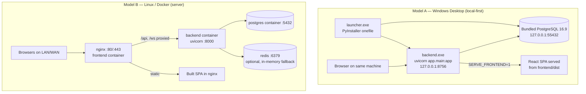
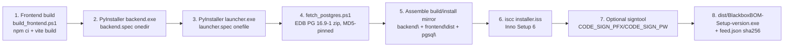
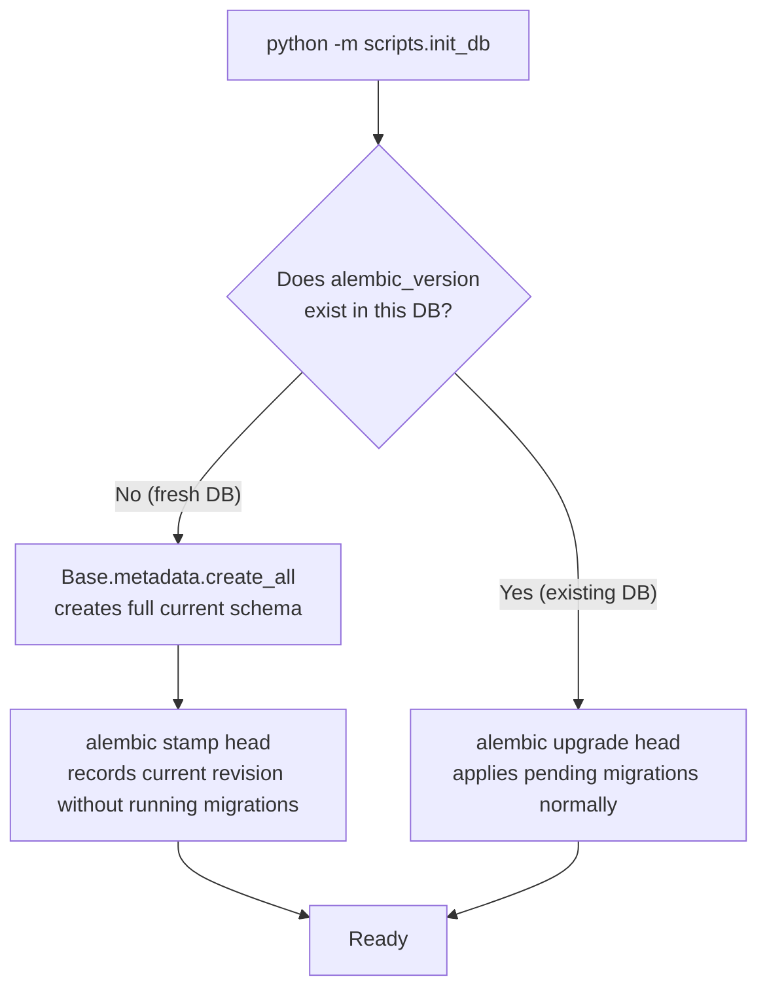
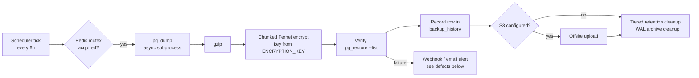
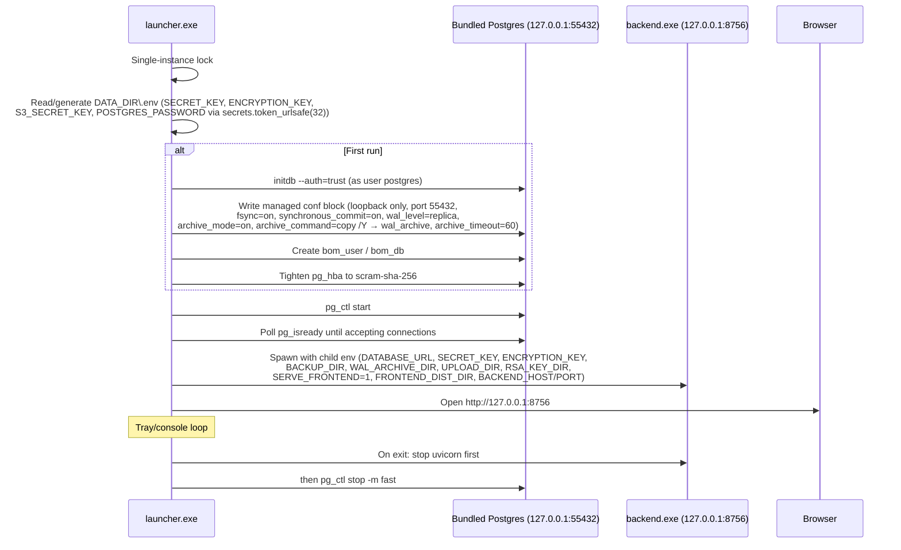
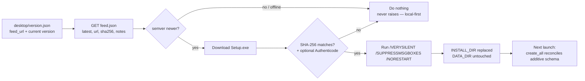

# Blackbox BOM — Production Deployment Guide

> **Scope.** This guide covers deploying the Blackbox BOM tool (FastAPI backend + React/Vite frontend + PostgreSQL) in its two supported deployment models: the **Windows desktop installer** (local-first, one machine, no prerequisites) and **Linux/Docker** (server deployment behind a reverse proxy). It also covers building release artifacts, database setup and migrations, backups, monitoring, and safe update/rollback procedures.
>
> **This is not an Airflow / data-pipeline deployment.** The stack is a single-process async FastAPI monolith (`backend/app/main.py`) that serves the JSON API under `/api/v1`, WebSockets at `/ws/{channel}`, and — optionally — the built React SPA from the same process.

**Related documents (read alongside this guide):**

| Document | What it covers |
|---|---|
| `INSTALL.md` | Docker quick-start install, backup/restore migration scripts (sections 4–5) |
| `desktop/DESKTOP_PACKAGING.md` | Desktop build machine prerequisites, build pipeline details, dev fast-paths |
| `desktop/DURABILITY.md` | Crash-safety / durability posture of the bundled Postgres, verification log, known gaps |
| `DISASTER_RECOVERY_RUNBOOK.md` | Deeper disaster-recovery procedures (PITR, restore wizard, recovery tests) |
| `frontend/OPEN_ITEMS.md` | Frontend migration state, known open items |
| `.env.example` | Canonical environment variable template (secrets intentionally empty, fail-closed `:?` compose interpolation) |
| `backend/docs/TECH_STACK_AND_WORKING.md` | Deeper narrative on the stack and how the pieces fit together — read alongside §1 |
| `backend/docs/API_REFERENCE.md` | Full endpoint-by-endpoint API reference (~549 routes) — the detailed companion to §7–§9's operational view of the API surface |
| `backend/docs/data-dictionary.md` | Full table/column reference for the schema this guide's §5 (migrations) and §6 (backups) operate on |
| `backend/docs/admin-guide.md` | Day-2 administration tasks (user/tenant management, RBAC) that pick up once the deployment in this guide is live |

---

## Table of Contents

1. [Deployment Models at a Glance](#1-deployment-models-at-a-glance)
2. [System Requirements](#2-system-requirements)
3. [Configuration Reference (Environment Variables)](#3-configuration-reference-environment-variables)
4. [Building the Application](#4-building-the-application)
5. [Database Setup, Migrations, and Seeding](#5-database-setup-migrations-and-seeding)
6. [Backup and Restore](#6-backup-and-restore)
7. [Deployment Option A — Windows Desktop Installer](#7-deployment-option-a--windows-desktop-installer)
8. [Deployment Option B — Linux / Docker](#8-deployment-option-b--linux--docker)
9. [Reverse Proxy, HTTPS, and Nginx](#9-reverse-proxy-https-and-nginx)
10. [Monitoring, Health Checks, and Logs](#10-monitoring-health-checks-and-logs)
11. [Safe Updates and Rollback](#11-safe-updates-and-rollback)
12. [Known Limitations, Stubs, and Operational Cautions](#12-known-limitations-stubs-and-operational-cautions)
13. [Pre-Production Checklist](#13-pre-production-checklist)
14. [Appendix — Ports, Paths, and Quick Reference](#14-appendix--ports-paths-and-quick-reference)

---

## 1. Deployment Models at a Glance

The project is **local-first by design**: it must function fully on-premises with no cloud connectivity. Two deployment models coexist in the repository and are both maintained:



**Key architectural facts that shape deployment** (from `backend/app/main.py`):

- One uvicorn process serves everything: the JSON API at `/api/v1/*`, WebSockets at `/ws/{channel}`, `GET /health`, and (opt-in via `SERVE_FRONTEND`) the built React SPA via a catch-all route with `/assets` mounted from `frontend/dist`.
- Application **lifespan startup** does, in order: DB engine init with a 5-attempt exponential-backoff retry → `Base.metadata.create_all` *unless* `SKIP_CREATE_ALL` is set (deprecated behavior — see §5) → tenant-isolation ORM event listener registration → background job-queue worker start → Redis-backed rate limiter init → startup health checks (`scripts/startup_health_check.py`) → three long-lived background tasks: **backup scheduler** (every `BACKUP_SCHEDULE_HOURS`, default 6h), **integration outbox drainer** (15s tick), and **Zoho Books inbound poll** (60s tick).
- **Redis is optional everywhere.** Rate limits, JWT token blacklist, and the backup mutex all use Redis when available and fall back to in-memory implementations when not — consistent with local-first. (Caveat in §12: a *remote* Redis URL is assumed reachable without a ping.)
- Auth is **cookie-based JWT (RS256 by default)**. An RSA-4096 keypair is auto-generated on first run into `RSA_KEY_DIR` and the private key PEM is passphrase-encrypted with a key derived from `ENCRYPTION_KEY`. This directory is **stateful and must be persisted and backed up** — losing it (or `ENCRYPTION_KEY`) invalidates all sessions and makes encrypted backups undecryptable.
- CSRF protection is a **double-submit cookie** signed with HMAC-SHA256 of `SECRET_KEY`, enforced on cookie-authenticated mutating requests. This is why **same-origin deployment** (SPA and API on one origin) is the strongly recommended topology — see §9.

> For a deeper narrative walkthrough of how the middleware stack, ORM, and frontend fit together (rather than the deployment-focused summary above), see `backend/docs/TECH_STACK_AND_WORKING.md`.

---

## 2. System Requirements

### 2.1 Runtime requirements

| Component | Requirement | Why |
|---|---|---|
| **OS (desktop)** | Windows 10 / 11, **x64 only**, admin rights to install | `desktop/installer.iss` sets `MinVersion 10.0`, x64-only, admin privileges; installs to `%ProgramFiles%\BlackboxBOM` |
| **OS (server)** | Any Linux capable of running Docker Engine + Compose v2 (or Python 3.11+ natively) | Docker path is the tested server route (`docker-compose.yml`, `backend/docker-compose.prod.yml`) |
| **Python** | **3.11+** | `backend/Dockerfile.prod` is `python:3.11-slim`; the root `backend/Dockerfile` uses `python:3.12-slim`; CI runs 3.12. Target 3.11 as the floor, 3.12 as tested. |
| **Node.js** | Current LTS | Frontend build only (Vite 6, React 18.3). Not needed at runtime — the SPA is static files after `vite build`. |
| **PostgreSQL** | **16+ recommended** | The desktop bundle ships EDB PostgreSQL **16.9-1**. Note: the root `docker-compose.yml` currently pins `postgres:15-alpine` while `postgres-ci.yml` tests against 16 — a known version skew. For new server deployments, use 16 to match the desktop bundle and CI gate. |
| **Redis** | 7.x, **optional** | Used opportunistically for rate limiting, token blacklist, backup mutex; in-memory fallback exists. Strongly recommended for multi-user server deployments. |
| **Tesseract OCR** | Optional | Only needed if you use the `/api/v1/ocr` endpoints (real Tesseract-based extraction). |
| **RAM/CPU** | 2 GB+ RAM for the backend process; Postgres sized to data | Single async process; `Dockerfile.prod` runs 4 uvicorn workers (see the multi-worker caveat in §12.4) |

### 2.2 Build machine requirements (desktop installer)

From `desktop/DESKTOP_PACKAGING.md`:

- Python 3.11+, Node LTS
- **PyInstaller** (builds `backend.exe` onedir via `desktop/backend.spec` and `launcher.exe` onefile via `desktop/launcher.spec`)
- **Inno Setup 6** (`iscc` on PATH — compiles `desktop/installer.iss`)
- PowerShell (build scripts are `.ps1`)
- Network access **once** to fetch the portable PostgreSQL 16.9-1 EDB binaries zip (`desktop/fetch_postgres.ps1`, MD5-pinned to `ff183ee1a501ec4db28d106376622bc4`)
- Optional: a code-signing PFX for Authenticode (`CODE_SIGN_PFX` / `CODE_SIGN_PW`)

### 2.3 Dependency pinning caution

`backend/requirements.txt` is **version-ranged** (e.g. `fastapi>=0.111,<1.0`) and there is **no lock file**. For reproducible production builds, freeze your tested environment (`pip freeze > requirements.lock.txt`) and install from that in your build pipeline. The frontend has a `package-lock.json` (builds use `npm ci`), but note the known type-package skew: React 18 runtime with `@types/react` 19.x — build-time only, not a runtime risk.

---

## 3. Configuration Reference (Environment Variables)

All backend configuration flows through a single pydantic-settings class (`backend/app/core/config.py`) that reads a `.env` file, supports an **optional HashiCorp Vault** backend for secrets, and validates secret strength (Shannon entropy ≥ 80 bits plus weak-secret checks). **In `ENVIRONMENT=production`, the app hard-fails at startup on missing or weak secrets** — this is deliberate; do not work around it with dummy values.

### 3.1 Core secrets (required)

| Variable | Purpose | Notes |
|---|---|---|
| `SECRET_KEY` | Signs the CSRF double-submit cookie (HMAC-SHA256) and other HMAC uses | Generate with high entropy, e.g. `python -c "import secrets; print(secrets.token_urlsafe(48))"`. Production hard-fails if weak/missing. |
| `ENCRYPTION_KEY` | Derives (a) the passphrase encrypting the auto-generated RSA-4096 JWT private key and (b) the Fernet key encrypting backups | **Losing this key makes existing encrypted backups permanently unrecoverable and invalidates the JWT keypair.** Store it in your secret manager and include it in your DR plan. It is truncated/padded to 32 bytes internally. |
| `ENVIRONMENT` | `development` / `production` | Production enables: hard-fail on weak secrets, MFA-gated superuser access, stricter CSP (trusted-types + report-uri), stricter cookie/CSRF behavior, and HSTS (TLS-gated). **The desktop bundle deliberately runs non-production** because production mode assumes TLS while the desktop serves plain HTTP on `127.0.0.1`. Use `production` for any server deployment behind HTTPS. |

### 3.2 Database

| Variable | Purpose | Notes |
|---|---|---|
| `POSTGRES_SERVER` / `POSTGRES_USER` / `POSTGRES_PASSWORD` / `POSTGRES_DB` / `POSTGRES_PORT` | Assembled into an async DSN by `assemble_db_connection` | **Known limitation:** the password is interpolated into the DSN *without URL-encoding* (`config.py`). Avoid `@`, `:`, `/`, `#` in `POSTGRES_PASSWORD`, or set `DATABASE_URL` directly. |
| `DATABASE_URL` | Full DSN override, `postgresql+asyncpg://...` | The desktop launcher exports this directly to the backend child process. |
| `SKIP_CREATE_ALL` | When set, the lifespan skips the deprecated `Base.metadata.create_all` | **Set `true` on every migration-managed deployment** (the Docker entrypoint already does). Leaving it off can create tables outside Alembic and mask migration drift. See §5. |
| `ENABLE_RLS` | Opt-in PostgreSQL Row-Level Security as a second tenant-isolation layer | **Trap:** migration `040_postgres_rls_tenant_isolation` only applies RLS if `ENABLE_RLS` is true **at the time the migration runs**. Flipping it on later does nothing — you must `alembic downgrade 039` then re-upgrade with the flag set. Decide *before* first migration. Strongly recommended for any multi-tenant server deployment (see §12.2). |

### 3.3 Frontend serving (single-process mode)

| Variable | Purpose | Notes |
|---|---|---|
| `SERVE_FRONTEND` | `1` = the backend serves the built SPA (catch-all GET route + `/assets` mount) | Used by the desktop bundle. On Docker, nginx serves the SPA instead and this stays off. |
| `FRONTEND_DIST_DIR` | Absolute path to the Vite `dist/` output | Must exist and contain `index.html`; auto-detected in some layouts, but set explicitly in production. |

### 3.4 Files and key material (stateful directories)

| Variable | Purpose | Notes |
|---|---|---|
| `UPLOAD_DIR` | Document uploads (`/api/v1/documents` upload path) | **Must be writable by the backend process and persisted** (Docker volume `backend_uploads`; desktop: `%ProgramData%\BlackboxBOM\uploads`). |
| `RSA_KEY_DIR` | Auto-generated RSA-4096 JWT signing keypair | **Must be writable and persisted** (Docker volume `rsa_keys`; desktop: `%ProgramData%\BlackboxBOM\rsa_keys`). Back it up with the DB — the `scripts/backup-data.*` scripts already include it. Note: the private key file is written with default file permissions (no chmod 0600) — restrict the directory's ACL yourself on shared hosts. |

### 3.5 Backups

| Variable | Purpose | Notes |
|---|---|---|
| `BACKUP_DIR` | Where `pg_dump` / `pg_basebackup` outputs land | Desktop: `%ProgramData%\BlackboxBOM\backups`. Docker volume `backend_backups`. |
| `WAL_ARCHIVE_DIR` | WAL segment archive for PITR | Desktop launcher configures Postgres `archive_command` to copy WAL here. |
| `BACKUP_SCHEDULE_HOURS` | Interval of the in-process backup scheduler task | Default **6 hours**. |
| `S3_SECRET_KEY` (+ related S3 settings in `config.py`) | Optional offsite S3 upload of backups | Optional by local-first principle. |

### 3.6 Redis and rate limiting

| Variable | Purpose | Notes |
|---|---|---|
| `REDIS_URL` | Redis connection for slowapi rate limits, JWT blacklist, backup mutex | Optional; in-memory fallback. **Caveat:** if `REDIS_URL` points at a *non-localhost* host, availability is assumed without a ping — a down remote Redis leaves the limiter built against unreachable storage (`rate_limit.py`). Keep Redis co-located and monitored. |
| `REDIS_PASSWORD` | Compose sets `requirepass` on the redis:7 container | |

Built-in limits (no tuning vars documented): per-IP default **60/min**, per-user **300/min**, per-API-key **120/min**, per-IP WebSocket **30/min**.

### 3.7 Reverse proxy

| Variable | Purpose | Notes |
|---|---|---|
| `BEHIND_PROXY` | When `True`, `get_client_ip` trusts `X-Forwarded-For` | **Required behind nginx** or all rate limiting keys on the proxy's IP. Known gaps even with this set: the audit middleware records `request.client.host` directly and the WebSocket rate limiter uses `websocket.client.host` — both see the proxy IP (§12.4). |

### 3.8 Seeding and bootstrap

| Variable | Purpose | Notes |
|---|---|---|
| `SEED_ADMIN_PASSWORD` | If set (and `ENVIRONMENT` is not production), `seed_db.py` creates an admin user | Correctly gated: no admin is ever seeded without it, and never in production. |
| `SEED_RBAC_ON_START` / `ADMIN_EMAIL` | Docker entrypoint conditionally seeds RBAC roles when the roles table is empty | One-time, idempotent by count check. |

### 3.9 Desktop launcher overrides (`BLACKBOX_*`)

The launcher (`desktop/launcher.py`) honors: `BLACKBOX_INSTALL_DIR`, `BLACKBOX_DATA_DIR`, `BLACKBOX_BACKEND_DIR`, `BLACKBOX_PGSQL_DIR`, `BLACKBOX_PYTHON`, `BLACKBOX_PG_PORT`, `BLACKBOX_BACKEND_PORT`, `BLACKBOX_ENVIRONMENT`, `BLACKBOX_SKIP_PG` (run against an existing Postgres — dev fast-path), `BLACKBOX_NO_BROWSER`. In bundled-exe mode it additionally exports `BACKEND_HOST`, `BACKEND_PORT`, `BACKEND_LOG_LEVEL` to `backend.exe`.

### 3.10 Build-time (desktop release)

| Variable | Purpose |
|---|---|
| `CODE_SIGN_PFX` / `CODE_SIGN_PW` | Optional Authenticode signing of the installer in `desktop/build.py` (signtool stage) |

### 3.11 Docker host-port mapping

`.env` for the root `docker-compose.yml`: `FRONTEND_PORT`, `BACKEND_PORT`, `POSTGRES_HOST_PORT`, `REDIS_HOST_PORT`. `.env.example` ships all secrets **intentionally empty** with fail-closed `:?` compose interpolation — `docker compose up` refuses to start until you fill them in. This is a feature; do not defeat it.

---

## 4. Building the Application

### 4.1 Frontend (Vite)

```bash
cd frontend
npm ci
npm run build        # → frontend/dist/
```

- Stack: Vite 6, React 18.3, react-router-dom 7 (verified in `frontend/package.json`).
- Output is a fully static `dist/` with content-hashed assets. **Everything is bundled locally** — no CDN at runtime.
- `vite.config.ts` deliberately restricts `manualChunks` to a react/react-dom/scheduler vendor chunk only, because the legacy `src/root/*.jsx` modules are mutually circular and manual splitting previously caused TDZ crashes. **Do not "optimize" the chunking config as part of a deployment.**
- A service worker (`public/sw.js`, cache `bbox-v2`) is registered in production builds only. It is network-first for navigations and `/api/*`, cache-first for other same-origin assets. See §12.5 for its stale-asset caveat.
- **Do not deploy `frontend/serve.py` or `frontend/server.js` to production.** They are dev servers with CSP headers hard-pinned to localhost API origins (and they disagree with each other on ports 8000 vs 8001). In production the SPA is served either by the backend (`SERVE_FRONTEND=1`) or by nginx.

### 4.2 Backend

For a native (non-Docker, non-desktop) install:

```bash
cd backend
python -m venv .venv && source .venv/bin/activate
pip install -r requirements.txt          # consider a frozen lock file — see §2.3
# DB bootstrap (see §5) then:
uvicorn app.main:app --host 127.0.0.1 --port 8000
```

For Docker, the images build themselves (`backend/Dockerfile` = python:3.12-slim + tini; `backend/Dockerfile.prod` = python:3.11-slim multi-stage, 4 uvicorn workers).

### 4.3 Desktop installer (`desktop/build.py` + Inno Setup)

`desktop/build.py` is an 8-stage pipeline producing `dist/BlackboxBOM-Setup-<version>.exe` plus a `feed.json` containing the SHA-256 (consumed by the auto-updater):



Useful flags (documented in `desktop/DESKTOP_PACKAGING.md` §6):

- `build.py --no-pgsql` — skip the Postgres fetch (reuse a previously fetched copy)
- `build.py --skip-installer` — stop before the Inno stage (fast iteration)
- `BLACKBOX_SKIP_PG=1` — run the launcher against an already-running Postgres (dev)

**Release publishing is manual and order matters:** upload the new `Setup.exe` first, **then** overwrite `feed.json`. Publishing the feed first creates a window where clients download a URL that 404s or hash-mismatches.

**Installer behavior** (`desktop/installer.iss`): fixed `AppId`, admin privileges, x64-only, Windows 10+, directory choice **disabled** — the launcher and backend are rigidly path-coupled to `%ProgramFiles%\BlackboxBOM` (code) and `%ProgramData%\BlackboxBOM` (data). Registry keys under `HKLM\Software\BlackboxBOM` record `InstallDir`, `DataDir`, `Version`, `BackendUrl` (`http://127.0.0.1:8756`). The data directory is flagged `uninsneveruninstall`: it survives updates **and** uninstall unless the user explicitly opts into deletion (interactive MsgBox or `/REMOVEDATA`).

---

## 5. Database Setup, Migrations, and Seeding

### 5.1 The one rule: bootstrap with `init_db`, never bare `alembic upgrade head` on an empty database

The Alembic chain is 47 files with a **single linear head: `047_solidworks_integration`** (verified — one root `001_initial`, no branches; see `backend/docs/data-dictionary.md` for the full table/column reference these migrations build). However, **migrations `004+` reference ~74 tables that historically only exist via `Base.metadata.create_all`** — running `alembic upgrade head` against an *empty* database fails partway. That is exactly why `.github/workflows/postgres-ci.yml` exists as the fresh-install gate.

The supported bootstrap is `backend/scripts/init_db.py`:



- **Fresh database** → `create_all` + `alembic stamp head`. The DB is born at the current schema and future upgrades apply incrementally.
- **Existing, previously-stamped database** → normal `alembic upgrade head`.
- The Docker entrypoint (`backend/scripts/docker-entrypoint.sh`) runs this automatically: `pg_isready` wait → `python -m scripts.init_db` → conditional RBAC seed → `exec uvicorn`.
- `postgres-ci.yml` proves this bootstrap is idempotent against an empty PostgreSQL 16. (Note it currently hardcodes `EXPECTED_HEAD='041_zoho_books_sync_tables'`, which is stale versus the actual head `047` — bump it when you add migrations.)

**Set `SKIP_CREATE_ALL=true` in every deployment that uses `init_db`.** Otherwise the FastAPI lifespan *also* runs `create_all` at every startup (a deprecated legacy behavior kept for the desktop bundle), which can silently create tables outside Alembic's knowledge and mask drift.

Two previously-tracked Postgres-only Alembic bugs are **confirmed fixed** in `backend/alembic/env.py`: it now widens `alembic_version.version_num` to `VARCHAR(255)` on Postgres (long revision ids no longer break at migration 036+), and it falls back to `settings.DATABASE_URI` so `.env` is honored.

### 5.2 Migration hygiene notes for operators

- **Numbering trap:** three files share the `041_` prefix (`041_compliance_pack_tables`, `041_part11_esignatures`, `041_zoho_books_sync_tables`), and the Zoho one actually revises `044`. The real order is `040 → 041_compliance → 041_part11 → 042 → 043 → 044 → 041_zoho → 045 → 046 → 047`. **Never infer chain order from filenames**; use `alembic history`.
- **RLS (`ENABLE_RLS`) must be decided before migrating.** Migration `040` no-ops unless the dialect is PostgreSQL *and* `ENABLE_RLS` is true at migration time. Enabling it later requires `alembic downgrade 039` + re-upgrade with the flag set (documented in the migration's own docstring; covered by `app/tests/test_rls_flag.py`).
- RLS policies attach only to tables that have a `tenantId` column. The deliberately global tables (substance reference data from `042`, `compliance_packs`/`part_certifications` from `041_compliance_pack_tables`) sit outside RLS by design.

### 5.3 Seeding

Two distinct seeds exist:

1. **RBAC seed** (Docker entrypoint, gated by `SEED_RBAC_ON_START` and an empty-roles check): creates the role/permission fixtures the RBAC layer needs. Role hierarchy: `superadmin > admin > engineering/procurement/finance > viewer` with `resource:action` permission strings.
2. **Demo/data seed** (`backend/seed_db.py`): creates the "Blackbox Factories"/"BBF" tenant, 5 parts, 4 vendors, 2 projects, 1 draft BOM per project. An admin user is created **only** if `SEED_ADMIN_PASSWORD` is set and `ENVIRONMENT` is not production.

**Caution:** `seed_db.py` bootstraps schema via `create_all` **without stamping alembic** — a database born solely from `seed_db.py` diverges from migration-managed DDL (partial indexes, RLS, data backfills that only exist in migrations are skipped), and a later `alembic upgrade` will replay from base against existing tables and fail. **Always run `scripts.init_db` first; treat `seed_db.py` as data-only on an already-bootstrapped DB.**

---

## 6. Backup and Restore

### 6.1 What the backup system does (and does well)

The in-process backup pipeline (`backend/app/core/backup.py`) is scheduled by the lifespan task every `BACKUP_SCHEDULE_HOURS` (default 6h):



Additional machinery: `pg_basebackup` physical backups for PITR, WAL archiving (desktop: `archive_command = copy /Y ... wal_archive\`, `archive_timeout=60`), `scripts/db_backup.py` (keeps the 30 most recent dumps), `scripts/backup_scheduler.py` (daily/weekly/monthly/yearly buckets), `scripts/pitr_restore.py`, `scripts/restore_wizard.py`, `scripts/recovery_test.py`, and the superuser-gated `/api/v1/backup/*` endpoints (history/create/physical/verify/pipeline/cleanup/pitr-restore/restore/latest). For Docker migrations, `scripts/backup-data.ps1/.sh` bundle `db.dump` + `uploads.tar.gz` + `rsa_keys.tar.gz` into `backups/<timestamp>`, and `restore-data.ps1/.sh` perform a **destructive** restore into a fresh stack (`INSTALL.md` §4–5).

### 6.2 Known defects you MUST plan around (audited, current as of this writing)

These are confirmed bugs in `backend/app/core/backup.py` and `scripts/pitr_restore.py`. Until they are fixed, shape your backup posture accordingly:

| # | Defect | Operational consequence |
|---|---|---|
| 1 | **Encrypted *physical* backups cannot be restored.** `create_physical_backup` encrypts with a length-prefixed multi-chunk Fernet stream, but `restore_physical_backup` decrypts with a single-shot `fernet.decrypt(f.read())` — always raises `InvalidToken` on stream-encrypted files. | The PITR recovery path for **encrypted basebackups is broken**. The *logical* restore path (`restore_backup`) correctly uses stream decryption and works. |
| 2 | **Backup-failure email alerts silently never send.** `_send_email_alert` references `settings.APP_NAME`, which doesn't exist (`config.py` defines `PROJECT_NAME`); the `AttributeError` is swallowed by a broad `except`. | You will **not** be emailed when backups fail. Use the webhook alert path and/or external monitoring of `/health` (which includes backup health) instead. |
| 3 | **PITR restore is not Windows-aware.** `pitr_restore.py` hardcodes `/var/lib/postgresql/wal_archive` and a Unix `cp` `restore_command`; `restore_physical_backup` resolves the right path but still emits `cp`, which Windows `cmd.exe` lacks. | Desktop WAL **archiving works** (the launcher writes a correct `copy /Y` archive_command), but a desktop **PITR restore will fail at first WAL replay**. Tracked in `OPEN_ITEMS.md` ("PITR/WAL live verification") and `desktop/DURABILITY.md`. |
| 4 | Physical restore uses `tarfile.extractall` without member filtering (tar-slip risk on tampered archives) and decrypts whole files in memory (OOM risk on large basebackups). | Only restore physical backups you created and stored securely. |
| 5 | Webhook alerts are signed with `sha256(payload + secret)` rather than HMAC (length-extension weakness). | Treat webhook signatures as informational, not authentication, until fixed. |

### 6.3 Recommended backup posture (until the defects above are fixed)

1. **Rely on logical backups** (`pg_dump` custom format) as your primary restore path — create + verify + restore are all sound, including stream encryption/decryption.
2. **Test restores, don't just take backups.** Run `scripts/recovery_test.py` (or manually `pg_restore` into a scratch DB) on a schedule. A backup you haven't restored is a hope, not a backup.
3. Back up the **trio** together: database dump + `UPLOAD_DIR` + `RSA_KEY_DIR` (the `backup-data.*` scripts already do). Also escrow `ENCRYPTION_KEY` and `SECRET_KEY` — encrypted backups are useless without `ENCRYPTION_KEY`.
4. Keep WAL archiving on (it's cheap insurance and the archive side works on all platforms), but **do not count on PITR restore on Windows desktop** until defect #3 is fixed; on Linux, PITR restore with *unencrypted* basebackups is the viable path.
5. Wire the **webhook** failure alert and independently alert on `GET /health` (it reports backup health), because email alerts are currently dead (defect #2).

---

## 7. Deployment Option A — Windows Desktop Installer

This is the primary local-first deliverable: a one-click installer bundling PostgreSQL 16 + backend + SPA with **no prerequisites** on the end-user machine.

### 7.1 What gets installed where

| Location | Contents | Lifecycle |
|---|---|---|
| `%ProgramFiles%\BlackboxBOM` (`INSTALL_DIR`) | `launcher.exe`, `backend\` (PyInstaller onedir `backend.exe`), `frontend\dist`, `pgsql\` (portable PG 16.9) | **Replaced** on every update |
| `%ProgramData%\BlackboxBOM` (`DATA_DIR`) | `pgdata`, `.env` (generated secrets), `backups`, `logs`, `wal_archive`, `uploads`, `rsa_keys` | **Persists** across updates and uninstall (deletion requires explicit opt-in or `/REMOVEDATA`) |
| `HKLM\Software\BlackboxBOM` | `InstallDir`, `DataDir`, `Version`, `BackendUrl` | Registry breadcrumbs for the updater/support |

### 7.2 Runtime lifecycle



Secrets are **idempotent**: `DATA_DIR\.env` is generated once and preserved, so the DB password and JWT signing material stay stable across restarts and updates.

### 7.3 Launcher gotchas — already fixed; do not regress

Three classes of first-generation launcher bugs have been fixed in the current `desktop/launcher.py`. They are listed here because they are the exact traps anyone modifying the launcher will reintroduce first:

1. **`pg_ctl` startup handling (no `-w` wait / no blocking pipes).** `pg_ctl start` on Windows can hang the parent when its stdout/stderr pipes are held, and returns before the server actually accepts connections. The launcher now starts Postgres without relying on `pg_ctl -w` and **polls `pg_isready` in a loop** before proceeding. If you touch this code, keep the poll — starting the backend before Postgres accepts connections burns the 5-attempt engine-retry budget on a race you created.
2. **Writable `UPLOAD_DIR` and `RSA_KEY_DIR`.** Both must live under `%ProgramData%\BlackboxBOM` (writable), never under `%ProgramFiles%` (effectively read-only). If these point at the install dir, first-run RSA keypair generation and every document upload fail. The launcher exports both explicitly into the backend child environment.
3. **`SERVE_FRONTEND=1` + `FRONTEND_DIST_DIR` must reach the backend child process.** Without them the catch-all SPA route never registers and users hitting `http://127.0.0.1:8756` get the JSON welcome payload instead of the app.

### 7.4 Known desktop gaps (open, by design or deferred)

- **`backend.exe` mode never stamps `alembic_version`** (documented in `launcher.py` lines 82–90). In the normal installed case, schema is maintained solely by the idempotent `create_all` in the FastAPI lifespan. Consequence: **future schema changes shipped as real Alembic migrations (ALTERs, data migrations) will NOT auto-apply on desktop installs.** `DESKTOP_PACKAGING.md` §4 and the updater docstring still claim `alembic upgrade head` runs after update — that is only true in the dev/python-fallback mode. The proposed fix (have `backend_entry.py` call `scripts.init_db.bootstrap_database()`) is explicitly deferred. Until it lands, any release whose migration cannot be expressed by `create_all` (column type changes, backfills, drops) needs a bespoke desktop upgrade step.
- **PITR restore fails on Windows** (§6.2 defect #3). Archiving works; replay does not.
- `desktop/postgresql.conf.template` is shipped by the build but **never read by the launcher** — the effective config is the launcher's `_render_conf_block` managed block. Editing the template does nothing (flagged in `DURABILITY.md`).
- First-run `initdb --auth=trust` before tightening to scram-sha-256 is a short trust window, mitigated by loopback-only listen.
- `ENVIRONMENT` is deliberately left non-production (see §3.1): the desktop serves plain HTTP on 127.0.0.1, and production mode's cookie/CSRF/HSTS assumptions require TLS.

---

## 8. Deployment Option B — Linux / Docker

### 8.1 Quick start (root `docker-compose.yml`)

The stack: `postgres:15-alpine` + `redis:7` (with `requirepass`) + backend (python:3.12-slim, tini, entrypoint runs migrations) + frontend (Node build stage → `nginx:alpine` serving the SPA and proxying `/api` and `/ws`).

```bash
# 1. Configure
cp .env.example .env
# Fill in ALL empty secrets — compose uses :? interpolation and will
# refuse to start with any left blank (intentional fail-closed design).
#   SECRET_KEY, ENCRYPTION_KEY, POSTGRES_PASSWORD, REDIS_PASSWORD, ...
# Set ENVIRONMENT=production, SKIP_CREATE_ALL=true, ENABLE_RLS as decided (§5.2)

# 2. Launch (or use the provided install.sh / install.ps1 / install.bat wrappers)
docker compose up -d --build

# 3. Verify
curl -fsS http://localhost:${BACKEND_PORT:-8000}/health
```

What the backend entrypoint does on every start (`backend/scripts/docker-entrypoint.sh`): wait for `pg_isready` → `python -m scripts.init_db` (bootstrap or upgrade, §5.1) → seed RBAC once if the roles table is empty → `exec uvicorn app.main:app` on `:8000` with `SKIP_CREATE_ALL=true`.

Persistent volumes you must include in host backup plans: `pgdata`, `wal_archive`, `backend_backups`, `backend_uploads`, `rsa_keys`, `redis_data`.

Lifecycle scripts shipped at repo root: `install.ps1`/`install.bat` (generate `.env` + `docker compose up -d --build`), `stop.ps1`/`.bat`, `uninstall.ps1`/`.bat`, plus `scripts/backup-data.*` / `scripts/restore-data.*` (§6.1).

> **Version note:** the compose file pins `postgres:15-alpine` while the desktop bundles 16.9 and CI's fresh-install gate runs 16. For new deployments, prefer bumping the image to `postgres:16-alpine` *before first install* (changing the major version of an existing volume requires a dump/restore migration).

### 8.2 Production compose (`backend/docker-compose.prod.yml`)

A fuller enterprise stack exists for heavier server deployments: **pgbackrest** (backup), **backup-scheduler**, **pgbouncer** (connection pooling), **minio** (S3-compatible offsite target), **celery_worker**, **nginx**, **prometheus**, **grafana**, **alertmanager**, **loki**. The backend there builds from `backend/Dockerfile.prod` (python:3.11-slim, multi-stage, **4 uvicorn workers** — read the multi-worker caveat in §12.4 before scaling workers). This stack was enumerated but not deep-audited; validate each service's config against your environment before relying on it.

### 8.3 Native Linux (no Docker) — systemd sketch

The backend is a plain uvicorn app, so a native deployment is: Python 3.11+ venv + `pip install` + `scripts.init_db` + a systemd unit:

```ini
# /etc/systemd/system/bom-backend.service
[Unit]
Description=Blackbox BOM backend
After=postgresql.service network-online.target

[Service]
User=bom
WorkingDirectory=/opt/bom-tool/backend
EnvironmentFile=/etc/bom-tool/backend.env   # all vars from §3; chmod 600
ExecStartPre=/opt/bom-tool/backend/.venv/bin/python -m scripts.init_db
ExecStart=/opt/bom-tool/backend/.venv/bin/uvicorn app.main:app --host 127.0.0.1 --port 8000
Restart=on-failure

[Install]
WantedBy=multi-user.target
```

Serve the SPA either with `SERVE_FRONTEND=1` + `FRONTEND_DIST_DIR=/opt/bom-tool/frontend/dist` (single process, simplest) or via nginx (§9). Ensure `UPLOAD_DIR`, `RSA_KEY_DIR`, `BACKUP_DIR`, `WAL_ARCHIVE_DIR` point at persistent, service-user-writable paths.

---

## 9. Reverse Proxy, HTTPS, and Nginx

### 9.1 Why same-origin is the supported topology

Authentication is a **JWT in an HttpOnly cookie** plus a **CSRF double-submit cookie** (`csrf_token` cookie mirrored into an `X-CSRF-Token` header by `frontend/api.js`). The frontend's API base is same-origin `/api/v1` by default (`src/config.js`), with the WebSocket base derived from `location`. Cookies + CSRF work cleanly only when the SPA and the API share an origin. Cross-origin deployments are possible via the `window.__BBOX_CONFIG` override plus CORS configuration, but you inherit third-party-cookie and CSRF complexity — **don't do this unless you must**.

Also relevant behind a proxy:

- **TrustedHost middleware** is first in the chain — configure the allowed hosts in settings to include your public hostname, or requests are rejected.
- **HSTS is TLS-gated**: the `Strict-Transport-Security` header is only emitted when the request is over TLS, so the HTTP desktop bundle isn't broken and your HTTPS deployment gets HSTS automatically.
- **`ENVIRONMENT=production` assumes TLS** (secure cookies, stricter CSP with trusted-types and report-uri). Terminate TLS at nginx and run the backend in production mode behind it.
- The backend has an `ApiTrailingSlashMiddleware` and a SPA catch-all that recreates FastAPI's 307 slash-redirects — **proxy paths verbatim**; do not add your own trailing-slash rewrites in nginx.

### 9.2 Sample nginx (SPA + API + WebSockets + HTTPS)

The Docker frontend container already ships an nginx that proxies `/api` and `/ws`. For a native deployment, the equivalent is:

```nginx
map $http_upgrade $connection_upgrade {
    default upgrade;
    ''      close;
}

server {
    listen 443 ssl http2;
    server_name bom.example.internal;

    ssl_certificate     /etc/nginx/tls/bom.crt;
    ssl_certificate_key /etc/nginx/tls/bom.key;

    # --- React SPA (static, content-hashed assets) ---
    root /opt/bom-tool/frontend/dist;
    index index.html;
    location / {
        try_files $uri $uri/ /index.html;   # SPA client-side routing
    }

    # --- JSON API ---
    location /api/ {
        proxy_pass http://127.0.0.1:8000;
        proxy_set_header Host $host;
        proxy_set_header X-Forwarded-For $proxy_add_x_forwarded_for;
        proxy_set_header X-Forwarded-Proto $scheme;
        client_max_body_size 50m;           # document/CSV uploads
    }

    # --- WebSockets (collaboration: presence, cursors, locks) ---
    location /ws/ {
        proxy_pass http://127.0.0.1:8000;
        proxy_http_version 1.1;
        proxy_set_header Upgrade $http_upgrade;
        proxy_set_header Connection $connection_upgrade;
        proxy_set_header Host $host;
        proxy_set_header X-Forwarded-For $proxy_add_x_forwarded_for;
        proxy_read_timeout 3600s;           # long-lived collab sockets
    }

    # --- health for load balancers (unauthenticated) ---
    location = /health {
        proxy_pass http://127.0.0.1:8000;
    }
}

server {                                     # HTTP → HTTPS
    listen 80;
    server_name bom.example.internal;
    return 301 https://$host$request_uri;
}
```

### 9.3 `BEHIND_PROXY` and rate-limiting behind nginx

Set `BEHIND_PROXY=True` so `get_client_ip` (`app/core/client_ip.py`) trusts `X-Forwarded-For`. Without it, every rate limiter keys on nginx's IP and **all users share one 60/min bucket**.

Two audited gaps remain *even with* `BEHIND_PROXY=True` (see §12.4): the audit log records the proxy IP (`audit_middleware.py` uses `request.client.host` directly), and the **WebSocket** rate limiter also uses the raw socket host — behind a proxy, all users collectively share the 30/min WS connection cap. If you see WS connection failures under multi-user load behind nginx, this is why.

### 9.4 Security headers and CSP

`SecurityHeadersMiddleware` emits HSTS (TLS-gated), `X-Frame-Options: DENY`, Permissions-Policy, and an environment-differentiated CSP (production adds trusted-types + report-uri). Known audited looseness: `connect-src 'self' ws: wss:` allows WebSocket connections to *any* host — acceptable for now, but don't add a *stricter* CSP at nginx that conflicts with the app's own headers; if you harden, harden in one place. Also note the frontend `CurrencyScreen` calls an external `exchangerate-api.com` endpoint with a hardcoded key (§12.5) — in an egress-restricted network that screen's rate fetch simply fails.

---

## 10. Monitoring, Health Checks, and Logs

### 10.1 Health endpoints

| Endpoint | Auth | Returns |
|---|---|---|
| `GET /health` | None | DB health **and backup health** (`main.py:694-709`). Use this for load-balancer checks *and* backup alerting (§6.3). |
| `GET /api/v1/health` and `GET /api/v1/health/detailed` | Per router config | Detailed component health |
| `GET /api/v1/metrics` | **Auth-gated** | Prometheus metrics (via `MetricsMiddleware`). Because it requires auth, give your Prometheus scraper an API key (`/api/v1/api-keys`, sent as `X-API-Key`) rather than disabling auth. |

Startup also runs `scripts/startup_health_check.py` inside the lifespan, so a container that fails its checks fails fast. For the full endpoint-by-endpoint reference behind `/api/v1/*` (all ~549 routes across 73 routers), see `backend/docs/API_REFERENCE.md`; for routine post-deployment admin tasks (users, tenants, RBAC roles) once the service above is healthy, see `backend/docs/admin-guide.md`.

### 10.2 Error tracking and audit

- **Sentry** is wired in (`init_sentry`) — configure its DSN via `config.py` settings to activate.
- Every error response carries a **`request_id`**; server logs contain the full traceback while clients get only a generic detail + that id. When a user reports an error, ask for the request id and grep logs for it.
- **Audit trail:** all mutating requests are written to the `audit_logs` table by `AuditLogMiddleware` (3-retry background writes, drained at shutdown). Query via `GET /api/v1/audit-logs`. Caveat: behind a proxy the recorded `userIp` is the proxy's (§12.4).

### 10.3 Logs

| Deployment | Where |
|---|---|
| Desktop | `%ProgramData%\BlackboxBOM\logs` (launcher + backend); Postgres logs under `pgdata` |
| Docker | `docker compose logs backend` (stdout; tini as PID 1), nginx/frontend container logs, `postgres` container logs |
| Native | journald via systemd unit |

### 10.4 Prometheus / Grafana

`backend/docker-compose.prod.yml` ships prometheus + grafana + alertmanager + loki preconfigured for the stack. Minimum useful alerts for any deployment:

1. `GET /health` non-200 (includes backup health — compensates for the dead email alerts, §6.2).
2. Prometheus `up` for the backend scrape target.
3. Disk usage on the volumes holding `pgdata`, `BACKUP_DIR`, and `WAL_ARCHIVE_DIR` (WAL archives grow until cleanup runs).
4. Age of newest file in `BACKUP_DIR` > 2 × `BACKUP_SCHEDULE_HOURS`.

---

## 11. Safe Updates and Rollback

### 11.1 Golden rule

**Take a verified logical backup (and snapshot `UPLOAD_DIR` + `RSA_KEY_DIR`) immediately before any update.** `scripts/backup-data.ps1/.sh` does exactly this trio for Docker; on desktop, trigger `POST /api/v1/backup/pipeline` or copy `%ProgramData%\BlackboxBOM\backups` after a manual backup.

### 11.2 Desktop update flow (auto-updater)



- The updater (`desktop/updater.py`) is best-effort and silent on failure — offline machines simply keep running. Nothing executes without a verified SHA-256.
- The installer only touches `INSTALL_DIR`; `pgdata`, `.env` secrets, uploads, keys, and backups persist.
- **Migration limitation (important):** in bundled-exe mode the schema is reconciled by `create_all`, which is **additive-only** (new tables/columns via model defaults). Releases requiring real Alembic migrations (ALTER/backfill/drop) will not auto-apply on desktop (§7.4). Check release notes for a "requires migration" flag; such releases need a bespoke upgrade step until the deferred `init_db`-in-`backend_entry.py` fix lands.
- **Publishing order:** upload the new `Setup.exe` first, then overwrite `feed.json` (§4.3).

**Desktop rollback:** run the previous `BlackboxBOM-Setup-<older>.exe` (fixed AppId means it installs over in place; `DATA_DIR` persists). Because `create_all` never drops or alters, a DB touched only by additive changes usually still works with the older binary. If the newer release changed data shape, restore the pre-update logical backup via the restore endpoint or `restore_wizard.py`. If your feed still advertises the newer version, the rolled-back client will re-update — pull or edit `feed.json` first.

### 11.3 Docker update flow

```bash
# 0. Backup first (trio: db + uploads + rsa_keys)
./scripts/backup-data.sh

# 1. Fetch/build the new images
git pull            # or docker pull your registry tags
docker compose build backend frontend

# 2. Roll
docker compose up -d
# entrypoint re-runs scripts.init_db → alembic upgrade head applies
# any new migrations automatically before uvicorn starts
```

**Docker rollback:**

1. `docker compose down` (volumes remain).
2. Check out / retag the previous image version and `docker compose up -d`.
3. **If the newer version applied Alembic migrations**, the old code may not run against the new schema. Alembic downgrades exist but are not the tested path here — the reliable rollback is `./scripts/restore-data.sh` with the pre-update backup (destructive restore into a fresh stack, per `INSTALL.md` §5).

### 11.4 CI/CD caution — do not cargo-cult `.github/workflows/ci.yml`

The audited CI has several deploy-relevant defects: the `test-backend` job runs bare `alembic upgrade head` against an empty Postgres (the exact anti-pattern §5.1 forbids — `postgres-ci.yml` is the correct gate); `build-and-push` points docker/build-push-action at the repo root where **no Dockerfile exists**; and the deploy jobs run `docker compose pull api` while the checked-in compose files name the service **`backend`**. If you stand up CD from this repo, fix those first and keep `postgres-ci.yml`'s fresh-install job as your migration gate (bumping its hardcoded `EXPECTED_HEAD`, currently stale at `041_zoho_books_sync_tables` vs. actual head `047`). Also note `desktop/tests/test_updater.py` (24 updater unit tests) is not wired into any workflow — run it manually before desktop releases.

---

## 12. Known Limitations, Stubs, and Operational Cautions

Everything below is from the code audit. Deploy with these expectations set — several UI surfaces look more finished than they are.

### 12.1 Explicit stubs and not-implemented features (backend)

| Feature | Status |
|---|---|
| **ERP connector sync** (`POST /api/v1/erp-connectors/{id}/sync`) | **Explicit no-op stub.** It records a sync log saying "ERP sync is not implemented for this connector type — no network." Connector CRUD, logs, and test-connection are real; **no actual ERP data exchange exists.** |
| **Zoho Books integration** | **Outbound push only** (OAuth connect, org select, push sync, status/mappings work). Pull / reconcile / conflict-resolve endpoints return an explicit "not implemented in this build" (by design, increment 2a). |
| **Five routers implemented but never mounted** (`derivatives`, `formulas`, `graph`, `planning`, `solidworks_contract`) | Fully written but unreachable over HTTP — notably **PO-from-BOM planning** (`planning.py` + `planning_service.py`) is dead until someone adds the `include_router` lines in `app/api/api_v1.py`. Do not promise these features to users of a current deployment. |
| **"AI" features** (`/api/v1/ai`) | Implemented but **deterministic heuristics**, not ML — a hard-coded seasonal multiplier over PO history with fabricated confidence values. No GPU, model weights, or external AI API is needed (or used). |

### 12.2 Multi-tenancy: turn on RLS for real isolation

The advertised automatic ORM SELECT tenant filter in `app/core/tenant_events.py` is **dead code** (runtime-verified: it reads `execute_state.mapper_`, which doesn't exist on SQLAlchemy 2.0.48's `ORMExecuteState`; the AttributeError is swallowed and rows from *both* tenants come back). INSERT auto-stamping and UPDATE/DELETE cross-tenant guards **do** work, and services filter reads explicitly — but the automatic read layer contributes nothing today. Additionally, raw `text()` SELECTs are only *warned about*, not blocked, and the global `compliance_packs`/`part_certifications` tables are outside both layers.

**Operational consequence:** for any deployment hosting more than one tenant, set `ENABLE_RLS=true` *before* running migrations (§5.2) so PostgreSQL-level policies backstop read isolation. Single-tenant deployments (the common local-first case) are unaffected in practice.

### 12.3 Backup subsystem defects

See §6.2 — encrypted **physical** restores broken, backup-failure **emails** dead, **PITR restore** not Windows-aware. Plan posture per §6.3.

### 12.4 Server/runtime cautions

- **Multi-worker deployments (Dockerfile.prod's 4 uvicorn workers):** the WebSocket `ConnectionManager` (presence, cursors, typing, **document locks**) is **in-process** — state is not shared across workers. With >1 worker, collab features silently fragment unless you add sticky sessions pinning `/ws/` to one worker. The backup scheduler is Redis-mutexed (safe), but each worker also runs its own outbox drainer and Zoho poll. If collaboration matters, run **1 worker** and scale vertically, or pin WS traffic.
- **Doc-lock bugs:** locks are keyed by document id alone (cross-tenant collision possible) and a dropped connection **never releases its locks** until process restart. If users report "document locked" ghosts, restart the backend process.
- **Behind a proxy:** audit-log `userIp` and the WS rate limiter see the proxy IP even with `BEHIND_PROXY=True` (§9.3). The WS in-memory fallback also clears everyone's window when 1000 IPs are tracked.
- **Remote Redis is assumed up without a ping** (§3.6) — co-locate and monitor Redis.
- **RSA private key file permissions** are OS defaults — restrict `RSA_KEY_DIR` ACLs on multi-user hosts (§3.4).
- **`POSTGRES_PASSWORD` special characters** break the DSN (§3.2).

### 12.5 Frontend expectations (mock/demo surfaces)

The SPA is mid-migration and a number of screens render **fabricated demo data even in production** — this is a UX/honesty issue, not a data-integrity one (real writes go through the real API):

- **MOCK (fabricated data, no backend calls):** the main Dashboard's budget widget ("API Uptime 99.98%" is a literal), Activity feed (injects a random fake event every 15s), QMS dashboard and NCR screen, Inventory screen (synthesizes stock from part-number char codes), AI Assistant (canned regex replies), Internet Scrape / Price Alerts / RFQ Compare / Inflation modals, PDM vault tree, Audit Log *modal* (the Audit Trail *screen* is real).
- **REAL and reliable:** Audit Trail, Catalogs, Work Queue, Zoho Books, Integrations, Procurement, enterprise screens (dashboards, service BOM, routing, work centers, labor, API keys), tenant admin, BOM editor writes, WebSocket collaboration.
- **Known crashes when connected to a real backend:** several screens assume the demo BOM shape (`rows[0].children`) and throw once real API parts hydrate; `mobile-scanner.jsx` is missing a `toast` import; `GlobalSearchModal` references three nonexistent icons. Track fixes in `frontend/OPEN_ITEMS.md`.
- **External egress:** `CurrencyScreen` fetches live rates from `exchangerate-api.com` with a hardcoded key — the only runtime external dependency; it fails harmlessly in air-gapped networks but contradicts local-first and should be treated as a bug.
- **Service worker:** cache-first applies to *all* same-origin non-API assets (broader than its own comment claims), so non-hashed files (`manifest.json`, logos) can go stale until the SW cache name (`bbox-v2`) is bumped. Content-hashed JS/CSS from Vite always updates correctly. There is also **no real offline shell** — a true offline reload shows the browser error page.

### 12.6 Repo hygiene before building releases

The working tree contains large stray artifacts that must not ship: ~18 `test_*.db` SQLite files, multi-MB logs (`backend.log`, `desktop/build_run2.log`, `iscc_run.log`), two full extracted Postgres trees under `desktop/build/`, and `backend/.secret_key` / `desktop/.secret_key` files. Clean before packaging; never commit `.secret_key` files.

---

## 13. Pre-Production Checklist

**Secrets & config**
- [ ] `SECRET_KEY`, `ENCRYPTION_KEY` generated with real entropy; stored in a secret manager; **`ENCRYPTION_KEY` escrowed for DR** (§3.1, §6.3)
- [ ] `ENVIRONMENT=production` (server, behind TLS only) — desktop stays non-production by design
- [ ] `POSTGRES_PASSWORD` has no `@ : / #` characters (or `DATABASE_URL` set directly)
- [ ] `SKIP_CREATE_ALL=true` on all migration-managed deployments
- [ ] `ENABLE_RLS` decided **before** first migration; `true` for multi-tenant (§5.2, §12.2)
- [ ] `BEHIND_PROXY=True` when behind nginx; TrustedHost list includes the public hostname

**Data & durability**
- [ ] `UPLOAD_DIR`, `RSA_KEY_DIR`, `BACKUP_DIR`, `WAL_ARCHIVE_DIR` on persistent, writable storage (volumes/`%ProgramData%`)
- [ ] Backup schedule confirmed (`BACKUP_SCHEDULE_HOURS`) and **a restore actually tested** (logical path; §6.3)
- [ ] Webhook failure alert configured; external alert on `/health` (email alerts are dead — §6.2)
- [ ] `scripts/backup-data.*` (or equivalent) covering DB + uploads + rsa_keys

**Build & release**
- [ ] Backend dependencies frozen to a lock file (§2.3)
- [ ] Frontend built with `npm ci && npm run build`; `serve.py`/`server.js` not deployed
- [ ] Desktop: installer signed (`CODE_SIGN_PFX`), `feed.json` published **after** the exe (§4.3), `desktop/tests/test_updater.py` run manually
- [ ] Repo artifacts cleaned before packaging (§12.6)

**Ops**
- [ ] `/health` wired to LB checks and alerting; Prometheus scraping `/api/v1/metrics` with an API key (§10.1)
- [ ] Sentry DSN configured (optional but recommended)
- [ ] Single uvicorn worker (or sticky WS sessions) if collaboration features are in use (§12.4)
- [ ] Update runbook rehearsed including rollback restore (§11)
- [ ] Users briefed on which screens are demo/mock (§12.5)

---

## 14. Appendix — Ports, Paths, and Quick Reference

### Ports

| Service | Desktop | Docker (defaults) |
|---|---|---|
| PostgreSQL | `127.0.0.1:55432` (bundled, loopback-only) | `db:5432` (host port via `POSTGRES_HOST_PORT`) |
| Backend (uvicorn) | `127.0.0.1:8756` | `backend:8000` (host via `BACKEND_PORT`) |
| Frontend | served by backend (same port, `SERVE_FRONTEND=1`) | nginx `:80` (host via `FRONTEND_PORT`) |
| Redis | not bundled (in-memory fallbacks) | `redis:6379` (host via `REDIS_HOST_PORT`) |

### URL map (one backend process)

| Path | What |
|---|---|
| `/api/v1/*` | JSON API (~549 routes across 73 routers) |
| `/api/v1/metrics` | Prometheus (auth-gated) |
| `/ws/{channel}` | WebSocket collaboration (JWT via `?token=` or auth header) |
| `/health` | Unauthenticated DB + backup health |
| `/assets/*` | SPA static assets (when `SERVE_FRONTEND=1`) |
| `/*` (catch-all, registered last) | SPA `index.html` (when `SERVE_FRONTEND=1`), else JSON welcome |

### Desktop paths

| Path | Contents |
|---|---|
| `%ProgramFiles%\BlackboxBOM` | launcher.exe, backend\, frontend\dist, pgsql\ — replaced on update |
| `%ProgramData%\BlackboxBOM` | pgdata, .env, backups, logs, wal_archive, uploads, rsa_keys — persists |
| `HKLM\Software\BlackboxBOM` | InstallDir, DataDir, Version, BackendUrl |

### Key commands

```bash
# DB bootstrap / upgrade (the only supported way — §5.1)
python -m scripts.init_db

# Data-only seed (after init_db; never as schema bootstrap)
python seed_db.py            # admin only with SEED_ADMIN_PASSWORD, non-production

# Docker lifecycle
docker compose up -d --build
docker compose logs -f backend
./scripts/backup-data.sh && ./scripts/restore-data.sh   # backup / destructive restore

# Desktop release build
python desktop/build.py                     # full pipeline → dist/ + feed.json
python desktop/build.py --skip-installer    # fast iteration
```

---

*This guide is grounded in a code-level audit of the repository as of 2026-07. Where behavior is described as broken, stubbed, or mock, that reflects the audited code — verify against the current source before assuming a fix has landed. For gaps and their tracking, see `frontend/OPEN_ITEMS.md`, `desktop/DURABILITY.md`, and `DISASTER_RECOVERY_RUNBOOK.md`.*
