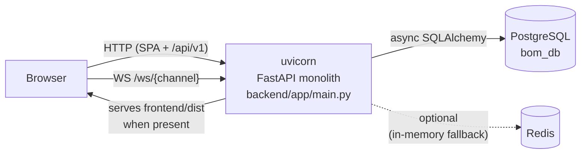
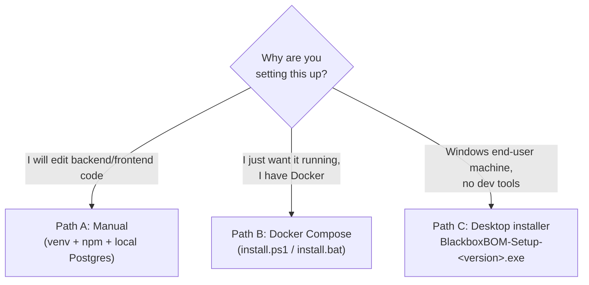
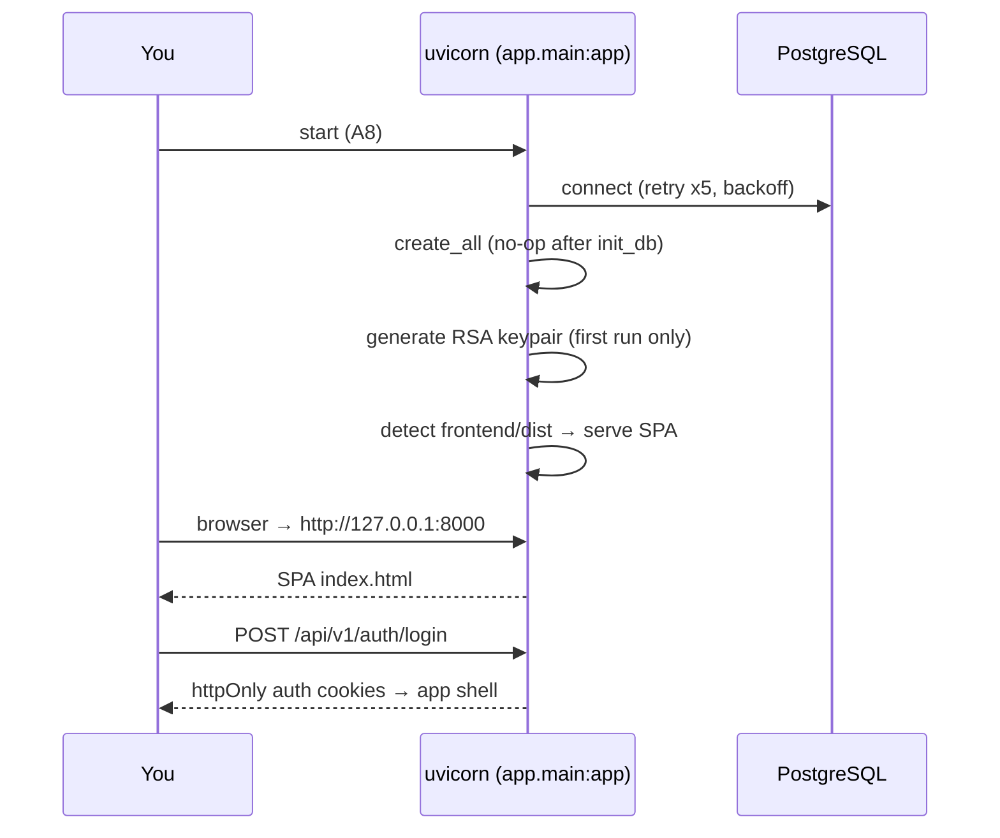

# First-Time Setup Guide — Blackbox BOM

> **Who this is for:** someone with **zero prior knowledge** of this codebase who needs to go from
> `git clone` to a working, logged-in app on their own machine. Every command is copy-pasteable.
> Every claim in this guide is grounded in the actual source code (file paths are cited throughout),
> including honest callouts of what is **mock/stub** and what is known to be broken.

> **Related documents** (read after this one, not instead of it):
> - `INSTALL.md` — the Docker Compose install path in more depth (backup/restore of a Docker stack in sections 4–5).
> - `desktop/DESKTOP_PACKAGING.md` — how the one-click Windows installer is built and what it bundles.
> - `desktop/DURABILITY.md` — crash-safety / backup verification notes for the desktop bundle.
> - `DISASTER_RECOVERY_RUNBOOK.md` (repo root) — deeper disaster-recovery procedures.
> - `frontend/OPEN_ITEMS.md` and `frontend/MIGRATION_MAP.md` — the frontend's in-progress migration state.
> - `TEST_FAILURES_TRIAGE.md` (repo root) — known pre-existing test failures (so you don't panic when the SQLite suite is red).

---

## Table of Contents

1. [What you are setting up](#1-what-you-are-setting-up)
2. [Choose your setup path](#2-choose-your-setup-path)
3. [Prerequisites](#3-prerequisites)
4. [Path A — Manual developer setup (backend + frontend from source)](#4-path-a--manual-developer-setup)
   - [A1. Clone the repository](#a1-clone-the-repository)
   - [A2. Set up PostgreSQL](#a2-set-up-postgresql)
   - [A3. Backend: virtualenv + dependencies](#a3-backend-virtualenv--dependencies)
   - [A4. Configure the backend `.env`](#a4-configure-the-backend-env)
   - [A5. Initialize the database schema (`init_db`)](#a5-initialize-the-database-schema-init_db)
   - [A6. Seed sample data and the admin user (`seed_db`)](#a6-seed-sample-data-and-the-admin-user-seed_db)
   - [A7. Frontend: install and build](#a7-frontend-install-and-build)
   - [A8. Run the backend (which also serves the frontend)](#a8-run-the-backend-which-also-serves-the-frontend)
   - [A9. Verify and log in](#a9-verify-and-log-in)
   - [A10. Optional: the Vite dev server (and its big caveat)](#a10-optional-the-vite-dev-server-and-its-big-caveat)
5. [Path B — Docker Compose (one command, whole stack)](#5-path-b--docker-compose)
6. [Path C — One-click Windows desktop installer](#6-path-c--one-click-windows-desktop-installer)
7. [Verification checklist](#7-verification-checklist)
8. [What is real vs. partial vs. mock in the UI](#8-what-is-real-vs-partial-vs-mock-in-the-ui)
9. [Common issues & troubleshooting](#9-common-issues--troubleshooting)
10. [FAQ](#10-faq)
11. [Reference: ports, URLs, environment variables](#11-reference-ports-urls-environment-variables)

---

## 1. What you are setting up

Blackbox BOM is a **local-first, multi-tenant BOM (Bill of Materials) management tool**:

- **Backend** — a single-process async **FastAPI** monolith (`backend/app/main.py`). One `uvicorn`
  process serves:
  - the JSON API under `/api/v1` (~549 routes across 73 endpoint modules, wired in `backend/app/api/api_v1.py`),
  - WebSockets at `/ws/{channel}` (presence, cursors, doc locks for collaboration),
  - and — **when a built frontend exists** — the React SPA itself via a catch-all route
    (`backend/app/main.py`, `SERVE_FRONTEND` / `FRONTEND_DIST_DIR` logic around lines 717–785).
- **Frontend** — a **Vite + React 18** single-page app (`frontend/`), currently **mid-migration**
  from a legacy `window.*`-globals architecture to ES modules (this matters for some of the
  quirks in the troubleshooting section). The API client is `frontend/api.js`; it talks to the
  backend **same-origin** at `/api/v1` (`frontend/src/config.js`).
- **Database** — **PostgreSQL** with async SQLAlchemy 2.0 and Alembic migrations
  (47 migration files, single head `047_solidworks_integration`). Every business table is
  tenant-scoped via a `tenantId` column.
- **Redis** — **optional**. Rate limiting, token blacklists, and backup locks use Redis when
  available and fall back to in-memory implementations when not (`backend/app/core/rate_limit.py`).
  You do **not** need Redis for a local manual setup.

"Local-first" is a deliberate design principle here: the app must function entirely on your
machine with no cloud connectivity. Nothing in first-time setup requires the internet except
downloading dependencies.



---

## 2. Choose your setup path

There are **three** supported ways to run this app. Pick one:

| Path | Best for | What you install | Effort | URL you end up at |
|---|---|---|---|---|
| **A. Manual** | Developers who will edit code | Python, Node, PostgreSQL yourself | ~30 min | `http://127.0.0.1:8000` |
| **B. Docker Compose** | "Just run it" on any machine with Docker | Docker Desktop only | ~10 min | `http://localhost` |
| **C. Desktop installer** | End users on Windows, zero prerequisites | One `.exe` (bundles Postgres 16 + backend + SPA) | ~2 min | `http://127.0.0.1:8756` |



All three paths end at the same place: a browser, a login screen, and (if you seeded it)
the `admin@blackbox.com` account.

---

## 3. Prerequisites

### For Path A (manual)

| Tool | Version | Why |
|---|---|---|
| **Python** | 3.11 or 3.12 | Backend runtime. CI runs 3.12; docs say 3.11+. |
| **Node.js** | Current LTS (18+) | Frontend build (Vite 6, React 18). |
| **PostgreSQL** | 15 or 16 | The database. Docker CI uses 15/16; the desktop bundle ships 16.9. |
| **Git** | any recent | Cloning. |

Redis is **not** required (in-memory fallbacks are automatic). SQLite is used by parts of the
test suite but is **not** a supported runtime database for the app.

### For Path B (Docker)

- **Docker Desktop** (with Compose v2, i.e. `docker compose` works).
- Free ports: `80` (frontend), `8000` (backend), `5432` (Postgres), `6379` (Redis) — all
  remappable via `.env` (`FRONTEND_PORT`, `BACKEND_PORT`, `POSTGRES_HOST_PORT`, `REDIS_HOST_PORT`).

### For Path C (desktop installer)

- A 64-bit **Windows 10+** machine and admin rights. Nothing else — Postgres, the backend,
  and the built frontend are all bundled.

---

## 4. Path A — Manual developer setup

All paths below assume the repository root is called `bom-tool` and commands are run from it
unless stated otherwise. Commands are given for **PowerShell (Windows)** and **bash (macOS/Linux)**
where they differ.

### A1. Clone the repository

```bash
git clone <your-repo-url> bom-tool
cd bom-tool
```

You should see (among others):

```
bom-tool/
├── backend/          # FastAPI app, Alembic migrations, seed_db.py
├── frontend/         # Vite + React SPA
├── desktop/          # Windows installer / launcher (Path C)
├── docker-compose.yml
├── install.ps1 / install.bat     # Path B helpers
├── INSTALL.md
└── .env.example      # for the Docker path (Path B)
```

> **Note:** there are TWO `.env.example` files. The **root** one is for Docker Compose (Path B).
> The one you want for manual setup is **`backend/.env.example`** (Path A, step A4).

### A2. Set up PostgreSQL

You need a running PostgreSQL server and a database + user for the app. Two options:

#### Option 1 — Native PostgreSQL install (recommended for development)

Install PostgreSQL 15 or 16 (Windows: EDB installer; macOS: `brew install postgresql@16`;
Linux: your distro's packages). Then create the role and database.

First generate a strong password (**important**: use exactly this generator — see the warning below):

```bash
python -c "import secrets; print(secrets.token_urlsafe(32))"
```

> ⚠️ **Why this specific generator?** The backend interpolates `POSTGRES_PASSWORD` into the
> database URL **without URL-encoding** (`backend/app/core/config.py`, `assemble_db_connection`).
> A password containing `@`, `:`, `/`, or `#` will silently break the connection string.
> `token_urlsafe` only emits `[A-Za-z0-9_-]`, which is always safe.

Then, in `psql` as the `postgres` superuser:

```sql
CREATE USER bom_user WITH PASSWORD '<the-generated-password>';
CREATE DATABASE bom_db OWNER bom_user;
```

(On Windows, `psql` is typically at `C:\Program Files\PostgreSQL\16\bin\psql.exe`;
run `psql -U postgres`.)

#### Option 2 — Postgres in a Docker container (DB only, everything else native)

```bash
docker run -d --name bom-postgres \
  -e POSTGRES_USER=bom_user \
  -e POSTGRES_PASSWORD=<the-generated-password> \
  -e POSTGRES_DB=bom_db \
  -p 5432:5432 \
  postgres:16-alpine
```

#### Option 3 — The bundled Postgres

The **desktop installer** (Path C) ships its own portable PostgreSQL 16.9 on port **55432**,
bootstrapped automatically by `desktop/launcher.py`. If you want zero-effort Postgres, use
Path C instead of Path A — the bundled cluster is not intended to be paired with a manual
source checkout (the launcher owns its lifecycle, config, and WAL archiving).

### A3. Backend: virtualenv + dependencies

```powershell
# PowerShell (Windows)
cd backend
python -m venv .venv
.\.venv\Scripts\Activate.ps1
python -m pip install --upgrade pip
pip install -r requirements.txt
```

```bash
# bash (macOS/Linux)
cd backend
python3 -m venv .venv
source .venv/bin/activate
python -m pip install --upgrade pip
pip install -r requirements.txt
```

Notes:

- `backend/requirements.txt` uses **version ranges** (e.g. `fastapi>=0.111,<1.0`) and there is
  **no lock file**, so exact resolved versions can drift between installs. If something breaks
  after a fresh install, dependency drift is a legitimate suspect.
- Test dependencies are separate (`requirements-test.txt`); you don't need them to run the app.

### A4. Configure the backend `.env`

Copy the template and open it:

```powershell
# from backend/
Copy-Item .env.example .env
```

```bash
# from backend/
cp .env.example .env
```

Now fill in the **required** values in `backend/.env`. Generate **each** secret separately:

```bash
python -c "import secrets; print(secrets.token_urlsafe(32))"
```

Minimum working configuration:

```dotenv
ENVIRONMENT=development

# PostgreSQL — must match what you created in step A2
POSTGRES_USER=bom_user
POSTGRES_PASSWORD=<generated-in-A2>
POSTGRES_DB=bom_db
POSTGRES_SERVER=127.0.0.1
POSTGRES_PORT=5432

# Redis — leave BOTH empty for local dev (in-memory fallback kicks in)
REDIS_PASSWORD=
REDIS_URL=

# App secrets — REQUIRED, generate fresh values
SECRET_KEY=<generated>
ENCRYPTION_KEY=<generated>

# S3 — NOT used locally, but the backend validates S3_SECRET_KEY is non-empty
# at startup anyway. Any generated value works.
S3_ACCESS_KEY=local-unused
S3_SECRET_KEY=<generated>
```

**What these secrets actually do (and why you can't skip them):**

- `SECRET_KEY` — signs CSRF cookies and other HMAC material. Config validation
  (`backend/app/core/config.py`) enforces **Shannon entropy ≥ 80 bits** and rejects
  known-weak values; in `ENVIRONMENT=production` a missing/weak secret is a **hard startup
  failure**. In development you still need a real random value.
- `ENCRYPTION_KEY` — on first run the backend **auto-generates an RSA-4096 keypair** for
  signing JWTs (RS256) and encrypts the private key PEM with a passphrase derived from
  `ENCRYPTION_KEY` (`backend/app/core/security.py`). **Consequence:** if you change
  `ENCRYPTION_KEY` after first run, the backend can no longer decrypt its own JWT signing key.
  Keep your `.env` stable; back it up.
- `POSTGRES_PASSWORD` — see the URL-encoding warning in A2.

Things to deliberately **leave alone** for a first-time setup:

- `ENVIRONMENT=development` — do **not** set `production` on a first run. Production mode
  hard-fails on weak secrets, requires **MFA for superuser accounts**
  (`backend/app/core/deps.py`), tightens cookies/CSRF/HSTS assuming TLS, and `seed_db.py`
  **refuses to create the admin user** in production.
- `REDIS_URL` — leave empty. A subtle known issue: if you point `REDIS_URL` at a **remote**
  host, the availability check assumes it's reachable without pinging it
  (`backend/app/core/rate_limit.py`), so a down remote Redis breaks rate limiting. Empty = safe
  in-memory fallback.
- `ENABLE_RLS` — leave off/absent. Postgres Row-Level Security is an **opt-in second layer**
  of tenant isolation with an operational trap: the RLS migration (040) only applies its
  policies if the flag is on **at migration time**, and the greenfield `init_db` path doesn't
  run migration SQL at all (see A5). App-layer isolation is the primary mechanism.

### A5. Initialize the database schema (`init_db`)

From `backend/` with the venv activated:

```bash
python -m scripts.init_db
```

Expected output on a fresh database:

```
[init_db] greenfield DB: Base.metadata.create_all + alembic stamp head
```

**Why this exists — and why you must NOT run `alembic upgrade head` on a fresh DB:**
the historical migration chain cannot build a database from scratch. Early migrations (004+)
reference ~74 tables that only ever existed via `Base.metadata.create_all()` and were not
formalized into migrations until revision 022. So `alembic upgrade head` on an empty Postgres
**fails at migration 004** — by design, `scripts/init_db.py` handles both cases idempotently:

- **Fresh DB** (no `alembic_version` table): builds the full current schema from the ORM models
  via `create_all`, then `alembic stamp head` (records the head revision **without** replaying
  the broken chain).
- **Existing managed DB**: runs `alembic upgrade head` normally to apply pending migrations.

It honors `DATABASE_URL`/`DATABASE_URI` env vars if set, otherwise reads your `backend/.env`
(the Alembic `env.py` falls back to the app settings — a past bug where it ignored `.env` is fixed).

> **Caveat (documented in `scripts/init_db.py` itself):** the greenfield path does not execute
> migration 040's raw RLS SQL. RLS is off by default so this doesn't affect you, but if you
> later want RLS you must apply those policies separately.

### A6. Seed sample data and the admin user (`seed_db`)

The seeder (`backend/seed_db.py`) creates:

- a default tenant: **"Blackbox Factories" (code `BBF`)** — every table is multi-tenant, so a
  tenant must exist first,
- **5 sample parts**, **4 vendors** (Digi-Key, Mouser, Protolabs, Arrow), **2 projects**
  (ATLAS Rover, HORIZON Drone), and **one draft BOM per project** (without this, the BOM editor
  has nothing to open and item-adds fail with "BOM not found"),
- **optionally** an admin user — **only** if you set `SEED_ADMIN_PASSWORD`. This is a deliberate
  safety choice: no environment variable, no default admin account. The default admin email is
  `admin@blackbox.com` (override with `SEED_ADMIN_EMAIL`). Seeding an admin is also **refused
  outright** when `ENVIRONMENT=production`.

Run it **with** the admin password set (from `backend/`, venv active):

```powershell
# PowerShell
$env:SEED_ADMIN_PASSWORD = "<pick-a-strong-login-password>"
python seed_db.py
```

```bash
# bash
SEED_ADMIN_PASSWORD='<pick-a-strong-login-password>' python seed_db.py
```

Expected output:

```
Database seeded successfully!
  - 5 parts
  - 4 vendors
  - 2 projects
  - 1 admin user (admin@blackbox.com) with password from SEED_ADMIN_PASSWORD
```

> **Idempotency note:** if the parts table already has rows, the seeder prints
> `Database already has N parts. Skipping seed.` and does **nothing else** — including the
> admin user. If you forgot `SEED_ADMIN_PASSWORD` on the first run, the simplest fix on a
> throwaway dev DB is to drop and recreate `bom_db`, then redo A5 + A6.

> **Known quirk:** the sample parts declare `tags` and `compliance` strings, but the seeder
> silently strips them (they're relationship join-tables, not columns), so seeded parts have
> no tag/compliance rows. Cosmetic only.

### A7. Frontend: install and build

```bash
cd ../frontend      # from backend/
npm install
npm run build       # outputs to frontend/dist/
```

**Why build instead of `npm run dev`?** The backend **automatically detects and serves**
`frontend/dist` (see A8), giving you a single-origin setup where cookies, CSRF, and WebSockets
all just work. The Vite dev server, by contrast, has **no `/api` proxy configured**
(`frontend/vite.config.ts` has no `server.proxy` entry), so a dev-server-only frontend cannot
reach the backend and silently drops into offline/demo mode — see A10.

Notes:

- `npm run build` runs a `prebuild` clean step (`node clean.js`) automatically.
- Known dependency wart (won't block the build): `react`/`react-dom` are `^18.3.1` but
  `@types/react`/`@types/react-dom` are v19 and `typescript` is pinned to `^6.0.3` —
  a type/runtime major mismatch. `npm run typecheck` results are unreliable; the Vite build
  itself is what matters.

### A8. Run the backend (which also serves the frontend)

From `backend/` with the venv activated:

```bash
uvicorn app.main:app --host 127.0.0.1 --port 8000
```

(Add `--reload` while developing backend code.)

**What happens at startup** (the lifespan hook in `backend/app/main.py`):

1. DB engine init with a 5-attempt exponential-backoff retry (so a slow-starting Postgres is tolerated).
2. `Base.metadata.create_all` runs (deprecated but on by default; opt out with `SKIP_CREATE_ALL=true`).
   Since you already ran `init_db`, this is a no-op.
3. Tenant-isolation ORM event listeners register; the job-queue worker and rate limiter initialize
   (in-memory, since Redis is unset).
4. First run only: the **RSA-4096 JWT keypair is generated** and written encrypted to disk.
5. Three background tasks start: backup scheduler (every 6h by default), integration outbox
   drainer (15s), Zoho Books inbound poll (60s tick — harmless no-op when Zoho isn't connected).
6. **Frontend serving auto-enables** because `frontend/dist/index.html` now exists at the
   repo-relative path the backend probes (`backend/app/main.py`, `_resolve_frontend_dist_dir`).
   You can force it with `SERVE_FRONTEND=1`, force it **off** with `SERVE_FRONTEND=0`, or point
   at a non-standard build with `FRONTEND_DIST_DIR=<path>`. Look for this log line:

   ```
   Serving built frontend from ...frontend/dist
   ```



### A9. Verify and log in

1. **Health check** — in a second terminal or the browser:

   ```
   http://127.0.0.1:8000/health
   ```

   should return JSON with database (and backup) health. If the DB is unreachable you'll see
   it here first.

2. **Open the app** — `http://127.0.0.1:8000/`. You should get the Blackbox BOM login screen
   (if you instead see a small JSON welcome message, the frontend build wasn't detected — see
   troubleshooting).

3. **Log in** as:

   - **Email:** `admin@blackbox.com`
   - **Password:** whatever you set as `SEED_ADMIN_PASSWORD` in A6.

   Authentication is **cookie-based** (httpOnly `access_token` cookie + CSRF double-submit
   cookie; tokens are never stored in `localStorage`). The login endpoint is
   `POST /api/v1/auth/login` (`backend/app/api/endpoints/auth.py`).

4. **Expect real data** — the Parts screen should show the 5 seeded parts, Vendors the 4
   seeded vendors, and the project switcher should reflect real projects. If you see a rich,
   fully-populated demo workspace instead, you are in offline/demo mode — see
   [troubleshooting](#9-common-issues--troubleshooting).

### A10. Optional: the Vite dev server (and its big caveat)

For frontend development with hot reload:

```bash
cd frontend
npm run dev        # serves at http://localhost:3001
```

**The caveat:** `frontend/vite.config.ts` configures port 3001 but **no proxy for `/api`**, and
the API client (`frontend/src/config.js`) is same-origin by design (`API_BASE: '/api/v1'`).
So the dev server's API calls go to `localhost:3001/api/v1/...` — which the Vite server answers
with the SPA's HTML, not JSON. The app's startup health check fails, `apiConnected` goes false,
and the UI **falls back to built-in demo fixtures** (the ATLAS/HORIZON demo BOM from
`frontend/data.js` / `frontend/projects.js`). This is by design for offline demoing, but it
means **`npm run dev` alone gives you a demo-data UI, not a live-backend UI.**

Your options:

1. **Recommended:** develop the frontend, then `npm run build` and refresh
   `http://127.0.0.1:8000` (backend picks up the new `dist` immediately; slower loop but
   fully real).
2. Inject `window.__BBOX_CONFIG = { API_BASE: 'http://127.0.0.1:8000/api/v1', WS_BASE: 'ws://127.0.0.1:8000/ws' }`
   in an inline script **before** the bundle loads (this is the documented override hook in
   `frontend/src/config.js`) — but you're then cross-origin: you must add `http://localhost:3001`
   to `BACKEND_CORS_ORIGINS` in `backend/.env`, and cookie-based auth across origins is fragile.
   Only go here if you know you need it.
3. Add a `server.proxy` block to `vite.config.ts` yourself (not currently present in the repo).

> Also note: `frontend/serve.py` and `frontend/server.js` are **legacy static servers** from an
> earlier architecture. Their hardcoded CSP headers disagree with each other (one allows API
> `connect-src` on port 8000, the other on 8001) and they do not proxy `/api` either. Don't use
> them for setup; they're covered in troubleshooting because their CSP quirks can bite you.

---

## 5. Path B — Docker Compose

The root `docker-compose.yml` runs the whole stack: `postgres:15-alpine`, `redis:7`
(with `--requirepass`), the backend (built from `backend/Dockerfile`, migrations applied by
`backend/scripts/docker-entrypoint.sh`), and the frontend (built and served by nginx, which
reverse-proxies `/api` and `/ws` to the backend).

### B1. The easy way (Windows)

```powershell
.\install.ps1     # or install.bat
```

The installer script **generates all the required secrets for you** into `.env` and runs
`docker compose up -d --build`. There are matching `stop.ps1`/`stop.bat` and
`uninstall.ps1`/`uninstall.bat` scripts.

### B2. The manual way (any OS)

```bash
cp .env.example .env
# open .env and fill in EVERY empty secret:
#   POSTGRES_PASSWORD, REDIS_PASSWORD, SECRET_KEY, ENCRYPTION_KEY, S3_SECRET_KEY
# generate each with:  python -c "import secrets; print(secrets.token_urlsafe(32))"
docker compose up -d --build
```

> **This is intentional friction:** the root `.env.example` ships secrets **empty**, and compose
> uses fail-closed `${VAR:?}` interpolation — `docker compose up` refuses to start with a
> `"variable is required"` error naming the missing variable until you fill them all in. A
> committed placeholder secret would let anyone forge auth tokens.

### B3. First-run behavior and login

- The entrypoint waits for Postgres (`pg_isready`), runs `python -m scripts.init_db`
  (same greenfield-vs-managed logic as Path A5), and seeds the **RBAC roles/permissions catalog**
  once when the roles table is empty (`SEED_RBAC_ON_START=true` is safe to leave on forever).
- Open **`http://localhost`** (nginx serves the SPA and proxies the API — the backend port is
  not exposed to the browser at all).
- **The Docker path does not seed the demo data or admin user automatically.** To get the same
  `admin@blackbox.com` account as Path A, run the seeder inside the backend container:

  ```bash
  docker compose exec -e SEED_ADMIN_PASSWORD='<password>' backend python seed_db.py
  ```

- Backup/restore of a running Docker stack is covered by `scripts/backup-data.ps1`/`.sh` and
  `scripts/restore-data.ps1`/`.sh` — see `INSTALL.md` sections 4–5.

---

## 6. Path C — One-click Windows desktop installer

This is the true "zero prerequisites" path: a single Inno Setup `.exe` that bundles the
PyInstaller-packaged backend, the built React SPA, and a **portable PostgreSQL 16.9**.

### C1. If you already have the installer

Run `BlackboxBOM-Setup-<version>.exe` (admin rights required; x64 Windows 10+ only). It installs:

| What | Where | Notes |
|---|---|---|
| Program files | `%ProgramFiles%\BlackboxBOM` | launcher + backend.exe + pgsql + frontend dist. The install directory is fixed by design. |
| Your data | `%ProgramData%\BlackboxBOM` | `pgdata`, `.env` (auto-generated secrets), `backups`, `wal_archive`, `logs`, `uploads`, `rsa_keys`. **Survives updates AND uninstall** by default; deletion requires an explicit opt-in prompt or the `/REMOVEDATA` uninstall flag. |
| Registry | `HKLM\Software\BlackboxBOM` | InstallDir / DataDir / Version / BackendUrl. |

On first launch, `launcher.py` (compiled into the launcher exe):

1. Generates all secrets into `%ProgramData%\BlackboxBOM\.env` (once; stable across runs so
   your JWTs and DB password don't churn).
2. Bootstraps the bundled Postgres: `initdb`, loopback-only listen on **port 55432**,
   crash-safe settings (`fsync=on`, `synchronous_commit=on`, WAL archiving for point-in-time
   recovery), creates `bom_user`/`bom_db`, then tightens auth to `scram-sha-256`.
3. Starts the backend on **`http://127.0.0.1:8756`** (serving both API and SPA) and opens
   your browser. A tray icon manages shutdown (backend first, then Postgres).

**Creating your first account on desktop:** the desktop bundle does **not** auto-create an
admin user. Either register through the app's sign-up flow, or seed one the same way as Path A6
if you have a source checkout pointed at the bundled DB. There is no default password anywhere,
by design.

Auto-update (`desktop/updater.py`) is best-effort and fully offline-safe: it checks a feed URL,
verifies the download's SHA-256 before executing anything, and silently does nothing when
offline. Updates never touch `%ProgramData%`.

### C2. If you need to build the installer yourself

On a build machine with Python 3.11+, Node LTS, PyInstaller, Inno Setup 6, and PowerShell:

```powershell
cd desktop
python build.py
```

The 8-stage pipeline (see `desktop/build.py` and `desktop/DESKTOP_PACKAGING.md`) builds the
frontend, PyInstaller-packages the backend and launcher, fetches the pinned EDB PostgreSQL
16.9 zip (the only step needing network, one time), assembles the layout, and runs Inno Setup.
Output: `desktop/dist/BlackboxBOM-Setup-<version>.exe` plus a `feed.json` for the updater.
Dev shortcuts: `--no-pgsql` / `--skip-installer`, and `BLACKBOX_SKIP_PG=1` to run the launcher
against an existing Postgres (documented in `DESKTOP_PACKAGING.md` section 6).

### C3. Desktop-specific known gaps (honesty section)

- **Migrations on desktop installs:** in the installed `backend.exe` mode the launcher **never
  stamps `alembic_version`** — the schema comes only from the idempotent `create_all` at startup
  (`desktop/launcher.py` documents this as a known gap). Future schema changes that ship as real
  Alembic migrations (ALTERs, data migrations) will **not** auto-apply on desktop installs today.
- **PITR restore on Windows is broken:** WAL archiving itself works (the launcher writes a
  correct `copy /Y` archive command), but `backend/scripts/pitr_restore.py` hardcodes a Unix
  path and a `cp`-based restore command, so a desktop point-in-time restore would fail at first
  WAL replay. Plain `pg_dump` backup/restore is unaffected.
- Two more backup-subsystem bugs worth knowing before you rely on backups — see the
  [FAQ](#10-faq) entry "Can I trust the built-in backups?".

---

## 7. Verification checklist

Run through this regardless of path:

| # | Check | Expected |
|---|---|---|
| 1 | `GET /health` (`:8000/health`, `localhost/health` via nginx, or `:8756/health`) | JSON with healthy DB status |
| 2 | Open the served URL | Login screen renders (not a JSON welcome, not a browser error page) |
| 3 | Log in with `admin@blackbox.com` + your `SEED_ADMIN_PASSWORD` | App shell loads, no redirect loop |
| 4 | Parts screen | The **5 seeded parts** (`EL-MCU-STM32H7`, `ME-SEN-DHT22`, `EL-PSU-12V5A`, `ME-ENC-ALU6061`, `EL-LCD-IPS5`) |
| 5 | Vendors screen | Digi-Key, Mouser, Protolabs, Arrow |
| 6 | Open a BOM | The seeded draft BOM ("… - Main Assembly") opens; adding an item works |
| 7 | Browser devtools → Network | API calls hit `/api/v1/...` and return 200s after login |

If check 4 shows a large, fully-populated electronics BOM you never seeded — that's the
**demo fixture**, meaning the frontend could not reach the backend. See the next section.

---

## 8. What is real vs. partial vs. mock in the UI

This app's backend is broad and genuinely implemented (~549 API routes; a full audit found only
two intentional stubs). The **frontend**, however, is mid-migration, and a significant share of
screens still render **fabricated demo data** regardless of what's in your database. Knowing
this up front saves hours of "why doesn't my data show up here?" confusion. Roughly ~30 screens
are fully real, ~31 partial, ~66 mock (audit of `frontend/src`).

**Real (wired to the live API, honest error states):** Audit Trail, Catalogs, Work Queue &
Teams, Zoho Books screen, Integrations config, Procurement (PO list/stats), ERP
Connectors/Webhooks/Bulk Import/Supplier Portal/Order Tracking screens, the enterprise screens
(dashboards, service BOM, routings, work centers, labor, custom attributes, API keys), Tenants
admin, BOM editor **writes**, and WebSocket presence/collaboration.

**Partial (some API, some fabricated):** Analytics (2–3 KPIs real; **all trend charts are
hardcoded**), Diff/compare (real compare API but hardcoded BOM ids; version diffs fabricated),
Documents (real list with silent static fallback), OCR (real extraction; "Apply to part" only
shows a toast), Vendors (reads real; preferred/active toggles don't persist), ECR, Compliance
screen (fetches real data then **hardcodes every part's RoHS/REACH status to "valid"**),
Calendar (localStorage only, never calls the real calendar API), mobile scanner (real lookups,
**simulated** barcode scan).

**Mock (entirely fabricated — do not trust these numbers):** the main Dashboard's budget widget
and "API Uptime 99.98%", the Activity feed (invents a fake event every 15 seconds with actors
like "E. Chen"), the AI Assistant (canned regex replies — and note the backend's "AI" demand
forecast is itself an honest-but-deterministic seasonal heuristic, not ML), Internet
Scrape/Price Alerts/RFQ Compare/Inflation modals, the QMS dashboard and NCR screen (real
quality/NCR/CAPA **endpoints exist**, these screens just don't call them), the Inventory screen
(synthesizes stock from part-number characters), Find Alternates, the Audit Log **modal**
(the Audit Trail **screen** is real), and most of the PDM/CAD vault tree.

**Backend stubs (explicit, by design):**
- `POST /api/v1/erp-connectors/{id}/sync` — records a log saying ERP sync is **not implemented**;
  connector CRUD/test-connection are real.
- Zoho Books — OAuth connect and **outbound push** sync are real; **pull/reconcile/conflict
  endpoints return an explicit "not implemented in this build"** response.
- Five fully-written routers (`derivatives`, `formulas`, `graph`, `planning`,
  `solidworks_contract`) are **never mounted** in `backend/app/api/api_v1.py`, so their
  features — notably PO-from-BOM planning — are currently unreachable over HTTP.

---

## 9. Common issues & troubleshooting

### Startup & database

**"variable is required" from `docker compose up`**
By design — the root `.env` ships secrets empty (fail-closed `${VAR:?}` interpolation). Fill in
every empty secret in `.env` (see B2) or use `install.ps1` which generates them.

**Backend exits at startup complaining about `SECRET_KEY` / weak secret / entropy**
Config validation requires ≥ 80 bits of Shannon entropy and rejects known-weak values.
Generate with `python -c "import secrets; print(secrets.token_urlsafe(32))"` — don't hand-type
a password. In `ENVIRONMENT=production` this is a hard failure on purpose.

**`alembic upgrade head` fails around migration 004 on a fresh database**
Expected — the chain can't build from scratch (see A5). Never run raw Alembic on a fresh DB;
use `python -m scripts.init_db`, which handles both fresh and existing databases.

**Backend can't connect to Postgres / retries then dies**
Check in order: Postgres is actually running; `POSTGRES_SERVER`/`POSTGRES_PORT` in
`backend/.env` match reality (5432 native/Docker-DB, 55432 desktop bundle); the password
contains no `@ : / #` characters (URL-encoding bug — regenerate with `token_urlsafe`);
`bom_db` exists and is owned by `bom_user`.

**Login fails with "user not found" / `admin@blackbox.com` doesn't exist**
The admin user is **only** created when `SEED_ADMIN_PASSWORD` was set during `seed_db.py`, and
never in production mode. Also, if parts already existed, the seeder skipped **everything**
including the admin. Re-run seeding against a clean DB with the env var set (A6).

### The 401 flood (read this before filing a bug)

**Symptom:** the browser console / network tab shows a burst of `401 Unauthorized` responses
on `/api/v1/...` endpoints.

**Cause & fix: you are not logged in.** That's it, in almost every case. The SPA boots, screens
fire their data requests, the backend correctly rejects them all with 401 until you have an
auth cookie. **Log in and the flood stops.** The client even handles this gracefully — a single
shared silent-refresh attempt (`POST /auth/refresh`) runs once per 401 burst, and only a
**failed refresh** triggers logout; transient 429/5xx/network errors during refresh
deliberately do *not* log you out (`frontend/api.js`).

Related 401 edge case: a **stale `access_token` cookie takes precedence over a fresh
`Authorization: Bearer` header** (`backend/app/core/deps.py` — cookie wins). If you're testing
with API tokens in curl/Postman *and* have logged into the SPA in the same browser profile,
clear cookies for the site or use a separate profile.

### Service worker & stale bundles

**Symptom:** you deployed/rebuilt the frontend but the browser still shows the **old UI**, or
the app behaves like a mix of old and new code.

**Cause:** the production build registers a service worker (`frontend/public/sw.js`, cache name
`bbox-v2`, registered only in production builds by `frontend/src/main.jsx`). It's network-first
for navigations and `/api/*`, but **cache-first for all other same-origin requests** — and
despite its own comment claiming only content-hashed `/assets/*` files are cached, it actually
caches **every** same-origin static file (e.g. `manifest.json`, logos) forever until the cache
name is bumped. Hashed JS/CSS self-heal on deploy; non-hashed files can stay stale.

**Fixes, in order of gentleness:**
1. **Hard refresh:** `Ctrl+Shift+R` (Windows/Linux) or `Cmd+Shift+R` (macOS).
2. **Incognito/private window** — no service worker state, instantly proves whether SW staleness is your problem.
3. **Nuke it:** DevTools → Application → Service Workers → *Unregister*, then Application →
   Storage → *Clear site data*, then reload.

Also know: the SW's *offline* fallback is effectively dead code — nothing ever populates the
cache with `/index.html`, so a genuinely offline reload shows the browser error page, not the
app. Don't expect PWA-style offline reloads.

### Trailing slashes, redirects, and odd URLs

- Seeing **307 redirects** on API calls without trailing slashes is **normal**. The backend has
  a dedicated raw-ASGI `ApiTrailingSlashMiddleware` (`backend/app/main.py`) that rewrites
  slash-less API paths, and the SPA catch-all route recreates FastAPI's slash redirect for API
  paths so that single-process SPA serving doesn't swallow them. If a `curl` request seems to
  "do nothing", add `-L` to follow the redirect or match the route's canonical slash form.
- Some doubled path segments are **known warts, not bugs you introduced**:
  `/api/v1/compliance/compliance/...`, `/api/v1/calendar/calendar-events`,
  `/api/v1/sessions/sessions/...` (router prefix + route paths that already contain the prefix).
  The frontend mirrors the doubled forms where it calls them.

### Content-Security-Policy (CSP)

- The backend sets environment-differentiated CSP headers
  (`backend/app/core/security_headers.py`) — with HSTS only when TLS is detected, which is why
  the plain-HTTP desktop bundle works. If you serve via the backend (Path A/C) or nginx
  (Path B), CSP should never block your own app.
- **Do not serve the frontend with `frontend/serve.py` or `frontend/server.js`.** They are
  legacy static servers whose hardcoded CSPs disagree (`connect-src` allows the API on port
  8000 in one, 8001 in the other) and allow third-party script CDNs the built app doesn't need.
  If you use them anyway, expect API calls or the Currency screen to be CSP-blocked depending
  on which server and port you picked.
- The **Currency screen** calls a live external exchange-rate API with a key hardcoded in the
  client source (`frontend/src/root/enterprise-screens.jsx`) — a known contradiction of the
  local-first principle. If your CSP or firewall blocks it, only that screen degrades.

### "Service temporarily unavailable" toasts

The API client has a **per-resource circuit breaker**: 5 failures within 30 seconds on one
resource (first path segment, e.g. `parts`) opens the circuit and instantly fails all requests
to it for 30s. Known bug: deterministic 4xx responses (404/422) **also** count and get retried,
so hammering a missing resource can lock out the whole resource family for 30s. Wait half a
minute; fix the underlying failing call.

### Demo data confusion

**Symptom:** the app shows a polished, fully-populated workspace (ATLAS Rover BOM, vendors,
dashboards) that you never created — or shows it **mixed** with your data.

**Cause:** the frontend's health check to the backend failed, so it fell back to bundled demo
fixtures. Common triggers: running `npm run dev` without an API proxy (see A10), the backend
being down, or wrong ports.

**Also be aware:**
- **Offline login quirk:** if the backend is unreachable — or even returns a 500 — the login
  screen accepts **any** credentials and enters an offline UI mode (`frontend/src/screens/App.jsx`).
  Your data is still protected server-side (there's no session), but the shell renders. If login
  "worked" with a password you know is wrong, your backend isn't actually being reached.
- Switching projects via the top-bar can replace live rows with fixture data even when
  connected (known issue in `frontend/src/context/AppCtx.jsx`), and the top-bar project list
  itself is hardcoded demo data.

### Known frontend crashes (pre-existing, not your setup)

| Crash | Where | Cause |
|---|---|---|
| `TypeError: ... .children` / `.flatMap` during render | Analytics screen, cost simulator, vendor detail, print preview, detail drawer | Code assumes the demo BOM tree shape (`rows[0].children`); API-hydrated rows are **flat**, so this fires precisely when you're *really* connected. |
| `ReferenceError: toast is not defined` | Mobile scanner flows | Missed import during the window→ESM migration. |
| "Element type is invalid" | Global search results | References `Icon.Package` / `Icon.Shield` / `Icon.Alert`, which don't exist in `frontend/src/root/icons.jsx`. |
| "Rendered more hooks than during the previous render" | Webhooks **modal** (the Webhooks *screen* is fine) | Early-return before `useState` — Rules of Hooks violation. |

### Production-mode surprises

Setting `ENVIRONMENT=production` intentionally changes behavior: weak/missing secrets become
fatal, **superuser accounts require enabled MFA** (`backend/app/core/deps.py`), cookie/CSRF/HSTS
settings assume TLS, and `seed_db.py` refuses to seed an admin. First-time local setups should
stay on `development`. (The desktop bundle deliberately does not run in production mode for
exactly this reason — it serves plain HTTP on loopback.)

---

## 10. FAQ

**Q: Do I need Redis?**
No. Rate limiting, token blacklisting, and backup locking all fall back to in-memory
implementations when `REDIS_URL` is unset. Docker Compose includes Redis because it's free
there. If you *do* set `REDIS_URL`, make sure it's reachable — a configured-but-down remote
Redis is worse than none (see A4).

**Q: Do I need internet access to run this?**
No — local-first is a core design principle. The exceptions: dependency installation (once),
the desktop updater's best-effort feed check (silently skipped offline), the optional Zoho Books
integration, and the Currency screen's external exchange-rate call (a known wart).

**Q: What's the admin login again?**
`admin@blackbox.com` with the password **you** chose via `SEED_ADMIN_PASSWORD` when running
`seed_db.py`. There is no built-in default password anywhere, deliberately. Override the email
with `SEED_ADMIN_EMAIL`.

**Q: Why do I see loads of 401s in the console?**
You're not logged in. Log in. (Full explanation in [troubleshooting](#the-401-flood-read-this-before-filing-a-bug).)

**Q: The UI looks stale/old after an update.**
Service worker. Hard refresh (`Ctrl+Shift+R`) or try an incognito window; worst case unregister
the SW and clear site data (see [troubleshooting](#service-worker--stale-bundles)).

**Q: Are the API docs available?**
The API is mounted at `/api/v1` and `GET /health` is the quickest liveness probe. `/metrics`
(Prometheus, auth-gated) and `/health/detailed` also exist under the v1 router.

**Q: Why does the dashboard show budgets / uptime / activity that I never entered?**
Those specific widgets are **mock** — fabricated client-side demo data (see
[section 8](#8-what-is-real-vs-partial-vs-mock-in-the-ui)). The same goes for the AI assistant,
the QMS dashboard, the inventory screen numbers, and several modals. The underlying backend
endpoints for quality/NCR/inventory are real; these screens just aren't wired to them yet.

**Q: Is the "AI" real?**
The `/api/v1/ai` endpoints are implemented but deterministic: the demand forecast is a
hard-coded seasonal multiplier over PO history with fabricated confidence values — statistics,
not ML. The chat-style AI Assistant in the UI is entirely canned.

**Q: Does the ERP sync / Zoho pull work?**
ERP connector **sync** is an explicit no-op stub (the connector CRUD and test-connection are
real). Zoho Books supports OAuth connect and **outbound push** only; pull/reconcile/conflict
resolution return an explicit "not implemented in this build".

**Q: Can I trust the built-in backups?**
Partially — verify before relying on them. Logical `pg_dump` backups (including encrypted ones)
create, verify, and restore correctly. Two audited bugs in `backend/app/core/backup.py`:
(1) **encrypted *physical* basebackups cannot currently be restored** (the restore path uses a
single-shot decrypt against a chunked stream-encryption format, so decryption always fails);
(2) **backup-failure email alerts silently never send** (an attribute typo swallowed by a broad
exception handler). On Windows desktop, PITR restore is additionally not Windows-aware (C3).
Practical guidance: rely on logical dumps, test a restore once, don't assume you'd be emailed
about failures. See `desktop/DURABILITY.md` and `DISASTER_RECOVERY_RUNBOOK.md` (repo root).

**Q: How do I completely reset my install?**
- *Path A:* stop uvicorn, `DROP DATABASE bom_db; CREATE DATABASE bom_db OWNER bom_user;`,
  re-run A5 + A6. Keep `backend/.env` (remember: changing `ENCRYPTION_KEY` orphans the JWT keys).
- *Path B:* `docker compose down -v` (the `-v` deletes the data volumes), then bring it back up
  and re-seed.
- *Path C:* uninstall with the `/REMOVEDATA` flag, or delete `%ProgramData%\BlackboxBOM` after
  uninstalling (by default your data intentionally survives uninstall).

**Q: The backend test suite has failures — did I break something?**
Probably not. There are ~93 documented pre-existing failures in the SQLite-based suite
(`TEST_FAILURES_TRIAGE.md`, repo root); CI treats that suite as non-blocking. The meaningful gate
is the Postgres fresh-install bootstrap job (`.github/workflows/postgres-ci.yml`).

**Q: Multi-tenancy — do I need to care during setup?**
Only to know it exists: everything you create lives under the seeded "Blackbox Factories" (BBF)
tenant, isolation is enforced app-side per request, and Postgres RLS is an optional extra layer
that's off by default. Tenant administration endpoints (`/api/v1/tenants`) are superuser-only.

---

## 11. Reference: ports, URLs, environment variables

### Ports & URLs by path

| | Path A (manual) | Path B (Docker) | Path C (desktop) |
|---|---|---|---|
| App URL | `http://127.0.0.1:8000` | `http://localhost` (nginx :80) | `http://127.0.0.1:8756` |
| API | same origin, `/api/v1` | proxied `/api` → backend :8000 | same origin, `/api/v1` |
| WebSockets | `/ws/{channel}` same origin | proxied `/ws` | same origin |
| PostgreSQL | `127.0.0.1:5432` (yours) | container, host-mapped :5432 | bundled, `127.0.0.1:55432` |
| Redis | none (in-memory fallback) | container :6379 (`--requirepass`) | none (in-memory fallback) |
| Vite dev server | `http://localhost:3001` (demo mode only — A10) | — | — |

### Environment variables you'll actually touch (Path A)

| Variable | Required? | Purpose |
|---|---|---|
| `ENVIRONMENT` | yes (`development`) | Gates production hardening (MFA, secret hard-fails, TLS-assuming cookies). |
| `POSTGRES_USER/PASSWORD/DB/SERVER/PORT` | yes | DB connection. Password must be URL-safe (`token_urlsafe`). |
| `SECRET_KEY` | yes | HMAC/CSRF signing. Entropy-validated at startup. |
| `ENCRYPTION_KEY` | yes | Encrypts the auto-generated RSA-4096 JWT signing key. **Never change after first run.** |
| `S3_ACCESS_KEY` / `S3_SECRET_KEY` | yes (any value) | Validated non-empty even though S3 is unused locally. |
| `REDIS_URL` / `REDIS_PASSWORD` | no | Leave empty locally. |
| `SEED_ADMIN_PASSWORD` / `SEED_ADMIN_EMAIL` | seed-time only | Creates `admin@blackbox.com` (or your email) during `seed_db.py`. |
| `SERVE_FRONTEND` / `FRONTEND_DIST_DIR` | no | Force SPA serving on (`1`)/off (`0`) or point at a custom `dist`. Auto-detected otherwise. |
| `SKIP_CREATE_ALL` | no | Set `true` to skip the deprecated startup `create_all` (Docker does this). |
| `ENABLE_RLS` | no | Opt-in Postgres RLS second layer. Leave off for first-time setup. |
| `BACKEND_CORS_ORIGINS` | no | Only needed for cross-origin frontends (e.g. the A10 option 2 setup). |

### The commands, condensed (Path A happy path)

```powershell
# 1. Clone
git clone <your-repo-url> bom-tool; cd bom-tool

# 2. Postgres: create bom_user + bom_db (see A2)

# 3. Backend
cd backend
python -m venv .venv; .\.venv\Scripts\Activate.ps1
pip install -r requirements.txt
Copy-Item .env.example .env    # then fill in secrets (A4)

# 4. Schema + seed
python -m scripts.init_db
$env:SEED_ADMIN_PASSWORD = "<password>"; python seed_db.py

# 5. Frontend
cd ..\frontend
npm install; npm run build

# 6. Run (backend serves API + SPA)
cd ..\backend
uvicorn app.main:app --host 127.0.0.1 --port 8000

# 7. Browse http://127.0.0.1:8000 → log in as admin@blackbox.com
```

---

*This guide reflects the codebase as audited (backend core, API surface, database schema,
frontend architecture/UI, and packaging/deployment). Where behavior is stubbed, mocked, or
known-broken, it is called out as such rather than papered over. When in doubt, the cited
source files are the ground truth.*
