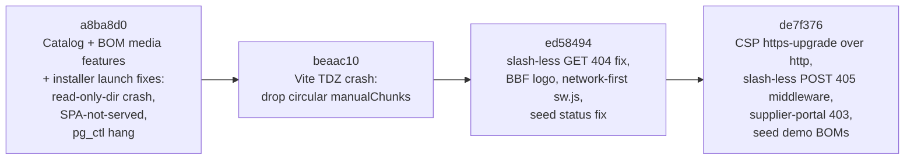
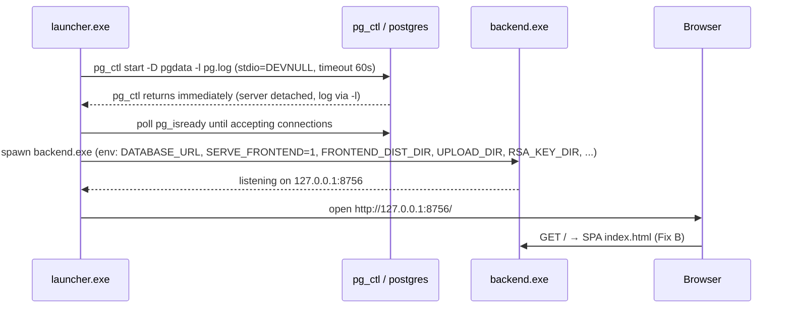
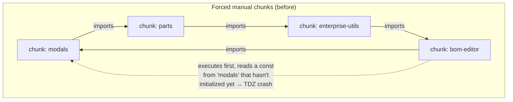
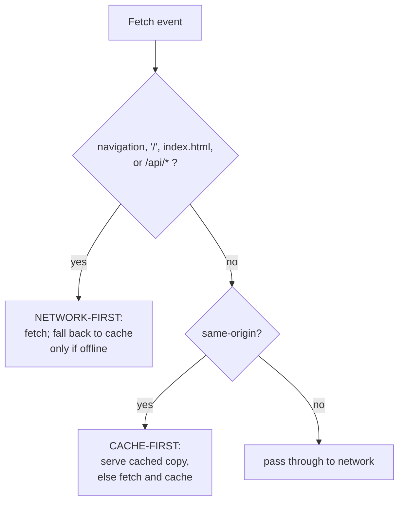
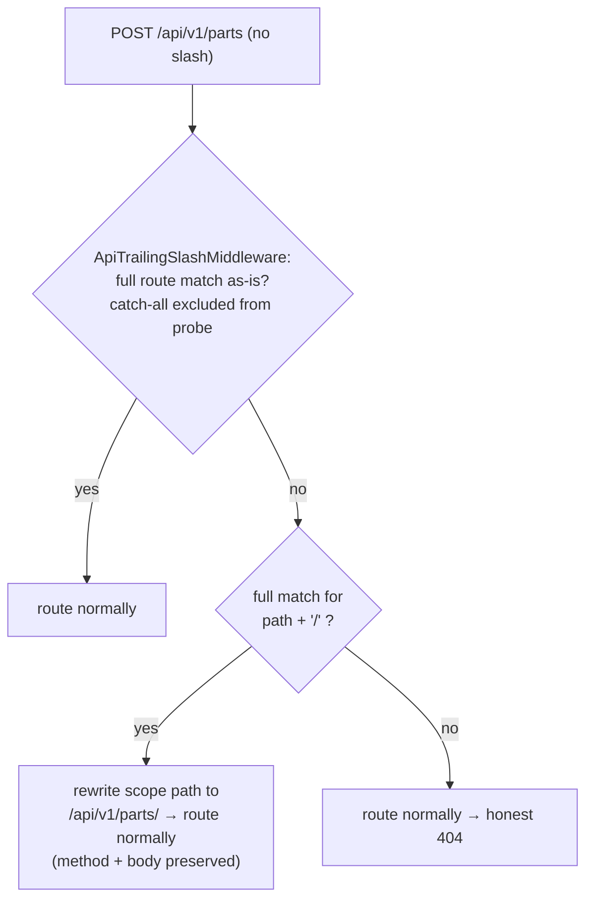

# PATCHES_APPLIED.md — Fix Cycle of 2026-07-19

> **Scope of this document.** This is the engineering record of the bug fixes that were **already applied and committed** in the 2026-07-19 fix cycle, across four commits (`a8ba8d0`, `beaac10`, `ed58494`, `de7f376`), plus a **"Pending safe patches"** section listing verified-but-not-yet-fixed items so the next session can pick them up without re-auditing. Everything in this document is grounded in the committed diffs and the read-only subsystem audits; where a feature is a **mock or stub**, that is stated plainly rather than glossed over.
>
> **Related documents:** `OPEN_ITEMS.md` (running backlog), `desktop/DESKTOP_PACKAGING.md` (build/install pipeline), `desktop/DURABILITY.md` (backup/PITR verification status), `INSTALL.md` (Docker path), `frontend/OPEN_ITEMS.md` and `frontend/MIGRATION_MAP.md` (window.* → ESM migration state), `backend/TEST_FAILURES_TRIAGE.md` (known pre-existing SQLite test failures).

---

## Table of contents

1. [How to read this document](#1-how-to-read-this-document)
2. [Fix-cycle overview](#2-fix-cycle-overview)
3. [Commit `a8ba8d0` — Catalog + BOM media features, and three desktop-installer launch fixes](#3-commit-a8ba8d0)
4. [Commit `beaac10` — Vite circular-chunk TDZ crash on load](#4-commit-beaac10)
5. [Commit `ed58494` — API trailing-slash 404s, BBF logo, network-first service worker, seed status fix](#5-commit-ed58494)
6. [Commit `de7f376` — CSP https-upgrade over http, slash-less POST 405 middleware, supplier-portal 403, seed BOMs](#6-commit-de7f376)
7. [Pending safe patches (NOT yet applied)](#7-pending-safe-patches-not-yet-applied)
8. [Residual known issues documented elsewhere](#8-residual-known-issues-documented-elsewhere)

---

## 1. How to read this document

Each applied fix follows the same template:

| Field | Meaning |
|---|---|
| **Problem** | The user-visible symptom, in plain language |
| **Root cause** | The exact mechanism that produced the symptom |
| **Impact** | Who/what was affected, and how badly |
| **Files** | Every file touched for this specific fix |
| **Before → After** | Observable behaviour before and after the patch |
| **Risk** | What could regress, and any residual caveats introduced or left behind |
| **Testing** | What verification actually happened (automated tests, rebuilds, live desktop runs) — stated honestly, including where verification was manual |

A note on context for beginners: this project ships in **two deployment models** (see `desktop/DESKTOP_PACKAGING.md` and `INSTALL.md`):

- **Windows desktop, local-first**: `desktop/launcher.py` (packaged by PyInstaller + Inno Setup) starts a **bundled PostgreSQL 16** on `127.0.0.1:55432`, then the FastAPI backend on `http://127.0.0.1:8756`, which also serves the built React SPA. Program files live under the **read-only** `%ProgramFiles%\BlackboxBOM`; all mutable state lives under `%ProgramData%\BlackboxBOM` (the `DATA_DIR`).
- **Docker**: nginx serves the SPA and proxies `/api` + `/ws` to the backend on port 8000.

Most of this cycle's fixes exist because the desktop bundle was exercised **live** for the first time end-to-end, and the plain-HTTP, read-only-install-dir, single-process-serves-everything environment surfaced failure modes that never appear in `npm run dev` + uvicorn development.

---

## 2. Fix-cycle overview

Quick-reference table:

| Commit | Fixes | Severity of what it fixed | Key files |
|---|---|---|---|
| `a8ba8d0` | Backend import crash under read-only Program Files; app opening to JSON instead of the SPA; launcher freezing at "Starting Postgres"; build/installer path bugs | **Launch-blocking** (installed app unusable) | `backend/app/api/endpoints/documents.py`, `backend/app/services/bom_service.py`, `desktop/launcher.py`, `desktop/build.py`, `desktop/installer.iss` |
| `beaac10` | SPA crashed at load with a temporal-dead-zone (TDZ) error caused by forced circular chunk splitting | **Load-blocking** (SPA served but never initialized) | `frontend/vite.config.ts` |
| `ed58494` | Slash-less API **GET**s hard-404ing under the SPA catch-all; stale-bundle-pinning service worker; branding on the loader; seed data violating a DB CHECK constraint | High (broken screens, stale-code incidents) | `backend/app/main.py`, `frontend/public/sw.js`, `frontend/index.html`, `frontend/src/components/TopBar.jsx`, `backend/seed_db.py` |
| `de7f376` | Browser force-upgrading every request to `https://` on the plain-HTTP desktop; slash-less **POST/PUT/DELETE** returning 405; admins being silently logged out by the supplier-portal screen; fresh installs having no BOM to edit | High (app-wide "Unable to connect", failed saves, surprise logouts) | `backend/app/core/security_headers.py`, `backend/app/main.py`, `backend/app/api/endpoints/supplier_portal.py`, `backend/seed_db.py` |

---

## 3. Commit `a8ba8d0` — Catalog + BOM media features, and three desktop-installer launch fixes

> **Commit title:** *Add Catalog system + BOM line-item media/exclusion/custom-attrs; fix desktop installer launch*
> **Date:** 2026-07-19 18:14 IST

This commit is primarily a **feature commit** (OpenBOM-parity Batch 1) that also carries the desktop-launch bug fixes. For completeness, the feature payload was:

- **Catalog system**: `Catalog` + `PartCatalog` models (`backend/app/models/catalog.py`), a `/api/v1/catalogs` API (`backend/app/api/endpoints/catalogs.py`, backed by `backend/app/services/catalog_service.py`, 484 lines — CRUD, add/remove part, create-from-folder with CAD metadata extraction and a zip-slip guard, `folder_path` admin-gated), and a fully wired `CatalogsScreen` (`frontend/src/components/screens/CatalogsScreen.jsx`, classified **REAL** by the UI audit — it calls `api.catalogs` list/create/parts/upload with honest loading/error states).
- **BOM line-item media/exclusion/custom-attrs** on `bom_items_master`: per-line image (`image_document_id` → documents, `thumbnail_path`), `exclude_from_bom` (honored in **both** explosion and quantity/cost rollups in `backend/app/services/bom_service.py`), and ad-hoc custom columns via a `BomItemCustomValue` store (`backend/app/models/bom_item_custom_value.py`).
- **Migrations 045 + 046** (`backend/alembic/versions/045_catalogs_and_bom_item_media.py`, `046_bom_item_custom_values.py`), both carrying Postgres RLS tenant-isolation policies, keeping the Alembic chain single-headed.
- Latent bugs surfaced by the new tests and fixed in passing: `create_bom` bom_number autogeneration + explicit `tenant_id`, `service_bom` `service_type` column drift, and a `service_bom` raw `INSERT` that was missing `tenantId`.
- `OPEN_ITEMS.md`: logged the Master Manufacturing BOM workbook field-parity backlog (tracking only, no code).

The three **launch fixes** below are the part relevant to this patch record. Together they turned an installer that produced a frozen/broken app into one that boots to a working UI.

### 3.1 Fix A — Backend import-time crash under read-only Program Files (`PermissionError`)

**Problem.** On an installed machine, the packaged backend (`backend.exe`) crashed **during Python import**, before FastAPI even started. The launcher would report the backend as failed; no app ever appeared.

**Root cause.** `backend/app/api/endpoints/documents.py` (and the matching path logic in `backend/app/services/bom_service.py`) computed the uploads directory **relative to `__file__`** and created it eagerly at import time. In development that resolves to a writable folder inside the repo. In the installed desktop bundle, `__file__`-relative paths land inside `%ProgramFiles%\BlackboxBOM\backend\...`, which is **read-only** for the service process — so the import-time `mkdir` raised `PermissionError` and killed the process before the app object existed.

**Impact.** Every fresh desktop install was dead on arrival: the backend process exited during import, so nothing listened on port 8756. This was one of three independent launch blockers (see 3.2 and 3.3 — all three had to be fixed for the installed app to work).

**Files.**
- `backend/app/api/endpoints/documents.py` (+21/−…)
- `backend/app/services/bom_service.py` (upload-path portion of the larger diff)
- `desktop/launcher.py` (supplies the env vars — see 3.2)

**Before → After.**

| | Before | After |
|---|---|---|
| Upload dir source | Hardcoded, `__file__`-relative | Env-configurable `settings.UPLOAD_DIR` (pydantic-settings, so `UPLOAD_DIR` env var wins) |
| Import-time `mkdir` | Fatal on failure (`PermissionError` propagates, process dies) | **Non-fatal** — a failed import-time mkdir no longer kills the process; the directory is resolved from config |
| Installed desktop | Backend crashes on import | Backend starts; uploads go to `%ProgramData%\BlackboxBOM\uploads` |

**Risk.** Low. The change is a config indirection plus removing a fatal side effect at import time. The one behavioural nuance: if `UPLOAD_DIR` points somewhere genuinely unwritable, the failure now surfaces at first upload rather than at process start — which is the correct trade-off for a server that must boot to show *any* UI. Docker deployments already passed `UPLOAD_DIR`-style env config via compose volumes, so they are unaffected.

**Testing.** Verified live on the installed desktop bundle (backend boots, uploads land in `DATA_DIR\uploads`). The commit also shipped 300+ lines of new backend tests (`backend/app/tests/test_bom_item_media_visibility.py`, `backend/app/tests/test_catalogs.py`) exercising the upload-adjacent BOM-media endpoints, run on the SQLite `create_all` track. No dedicated unit test pins the read-only-Program-Files scenario itself (that requires a Windows ACL simulation); the guard is the live installer smoke run.

### 3.2 Fix B — Installed app opened to the JSON API root instead of the SPA

**Problem.** After install, the launcher opened the browser at `http://127.0.0.1:8756/` and the user saw the backend's **JSON welcome message**, not the application UI.

**Root cause.** Two stacked issues in how the backend decides to serve the SPA:

1. The backend's SPA serving is **opt-in/auto-detected**: it serves `frontend/dist` at `/` only when `SERVE_FRONTEND` is set (or when its auto-detection finds a dist folder). Inside the **frozen PyInstaller exe**, the auto-detect resolved to a nonexistent `_internal/frontend/dist` path inside the exe bundle — so detection failed and the backend fell back to the JSON welcome route (`GET /` in `backend/app/main.py`).
2. Independently, the backend defaults `UPLOAD_DIR`/`RSA_KEY_DIR` to app-relative directories (`./uploads`, `./rsa_keys`) that are read-only under Program Files (same class of problem as 3.1 — the RSA keypair for JWT signing is auto-generated on first run and must be written somewhere writable).

**Impact.** Even once the backend booted, the product looked broken: users got raw JSON at the root URL. And without a writable `RSA_KEY_DIR`, first-run JWT keypair generation would fail.

**Files.**
- `desktop/launcher.py` (+47/−4): `resolve_paths()` now creates `DATA_DIR\uploads` and `DATA_DIR\rsa_keys`; `build_child_env()` now exports four new variables to the backend child process:
  - `UPLOAD_DIR` → `%ProgramData%\BlackboxBOM\uploads`
  - `RSA_KEY_DIR` → `%ProgramData%\BlackboxBOM\rsa_keys`
  - `SERVE_FRONTEND=1` (explicit, no auto-detect reliance)
  - `FRONTEND_DIST_DIR` → `%ProgramFiles%\BlackboxBOM\frontend\dist` (the real installed dist)

**Before → After.**

| | Before | After |
|---|---|---|
| `GET /` on desktop | JSON welcome (`{"message": ...}`) | SPA `index.html`; `/assets` served; SPA catch-all handles client routes |
| RSA keys / uploads | Attempted under read-only install dir | Written under `DATA_DIR` (persists across updates AND uninstall, per `desktop/installer.iss` data-preservation policy) |
| SPA detection | Fragile auto-detect (broken inside frozen exe) | Explicit env contract between launcher and backend |

**Risk.** Low. This is configuration plumbing along the already-designed env-var contract (documented in the packaging audit's env-surface list). One residual to know about: the backend's `GET /` handler duplicates the dist-detection logic that the module-scope catch-all uses (a known low-severity hygiene item from the backend-core audit, `backend/app/main.py:675-691` vs `735-742`) — both now agree because the env vars are explicit, but the duplication itself was not de-duplicated in this cycle.

**Testing.** Live desktop verification: installed app opens to the UI at `http://127.0.0.1:8756/`. The interaction between the SPA catch-all and API routes surfaced follow-on bugs that were fixed in `ed58494` and `de7f376` (sections 5 and 6) — i.e., this fix is what *exposed* the trailing-slash family of bugs, because before it the catch-all never ran on desktop.

### 3.3 Fix C — Launcher froze forever at "Starting Postgres" (`pg_ctl` + pipe inheritance)

**Problem.** The launcher printed "Starting Postgres" and then **hung indefinitely**. Postgres was actually running; the launcher just never proceeded to start the backend. Killing and retrying reproduced the freeze.

**Root cause.** Two independent Windows-specific hazards in `run_pg_ctl_start` (`desktop/launcher.py`):

1. **The pipe-inheritance deadlock (the actual cause).** The old code ran `subprocess.run(cmd, capture_output=True, ...)`. `pg_ctl start` launches a **long-lived** `postgres` server process, and on Windows that child **inherits `pg_ctl`'s stdout/stderr handles**. `capture_output=True` means Python is reading from a pipe that will only reach EOF when *every* process holding the write end exits — and the `postgres` server never exits. So `subprocess.run()` blocked forever, even though `pg_ctl` itself had finished.
2. **`pg_ctl -w` (wait mode).** The old command also passed `-w -t 60`, delegating readiness-waiting to `pg_ctl`. On some setups this blocks indefinitely even when the server is already up. The launcher already had its own `wait_for_postgres_ready()` poll (via `pg_isready`), making `-w` redundant *and* hazardous.

**Impact.** Total launch failure with the worst possible UX: no error, no timeout, just a frozen "Starting Postgres" line. Because Postgres *did* start, retries could also hit "already running" states.

**Files.**
- `desktop/launcher.py` (part of the +47/−4 diff)

**Before → After.**

| | Before | After |
|---|---|---|
| Command | `pg_ctl start -D <pgdata> -l <log> -w -t 60` | `pg_ctl start -D <pgdata> -l <log>` (no `-w`) |
| stdio | `capture_output=True` (piped — deadlocks) | `stdin/stdout/stderr = DEVNULL`; server log still captured via `-l` |
| Wait strategy | `pg_ctl`'s own `-w` wait | Launcher's `wait_for_postgres_ready()` poll immediately after |
| Failure mode | Infinite hang | `timeout=60` on the `subprocess.run` → explicit `RuntimeError("pg_ctl start timed out")`; non-zero exit → explicit error |
| Console window | (default) | `CREATE_NO_WINDOW` creationflag (no flashing console) |

Launch sequence after the fix:

**Risk.** Low, with one accepted trade-off: `pg_ctl`'s own stdout/stderr chatter is discarded (`DEVNULL`), so if `pg_ctl` fails, the launcher log now records only the exit code, not `pg_ctl`'s message — but the *server's* log is still fully captured via `-l`, which is where the useful diagnostics live. Readiness is now entirely the launcher's poll; if `wait_for_postgres_ready()` had a bug, startup detection would too (it is the pre-existing, already-exercised code path).

**Testing.** Live desktop verification: launcher proceeds past "Starting Postgres" reliably, both on cold first-run (initdb path) and warm restarts. No automated test covers this (it needs a real Windows Postgres bundle); the guard is the installer smoke run. Note that per the packaging audit, **no CI job exercises the desktop path at all** — see section 8.

### 3.4 Fix D — Build/installer path bugs (`build.py --skip-frontend`, `installer.iss` hardcoded dirs)

**Problem.** Two build-pipeline defects: (1) `desktop/build.py --skip-frontend` crashed with a `copytree` error; (2) `desktop/installer.iss` ignored the caller's source/output directories, so `iscc` compiled a **stale layout** and dropped the setup exe in the wrong directory.

**Root cause.** (1) The `--skip-frontend` fast-path returned the path to `index.html` instead of the **dist directory**, and the subsequent assembly stage called `copytree` on a file. (2) `installer.iss` had hardcoded `SourceDir`/`OutputDir` constants instead of honoring the `/DSourceDir=` and `/DOutputDir=` defines that `build.py` passes to `iscc`.

**Impact.** Developer-facing only, but nasty: the stale-layout bug meant you could "successfully" build an installer that packaged **old files**, silently shipping unfixed code — the kind of bug that invalidates your own verification loop.

**Files.**
- `desktop/build.py` (+3/−1)
- `desktop/installer.iss` (+37/−…)

**Before → After.** `build.py --skip-frontend` completes the assembly stage; `iscc installer.iss /DSourceDir=<build\install> /DOutputDir=<dist>` packages exactly the freshly assembled tree into the requested output directory.

**Risk.** Minimal — build tooling only; the installed product is unaffected except that builds are now *actually* reproducible from the assembled tree.

**Testing.** Verified by running the full `desktop/build.py` pipeline and installing the produced `BlackboxBOM-Setup-<version>.exe` (the live runs behind fixes A–C above were performed against installers produced by the fixed pipeline).

---

## 4. Commit `beaac10` — Vite circular-chunk TDZ crash on load

> **Commit title:** *Fix frontend TDZ crash on load: drop circular manualChunks*
> **Date:** 2026-07-19 18:44 IST

**Problem.** The SPA was **served** correctly (Fix 3.2 made that work) but crashed the instant it loaded with `Cannot access 'X' before initialization` — a JavaScript **temporal dead zone (TDZ)** error. White screen; the bundle never initialized.

**Root cause.** `frontend/vite.config.ts` contained a `manualChunks` configuration that force-split the legacy `src/root/*.jsx` modules into named chunks. Those modules are **mutually circular** by design of the mid-migration architecture (`modals ↔ parts ↔ enterprise-utils ↔ bom-editor` — each self-registers globals on `window` and imports siblings; see `frontend/MIGRATION_MAP.md`). Rollup emitted **~14 "Circular chunk" warnings** at build time, and at runtime the circular chunk graph could execute a chunk that reads a `const`/`let` binding from a sibling chunk **before that sibling's module body has run** — which is exactly what a TDZ error is: accessing a block-scoped binding in the window between hoisting and initialization.

A beginner-friendly way to picture it:

**Impact.** Complete frontend outage on any build produced with the circular `manualChunks` config. Note the confusing overlap with the **service-worker stale-bundle incident** (section 5.3): both produce the *same symptom* (`Cannot access 'X' before initialization`) from *different causes* — one from a genuinely broken chunk graph, one from an old SW replaying a stale chunk graph against new HTML. This cycle fixed **both** causes; if this symptom ever reappears, check the SW cache version first, then the build's circular-chunk warnings.

**Files.**
- `frontend/vite.config.ts` (+16/−22) — the only file touched.

**Before → After.**

| | Before | After |
|---|---|---|
| `manualChunks` | Forced named chunks for circular `root/*.jsx` modules | **Only** the safe `vendor` split (react / react-dom / scheduler); Rollup auto-chunks everything else (cycle-safe) |
| Build warnings | ~14 "Circular chunk" warnings | **0** circular warnings (verified by rebuild) |
| Runtime | TDZ crash on load | Bundle initializes; `LazyScreens.jsx` dynamic imports still give route-level code splitting |

**Risk.** Low, and deliberately conservative. Route-level code splitting is preserved because it comes from `React.lazy` dynamic imports in `frontend/src/components/LazyScreens.jsx`, not from `manualChunks`. The main "risk" is really a **guardrail for future maintainers**: the `manualChunks` restriction is **load-bearing**. The config now carries a comment explaining why; do **not** re-add manual splits for `root/*.jsx` until the circular imports themselves are untangled (tracked in the migration plan, `frontend/MIGRATION_MAP.md`). Chunk granularity is somewhat coarser, which can slightly increase the initial bundle — an acceptable trade against a hard crash.

**Testing.** Full `vite build` rebuild: 0 circular-chunk warnings (was ~14), followed by a live load of the built SPA confirming initialization. No unit test can meaningfully pin this (it is a bundler-graph property); the build-time warning count is the regression signal to watch.

---

## 5. Commit `ed58494` — API trailing-slash 404s (GET), BBF logo, network-first service worker, seed status fix

> **Commit title:** *Fix API trailing-slash 404s under SPA catch-all; BBF logo on loader/topbar; network-first sw.js; seed status fix*
> **Date:** 2026-07-19 19:25 IST

Four independent fixes in one commit; each documented separately.

### 5.1 Fix A — Slash-less API GETs hard-404'd under the SPA catch-all

**Problem.** On the desktop bundle, API GET calls without a trailing slash — e.g. `GET /api/v1/vendors` — returned **404**, even though `GET /api/v1/vendors/` was a real, working route. Screens that happened to call slash-less paths broke; the concrete reported casualty was the **component edit drawer**.

**Root cause.** FastAPI collection routes in this codebase are defined **with** a trailing slash (`/api/v1/parts/`), while parts of the frontend call **without** it. Normally Starlette's built-in `redirect_slashes` quietly 307-redirects the slash-less variant to the canonical route. But the desktop deployment registers a **SPA catch-all** route (`GET /{full_path:path}`, registered last in `backend/app/main.py`) that **fully matches any GET path**. Once *some* route fully matches, Starlette's slash-retry never fires — so the catch-all swallowed slash-less API GETs, and its own guard clause ("never intercept API paths") correctly refused to serve HTML for them but then raised a plain 404.

This is a classic interaction bug: each piece (slashed routes, `redirect_slashes`, SPA catch-all) is individually correct; the combination is broken. And it only exists when the SPA is served by the backend — which is why it appeared immediately after fix 3.2 turned that on for desktop.

**Impact.** Any frontend call site using slash-less collection paths 404'd on desktop (worked in Docker, where nginx fronts the API and the catch-all... is still registered, but dev setups typically hit slashed paths). User-visible as broken screens/drawers with "not found" errors on data that plainly existed.

**Files.**
- `backend/app/main.py` (+12/−4) — inside the `serve_frontend` catch-all handler.

**Before → After.**

| | Before | After |
|---|---|---|
| `GET /api/v1/vendors` (no slash) | 404 from the catch-all's API guard | **307 redirect** → `/api/v1/vendors/` (query string preserved), which then serves normally |
| Non-API unknown GETs | SPA `index.html` (client routing) | Unchanged |
| Truly nonexistent API paths | 404 | Still 404 (redirect only recreated for the slash variant; anything under the API prefix with no match still 404s) |

**Risk.** Low-to-moderate at the time, for a reason that materialized the same evening: a **307 redirect only helps GETs cleanly**. 307 does preserve method and body, but this recreation lived inside a **GET-only** catch-all — slash-less `POST/PUT/DELETE` never even reached it and instead got **405** from partial route matches. That gap was closed hours later in `de7f376` (section 6.2) with a method-agnostic ASGI middleware; this catch-all 307 remains in the code as a **backstop** for GETs. Both layers coexist at head: the middleware rewrites first (so in practice the 307 rarely fires anymore), and the catch-all redirect covers any edge the middleware's route-probe declines.

**Testing.** Live verification on the desktop bundle: previously-404ing screens (component edit drawer) load. No dedicated automated test was added for the redirect in this commit.

### 5.2 Fix B — BBF logo on the loading screen and top bar

**Problem.** Cosmetic/branding: the pre-React loading screen in `frontend/index.html` used a hand-coded CSS block instead of the real logo, and `TopBar.jsx` showed a redundant `<< BLACKBOX` text string next to the brand mark.

**Root cause.** Leftover placeholder markup from before the brand asset (`bbf-logo.svg`) existed in the tree.

**Impact.** Presentation only. No functional behaviour involved.

**Files.**
- `frontend/index.html` (+12/−… — loader block replaced with `bbf-logo.svg`)
- `frontend/src/components/TopBar.jsx` (−2 — redundant text removed)

**Before → After.** Loader shows the real `bbf-logo.svg`; top bar shows the logo without the duplicate wordmark text.

**Risk.** Effectively zero. One related caveat worth knowing (NOT fixed in this cycle, see section 7.3): `bbf-logo.svg` and other non-hashed public files interact with the new service worker's cache-first branch — the logo could be cached until the SW cache-name bump. Also note the UI audit's finding that the **PWA icon set is still a 247-byte placeholder "BB" SVG** and `manifest.json` colors still carry the legacy orange — the loader/topbar fix did not touch those.

**Testing.** Visual verification on the built bundle.

### 5.3 Fix C — Service worker rewritten: network-first app shell, cache only hashed assets

**Problem.** Browsers that had ever visited the app kept executing an **old JS bundle** after new builds shipped. The recorded symptom was, again, `Cannot access 'X' before initialization` — an *old* chunk graph being replayed against new expectations — even though the server was serving a fixed build. Hard-refresh sometimes didn't help.

**Root cause.** The previous `frontend/public/sw.js` (`bbox-v1`) did three compounding wrong things:

1. **Pre-cached `/`** at install — pinning the built `index.html` (which references hashed chunk filenames) into the cache.
2. Served **all same-origin requests cache-first** — so the pinned old `index.html` + old chunks won over the network forever.
3. Used a **never-changing cache name** (`bbox-v1`) with an `activate` handler that only deleted *other* names — so nothing ever invalidated the poisoned cache.

Net effect: the first bundle a browser ever cached was the bundle it ran for life.

**Impact.** High and insidious: every frontend fix shipped during this period could appear "not to work" on machines that had previously loaded the app — including the TDZ fix in `beaac10`. This is the incident that made two different bugs (SW staleness + circular chunks) present identically.

**Files.**
- `frontend/public/sw.js` (rewritten, +43/−41; cache name `bbox-v1` → `bbox-v2`)

**Before → After.**

| | Before (`bbox-v1`) | After (`bbox-v2`) |
|---|---|---|
| Install | Pre-caches `/` (pins stale shell) | Pre-caches **nothing**; `skipWaiting()` only |
| Activate | Deletes only non-current cache names | **Deletes ALL caches** — self-heals any browser stranded on the old bundle the moment the new SW activates |
| App shell + `/api/*` | Mixed; effectively cache-first for shell | **Network-first**; cache fallback only when offline |
| Static assets | Cache-first for all same-origin | Cache-first intended for content-hashed `/assets/*` (safe: hash changes with content) |
| Hardcoded `API_HOST 'localhost:8001'` | Present | Removed (path-based `/api/` check only) |

**Risk.** Two honest residuals, both confirmed by the follow-up frontend audit and deliberately left as future work (see 7.3 for the related pending item):

1. **Comment-vs-code mismatch:** the header comment says "only content-hashed `/assets/*` files are cached", but the cache-first branch actually matches **all** same-origin non-navigation, non-`/api/` requests — including non-hashed files like `/manifest.json` and `/bbf-logo.svg`. Those get cached until the next cache-name bump, partially re-creating (in much milder form — the *shell and code* are safe now) the staleness class this rewrite fixed. The precise fix is to restrict the cache-first branch to `url.pathname.startsWith('/assets/')`.
2. **The offline fallback is dead code:** nothing ever `cache.put()`s `/` or `index.html` (pre-cache was removed on purpose, and the network-first branch doesn't populate the cache), so a true offline reload gets the browser error page rather than the app shell. That is at odds with the local-first goal and is inventoried as future work.

Neither residual can re-pin stale **code**, which was the emergency.

**Testing.** Live verification: after deploying `bbox-v2`, previously-stranded browsers recovered on next load (activate purge). The SW is registered production-only (`frontend/src/main.jsx`), so dev flows were never affected. No automated SW test exists.

### 5.4 Fix D — Seed data violated the projects status CHECK constraint

**Problem.** `backend/seed_db.py` failed on Postgres when inserting seed projects.

**Root cause.** `SEED_PROJECTS` used `"status": "active"`, but the `projects` table has a status **CHECK constraint** whose allowed values do not include `active`. On Postgres the CHECK is enforced at insert → `IntegrityError`. (On the SQLite `create_all` test track this class of mismatch can slip through, which is exactly how it survived until a live Postgres seed run.)

**Impact.** Fresh-install seeding broke on the real database engine, blocking the demo/first-run experience the seeder exists to provide.

**Files.**
- `backend/seed_db.py` (+2/−2)

**Before → After.** Seed projects now use `"status": "Released"`, a value accepted by the CHECK constraint. Seeding completes on Postgres.

**Risk.** Minimal — data-literal change in a dev/demo seeding script that already refuses to run in production and gates admin creation behind `SEED_ADMIN_PASSWORD`. Known residuals in `seed_db.py` that this commit did **not** address (documented by the DB audit, section 8): it bootstraps schema via `Base.metadata.create_all` without stamping `alembic_version`, and seeded parts' `tags`/`compliance` strings are silently stripped by `_row()` (they are join-table relationships, not columns).

**Testing.** Live seed run against Postgres.

---

## 6. Commit `de7f376` — CSP https-upgrade over http, slash-less POST 405 middleware, supplier-portal 403, seed BOMs

> **Commit title:** *Fix three live-found bugs: CSP https-upgrade over http, slash-less POST 405, supplier-portal 401 logout; seed demo BOMs*
> **Date:** 2026-07-19 19:43 IST

### 6.1 Fix A — CSP `upgrade-insecure-requests` (and HSTS) emitted over plain HTTP broke the entire desktop app

**Problem.** On the desktop bundle (`http://127.0.0.1:8756`), the app loaded and then **every API call failed** with `ERR_SSL_PROTOCOL_ERROR`, surfacing in the UI as "Unable to connect to server" across all screens.

**Root cause.** `backend/app/core/security_headers.py` (`SecurityHeadersMiddleware`) unconditionally emitted:

- `Strict-Transport-Security` (HSTS), and
- a Content-Security-Policy containing the **`upgrade-insecure-requests`** directive.

`upgrade-insecure-requests` instructs the browser to transparently rewrite every `http://` subresource/API request from that page to `https://` **before sending it**. That is correct hardening on a TLS deployment — and catastrophic on the desktop's deliberate plain-HTTP loopback deployment, where the server does not speak TLS on 8756 at all. The browser upgraded `http://127.0.0.1:8756/api/v1/...` to `https://127.0.0.1:8756/...`, the TLS handshake failed, and every request died client-side. (This is precisely the "production tightens headers assuming TLS while desktop serves plain http" tension flagged in the packaging audit's notes; HSTS was already understood to be TLS-sensitive, but the CSP directive slipped through.)

**Impact.** Complete functional outage of the installed desktop app the moment the middleware ran with these headers — arguably the single most severe bug in this cycle, because everything *looked* healthy server-side.

**Files.**
- `backend/app/core/security_headers.py` (+23/−7)

**Before → After.**

| | Before | After |
|---|---|---|
| HSTS | Always sent (prod and non-prod variants) | Sent **only when the request actually arrived over TLS**: `request.url.scheme == "https"` **or** `X-Forwarded-Proto: https` (reverse-proxy case) |
| CSP `upgrade-insecure-requests` | Always in the directive list | Appended **only when** the same `is_https` check passes |
| Desktop over `http://127.0.0.1:8756` | Browser force-upgrades to https → `ERR_SSL_PROTOCOL_ERROR` everywhere | Requests go out over http as intended; app works |
| TLS deployments (direct or behind proxy) | Hardened | Identically hardened (no weakening when HTTPS is real) |

**Risk.** Low, with two things to understand:

1. **Trusting `X-Forwarded-Proto`**: the check accepts the header from any client. A client spoofing `X-Forwarded-Proto: https` over plain HTTP would only cause the server to emit *stricter* headers at that client (HSTS/upgrade), harming only the spoofer — there is no path to *weakening* headers for anyone else, so this is benign.
2. **Behind a TLS-terminating proxy that does NOT set `X-Forwarded-Proto`**, HSTS/upgrade would silently not be emitted. Standard proxies (including the project's nginx config) set it; deployment docs should keep requiring it.

The rest of the header set (X-Frame-Options DENY, nosniff, Permissions-Policy, prod trusted-types) is unchanged and still always emitted. Note the separate, still-open CSP observation from the backend-core audit: `connect-src` allows `ws:`/`wss:` to **any** host (scheme-only source) — unrelated to this fix and not changed here.

**Testing.** Live desktop verification: with the patched backend, all API calls succeed over plain HTTP; previously the failure was reproducible on first screen load. Verified TLS-style behaviour by exercising the `X-Forwarded-Proto` branch. No dedicated unit test pins the header conditionality yet.

### 6.2 Fix B — `ApiTrailingSlashMiddleware`: slash-less POST/PUT/DELETE returned 405 ("Save failed: Method Not Allowed")

**Problem.** After 5.1 fixed slash-less **GET**s, mutating requests hit the sibling failure: `POST /api/v1/parts` (no slash) returned **405 Method Not Allowed**, surfacing as "Save failed: Method Not Allowed" toasts. Users could read data but not save it from affected call sites.

**Root cause.** Same route-matching interaction as 5.1, but for non-GET methods the mechanics differ subtly:

- The SPA catch-all is a **GET** route. For a slash-less `POST`, it *partially* matches (path pattern matches, method doesn't). A partial match is enough to make Starlette answer **405** (right path shape, wrong method) instead of falling through to the slash-retry — so `redirect_slashes` never fires for these either.
- The 5.1 fix couldn't help: it lives inside the GET handler, which a POST never enters.

**Files.**
- `backend/app/main.py` (+46) — new `ApiTrailingSlashMiddleware` class + registration.

**How the fix works (and why a middleware, not a redirect).** `ApiTrailingSlashMiddleware` is a **raw ASGI middleware** registered so that it runs immediately before routing. For any HTTP request whose path starts with `/api/v1/` and lacks a trailing slash, it probes the app's route table: if the path as-given has **no full match**, but `path + "/"` **does** fully match, it rewrites `scope["path"]` (and `raw_path`) in place before routing. Crucially:

- It works for **ALL methods** — GET, POST, PUT, DELETE, PATCH.
- It is a **rewrite, not a redirect**: no 307 round-trip, no risk of clients downgrading the method or dropping the body, request bodies stream through untouched.
- The probe **skips the SPA catch-all** (`/{full_path:path}`) when checking for a full match, otherwise the catch-all would "match everything" and defeat the probe.
- If neither variant matches, nothing is rewritten and the request 404s honestly.

**Before → After.**

| | Before | After |
|---|---|---|
| `POST /api/v1/parts` (no slash) | 405 "Method Not Allowed" | Transparently routed to `POST /api/v1/parts/` — saves work |
| Slash-less GETs | 307 redirect (from 5.1) | Rewritten in-scope by the middleware first; the catch-all 307 remains as a GET backstop |
| Canonical slashed calls | Unchanged | Unchanged (middleware is a no-op for them) |

**Risk.** Low-moderate, well-contained:

- **Performance:** each slash-less API request pays up to two linear scans of the route table (~549 routes). Only slash-less requests pay it; canonical calls skip the probe entirely after the cheap prefix/suffix string checks. Negligible at this app's request volumes.
- **Correctness:** the rewrite happens before auth/CSRF/rate-limit dependencies run (they run at routing), so all security middleware sees the canonical path — no bypass surface. The middleware sits last in the registration order (executes just before routes), per the middleware-order documentation in `backend/app/main.py`.
- **Residual:** the long-term clean fix is for the frontend to call canonical slashed paths consistently (the audit notes several deliberate frontend path quirks like `/compliance/compliance/...` — see `frontend/api.js`); this middleware makes the server tolerant either way.

**Testing.** Live desktop verification of the exact reported failure (save from the parts/BOM editor previously 405ing, now succeeding). The middleware is exercised implicitly by every slash-less call the frontend makes; no dedicated unit test yet.

### 6.3 Fix C — Supplier-portal auth returned 401, silently logging out admins (now 403)

**Problem.** Whenever a normal logged-in **admin** opened the supplier-portal screen, they were **silently logged out of the entire app**.

**Root cause.** A subtle interaction between two correct-in-isolation designs:

1. The supplier portal (`backend/app/api/endpoints/supplier_portal.py`) uses a **separate token realm** — suppliers authenticate with their own supplier tokens, not the app's user JWTs. Its `get_current_supplier_user` dependency raised **401** for any caller without a valid supplier token.
2. The shared frontend API client (`frontend/api.js` `apiRequest`) implements **silent session refresh**: any 401 triggers `POST /auth/refresh`; if the refresh doesn't produce a usable session for the retried request, the global unauthorized handler fires → **logout**.

So: admin opens the supplier-portal screen → screen calls a supplier endpoint with the admin's (non-supplier) credentials → 401 → client thinks *the session* expired → refresh → retry → 401 again → global logout. The admin was perfectly authenticated the whole time; they simply lacked *this realm's* credential.

**HTTP semantics note (why 403 is the right code):** 401 means "you are not authenticated — (re)authenticate"; **403** means "I know who you are, and you may not access this." An authenticated app user without a supplier token is the textbook 403 case. Returning the semantically correct code is what makes the shared client behave correctly *without* special-casing supplier paths.

**Files.**
- `backend/app/api/endpoints/supplier_portal.py` (+11/−1) — `credentials_exception` changed from `HTTPException(401, "Invalid or missing token")` to `HTTPException(403, "Supplier authentication required")`, with an explanatory comment block.

**Before → After.**

| | Before | After |
|---|---|---|
| Admin opens supplier-portal screen | 401 → silent refresh → fail → **global logout** | 403 → client surfaces "no access" **without killing the session** |
| Supplier with invalid/expired supplier token | 401 handled by the portal's own login flow | 403; the portal's own login flow still handles it (its error handling keys on failure, not the specific code) |
| Actual supplier authentication | Unchanged | Unchanged (token verification logic untouched) |

**Risk.** Low. The one theoretical regression surface is any client that specifically keyed on 401 from these endpoints to trigger a supplier re-login; the portal's own flow was reviewed and handles the 403. Security posture is unchanged — the endpoint still refuses all callers without a valid supplier token; only the status code (and thus the shared client's interpretation) changed. This mirrors the "supplier-portal 403-not-401" item in the audited findings exactly.

**Testing.** Live reproduction and verification: before — opening the screen as admin logged the admin out; after — the screen shows an access-denied state and the session survives.

### 6.4 Fix D — Seed one demo BOM per project ("BOM not found" on fresh installs)

**Problem.** On a fresh install, opening the BOM editor and trying to add an item failed with **"Failed to add item to BOM: BOM not found."**

**Root cause.** `backend/seed_db.py` seeded parts, vendors, and projects — but **no BOM rows**. The BOM editor operates against an existing BOM (`bom_id`); with zero BOMs in the database, every structural edit failed at the service layer's BOM lookup. (Related known frontend fragility, *not* fixed in this cycle: `frontend/src/context/AppCtx.jsx` falls back to `bomId = ... || 1` when no real BOM id is threaded through — the seeded BOMs make id 1 exist on fresh installs, but the hardcoded fallback itself remains an audit finding.)

**Files.**
- `backend/seed_db.py` (+25)

**Before → After.** After seeding projects, the script now `flush()`es to obtain project ids, then creates **one BOM per seeded project**:

- `bom_number`: `BOM-2026-0001`, `BOM-2026-0002`, … (matches the `uq(tenantId, bom_number)` constraint)
- `name`: `"<Project name> - Main Assembly"`, `status: "draft"`, `version: "1.0"`, `revision: 1`, linked via `project_id`
- Rows pass through the existing `_row()` helper, which strips non-column keys and **stamps `tenantId`** — consistent with the tenant-isolation model (`backend/app/models/mixins.py`).

A fresh install now opens the BOM editor against a real BOM and item adds succeed.

**Risk.** Minimal — additive demo data in the dev/demo seeder (production-refusing, as before). Same standing `seed_db.py` caveats as 5.4 (create_all without Alembic stamping), unchanged by this commit.

**Testing.** Live fresh-install run: seed → open BOM editor → add item succeeds. The commit message records this as the closing fix of the live-testing session.

---

## 7. Pending safe patches (NOT yet applied)

> These are **verified, low-risk, high-value** fixes identified by the read-only audits that have **NOT been implemented yet**. They are listed here so the next fix cycle can apply them without re-investigation. **No code for these has been changed as of this document.** Line numbers reference the audited tree at head (`de7f376`).

### 7.1 `toast is not defined` crash in the mobile scanner

- **What:** `frontend/src/root/mobile-scanner.jsx` calls `toast(...)` at lines **42, 87, 117, 448, 460, 482, 596** but never imports it (it imports only `storage` and `__t`). The v1.48 migration converted ~290 `window.toast` calls to ES imports across 50 files and **removed the `window.toast` global** — this file was missed.
- **Failure:** any camera-permission-denied, barcode-lookup-failure, PO-receive, or inventory path throws `ReferenceError: toast is not defined` and crashes the screen.
- **Safe patch:** a **one-line import** of `toast` from the module the other 50 files use. While in the file, also note it uses `kind: 'warning'` once where the toast host only special-cases `'warn'` (cosmetic).
- **Context to be honest about:** this screen is **PARTIAL, not fully real** — `api.parts.list` search, `api.barcodes.lookup`, and PO receiving are real calls, but `simulateScan` picks random demo codes; there is **no real barcode decoding**. The import fix stops the crashes; it does not make the scanner a real scanner.

### 7.2 `null[0]` / `rows[0].children` render crash — fires exactly when the backend is connected

- **What:** the pattern `(ctx?.rows || BOM_DATA.rows)[0].children.flatMap(...)` assumes the **demo fixture shape** (one root assembly with `.children`). But `convertApiPartsToTree` (`frontend/src/utils/bom.js:25`) returns a **FLAT array** — API-hydrated rows have no `.children`, and an empty backend yields `[]`, so `rows[0]` is a leaf or `undefined` and `.children.flatMap` throws a `TypeError` **during render**.
- **Where (audited call sites):**
  - `frontend/src/components/screens/AnalyticsScreen.jsx` lines **1022, 1220, 1293, 1488, 1546, 1629**
  - `frontend/src/components/advanced/CostSimulatorModal.jsx:14`
  - `frontend/src/components/modals/VendorDetailModal.jsx:13`
  - `frontend/src/root/overlays.jsx:2189` (print preview)
  - `frontend/src/root/detail-drawer.jsx:26`
- **Why it matters:** this crash **punishes real usage** — it appears precisely when the app successfully hydrates from the API and disappears in demo mode. It is the highest-leverage frontend fix pending.
- **Safe patch:** replace each call site with a **safe flatten helper** (`frontend/src/utils/bom.js` already contains tree-walking utilities) that handles flat arrays, empty arrays, and tree shapes uniformly. Pure refactor; no behaviour change on demo data.

### 7.3 Icon problems: missing `Icon.*` components (crash) + placeholder PWA icons (broken/404-class assets)

Two related-but-distinct issues share the "icons" label:

- **(a) Crash — undefined icon components:** `frontend/src/components/modals/GlobalSearchModal.jsx` renders `Icon.Package` (line 154), `Icon.Shield` (line 206), and `Icon.Alert` (line 226), none of which are defined in `frontend/src/root/icons.jsx` (the defined set ends at Menu/Close). Rendering those search-result groups produces `<undefined/>` and React throws **"Element type is invalid."** *Safe patch:* add the three icons to `icons.jsx` or map them to existing glyphs.
- **(b) Broken/404-class PWA assets:** every app icon under `frontend/icons/` is a **247-byte placeholder SVG reading "BB"**; `apple-touch-icon` in `frontend/index.html` points at `icon-192.svg` but **iOS requires PNG** (broken home-screen icon); `frontend/manifest.json` declares SVG-only icons with fixed `sizes` strings and legacy colors (`theme_color #e85d1f`, `background_color #0a0a0a`) that clash with current BBF branding; `og:image` is a relative SVG path (social scrapers need an absolute PNG/JPG). *Safe patch:* ship a real BBF-branded PNG+SVG icon set and correct `manifest.json` / `index.html` references. Purely additive assets + metadata; zero code risk.

### 7.4 `/bom/compare` — briefed gap is STALE; remaining work is frontend wiring

- **Audit verdict:** the previously-briefed "frontend calls `/bom/compare` but the endpoint is missing" is **no longer true**. `POST /api/v1/bom/compare` exists (`backend/app/api/endpoints/bom_enterprise.py:324`, mounted under `/bom` in `backend/app/api/api_v1.py`), backed by `bom_service.compare_boms` (`backend/app/services/bom_service.py:1662`). The frontend call (`frontend/api.js:907`, payload `{bom_id_1, bom_id_2}`) matches the `BomCompareRequest` schema. **No backend gap exists today** — do not "fix" this by adding a duplicate endpoint.
- **What remains (the actual pending safe patch):** the Diff screen calls the real compare endpoint but with **hardcoded bomIds 1 and 2**; its v3.1.0/v3.0.0 revision diffs are **fully fabricated**, and its "Export diff" button is a **fake toast** that exports nothing. *Safe patch:* thread real BOM ids from context/selection into the compare call, back revision diffs with `revisionsAPI`, and either implement or remove the export button. Until then, treat the Diff screen as **PARTIAL** (real endpoint, mock presentation).

### 7.5 ERP connectors — `latest/logs` 422 (confirmed contract bug) + sync is an explicit stub

- **Confirmed contract bug:** `frontend/src/root/integration-screens.jsx:49` calls `erpConnectorsAPI.logs("latest")` → `GET /api/v1/erp-connectors/latest/logs`. The backend route (`backend/app/api/endpoints/erp_connectors.py:193-194`) declares `get_sync_logs(connector_id: int)`, so the literal string `"latest"` **fails path validation with 422 on every call**; the frontend swallows the error in `.catch()`, so the logs panel just silently shows nothing. *Safe patch (either side works):* add a `/erp-connectors/latest/logs` alias route on the backend, **or** have the frontend fetch the connector list first and pass a real integer id. Backend alias is the smaller, non-breaking change.
- **Be aware while in this file — the sync is a stub, plainly:** `POST /api/v1/erp-connectors/{connector_id}/sync` is an **explicit no-op** — line 171 records a sync log entry stating *"ERP sync is not implemented for this connector type — no network."* Connector CRUD, logs, and test-connection are real; **actual ERP data exchange does not exist**. Do not mistake fixing the 422 for making ERP sync functional, and do not present the sync button as working in any UI copy.

---

## 8. Residual known issues documented elsewhere (context, not this cycle's scope)

Not patches and not pending patches — just the most important adjacent findings from the same audit set, so readers of this document don't assume "fixed cycle" means "clean bill of health." Each is tracked in the audits / `OPEN_ITEMS.md`:

| Area | Finding (severity) | Where documented |
|---|---|---|
| Tenant isolation | The automatic ORM SELECT tenant filter in `backend/app/core/tenant_events.py` is **dead code** (reads nonexistent `execute_state.mapper_`; runtime-verified). Insert-stamping and update/delete guards work; read isolation rests on explicit service filters + opt-in RLS. One-line fix (`bind_mapper`) pending. (critical) | DB schema audit |
| Backups | Backup-failure **emails can never send** (`settings.APP_NAME` doesn't exist; AttributeError swallowed) and **encrypted physical basebackups are unrestorable** (stream-encrypt vs single-shot-decrypt mismatch) in `backend/app/core/backup.py`. (high ×2) | Backend core audit; `desktop/DURABILITY.md` |
| Desktop migrations | Installed `backend.exe` mode never stamps `alembic_version`; future real Alembic migrations won't auto-apply on desktop. (high) | `desktop/launcher.py` comment block; packaging audit |
| Desktop PITR | `backend/scripts/pitr_restore.py` hardcodes Unix paths + `cp` restore_command; desktop PITR restore would fail at first WAL replay. (high) | `desktop/DURABILITY.md`; `OPEN_ITEMS.md` |
| Dead routers | Five fully-implemented routers are imported but never mounted (`derivatives`, `formulas`, `graph`, `planning` — the PO-from-BOM feature — and `solidworks_contract`); a ~5-line `api_v1.py` change would light them up. (high) | API surface audit |
| Frontend API client | The circuit breaker counts deterministic 4xx toward tripping and retries non-idempotent POSTs on network errors (`frontend/api.js`). (high/medium) | Frontend architecture audit |
| CI | Several `ci.yml` jobs are broken as written (alembic-vs-create_all bootstrap, missing root Dockerfile for build-push, junit path, compose service name), and **no CI covers the desktop path** at all. (high/medium) | Packaging/CI audit |
| Mock inventory | Roughly a third of frontend screens/modals remain **MOCK** (fabricated data: QMS dashboard, NCR screen, inventory synthesis, price alerts, RFQ compare, AI assistant canned replies, PDM vault tree, activity feed with fake events, dashboard budget) — most have real endpoints already exposed in `frontend/api.js`/`screenDataBridge.js` awaiting UI rewiring. | Frontend UI audit; `frontend/OPEN_ITEMS.md` |

---

*Document generated for the 2026-07-19 fix cycle. All applied-fix details are taken from the committed diffs of `a8ba8d0`, `beaac10`, `ed58494`, `de7f376`; all pending-item details are taken verbatim from the read-only subsystem audits. No source code was modified in producing this document.*
