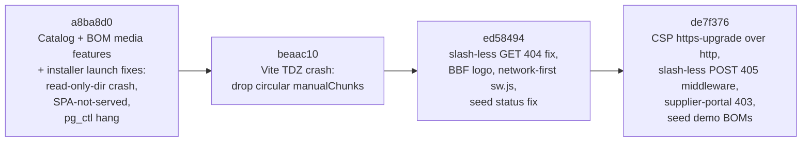
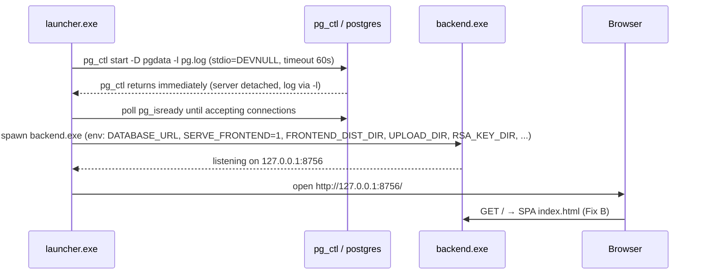
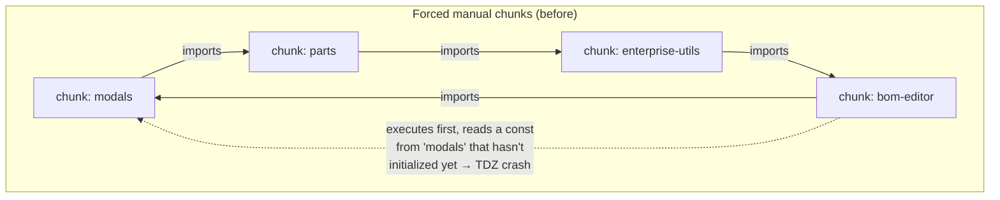
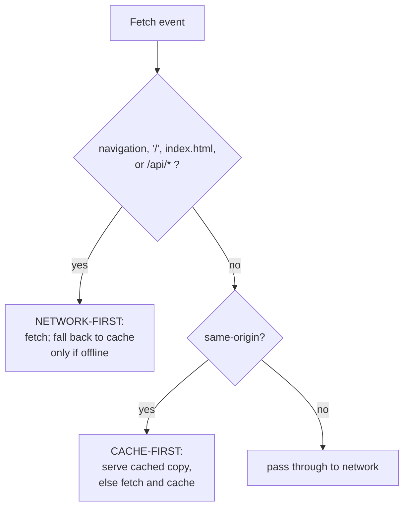
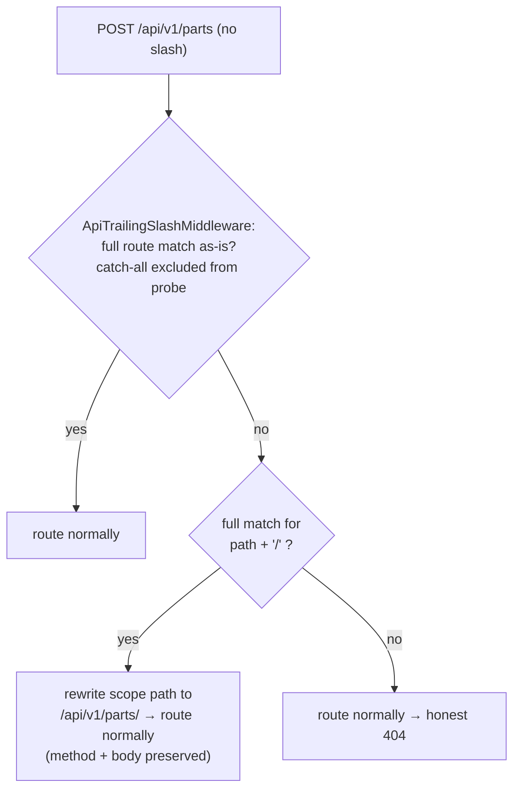
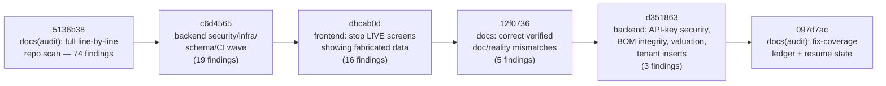

# PATCHES_APPLIED.md — Fix Cycles of 2026-07-19 and 2026-08-02

> **Scope of this document.** This is the engineering record of bug fixes that were **already applied and committed**, across two fix cycles:
> 1. **2026-07-19** — four commits (`a8ba8d0`, `beaac10`, `ed58494`, `de7f376`) fixing the desktop-installer launch path, a Vite bundling crash, and three API-routing/security bugs found by live-testing the desktop build.
> 2. **2026-08-02** — a full-repo, line-by-line scan (`docs/audit-2026-08/FINDINGS_FULL_SCAN.md`, 74 findings) followed by a four-commit fix campaign (`c6d4565`, `dbcab0d`, `12f0736`, `d351863`) that closed 43 of those findings. See section 9.
>
> Both cycles share a **"Pending / deferred safe patches"** section listing verified-but-not-yet-fixed items so the next session can pick them up without re-auditing. Everything in this document is grounded in the committed diffs and the underlying audit write-ups; where a feature is a **mock, stub, or dead layer**, that is stated plainly rather than glossed over.
>
> **Related documents:** `OPEN_ITEMS.md` (running backlog), `desktop/DESKTOP_PACKAGING.md` (build/install pipeline), `desktop/DURABILITY.md` (backup/PITR verification status), `INSTALL.md` (Docker path), `frontend/OPEN_ITEMS.md` and `frontend/MIGRATION_MAP.md` (window.* → ESM migration state), `backend/TEST_FAILURES_TRIAGE.md` (known pre-existing SQLite test failures). For the 2026-08-02 cycle specifically: `docs/audit-2026-08/FINDINGS_FULL_SCAN.md` (all 74 findings), `docs/audit-2026-08/FIX_COVERAGE.md` (the 43-fixed/31-deferred ledger this section is built from), `docs/audit-2026-08/fix_*.md` / `fix2_*.md` / `fixfe_*.md` (per-cluster engineering write-ups with red/green test evidence), and `frontend/OPENBOM_GAP_ANALYSIS.md` (competitive gap — largely unaffected by this cycle, since almost every fix here is correctness/security/honesty, not new-feature UI work).

---

## Table of contents

1. [How to read this document](#1-how-to-read-this-document)
2. [Fix-cycle overview](#2-fix-cycle-overview)
3. [Commit `a8ba8d0` — Catalog + BOM media features, and three desktop-installer launch fixes](#3-commit-a8ba8d0)
4. [Commit `beaac10` — Vite circular-chunk TDZ crash on load](#4-commit-beaac10)
5. [Commit `ed58494` — API trailing-slash 404s, BBF logo, network-first service worker, seed status fix](#5-commit-ed58494)
6. [Commit `de7f376` — CSP https-upgrade over http, slash-less POST 405 middleware, supplier-portal 403, seed BOMs](#6-commit-de7f376)
7. [Pending safe patches (NOT yet applied)](#7-pending-safe-patches-not-yet-applied)
8. [Residual known issues documented elsewhere](#8-residual-known-issues-documented-elsewhere)
9. [2026-08-02 — Full-repo scan fix campaign](#9-2026-08-02-full-repo-scan-fix-campaign)

---

## 1. How to read this document

Each applied fix follows the same template:

| Field | Meaning |
|---|---|
| **Problem** | The user-visible symptom, in plain language |
| **Root cause** | The exact mechanism that produced the symptom |
| **Impact** | Who/what was affected, and how badly |
| **Files** | Every file touched for this specific fix |
| **Before → After** | Observable behaviour before and after the patch |
| **Risk** | What could regress, and any residual caveats introduced or left behind |
| **Testing** | What verification actually happened (automated tests, rebuilds, live desktop runs) — stated honestly, including where verification was manual |

A note on context for beginners: this project ships in **two deployment models** (see `desktop/DESKTOP_PACKAGING.md` and `INSTALL.md`):

- **Windows desktop, local-first**: `desktop/launcher.py` (packaged by PyInstaller + Inno Setup) starts a **bundled PostgreSQL 16** on `127.0.0.1:55432`, then the FastAPI backend on `http://127.0.0.1:8756`, which also serves the built React SPA. Program files live under the **read-only** `%ProgramFiles%\BlackboxBOM`; all mutable state lives under `%ProgramData%\BlackboxBOM` (the `DATA_DIR`).
- **Docker**: nginx serves the SPA and proxies `/api` + `/ws` to the backend on port 8000.

Most of this cycle's fixes exist because the desktop bundle was exercised **live** for the first time end-to-end, and the plain-HTTP, read-only-install-dir, single-process-serves-everything environment surfaced failure modes that never appear in `npm run dev` + uvicorn development.

---

## 2. Fix-cycle overview

Quick-reference table:

| Commit | Fixes | Severity of what it fixed | Key files |
|---|---|---|---|
| `a8ba8d0` | Backend import crash under read-only Program Files; app opening to JSON instead of the SPA; launcher freezing at "Starting Postgres"; build/installer path bugs | **Launch-blocking** (installed app unusable) | `backend/app/api/endpoints/documents.py`, `backend/app/services/bom_service.py`, `desktop/launcher.py`, `desktop/build.py`, `desktop/installer.iss` |
| `beaac10` | SPA crashed at load with a temporal-dead-zone (TDZ) error caused by forced circular chunk splitting | **Load-blocking** (SPA served but never initialized) | `frontend/vite.config.ts` |
| `ed58494` | Slash-less API **GET**s hard-404ing under the SPA catch-all; stale-bundle-pinning service worker; branding on the loader; seed data violating a DB CHECK constraint | High (broken screens, stale-code incidents) | `backend/app/main.py`, `frontend/public/sw.js`, `frontend/index.html`, `frontend/src/components/TopBar.jsx`, `backend/seed_db.py` |
| `de7f376` | Browser force-upgrading every request to `https://` on the plain-HTTP desktop; slash-less **POST/PUT/DELETE** returning 405; admins being silently logged out by the supplier-portal screen; fresh installs having no BOM to edit | High (app-wide "Unable to connect", failed saves, surprise logouts) | `backend/app/core/security_headers.py`, `backend/app/main.py`, `backend/app/api/endpoints/supplier_portal.py`, `backend/seed_db.py` |

---

## 3. Commit `a8ba8d0` — Catalog + BOM media features, and three desktop-installer launch fixes

> **Commit title:** *Add Catalog system + BOM line-item media/exclusion/custom-attrs; fix desktop installer launch*
> **Date:** 2026-07-19 18:14 IST

This commit is primarily a **feature commit** (OpenBOM-parity Batch 1) that also carries the desktop-launch bug fixes. For completeness, the feature payload was:

- **Catalog system**: `Catalog` + `PartCatalog` models (`backend/app/models/catalog.py`), a `/api/v1/catalogs` API (`backend/app/api/endpoints/catalogs.py`, backed by `backend/app/services/catalog_service.py`, 484 lines — CRUD, add/remove part, create-from-folder with CAD metadata extraction and a zip-slip guard, `folder_path` admin-gated), and a fully wired `CatalogsScreen` (`frontend/src/components/screens/CatalogsScreen.jsx`, classified **REAL** by the UI audit — it calls `api.catalogs` list/create/parts/upload with honest loading/error states).
- **BOM line-item media/exclusion/custom-attrs** on `bom_items_master`: per-line image (`image_document_id` → documents, `thumbnail_path`), `exclude_from_bom` (honored in **both** explosion and quantity/cost rollups in `backend/app/services/bom_service.py`), and ad-hoc custom columns via a `BomItemCustomValue` store (`backend/app/models/bom_item_custom_value.py`).
- **Migrations 045 + 046** (`backend/alembic/versions/045_catalogs_and_bom_item_media.py`, `046_bom_item_custom_values.py`), both carrying Postgres RLS tenant-isolation policies, keeping the Alembic chain single-headed.
- Latent bugs surfaced by the new tests and fixed in passing: `create_bom` bom_number autogeneration + explicit `tenant_id`, `service_bom` `service_type` column drift, and a `service_bom` raw `INSERT` that was missing `tenantId`.
- `OPEN_ITEMS.md`: logged the Master Manufacturing BOM workbook field-parity backlog (tracking only, no code).

The three **launch fixes** below are the part relevant to this patch record. Together they turned an installer that produced a frozen/broken app into one that boots to a working UI.

### 3.1 Fix A — Backend import-time crash under read-only Program Files (`PermissionError`)

**Problem.** On an installed machine, the packaged backend (`backend.exe`) crashed **during Python import**, before FastAPI even started. The launcher would report the backend as failed; no app ever appeared.

**Root cause.** `backend/app/api/endpoints/documents.py` (and the matching path logic in `backend/app/services/bom_service.py`) computed the uploads directory **relative to `__file__`** and created it eagerly at import time. In development that resolves to a writable folder inside the repo. In the installed desktop bundle, `__file__`-relative paths land inside `%ProgramFiles%\BlackboxBOM\backend\...`, which is **read-only** for the service process — so the import-time `mkdir` raised `PermissionError` and killed the process before the app object existed.

**Impact.** Every fresh desktop install was dead on arrival: the backend process exited during import, so nothing listened on port 8756. This was one of three independent launch blockers (see 3.2 and 3.3 — all three had to be fixed for the installed app to work).

**Files.**
- `backend/app/api/endpoints/documents.py` (+21/−…)
- `backend/app/services/bom_service.py` (upload-path portion of the larger diff)
- `desktop/launcher.py` (supplies the env vars — see 3.2)

**Before → After.**

| | Before | After |
|---|---|---|
| Upload dir source | Hardcoded, `__file__`-relative | Env-configurable `settings.UPLOAD_DIR` (pydantic-settings, so `UPLOAD_DIR` env var wins) |
| Import-time `mkdir` | Fatal on failure (`PermissionError` propagates, process dies) | **Non-fatal** — a failed import-time mkdir no longer kills the process; the directory is resolved from config |
| Installed desktop | Backend crashes on import | Backend starts; uploads go to `%ProgramData%\BlackboxBOM\uploads` |

**Risk.** Low. The change is a config indirection plus removing a fatal side effect at import time. The one behavioural nuance: if `UPLOAD_DIR` points somewhere genuinely unwritable, the failure now surfaces at first upload rather than at process start — which is the correct trade-off for a server that must boot to show *any* UI. Docker deployments already passed `UPLOAD_DIR`-style env config via compose volumes, so they are unaffected.

**Testing.** Verified live on the installed desktop bundle (backend boots, uploads land in `DATA_DIR\uploads`). The commit also shipped 300+ lines of new backend tests (`backend/app/tests/test_bom_item_media_visibility.py`, `backend/app/tests/test_catalogs.py`) exercising the upload-adjacent BOM-media endpoints, run on the SQLite `create_all` track. No dedicated unit test pins the read-only-Program-Files scenario itself (that requires a Windows ACL simulation); the guard is the live installer smoke run.

### 3.2 Fix B — Installed app opened to the JSON API root instead of the SPA

**Problem.** After install, the launcher opened the browser at `http://127.0.0.1:8756/` and the user saw the backend's **JSON welcome message**, not the application UI.

**Root cause.** Two stacked issues in how the backend decides to serve the SPA:

1. The backend's SPA serving is **opt-in/auto-detected**: it serves `frontend/dist` at `/` only when `SERVE_FRONTEND` is set (or when its auto-detection finds a dist folder). Inside the **frozen PyInstaller exe**, the auto-detect resolved to a nonexistent `_internal/frontend/dist` path inside the exe bundle — so detection failed and the backend fell back to the JSON welcome route (`GET /` in `backend/app/main.py`).
2. Independently, the backend defaults `UPLOAD_DIR`/`RSA_KEY_DIR` to app-relative directories (`./uploads`, `./rsa_keys`) that are read-only under Program Files (same class of problem as 3.1 — the RSA keypair for JWT signing is auto-generated on first run and must be written somewhere writable).

**Impact.** Even once the backend booted, the product looked broken: users got raw JSON at the root URL. And without a writable `RSA_KEY_DIR`, first-run JWT keypair generation would fail.

**Files.**
- `desktop/launcher.py` (+47/−4): `resolve_paths()` now creates `DATA_DIR\uploads` and `DATA_DIR\rsa_keys`; `build_child_env()` now exports four new variables to the backend child process:
  - `UPLOAD_DIR` → `%ProgramData%\BlackboxBOM\uploads`
  - `RSA_KEY_DIR` → `%ProgramData%\BlackboxBOM\rsa_keys`
  - `SERVE_FRONTEND=1` (explicit, no auto-detect reliance)
  - `FRONTEND_DIST_DIR` → `%ProgramFiles%\BlackboxBOM\frontend\dist` (the real installed dist)

**Before → After.**

| | Before | After |
|---|---|---|
| `GET /` on desktop | JSON welcome (`{"message": ...}`) | SPA `index.html`; `/assets` served; SPA catch-all handles client routes |
| RSA keys / uploads | Attempted under read-only install dir | Written under `DATA_DIR` (persists across updates AND uninstall, per `desktop/installer.iss` data-preservation policy) |
| SPA detection | Fragile auto-detect (broken inside frozen exe) | Explicit env contract between launcher and backend |

**Risk.** Low. This is configuration plumbing along the already-designed env-var contract (documented in the packaging audit's env-surface list). One residual to know about: the backend's `GET /` handler duplicates the dist-detection logic that the module-scope catch-all uses (a known low-severity hygiene item from the backend-core audit, `backend/app/main.py:675-691` vs `735-742`) — both now agree because the env vars are explicit, but the duplication itself was not de-duplicated in this cycle.

**Testing.** Live desktop verification: installed app opens to the UI at `http://127.0.0.1:8756/`. The interaction between the SPA catch-all and API routes surfaced follow-on bugs that were fixed in `ed58494` and `de7f376` (sections 5 and 6) — i.e., this fix is what *exposed* the trailing-slash family of bugs, because before it the catch-all never ran on desktop.

### 3.3 Fix C — Launcher froze forever at "Starting Postgres" (`pg_ctl` + pipe inheritance)

**Problem.** The launcher printed "Starting Postgres" and then **hung indefinitely**. Postgres was actually running; the launcher just never proceeded to start the backend. Killing and retrying reproduced the freeze.

**Root cause.** Two independent Windows-specific hazards in `run_pg_ctl_start` (`desktop/launcher.py`):

1. **The pipe-inheritance deadlock (the actual cause).** The old code ran `subprocess.run(cmd, capture_output=True, ...)`. `pg_ctl start` launches a **long-lived** `postgres` server process, and on Windows that child **inherits `pg_ctl`'s stdout/stderr handles**. `capture_output=True` means Python is reading from a pipe that will only reach EOF when *every* process holding the write end exits — and the `postgres` server never exits. So `subprocess.run()` blocked forever, even though `pg_ctl` itself had finished.
2. **`pg_ctl -w` (wait mode).** The old command also passed `-w -t 60`, delegating readiness-waiting to `pg_ctl`. On some setups this blocks indefinitely even when the server is already up. The launcher already had its own `wait_for_postgres_ready()` poll (via `pg_isready`), making `-w` redundant *and* hazardous.

**Impact.** Total launch failure with the worst possible UX: no error, no timeout, just a frozen "Starting Postgres" line. Because Postgres *did* start, retries could also hit "already running" states.

**Files.**
- `desktop/launcher.py` (part of the +47/−4 diff)

**Before → After.**

| | Before | After |
|---|---|---|
| Command | `pg_ctl start -D <pgdata> -l <log> -w -t 60` | `pg_ctl start -D <pgdata> -l <log>` (no `-w`) |
| stdio | `capture_output=True` (piped — deadlocks) | `stdin/stdout/stderr = DEVNULL`; server log still captured via `-l` |
| Wait strategy | `pg_ctl`'s own `-w` wait | Launcher's `wait_for_postgres_ready()` poll immediately after |
| Failure mode | Infinite hang | `timeout=60` on the `subprocess.run` → explicit `RuntimeError("pg_ctl start timed out")`; non-zero exit → explicit error |
| Console window | (default) | `CREATE_NO_WINDOW` creationflag (no flashing console) |

Launch sequence after the fix:

**Risk.** Low, with one accepted trade-off: `pg_ctl`'s own stdout/stderr chatter is discarded (`DEVNULL`), so if `pg_ctl` fails, the launcher log now records only the exit code, not `pg_ctl`'s message — but the *server's* log is still fully captured via `-l`, which is where the useful diagnostics live. Readiness is now entirely the launcher's poll; if `wait_for_postgres_ready()` had a bug, startup detection would too (it is the pre-existing, already-exercised code path).

**Testing.** Live desktop verification: launcher proceeds past "Starting Postgres" reliably, both on cold first-run (initdb path) and warm restarts. No automated test covers this (it needs a real Windows Postgres bundle); the guard is the installer smoke run. Note that per the packaging audit, **no CI job exercises the desktop path at all** — see section 8.

### 3.4 Fix D — Build/installer path bugs (`build.py --skip-frontend`, `installer.iss` hardcoded dirs)

**Problem.** Two build-pipeline defects: (1) `desktop/build.py --skip-frontend` crashed with a `copytree` error; (2) `desktop/installer.iss` ignored the caller's source/output directories, so `iscc` compiled a **stale layout** and dropped the setup exe in the wrong directory.

**Root cause.** (1) The `--skip-frontend` fast-path returned the path to `index.html` instead of the **dist directory**, and the subsequent assembly stage called `copytree` on a file. (2) `installer.iss` had hardcoded `SourceDir`/`OutputDir` constants instead of honoring the `/DSourceDir=` and `/DOutputDir=` defines that `build.py` passes to `iscc`.

**Impact.** Developer-facing only, but nasty: the stale-layout bug meant you could "successfully" build an installer that packaged **old files**, silently shipping unfixed code — the kind of bug that invalidates your own verification loop.

**Files.**
- `desktop/build.py` (+3/−1)
- `desktop/installer.iss` (+37/−…)

**Before → After.** `build.py --skip-frontend` completes the assembly stage; `iscc installer.iss /DSourceDir=<build\install> /DOutputDir=<dist>` packages exactly the freshly assembled tree into the requested output directory.

**Risk.** Minimal — build tooling only; the installed product is unaffected except that builds are now *actually* reproducible from the assembled tree.

**Testing.** Verified by running the full `desktop/build.py` pipeline and installing the produced `BlackboxBOM-Setup-<version>.exe` (the live runs behind fixes A–C above were performed against installers produced by the fixed pipeline).

---

## 4. Commit `beaac10` — Vite circular-chunk TDZ crash on load

> **Commit title:** *Fix frontend TDZ crash on load: drop circular manualChunks*
> **Date:** 2026-07-19 18:44 IST

**Problem.** The SPA was **served** correctly (Fix 3.2 made that work) but crashed the instant it loaded with `Cannot access 'X' before initialization` — a JavaScript **temporal dead zone (TDZ)** error. White screen; the bundle never initialized.

**Root cause.** `frontend/vite.config.ts` contained a `manualChunks` configuration that force-split the legacy `src/root/*.jsx` modules into named chunks. Those modules are **mutually circular** by design of the mid-migration architecture (`modals ↔ parts ↔ enterprise-utils ↔ bom-editor` — each self-registers globals on `window` and imports siblings; see `frontend/MIGRATION_MAP.md`). Rollup emitted **~14 "Circular chunk" warnings** at build time, and at runtime the circular chunk graph could execute a chunk that reads a `const`/`let` binding from a sibling chunk **before that sibling's module body has run** — which is exactly what a TDZ error is: accessing a block-scoped binding in the window between hoisting and initialization.

A beginner-friendly way to picture it:

**Impact.** Complete frontend outage on any build produced with the circular `manualChunks` config. Note the confusing overlap with the **service-worker stale-bundle incident** (section 5.3): both produce the *same symptom* (`Cannot access 'X' before initialization`) from *different causes* — one from a genuinely broken chunk graph, one from an old SW replaying a stale chunk graph against new HTML. This cycle fixed **both** causes; if this symptom ever reappears, check the SW cache version first, then the build's circular-chunk warnings.

**Files.**
- `frontend/vite.config.ts` (+16/−22) — the only file touched.

**Before → After.**

| | Before | After |
|---|---|---|
| `manualChunks` | Forced named chunks for circular `root/*.jsx` modules | **Only** the safe `vendor` split (react / react-dom / scheduler); Rollup auto-chunks everything else (cycle-safe) |
| Build warnings | ~14 "Circular chunk" warnings | **0** circular warnings (verified by rebuild) |
| Runtime | TDZ crash on load | Bundle initializes; `LazyScreens.jsx` dynamic imports still give route-level code splitting |

**Risk.** Low, and deliberately conservative. Route-level code splitting is preserved because it comes from `React.lazy` dynamic imports in `frontend/src/components/LazyScreens.jsx`, not from `manualChunks`. The main "risk" is really a **guardrail for future maintainers**: the `manualChunks` restriction is **load-bearing**. The config now carries a comment explaining why; do **not** re-add manual splits for `root/*.jsx` until the circular imports themselves are untangled (tracked in the migration plan, `frontend/MIGRATION_MAP.md`). Chunk granularity is somewhat coarser, which can slightly increase the initial bundle — an acceptable trade against a hard crash.

**Testing.** Full `vite build` rebuild: 0 circular-chunk warnings (was ~14), followed by a live load of the built SPA confirming initialization. No unit test can meaningfully pin this (it is a bundler-graph property); the build-time warning count is the regression signal to watch.

---

## 5. Commit `ed58494` — API trailing-slash 404s (GET), BBF logo, network-first service worker, seed status fix

> **Commit title:** *Fix API trailing-slash 404s under SPA catch-all; BBF logo on loader/topbar; network-first sw.js; seed status fix*
> **Date:** 2026-07-19 19:25 IST

Four independent fixes in one commit; each documented separately.

### 5.1 Fix A — Slash-less API GETs hard-404'd under the SPA catch-all

**Problem.** On the desktop bundle, API GET calls without a trailing slash — e.g. `GET /api/v1/vendors` — returned **404**, even though `GET /api/v1/vendors/` was a real, working route. Screens that happened to call slash-less paths broke; the concrete reported casualty was the **component edit drawer**.

**Root cause.** FastAPI collection routes in this codebase are defined **with** a trailing slash (`/api/v1/parts/`), while parts of the frontend call **without** it. Normally Starlette's built-in `redirect_slashes` quietly 307-redirects the slash-less variant to the canonical route. But the desktop deployment registers a **SPA catch-all** route (`GET /{full_path:path}`, registered last in `backend/app/main.py`) that **fully matches any GET path**. Once *some* route fully matches, Starlette's slash-retry never fires — so the catch-all swallowed slash-less API GETs, and its own guard clause ("never intercept API paths") correctly refused to serve HTML for them but then raised a plain 404.

This is a classic interaction bug: each piece (slashed routes, `redirect_slashes`, SPA catch-all) is individually correct; the combination is broken. And it only exists when the SPA is served by the backend — which is why it appeared immediately after fix 3.2 turned that on for desktop.

**Impact.** Any frontend call site using slash-less collection paths 404'd on desktop (worked in Docker, where nginx fronts the API and the catch-all... is still registered, but dev setups typically hit slashed paths). User-visible as broken screens/drawers with "not found" errors on data that plainly existed.

**Files.**
- `backend/app/main.py` (+12/−4) — inside the `serve_frontend` catch-all handler.

**Before → After.**

| | Before | After |
|---|---|---|
| `GET /api/v1/vendors` (no slash) | 404 from the catch-all's API guard | **307 redirect** → `/api/v1/vendors/` (query string preserved), which then serves normally |
| Non-API unknown GETs | SPA `index.html` (client routing) | Unchanged |
| Truly nonexistent API paths | 404 | Still 404 (redirect only recreated for the slash variant; anything under the API prefix with no match still 404s) |

**Risk.** Low-to-moderate at the time, for a reason that materialized the same evening: a **307 redirect only helps GETs cleanly**. 307 does preserve method and body, but this recreation lived inside a **GET-only** catch-all — slash-less `POST/PUT/DELETE` never even reached it and instead got **405** from partial route matches. That gap was closed hours later in `de7f376` (section 6.2) with a method-agnostic ASGI middleware; this catch-all 307 remains in the code as a **backstop** for GETs. Both layers coexist at head: the middleware rewrites first (so in practice the 307 rarely fires anymore), and the catch-all redirect covers any edge the middleware's route-probe declines.

**Testing.** Live verification on the desktop bundle: previously-404ing screens (component edit drawer) load. No dedicated automated test was added for the redirect in this commit.

### 5.2 Fix B — BBF logo on the loading screen and top bar

**Problem.** Cosmetic/branding: the pre-React loading screen in `frontend/index.html` used a hand-coded CSS block instead of the real logo, and `TopBar.jsx` showed a redundant `<< BLACKBOX` text string next to the brand mark.

**Root cause.** Leftover placeholder markup from before the brand asset (`bbf-logo.svg`) existed in the tree.

**Impact.** Presentation only. No functional behaviour involved.

**Files.**
- `frontend/index.html` (+12/−… — loader block replaced with `bbf-logo.svg`)
- `frontend/src/components/TopBar.jsx` (−2 — redundant text removed)

**Before → After.** Loader shows the real `bbf-logo.svg`; top bar shows the logo without the duplicate wordmark text.

**Risk.** Effectively zero. One related caveat worth knowing (NOT fixed in this cycle, see section 7.3): `bbf-logo.svg` and other non-hashed public files interact with the new service worker's cache-first branch — the logo could be cached until the SW cache-name bump. Also note the UI audit's finding that the **PWA icon set is still a 247-byte placeholder "BB" SVG** and `manifest.json` colors still carry the legacy orange — the loader/topbar fix did not touch those.

**Testing.** Visual verification on the built bundle.

### 5.3 Fix C — Service worker rewritten: network-first app shell, cache only hashed assets

**Problem.** Browsers that had ever visited the app kept executing an **old JS bundle** after new builds shipped. The recorded symptom was, again, `Cannot access 'X' before initialization` — an *old* chunk graph being replayed against new expectations — even though the server was serving a fixed build. Hard-refresh sometimes didn't help.

**Root cause.** The previous `frontend/public/sw.js` (`bbox-v1`) did three compounding wrong things:

1. **Pre-cached `/`** at install — pinning the built `index.html` (which references hashed chunk filenames) into the cache.
2. Served **all same-origin requests cache-first** — so the pinned old `index.html` + old chunks won over the network forever.
3. Used a **never-changing cache name** (`bbox-v1`) with an `activate` handler that only deleted *other* names — so nothing ever invalidated the poisoned cache.

Net effect: the first bundle a browser ever cached was the bundle it ran for life.

**Impact.** High and insidious: every frontend fix shipped during this period could appear "not to work" on machines that had previously loaded the app — including the TDZ fix in `beaac10`. This is the incident that made two different bugs (SW staleness + circular chunks) present identically.

**Files.**
- `frontend/public/sw.js` (rewritten, +43/−41; cache name `bbox-v1` → `bbox-v2`)

**Before → After.**

| | Before (`bbox-v1`) | After (`bbox-v2`) |
|---|---|---|
| Install | Pre-caches `/` (pins stale shell) | Pre-caches **nothing**; `skipWaiting()` only |
| Activate | Deletes only non-current cache names | **Deletes ALL caches** — self-heals any browser stranded on the old bundle the moment the new SW activates |
| App shell + `/api/*` | Mixed; effectively cache-first for shell | **Network-first**; cache fallback only when offline |
| Static assets | Cache-first for all same-origin | Cache-first intended for content-hashed `/assets/*` (safe: hash changes with content) |
| Hardcoded `API_HOST 'localhost:8001'` | Present | Removed (path-based `/api/` check only) |

**Risk.** Two honest residuals, both confirmed by the follow-up frontend audit and deliberately left as future work (see 7.3 for the related pending item):

1. **Comment-vs-code mismatch:** the header comment says "only content-hashed `/assets/*` files are cached", but the cache-first branch actually matches **all** same-origin non-navigation, non-`/api/` requests — including non-hashed files like `/manifest.json` and `/bbf-logo.svg`. Those get cached until the next cache-name bump, partially re-creating (in much milder form — the *shell and code* are safe now) the staleness class this rewrite fixed. The precise fix is to restrict the cache-first branch to `url.pathname.startsWith('/assets/')`.
2. **The offline fallback is dead code:** nothing ever `cache.put()`s `/` or `index.html` (pre-cache was removed on purpose, and the network-first branch doesn't populate the cache), so a true offline reload gets the browser error page rather than the app shell. That is at odds with the local-first goal and is inventoried as future work.

Neither residual can re-pin stale **code**, which was the emergency.

**Testing.** Live verification: after deploying `bbox-v2`, previously-stranded browsers recovered on next load (activate purge). The SW is registered production-only (`frontend/src/main.jsx`), so dev flows were never affected. No automated SW test exists.

### 5.4 Fix D — Seed data violated the projects status CHECK constraint

**Problem.** `backend/seed_db.py` failed on Postgres when inserting seed projects.

**Root cause.** `SEED_PROJECTS` used `"status": "active"`, but the `projects` table has a status **CHECK constraint** whose allowed values do not include `active`. On Postgres the CHECK is enforced at insert → `IntegrityError`. (On the SQLite `create_all` test track this class of mismatch can slip through, which is exactly how it survived until a live Postgres seed run.)

**Impact.** Fresh-install seeding broke on the real database engine, blocking the demo/first-run experience the seeder exists to provide.

**Files.**
- `backend/seed_db.py` (+2/−2)

**Before → After.** Seed projects now use `"status": "Released"`, a value accepted by the CHECK constraint. Seeding completes on Postgres.

**Risk.** Minimal — data-literal change in a dev/demo seeding script that already refuses to run in production and gates admin creation behind `SEED_ADMIN_PASSWORD`. Known residuals in `seed_db.py` that this commit did **not** address (documented by the DB audit, section 8): it bootstraps schema via `Base.metadata.create_all` without stamping `alembic_version`, and seeded parts' `tags`/`compliance` strings are silently stripped by `_row()` (they are join-table relationships, not columns).

**Testing.** Live seed run against Postgres.

---

## 6. Commit `de7f376` — CSP https-upgrade over http, slash-less POST 405 middleware, supplier-portal 403, seed BOMs

> **Commit title:** *Fix three live-found bugs: CSP https-upgrade over http, slash-less POST 405, supplier-portal 401 logout; seed demo BOMs*
> **Date:** 2026-07-19 19:43 IST

### 6.1 Fix A — CSP `upgrade-insecure-requests` (and HSTS) emitted over plain HTTP broke the entire desktop app

**Problem.** On the desktop bundle (`http://127.0.0.1:8756`), the app loaded and then **every API call failed** with `ERR_SSL_PROTOCOL_ERROR`, surfacing in the UI as "Unable to connect to server" across all screens.

**Root cause.** `backend/app/core/security_headers.py` (`SecurityHeadersMiddleware`) unconditionally emitted:

- `Strict-Transport-Security` (HSTS), and
- a Content-Security-Policy containing the **`upgrade-insecure-requests`** directive.

`upgrade-insecure-requests` instructs the browser to transparently rewrite every `http://` subresource/API request from that page to `https://` **before sending it**. That is correct hardening on a TLS deployment — and catastrophic on the desktop's deliberate plain-HTTP loopback deployment, where the server does not speak TLS on 8756 at all. The browser upgraded `http://127.0.0.1:8756/api/v1/...` to `https://127.0.0.1:8756/...`, the TLS handshake failed, and every request died client-side. (This is precisely the "production tightens headers assuming TLS while desktop serves plain http" tension flagged in the packaging audit's notes; HSTS was already understood to be TLS-sensitive, but the CSP directive slipped through.)

**Impact.** Complete functional outage of the installed desktop app the moment the middleware ran with these headers — arguably the single most severe bug in this cycle, because everything *looked* healthy server-side.

**Files.**
- `backend/app/core/security_headers.py` (+23/−7)

**Before → After.**

| | Before | After |
|---|---|---|
| HSTS | Always sent (prod and non-prod variants) | Sent **only when the request actually arrived over TLS**: `request.url.scheme == "https"` **or** `X-Forwarded-Proto: https` (reverse-proxy case) |
| CSP `upgrade-insecure-requests` | Always in the directive list | Appended **only when** the same `is_https` check passes |
| Desktop over `http://127.0.0.1:8756` | Browser force-upgrades to https → `ERR_SSL_PROTOCOL_ERROR` everywhere | Requests go out over http as intended; app works |
| TLS deployments (direct or behind proxy) | Hardened | Identically hardened (no weakening when HTTPS is real) |

**Risk.** Low, with two things to understand:

1. **Trusting `X-Forwarded-Proto`**: the check accepts the header from any client. A client spoofing `X-Forwarded-Proto: https` over plain HTTP would only cause the server to emit *stricter* headers at that client (HSTS/upgrade), harming only the spoofer — there is no path to *weakening* headers for anyone else, so this is benign.
2. **Behind a TLS-terminating proxy that does NOT set `X-Forwarded-Proto`**, HSTS/upgrade would silently not be emitted. Standard proxies (including the project's nginx config) set it; deployment docs should keep requiring it.

The rest of the header set (X-Frame-Options DENY, nosniff, Permissions-Policy, prod trusted-types) is unchanged and still always emitted. Note the separate, still-open CSP observation from the backend-core audit: `connect-src` allows `ws:`/`wss:` to **any** host (scheme-only source) — unrelated to this fix and not changed here.

**Testing.** Live desktop verification: with the patched backend, all API calls succeed over plain HTTP; previously the failure was reproducible on first screen load. Verified TLS-style behaviour by exercising the `X-Forwarded-Proto` branch. No dedicated unit test pins the header conditionality yet.

### 6.2 Fix B — `ApiTrailingSlashMiddleware`: slash-less POST/PUT/DELETE returned 405 ("Save failed: Method Not Allowed")

**Problem.** After 5.1 fixed slash-less **GET**s, mutating requests hit the sibling failure: `POST /api/v1/parts` (no slash) returned **405 Method Not Allowed**, surfacing as "Save failed: Method Not Allowed" toasts. Users could read data but not save it from affected call sites.

**Root cause.** Same route-matching interaction as 5.1, but for non-GET methods the mechanics differ subtly:

- The SPA catch-all is a **GET** route. For a slash-less `POST`, it *partially* matches (path pattern matches, method doesn't). A partial match is enough to make Starlette answer **405** (right path shape, wrong method) instead of falling through to the slash-retry — so `redirect_slashes` never fires for these either.
- The 5.1 fix couldn't help: it lives inside the GET handler, which a POST never enters.

**Files.**
- `backend/app/main.py` (+46) — new `ApiTrailingSlashMiddleware` class + registration.

**How the fix works (and why a middleware, not a redirect).** `ApiTrailingSlashMiddleware` is a **raw ASGI middleware** registered so that it runs immediately before routing. For any HTTP request whose path starts with `/api/v1/` and lacks a trailing slash, it probes the app's route table: if the path as-given has **no full match**, but `path + "/"` **does** fully match, it rewrites `scope["path"]` (and `raw_path`) in place before routing. Crucially:

- It works for **ALL methods** — GET, POST, PUT, DELETE, PATCH.
- It is a **rewrite, not a redirect**: no 307 round-trip, no risk of clients downgrading the method or dropping the body, request bodies stream through untouched.
- The probe **skips the SPA catch-all** (`/{full_path:path}`) when checking for a full match, otherwise the catch-all would "match everything" and defeat the probe.
- If neither variant matches, nothing is rewritten and the request 404s honestly.

**Before → After.**

| | Before | After |
|---|---|---|
| `POST /api/v1/parts` (no slash) | 405 "Method Not Allowed" | Transparently routed to `POST /api/v1/parts/` — saves work |
| Slash-less GETs | 307 redirect (from 5.1) | Rewritten in-scope by the middleware first; the catch-all 307 remains as a GET backstop |
| Canonical slashed calls | Unchanged | Unchanged (middleware is a no-op for them) |

**Risk.** Low-moderate, well-contained:

- **Performance:** each slash-less API request pays up to two linear scans of the route table (~549 routes). Only slash-less requests pay it; canonical calls skip the probe entirely after the cheap prefix/suffix string checks. Negligible at this app's request volumes.
- **Correctness:** the rewrite happens before auth/CSRF/rate-limit dependencies run (they run at routing), so all security middleware sees the canonical path — no bypass surface. The middleware sits last in the registration order (executes just before routes), per the middleware-order documentation in `backend/app/main.py`.
- **Residual:** the long-term clean fix is for the frontend to call canonical slashed paths consistently (the audit notes several deliberate frontend path quirks like `/compliance/compliance/...` — see `frontend/api.js`); this middleware makes the server tolerant either way.

**Testing.** Live desktop verification of the exact reported failure (save from the parts/BOM editor previously 405ing, now succeeding). The middleware is exercised implicitly by every slash-less call the frontend makes; no dedicated unit test yet.

### 6.3 Fix C — Supplier-portal auth returned 401, silently logging out admins (now 403)

**Problem.** Whenever a normal logged-in **admin** opened the supplier-portal screen, they were **silently logged out of the entire app**.

**Root cause.** A subtle interaction between two correct-in-isolation designs:

1. The supplier portal (`backend/app/api/endpoints/supplier_portal.py`) uses a **separate token realm** — suppliers authenticate with their own supplier tokens, not the app's user JWTs. Its `get_current_supplier_user` dependency raised **401** for any caller without a valid supplier token.
2. The shared frontend API client (`frontend/api.js` `apiRequest`) implements **silent session refresh**: any 401 triggers `POST /auth/refresh`; if the refresh doesn't produce a usable session for the retried request, the global unauthorized handler fires → **logout**.

So: admin opens the supplier-portal screen → screen calls a supplier endpoint with the admin's (non-supplier) credentials → 401 → client thinks *the session* expired → refresh → retry → 401 again → global logout. The admin was perfectly authenticated the whole time; they simply lacked *this realm's* credential.

**HTTP semantics note (why 403 is the right code):** 401 means "you are not authenticated — (re)authenticate"; **403** means "I know who you are, and you may not access this." An authenticated app user without a supplier token is the textbook 403 case. Returning the semantically correct code is what makes the shared client behave correctly *without* special-casing supplier paths.

**Files.**
- `backend/app/api/endpoints/supplier_portal.py` (+11/−1) — `credentials_exception` changed from `HTTPException(401, "Invalid or missing token")` to `HTTPException(403, "Supplier authentication required")`, with an explanatory comment block.

**Before → After.**

| | Before | After |
|---|---|---|
| Admin opens supplier-portal screen | 401 → silent refresh → fail → **global logout** | 403 → client surfaces "no access" **without killing the session** |
| Supplier with invalid/expired supplier token | 401 handled by the portal's own login flow | 403; the portal's own login flow still handles it (its error handling keys on failure, not the specific code) |
| Actual supplier authentication | Unchanged | Unchanged (token verification logic untouched) |

**Risk.** Low. The one theoretical regression surface is any client that specifically keyed on 401 from these endpoints to trigger a supplier re-login; the portal's own flow was reviewed and handles the 403. Security posture is unchanged — the endpoint still refuses all callers without a valid supplier token; only the status code (and thus the shared client's interpretation) changed. This mirrors the "supplier-portal 403-not-401" item in the audited findings exactly.

**Testing.** Live reproduction and verification: before — opening the screen as admin logged the admin out; after — the screen shows an access-denied state and the session survives.

### 6.4 Fix D — Seed one demo BOM per project ("BOM not found" on fresh installs)

**Problem.** On a fresh install, opening the BOM editor and trying to add an item failed with **"Failed to add item to BOM: BOM not found."**

**Root cause.** `backend/seed_db.py` seeded parts, vendors, and projects — but **no BOM rows**. The BOM editor operates against an existing BOM (`bom_id`); with zero BOMs in the database, every structural edit failed at the service layer's BOM lookup. (Related known frontend fragility, *not* fixed in this cycle: `frontend/src/context/AppCtx.jsx` falls back to `bomId = ... || 1` when no real BOM id is threaded through — the seeded BOMs make id 1 exist on fresh installs, but the hardcoded fallback itself remains an audit finding.)

**Files.**
- `backend/seed_db.py` (+25)

**Before → After.** After seeding projects, the script now `flush()`es to obtain project ids, then creates **one BOM per seeded project**:

- `bom_number`: `BOM-2026-0001`, `BOM-2026-0002`, … (matches the `uq(tenantId, bom_number)` constraint)
- `name`: `"<Project name> - Main Assembly"`, `status: "draft"`, `version: "1.0"`, `revision: 1`, linked via `project_id`
- Rows pass through the existing `_row()` helper, which strips non-column keys and **stamps `tenantId`** — consistent with the tenant-isolation model (`backend/app/models/mixins.py`).

A fresh install now opens the BOM editor against a real BOM and item adds succeed.

**Risk.** Minimal — additive demo data in the dev/demo seeder (production-refusing, as before). Same standing `seed_db.py` caveats as 5.4 (create_all without Alembic stamping), unchanged by this commit.

**Testing.** Live fresh-install run: seed → open BOM editor → add item succeeds. The commit message records this as the closing fix of the live-testing session.

---

## 7. Pending safe patches (NOT yet applied)

> These are **verified, low-risk, high-value** fixes identified by the read-only audits that have **NOT been implemented yet**. They are listed here so the next fix cycle can apply them without re-investigation. **No code for these has been changed as of this document.** Line numbers reference the audited tree at head (`de7f376`).

### 7.1 `toast is not defined` crash in the mobile scanner

- **What:** `frontend/src/root/mobile-scanner.jsx` calls `toast(...)` at lines **42, 87, 117, 448, 460, 482, 596** but never imports it (it imports only `storage` and `__t`). The v1.48 migration converted ~290 `window.toast` calls to ES imports across 50 files and **removed the `window.toast` global** — this file was missed.
- **Failure:** any camera-permission-denied, barcode-lookup-failure, PO-receive, or inventory path throws `ReferenceError: toast is not defined` and crashes the screen.
- **Safe patch:** a **one-line import** of `toast` from the module the other 50 files use. While in the file, also note it uses `kind: 'warning'` once where the toast host only special-cases `'warn'` (cosmetic).
- **Context to be honest about:** this screen is **PARTIAL, not fully real** — `api.parts.list` search, `api.barcodes.lookup`, and PO receiving are real calls, but `simulateScan` picks random demo codes; there is **no real barcode decoding**. The import fix stops the crashes; it does not make the scanner a real scanner.

### 7.2 `null[0]` / `rows[0].children` render crash — fires exactly when the backend is connected

- **What:** the pattern `(ctx?.rows || BOM_DATA.rows)[0].children.flatMap(...)` assumes the **demo fixture shape** (one root assembly with `.children`). But `convertApiPartsToTree` (`frontend/src/utils/bom.js:25`) returns a **FLAT array** — API-hydrated rows have no `.children`, and an empty backend yields `[]`, so `rows[0]` is a leaf or `undefined` and `.children.flatMap` throws a `TypeError` **during render**.
- **Where (audited call sites):**
  - `frontend/src/components/screens/AnalyticsScreen.jsx` lines **1022, 1220, 1293, 1488, 1546, 1629**
  - `frontend/src/components/advanced/CostSimulatorModal.jsx:14`
  - `frontend/src/components/modals/VendorDetailModal.jsx:13`
  - `frontend/src/root/overlays.jsx:2189` (print preview)
  - `frontend/src/root/detail-drawer.jsx:26`
- **Why it matters:** this crash **punishes real usage** — it appears precisely when the app successfully hydrates from the API and disappears in demo mode. It is the highest-leverage frontend fix pending.
- **Safe patch:** replace each call site with a **safe flatten helper** (`frontend/src/utils/bom.js` already contains tree-walking utilities) that handles flat arrays, empty arrays, and tree shapes uniformly. Pure refactor; no behaviour change on demo data.

### 7.3 Icon problems: missing `Icon.*` components (crash) + placeholder PWA icons (broken/404-class assets)

Two related-but-distinct issues share the "icons" label:

- **(a) Crash — undefined icon components:** `frontend/src/components/modals/GlobalSearchModal.jsx` renders `Icon.Package` (line 154), `Icon.Shield` (line 206), and `Icon.Alert` (line 226), none of which are defined in `frontend/src/root/icons.jsx` (the defined set ends at Menu/Close). Rendering those search-result groups produces `<undefined/>` and React throws **"Element type is invalid."** *Safe patch:* add the three icons to `icons.jsx` or map them to existing glyphs.
- **(b) Broken/404-class PWA assets:** every app icon under `frontend/icons/` is a **247-byte placeholder SVG reading "BB"**; `apple-touch-icon` in `frontend/index.html` points at `icon-192.svg` but **iOS requires PNG** (broken home-screen icon); `frontend/manifest.json` declares SVG-only icons with fixed `sizes` strings and legacy colors (`theme_color #e85d1f`, `background_color #0a0a0a`) that clash with current BBF branding; `og:image` is a relative SVG path (social scrapers need an absolute PNG/JPG). *Safe patch:* ship a real BBF-branded PNG+SVG icon set and correct `manifest.json` / `index.html` references. Purely additive assets + metadata; zero code risk.

### 7.4 `/bom/compare` — briefed gap is STALE; remaining work is frontend wiring

- **Audit verdict:** the previously-briefed "frontend calls `/bom/compare` but the endpoint is missing" is **no longer true**. `POST /api/v1/bom/compare` exists (`backend/app/api/endpoints/bom_enterprise.py:324`, mounted under `/bom` in `backend/app/api/api_v1.py`), backed by `bom_service.compare_boms` (`backend/app/services/bom_service.py:1662`). The frontend call (`frontend/api.js:907`, payload `{bom_id_1, bom_id_2}`) matches the `BomCompareRequest` schema. **No backend gap exists today** — do not "fix" this by adding a duplicate endpoint.
- **What remains (the actual pending safe patch):** the Diff screen calls the real compare endpoint but with **hardcoded bomIds 1 and 2**; its v3.1.0/v3.0.0 revision diffs are **fully fabricated**, and its "Export diff" button is a **fake toast** that exports nothing. *Safe patch:* thread real BOM ids from context/selection into the compare call, back revision diffs with `revisionsAPI`, and either implement or remove the export button. Until then, treat the Diff screen as **PARTIAL** (real endpoint, mock presentation).

### 7.5 ERP connectors — `latest/logs` 422 (confirmed contract bug) + sync is an explicit stub

- **Confirmed contract bug:** `frontend/src/root/integration-screens.jsx:49` calls `erpConnectorsAPI.logs("latest")` → `GET /api/v1/erp-connectors/latest/logs`. The backend route (`backend/app/api/endpoints/erp_connectors.py:193-194`) declares `get_sync_logs(connector_id: int)`, so the literal string `"latest"` **fails path validation with 422 on every call**; the frontend swallows the error in `.catch()`, so the logs panel just silently shows nothing. *Safe patch (either side works):* add a `/erp-connectors/latest/logs` alias route on the backend, **or** have the frontend fetch the connector list first and pass a real integer id. Backend alias is the smaller, non-breaking change.
- **Be aware while in this file — the sync is a stub, plainly:** `POST /api/v1/erp-connectors/{connector_id}/sync` is an **explicit no-op** — line 171 records a sync log entry stating *"ERP sync is not implemented for this connector type — no network."* Connector CRUD, logs, and test-connection are real; **actual ERP data exchange does not exist**. Do not mistake fixing the 422 for making ERP sync functional, and do not present the sync button as working in any UI copy.

---

## 8. Residual known issues documented elsewhere (context, not this cycle's scope)

Not patches and not pending patches — just the most important adjacent findings from the same audit set, so readers of this document don't assume "fixed cycle" means "clean bill of health." Each is tracked in the audits / `OPEN_ITEMS.md`:

| Area | Finding (severity) | Where documented |
|---|---|---|
| Tenant isolation | The automatic ORM SELECT tenant filter in `backend/app/core/tenant_events.py` is **dead code** (reads nonexistent `execute_state.mapper_`; runtime-verified). Insert-stamping and update/delete guards work; read isolation rests on explicit service filters + opt-in RLS. One-line fix (`bind_mapper`) pending. (critical) | DB schema audit |
| Backups | Backup-failure **emails can never send** (`settings.APP_NAME` doesn't exist; AttributeError swallowed) and **encrypted physical basebackups are unrestorable** (stream-encrypt vs single-shot-decrypt mismatch) in `backend/app/core/backup.py`. (high ×2) | Backend core audit; `desktop/DURABILITY.md` |
| Desktop migrations | Installed `backend.exe` mode never stamps `alembic_version`; future real Alembic migrations won't auto-apply on desktop. (high) | `desktop/launcher.py` comment block; packaging audit |
| Desktop PITR | `backend/scripts/pitr_restore.py` hardcodes Unix paths + `cp` restore_command; desktop PITR restore would fail at first WAL replay. (high) | `desktop/DURABILITY.md`; `OPEN_ITEMS.md` |
| Dead routers | Five fully-implemented routers are imported but never mounted (`derivatives`, `formulas`, `graph`, `planning` — the PO-from-BOM feature — and `solidworks_contract`); a ~5-line `api_v1.py` change would light them up. (high) | API surface audit |
| Frontend API client | The circuit breaker counts deterministic 4xx toward tripping and retries non-idempotent POSTs on network errors (`frontend/api.js`). (high/medium) | Frontend architecture audit |
| CI | Several `ci.yml` jobs are broken as written (alembic-vs-create_all bootstrap, missing root Dockerfile for build-push, junit path, compose service name), and **no CI covers the desktop path** at all. (high/medium) | Packaging/CI audit |
| Mock inventory | Roughly a third of frontend screens/modals remain **MOCK** (fabricated data: QMS dashboard, NCR screen, inventory synthesis, price alerts, RFQ compare, AI assistant canned replies, PDM vault tree, activity feed with fake events, dashboard budget) — most have real endpoints already exposed in `frontend/api.js`/`screenDataBridge.js` awaiting UI rewiring. | Frontend UI audit; `frontend/OPEN_ITEMS.md` |

> **Update, 2026-08-02:** the "NCR screen" and "WorkOrders" halves of the "Mock inventory" row above, and the compose-service-name / build-push-Dockerfile / alembic-bootstrap parts of the "CI" row, were fixed in the campaign documented in section 9 below. The rest of both rows (QMS dashboard, inventory synthesis, price alerts, RFQ compare, AI assistant, PDM vault tree, activity feed, dashboard budget; the dead-routers, backups, desktop-migration/PITR, and circuit-breaker items) were **not** touched by that campaign — see section 9.5 for the itemized carry-forward list.

---

*Document generated for the 2026-07-19 fix cycle. All applied-fix details are taken from the committed diffs of `a8ba8d0`, `beaac10`, `ed58494`, `de7f376`; all pending-item details are taken verbatim from the read-only subsystem audits. No source code was modified in producing this document.*

---

## 9. 2026-08-02 — Full-repo scan fix campaign

> **How this section was built.** On 2026-08-02 a full, line-by-line scan of the entire repository (backend, frontend, migrations, CI, desktop, SolidWorks plugin, docs) produced `docs/audit-2026-08/FINDINGS_FULL_SCAN.md` — **74 findings**, each with a confirmed file:line location. A fix campaign then worked through them, tracked in `docs/audit-2026-08/FIX_COVERAGE.md`: **43 fixed, 31 deferred**. The fixes landed in four commits, each with its own engineering write-up(s) under `docs/audit-2026-08/` (`fix_*.md` for backend clusters, `fix2_*.md` for a second backend wave, `fixfe_*.md` for frontend clusters). This section is a synthesis of those write-ups plus the actual commit messages (`git log`), organized by commit and by the same file-level "cluster" groupings the fix agents used — grouping is by **patch/cluster**, not by all 43 individual one-line findings, because many findings in the same file share one root cause and one diff; every finding is still traceable via the **Status/Finding/Location** table at the end of each subsection (reproduced from `FIX_COVERAGE.md`).
>
> Beginner note on vocabulary used throughout this section:
> - **Raw `text()` SQL** — a SQLAlchemy query written as a literal SQL string instead of the ORM (`select(Model)...`). The codebase's automatic tenant-isolation guard (`app/core/tenant_events.py`, described in `DATA_HANDLING.md`) only watches ORM statements; raw SQL and bulk `Core` `delete()`/`update()` statements sail past it untouched, so every raw-SQL endpoint must scope itself explicitly.
> - **Dead layer** — a React component that exists in the source tree and may even be fully wired to real APIs, but is never imported from `frontend/src/main.jsx`'s import chain, so it never renders in the shipped app. Fixing fabricated data in a dead layer is safe but has zero user-visible effect until someone wires it in; the ledger below flags these plainly rather than implying they're live.
> - **Red/green testing** — write a test that fails against the pre-fix code ("red," proving the bug is real and the test actually detects it), then confirm it passes against the fix ("green"). Nearly every cluster below did this rather than only testing the happy path.

Branch: all five commits landed on `wip/gap-closing-2026-08-02` (not yet merged to `master` as of this writing — check `git log master..wip/gap-closing-2026-08-02` before assuming these are on the deployed branch). CI status for this wave: the hard gate is `postgres-ci.yml` per `PROJECT_ARCHITECTURE.md`/`DEPLOYMENT_GUIDE.md`; the campaign's own testing was per-cluster `pytest`/`vitest` runs against throwaway SQLite files (documented per cluster below), not a full CI run.

### 9.1 Commit `c6d4565` — backend security/infra/schema/CI wave (19 findings)

> **Commit message (verbatim summary):** *"Fixes the confirmed backend findings from FINDINGS_FULL_SCAN.md, each with a red-before/green-after test where testable. 44 backend tests pass (10 new + 34 touched endpoint suites)."*

This is the largest single commit in the campaign. It covers four clusters, each documented in its own `docs/audit-2026-08/fix_*.md` file.

#### 9.1.1 Cluster: tenant-security (raw-SQL / bulk-Core tenant leaks)

**Problem.** Several endpoints let one tenant read or delete another tenant's rows by id — a direct multi-tenancy breach in a system whose entire security model depends on tenant isolation (see `DATA_HANDLING.md` for the isolation model this violates).

**Root cause.** `app/core/tenant_events.py` auto-filters ORM `select()` calls and blocks cross-tenant ORM `update`/`delete` at `before_flush` — but by its own logged warning, it does **not** and structurally **cannot** filter raw `text()` SQL or bulk `Core`-style `delete()`/`update()` statements (those never pass through the ORM's unit-of-work, so there is no flush event to intercept). Every finding in this cluster was exactly that: an endpoint or service function that used one of those two unguarded patterns against a tenant-scoped table.

**Impact.** Critical. A malicious or merely careless caller in tenant A could delete tenant B's parts or BOM items by id (`bulk_delete_parts`, `bulk_delete_bom_items` — both Core `delete()` statements filtered only by `id.in_(...)`), or read tenant B's compliance standards, routing tables, work centers/schedules/labor rates/timesheets, service BOMs, or order-tracking stats (all raw `text()` reads with no tenant predicate).

**Files modified.** `backend/app/services/part_service.py` (`bulk_delete_parts`); `backend/app/api/endpoints/bom_items.py` (`bulk_delete_bom_items`); `backend/app/api/endpoints/compliance_api.py` (`list_compliance`, `get_compliance`, `update_compliance`, `delete_compliance`, `get_part_compliance`, `certify_part`); `backend/app/api/endpoints/routing_api.py` (`list_routings`, `get_routing` — reads only; **not** `create_process_plan`'s insert, which was left as a known gap for the next cluster, see 9.4.1); `backend/app/api/endpoints/resource_api.py` (`list_work_centers`, `capacity_overview`, `list_schedules`, `list_labor_rates`, `list_timesheets`, `labor_cost_summary`); `backend/app/api/endpoints/service_bom.py` (`list_service_boms`, `get_service_bom`, the `bom_items` read inside `merge_boms`); `backend/app/api/endpoints/order_tracking.py` (`tracking_stats`); new test `backend/app/tests/test_tenant_isolation_bulk.py`.

**Reason for change.** Close the multi-tenancy gap without touching `tenant_events.py` itself (a shared, already-relied-upon module) or duplicating its logic per endpoint — reused the existing `app/core/tenant_context.get_tenant_id()` / `tenant_sql_clause()` helper (already used by `app/core/encryption.py`), the smallest correct fix for a raw-SQL statement: append a `tenantId = :tid` predicate when a tenant context is set, and leave behavior unchanged when it's `None` (superuser/no-context calls).

**Previous behaviour.** `bulk_delete_parts([id_from_tenant_A, id_from_tenant_B])` deleted both rows regardless of caller. `list_compliance()` returned every tenant's compliance standards mixed together. Same shape for routing/resource/service-BOM/order-tracking reads.

**New behaviour.** Every listed statement now carries an explicit `tenantId` predicate sourced from the request's tenant context; cross-tenant ids are silently excluded rather than acted on. Two tables (`compliance_packs`, `compliance_pack_items`) and `part_certifications` were deliberately **left unscoped** — confirmed via `app/models/compliance.py` (with an inline comment there stating this) that they have no `tenantId` column at all, so there is nothing to filter by; scoping them would require a schema change, out of scope for this fix.

**Risk level.** Low. The change is additive (a `WHERE` clause appended, never removed), and behavior is unchanged for the common no-tenant-context (superuser) path.

**Testing performed.** New `app/tests/test_tenant_isolation_bulk.py`, 3 tests, each **red-before/green-after** (fix reverted one at a time, test re-run, then restored): `test_bulk_delete_parts_does_not_delete_other_tenants_rows` (pre-fix: `deleted == 2` instead of `1`), `test_bulk_delete_bom_items_does_not_delete_other_tenants_rows` (pre-fix: `{'deleted': 2}`), `test_compliance_raw_sql_does_not_leak_other_tenants_rows` (pre-fix: both tenants' standard names returned). Full regression run across every touched endpoint's existing suite plus the pre-existing `test_tenant_select_isolation.py`: **33 passed**, run against an isolated throwaway SQLite file, never the live `bom_db`.

#### 9.1.2 Cluster: infra-secrets-health

**Problem 1 — secrets baked into Docker images.** `backend/Dockerfile` does `COPY . .`; `backend/.dockerignore` excluded only `test.db`/`bom.db`, so `backend/rsa_keys/private.pem`, `rsa_keys/public.pem`, and `backend/.secret_key` (all present on disk, confirmed via file glob) would be baked into any image built from this Dockerfile — along with 15 stray `test_*.db` files left over from prior dev sessions.

**Root cause.** `.dockerignore` patterns were incomplete; nobody had audited it against what actually exists in the working tree.

**Impact.** Critical if this image is ever pushed anywhere: the RSA keypair that signs every JWT, and the app's secret key, would ship inside a container image — a full authentication-bypass/token-forgery risk for anyone who obtains the image.

**Files modified.** `backend/.dockerignore` (added `test_*.db`, `private.pem`, `public.pem`, `.secret_key`, `rsa_keys/`, all unanchored patterns so they match at any depth).

**Reason for change.** Additive-only fix; no code path changes, just what the build context excludes.

**Previous behaviour → New behaviour.** Building the image would include the live keypair and secret key → building the image now excludes them (verified by reading the file back, not by an actual Docker build — no Docker engine available in the fix sandbox).

**Risk level.** Minimal — cannot regress anything at runtime, only affects what a future `docker build` copies in.

**Testing performed.** Read-back verification only (no Docker available in the sandbox that produced the fix); no automated test is possible for a `.dockerignore` file's effect.

**Problem 2 — `GET /health/detailed` was unauthenticated and lied about security status.** Confirmed in `backend/app/api/api_v1.py`: the neighboring `/metrics` route requires `Depends(get_current_user)`, but `/health/detailed` had no auth dependency at all, and its handler (`app/monitoring/health.py::get_detailed_health`) runs `SELECT COUNT(*)` over `users`, `parts`, `boms`, `vendors`, `po_headers`, and more — all visible to any anonymous caller — **and** always returned hardcoded `"security": {"csrf_protection": true, "rate_limiting_enabled": true, ...}` / `"authentication": {"mfa_available": true, ...}` blocks that were never actually probed, i.e. fabricated status fields on a monitoring endpoint.

**Root cause.** Missing auth dependency (likely an oversight when `/metrics` got its auth added and `/health/detailed` didn't); the fabricated security/auth block predates this fix cycle entirely.

**Impact.** High — anonymous information disclosure of internal row counts/business volume, plus a monitoring endpoint that would tell an operator "CSRF protection: true" even if it were, hypothetically, false.

**Files modified.** `backend/app/api/api_v1.py` (added `Depends(get_current_user)`, and pops the `"security"`/`"authentication"` keys off the response dict before returning — `app/monitoring/health.py` itself was out of this fix's file scope, so the fabricated computation still runs internally but its output is no longer surfaced to callers); new test `backend/app/tests/test_health_auth.py`.

**Reason for change.** Match the existing `/metrics` precedent exactly (same dependency, same file, same pattern) rather than inventing a new auth scheme; suppress fabricated fields at the boundary since the computing code itself was off-limits for this fix.

**Previous behaviour.** `curl http://host/api/v1/health/detailed` (no auth header) → `200` with row counts and fabricated security flags.

**New behaviour.** Same call → `401`. With a valid bearer token → `200`, but the response body no longer contains `"security"` or `"authentication"` keys at all.

**Risk level.** Low — this only *adds* a gate to a previously-open GET endpoint; no legitimate authenticated caller loses access. `/health` (the plain liveness probe, unauthenticated by design for load-balancer health checks) was explicitly left untouched.

**Testing performed.** `test_health_auth.py::test_detailed_health_requires_auth` — **red confirmed**: with the auth dependency reverted, `assert 200 in (401, 403)` failed (`200` returned). **Green**: restored, returns `401`. `::test_detailed_health_ok_with_auth` confirms `200` with a token and the absence of the fabricated keys. Pre-existing `test_monitoring.py::test_detailed_health` (already sends auth headers) stayed green, unaffected.

**Problem 3 — `create_admin.py` always crashed.** `backend/app/scripts/create_admin.py` imported `AsyncSessionLocal` from `app/db/session.py` and called it directly — but that module-level name is a placeholder set to `None` until `init_engine()` runs and rebinds it (which normally happens inside FastAPI's app startup/lifespan, never triggered by running the script standalone). Every standalone run of the admin-bootstrap script crashed with `TypeError: 'NoneType' object is not callable`, immediately after password validation, before touching the database.

**Root cause.** The script imported the lazily-initialized module attribute directly instead of the accessor function designed for exactly this situation.

**Impact.** High — this is the script an operator runs to create the first admin user on a fresh deployment; it never worked when run outside the running app process.

**Files modified.** `backend/app/scripts/create_admin.py` (swapped the import for `get_session_maker`, the same lazy-init accessor `app/db/session.py` already exposes, which calls `init_engine()` itself if needed); new test in `backend/app/tests/test_health_auth.py` (`test_create_admin_uses_real_session_maker`).

**Reason for change.** Reuse the existing lazy-init accessor rather than duplicating `init_engine()`-calling logic in the script.

**Previous behaviour → New behaviour.** `python -m app.scripts.create_admin` → immediate crash → now reaches the database query and exits cleanly (`SystemExit(0)`) via the "user already exists" branch in the test scenario, or would proceed to create the user in a real run.

**Risk level.** Low. One known, explicitly-not-fixed adjacent bug: the "create new admin" insert branch of `create_admin.py` constructs `User(...)` without `tenantId`, a `NOT NULL` FK — untouched here because it's a separate, unrelated defect and exercising it in the test would have muddied the red/green signal for this specific fix.

**Testing performed.** `test_health_auth.py`, 4 tests total (the 2 above plus `test_plain_health_stays_unauth`, `test_create_admin_uses_real_session_maker`) — **4 passed**, run against an isolated throwaway SQLite file (chosen specifically to avoid lock contention with a concurrent sibling agent's test run against the shared default `test.db` — a real collision was observed and documented, not hypothetical).

#### 9.1.3 Cluster: migrations-ci-build (Alembic + CI YAML + build file)

Four independent, unrelated-to-each-other findings verified by static analysis (`py_compile`, YAML parse, XML parse) and cross-referencing the actual `docker-compose.yml`/`postgres-ci.yml`, since none of these are exercised by pytest (they run against live Postgres, live CI, or MSBuild).

**Problem A.** `backend/alembic/versions/009_backup_and_schema_fixes.py` used `ALTER TABLE po_headers ADD CONSTRAINT IF NOT EXISTS ...` — invalid PostgreSQL syntax (`IF NOT EXISTS` is not supported for `ADD CONSTRAINT`, only for `ADD COLUMN`/`DROP CONSTRAINT`). **Root cause:** the author assumed a syntax Postgres doesn't have. **Impact:** migration 009 hard-fails with a syntax error on any database that runs `alembic upgrade head` from before revision 009 (fresh installs bootstrap via `create_all` + stamp-head instead, per `FIRST_TIME_SETUP.md`, so this specifically affects upgrading an *existing pre-009* database). **Fix:** replaced with a `DO $$ BEGIN ... EXCEPTION WHEN duplicate_object THEN NULL; END $$;` block — valid PL/pgSQL, same pattern already used elsewhere in this migration set for the "already exists" case. **Risk:** low, pure DDL syntax fix. **Testing:** `py_compile` passes; no live Postgres available in the fix sandbox to execute the DDL directly — this is a static-verification-only fix, flagged honestly as such.

**Problem B.** `backend/alembic/versions/033_money_columns_numeric.py` wrapped **every** `op.alter_column` call (~30 of them) in its own `contextlib.suppress(Exception)` — but all 30 run inside **one** Postgres transaction (Alembic's default). The first failure aborts the whole transaction; every subsequent statement (including ones that looked "successful" from Python's point of view) is silently discarded by Postgres, and `contextlib.suppress` hides all of it. **Root cause:** per-statement exception suppression inside a single shared transaction gives no actual per-statement isolation. **Impact:** the migration could report full success while having changed nothing beyond (at most) the columns before the first failure — a silent data-integrity risk on the money columns this migration exists to fix. **Fix:** removed the blanket suppress; added `_alter_column_guarded()`, wrapping each column's `alter_column` in its own `SAVEPOINT`/`RELEASE SAVEPOINT` (success) or `ROLLBACK TO SAVEPOINT` (failure) — a genuine per-statement isolation boundary within the one transaction. **Risk:** low; table/column names are drawn from a fixed dict literal in the same file, not external input, so the f-string-built `SAVEPOINT` names are safe. **Testing:** `py_compile` passes; same "no live Postgres in sandbox" caveat as Problem A.

**Problem C.** `.github/workflows/ci.yml` had four real defects: (a) `deploy-staging`/`deploy-production` ran `docker compose ... api`, but the actual service in `docker-compose.yml` is named `backend`; (b) `build-and-push` built Docker context `.` (repo root) with no Dockerfile argument, but there is no Dockerfile at repo root (real ones are `backend/Dockerfile`/`frontend/Dockerfile`); (c)/(d) the `test-backend` job ran bare `alembic upgrade head` against a brand-new, empty Postgres container (migrations 004+ assume tables that only formally existed via `create_all` until revision 022 — this is documented as an expected-to-fail path in `postgres-ci.yml`'s own header comment) and then ran the **legacy** 5-file/882-line `backend/tests/` suite rather than the current ~140-file `backend/app/tests/` suite — making a green result on this job actively misleading. **Root cause:** the deploy/build jobs drifted from the real compose/Dockerfile layout; `test-backend` was never updated after the test suite moved to `app/tests/`. **Impact:** high — deploy jobs would fail on a real run (wrong service name), the build job has no valid Dockerfile to build, and the "Test Backend" gate was testing the wrong, smaller suite while getting the bootstrap wrong. **Fix:** (a) `api` → `backend` (6 occurrences across both deploy jobs); (b) `context: ./backend`, `file: ./backend/Dockerfile`; (c)/(d) **deleted** the `test-backend` job entirely rather than patch it in place, because `postgres-ci.yml`'s `fresh-install-postgres` + `pytest-postgres` jobs already do this correctly (documented bootstrap via `python -m scripts.init_db`, full `app/tests/` suite, real Postgres) and keeping both would mean two gates that can drift out of sync — removed `test-backend` from the `needs:` lists of `build-and-push` and `notify`, and pointed the `notify` summary at `postgres-ci.yml` instead. **Risk:** low-moderate; deleting a CI job is the kind of change worth a second look, but the replacement gate (`postgres-ci.yml`) was already the documented hard merge gate per `PROJECT_ARCHITECTURE.md`, so this removes a redundant/misleading gate rather than any actual coverage. **Testing:** `python -c "import yaml; yaml.safe_load(...)"` parses the edited file cleanly; grepped for remaining `needs: [test-backend]` references — none found.

**Problem D.** `solidworks-plugin/BlackboxBOM.SolidWorks/BlackboxBOM.SolidWorks.csproj` referenced `EmbeddedResource Include="Resources\BlackboxBOM.ico"`, but no `Resources` directory exists anywhere in that project (confirmed via glob) — MSBuild fails with MSB3030 (missing embedded resource) on any build. **Root cause:** a resource reference left over from before (or without) the actual icon file ever being added. **Impact:** high for anyone building the SolidWorks add-in from source — the build simply fails. **Fix:** removed the `EmbeddedResource` line (chose removal over a `Condition="Exists(...)"` guard, since a conditional would just be permanent dead code for a file that will never appear). **Risk:** minimal — build-file-only change. **Testing:** `xml.dom.minidom.parse()` confirms the edited `.csproj` is still well-formed XML.

**Files modified (this cluster).** `backend/alembic/versions/009_backup_and_schema_fixes.py`, `backend/alembic/versions/033_money_columns_numeric.py`, `.github/workflows/ci.yml`, `solidworks-plugin/BlackboxBOM.SolidWorks/BlackboxBOM.SolidWorks.csproj`.

#### 9.1.4 Cluster: schema-gates

**Problem 1 — `RfqHeader.created_by` was `nullable=False` with `ondelete="SET NULL"`.** A foreign key with `ondelete="SET NULL"` promises the row survives its referenced user being deleted, by nulling the column — but `nullable=False` makes that impossible: on Postgres, deleting a user fires `UPDATE rfq_headers SET created_by = NULL ...`, which then violates the `NOT NULL` constraint and aborts the entire user-delete transaction. **Root cause:** contradictory column definition in `app/models/supplier_portal.py`. **Impact:** high — any attempt to delete a user who has ever created an RFQ would fail with an integrity error, instead of the RFQ being orphaned as the FK action intends. **Fix:** `nullable=False` → `nullable=True` in the model, plus new migration `alembic/versions/050_rfq_headers_created_by_nullable.py` (the current Alembic head — confirmed by tracing the `down_revision` chain from `001_initial`; there are duplicate `041_*` filename prefixes in the tree, but the chain itself resolves uniquely) doing `ALTER COLUMN created_by DROP NOT NULL` on Postgres, with a `downgrade()` that restores `SET NOT NULL`. A repo-wide grep of all 23 `ondelete="SET NULL"` foreign keys in `app/models/` confirmed `rfq_headers.created_by` was the *only* one with this contradiction. **Risk:** low — this is a targeted nullability relaxation on one column. **Testing:** covered indirectly by the eco-gates test run below (same commit, same cluster write-up).

**Problem 2 — `create_ecr`/`create_ecn` skipped the engineering gate every sibling ECO mutation uses.** In `app/api/endpoints/eco_api.py`, `create_eco`, `add_eco_item`, `eco_action`, and `implement_eco` all depend on `require_engineering`; `create_ecr` and `create_ecn` only depended on `get_current_user`. **Root cause:** an inconsistently-applied dependency across otherwise-parallel endpoints. **Impact:** high — any authenticated user who merely clears the router-level `require_viewer` gate (e.g. a plain "viewer" role, which should have read-only access) could file Engineering Change Requests/Notices. **Fix:** added `Depends(require_engineering)` to both endpoints, matching every sibling mutation. **Risk:** low — this only *tightens* access; no legitimate engineering-role caller loses anything. **Testing:** see below.

**Problem 3 — audit-log creation trusted a client-supplied `userId`.** `app/api/endpoints/audit_logs.py::create_audit_log` built the row via `AuditLog(**log.model_dump())`, and `AuditLogCreate.userId` is a required, client-supplied field — any authenticated user could POST `{"userId": <someone else's id>, ...}` and have it written verbatim, forging an audit-trail entry under another identity. **Root cause:** the schema exposes a field that should be server-derived as a client input instead. **Impact:** high — audit-trail integrity is the whole point of an audit log; a forgeable actor field defeats it. **Fix:** the row is still built from `log.model_dump()`, but `userId` is overwritten with `current_user.id` (the authenticated caller) immediately before constructing the `AuditLog`, ignoring whatever the client sent. **Risk:** low — this can only make the recorded actor *more* accurate, never less. **Testing:** see below.

**Files modified.** `backend/app/models/supplier_portal.py`; `backend/alembic/versions/050_rfq_headers_created_by_nullable.py` (new — **this is the migration that made 050 the current Alembic head**, referenced throughout this project's other docs); `backend/app/api/endpoints/eco_api.py`; `backend/app/api/endpoints/audit_logs.py`; new test `backend/app/tests/test_eco_gates.py`.

**Testing performed (problems 2 and 3 together).** New `test_eco_gates.py`, 3 tests, all **red-before/green-after**: with the fixes reverted, `POST /api/v1/eco/ecr` as a "viewer"-role user returned `201` (created) instead of the expected `403`; `POST /api/v1/eco/ecn` as the same user returned `404` instead of `403` (the request reached the ECO-lookup code instead of being gated before it); a forged `userId=999999` on `POST /api/v1/audit-logs/` was written verbatim (`999999 == 999999`) instead of being overwritten with the real caller's id. All three fixes restored → **3 passed**. Combined regression run with `test_eco_api.py`, `test_eco_change_control.py`, `test_eco_implement.py`, `test_audit_logs.py` → **22 passed** (one flaky, unrelated `no such table: timesheet_entries` SQLite error was reproduced, confirmed unrelated to this change, and disappeared on an identical immediate rerun — documented rather than hidden).

**Full finding-level ledger for commit `c6d4565`** (Status/Finding/Location, reproduced from `FIX_COVERAGE.md`; all ✅):

| Cluster | Location |
|---|---|
| infra-secrets-health | `backend/.dockerignore:1` (secrets), `:8` (test_*.db pattern) |
| tenant-security | `backend/app/services/part_service.py:122`; `backend/app/api/endpoints/bom_items.py:166`; `backend/app/api/endpoints/compliance_api.py:102`; `backend/app/api/endpoints/routing_api.py:61` (reads) |
| infra-secrets-health | `backend/app/api/api_v1.py:373` (`/health/detailed` auth) |
| migrations-ci-build | `.github/workflows/ci.yml:283, :254, :96, :111, :65`; `backend/alembic/versions/009_backup_and_schema_fixes.py:60`; `backend/alembic/versions/033_money_columns_numeric.py:80`; `solidworks-plugin/.../BlackboxBOM.SolidWorks.csproj:95` |
| infra-secrets-health | `backend/app/scripts/create_admin.py:54` |
| schema-gates | `backend/app/models/supplier_portal.py:77`; `backend/app/api/endpoints/eco_api.py:322`; `backend/app/api/endpoints/audit_logs.py:79` |

### 9.2 Commit `dbcab0d` — frontend: stop LIVE screens showing fabricated data (16 findings)

> **Commit message (verbatim summary):** *"Frontend wave from the full-repo scan. Every target confirmed rendered in the live app first; each fix either wires to an EXISTING api/screenData route or shows an honest empty/unknown state — no new fake data introduced. Production build passes; 216 unit tests pass."*

The unifying theme, and the unifying discipline every `fixfe_*.md` write-up applied before touching anything: **first trace the component from `frontend/src/main.jsx`'s import chain to confirm it is actually rendered** (per this project's mid-migration architecture, described in `PROJECT_ARCHITECTURE.md` — a file can be fully wired and still be a **dead layer** if nothing on the live import path ever reaches it). Every finding fixed in this commit was confirmed live; the deferred ones in `FIX_COVERAGE.md` tagged "dead layer" were left alone specifically because they aren't reachable yet.

#### 9.2.1 Cluster: final-polish.jsx (`printPO`, `ApprovalsScreen`)

**Problem.** `printPO()` (the "Print PDF" action on a Purchase Order, called from `PODetailModal.jsx`) labeled a line "Tax (GST 18%)" but computed it at 8%, and silently substituted fabricated values whenever real data was missing: unit cost defaulted to `12`, vendor name defaulted to `"Mean Well"`, vendor address was hardcoded to `"1234 Industrial Park"` (vendors have no address field in the schema at all — this was never real data), vendor country defaulted to `"TW"`, and the authorizing signatory was hardcoded to `"K. Singh, Procurement Lead"` regardless of who was actually logged in. Separately, `ApprovalsScreen` (routed at `/approvals`) permanently rendered 5 hardcoded fake approval rows (fake PO numbers, fake company names, fake requester names, fake dates and rupee amounts) alongside any real data, and its Approve/Reject action only worked for one row type ("BOM Revision") — every other row silently did nothing when acted on.

**Root cause.** Both are the same pattern: earlier development stubbed in demo-plausible constants "for now" and nothing ever replaced them with real data or a real "unknown" state; `ApprovalsScreen`'s `act()` function was only ever written to handle the one row kind (`"BOM Revision"`) that came from real context state.

**Impact.** Critical (printed, customer/vendor-facing PO documents with a wrong tax rate and fabricated vendor details — this is a compliance/financial-accuracy issue on a document that leaves the building) and high (an approvals workflow screen that silently no-ops on 5/6 of its content).

**Files modified.** `frontend/src/root/final-polish.jsx`.

**Reason for change.** For the tax rate: matched the rate already used elsewhere in the app (`power-features.jsx`'s landed-cost calculator uses `0.18`), fixing the math to match the label rather than relaxing the label to match wrong math. For the fabricated fallbacks: replaced each with an honest `"—"` (no known value) rather than any other invented default — a fabricated fallback is still fabrication no matter how plausible the number looks. For the signatory: pulled the real logged-in user's name/role from `storage.auth.get()` (the app's own non-secret session-profile store), which was sitting right there unused. For `ApprovalsScreen`: found a real, already-used backend source (`api.approvals` — the same `Approval` model and endpoints already consumed by `dashboard.jsx`'s `ApprovalsTile`) and wired to that instead of inventing anything new.

**Previous behaviour.** PO printouts showed "Tax (GST 18%): ₹X" where X was computed at 8%; unknown vendors printed as "Mean Well" at "1234 Industrial Park, TW"; unknown costs printed as $12 line items; every PO was "authorized by K. Singh" regardless of who clicked print. `/approvals` always showed the same 5 fake rows; clicking Approve/Reject on any of them changed nothing anywhere.

**New behaviour.** Tax math matches its label (18%). Unknown cost/vendor/address/country render `"—"` instead of a plausible-looking fake value. The signatory line shows the real logged-in user (or `"—"` if none). `ApprovalsScreen` fetches `api.approvals.list({status:"pending", per_page:500})` on mount (loading spinner while pending, honest empty array on fetch failure — never a fallback to fake rows) and merges those with the existing real BOM-Revision approval rows; Approve/Reject on any row now calls `api.approvals.update(id, {status})` and removes the row from view on success, or toasts a failure instead of silently doing nothing.

**Risk level.** Low. This is strictly a "show real data / honest unknown" change with no new write paths beyond the pre-existing `api.approvals.update` call.

**Testing performed.** No dedicated unit test exists for this file (none under `**/__tests__` for it); verified by a full re-read of the edited file confirming no dangling references to the removed fake constants (`"Mean Well"`, `12`, `"K. Singh"`, `"TW"`, `"1234 Industrial Park"`, the 5 fake approval rows) and balanced JSX/braces. Covered by the commit-wide "216 unit tests pass" run and a production build check.

#### 9.2.2 Cluster: power-features.jsx (`WorkOrdersScreen`, `NCRScreen`)

**Problem.** `WorkOrdersScreen` (`/work-orders`) substituted 5 hardcoded fake work orders (`DEFAULT_ORDERS`) whenever the real API call returned empty or errored, and its "Report build"/"Report defect"/"Create Work Order" actions only ever called a local `persist()` helper that updated React state and nothing else — no request ever reached the server. `NCRScreen` (`/ncr`) had the identical shape: 4 hardcoded fake Non-Conformance Reports seeded permanently into state, and its create action never called any backend.

**Root cause.** Same "demo seed never replaced, mutations never wired" pattern as 9.2.1, in a different pair of screens.

**Impact.** High — two entire operational screens (production work orders, quality non-conformance reports) that looked functional but persisted nothing; any real usage of "Report build"/"Report defect"/"Create Work Order"/create-NCR was silently lost on refresh.

**Files modified.** `frontend/src/root/power-features.jsx`.

**Reason for change.** Both screens already had real backend routes exposed via the existing `screenData.workOrders.*` / `screenData.quality.ncr.*` wrappers (`PUT/POST /work-orders`, `POST /quality/ncrs`) — reused those rather than inventing new ones. `DataTable`'s existing `empty` prop already renders an honest "No work orders"/"No non-conformance reports" `EmptyState`, so an empty real list needed no new UI.

**Previous behaviour.** Fresh load with no backend data → 5 fake work orders or 4 fake NCRs always appeared. Every mutating action updated only local state.

**New behaviour.** `useEffect` loads real data on mount; `setOrders([])`/`setNcrs([])` on empty/error (rendering the existing honest empty state, not fake rows). "Report build"/"Report defect"/"Create Work Order" apply the change optimistically in local state, then call the real `screenData.workOrders.update`/`.create`; `createNcr()` calls the real `screenData.quality.ncr.create`. A related fabrication caught while wiring `createNcr()` — it built a `wo:` (work-order reference) field from a counter (`"WO-2026-" + ...`) with no relation to any real work order — was also fixed to send an honest empty string instead of carrying a second fabrication into a now-real API call.

**Risk level.** Low-moderate. Both API calls are `.catch(() => {})`'d deliberately, not silently — `screenDataBridge`'s underlying `saveToAPI` helper already toasts an error and writes to localStorage on failure (a pre-existing "R9 fix" per its own comment), so this isn't swallowing errors, it's avoiding a duplicate error path.

**Testing performed.** No test file exists under `src/root/__tests__` for this file (checked — none run, per the file-scoped instructions of the fix pass). Verified via full re-read: no dangling references to the removed `DEFAULT_ORDERS` constant or `persist()` helper (confirmed zero remaining call sites by grep), both `useEffect` hooks correctly scoped, `window` exports unchanged.

#### 9.2.3 Cluster: ModalsHost.jsx

**Problem 1.** The "Release" confirmation modal's `onConfirm` only called local `setProject`/`setNotifications` and toasted success — no request ever left the browser — despite its own copy claiming a server-side lock, an immutable snapshot, and a changelog sent to engineering, procurement, and finance. **Problem 2.** The revision-increment logic, `String.fromCharCode(project.rev.charCodeAt(0) + 1)`, only read the *first character* of the revision string (silently corrupting any multi-character revision like `"AA"`) and had no rollover past `'Z'` (`'Z'.charCodeAt(0)+1` produces `'['`, not a valid letter).

**Root cause.** Problem 1: the modal was written before (or without) the real snapshot endpoint being wired in. Problem 2: a one-character-only increment with no wraparound logic — a classic off-by-assumption bug (assumed revisions are always exactly one letter).

**Impact.** High for both: Release claimed guarantees (server-side lock, immutable snapshot, cross-department notification) it never delivered; the revision bug would silently corrupt any BOM's revision string past single-letter/`Z` values.

**Files modified.** `frontend/src/components/ModalsHost.jsx`.

**Reason for change.** A real, already-wired endpoint exists for exactly the "immutable snapshot" half of the claim (`api.bomEnterprise.snapshots.create(bomId, data)` → `POST /bom/{bomId}/snapshots`) — wired to that. No endpoint anywhere sends cross-department notifications (`notificationsAPI` only has `list`/`update`, no `create`), so rather than fabricate that half too, the modal's body copy was edited to drop the unsupported claim and keep only the part that's now true. For the revision bug: wrote a small pure `nextRev(rev)` helper that increments the whole string like a spreadsheet column (`A→B…Y→Z→AA→AB…`), since no existing utility in `src/utils` did this.

**Previous behaviour.** Clicking Release always "succeeded" locally regardless of any real persistence; a BOM at revision "Z" or "AA" would advance to an invalid or wrong revision string.

**New behaviour.** Release now `await`s `api.bomEnterprise.snapshots.create(...)` inside a try/catch — the local state update, in-app notification, and success toast only run on a real success; a failure shows an error toast and does **not** mutate local state, so the UI no longer claims success when the persist call fails. Revisions increment correctly through single- and multi-character values with proper `Z`-rollover.

**Risk level.** Low. Both changes are strictly "make the claimed behavior true" or "fix an incrementer to be correct," with no new failure modes introduced.

**Testing performed.** No dedicated test file for this component; verified via full re-read, confirming the try/catch structure and the new `nextRev` helper are syntactically sound and don't disturb the file's other confirm-modal handlers (left untouched). A near-identical revision-increment bug was found to also exist in `src/root/detail-drawer.jsx:1640`, owned by a different fix cluster in this same commit and explicitly left untouched here to keep this diff scoped — flagged for anyone reading this doc as a known **not-yet-fixed** twin bug.

#### 9.2.4 Cluster: AppCtx.jsx

**Problem.** The app-wide `comments` and `approvals` context state was permanently seeded from `INITIAL_COMMENTS`/`INITIAL_APPROVALS` constants — fake names ("E. Chen", "M. Park", "R. Sato") keyed against fake demo part numbers — and never replaced by real data, even though the real API calls existed and were being fetched. `AppCtx.jsx` is the context provider mounted in the live render tree and consumed directly by `ModalsHost.jsx` (`ctx.comments[row.pn]`, `ctx.approvals[approvalKey]`).

**Root cause.** `dataService.refresh('comments')`/`dataService.refresh('approvals')` (which reshape real `commentsAPI`/`approvalsAPI` data into the exact `{[partNumber]: [...]}` shape the fake constants used) were already being called inside `dataService.syncAll()`'s `Promise.allSettled`, but the result was never captured — the real data was fetched every load and then silently discarded, leaving the fake seed as the only thing ever rendered.

**Impact.** High — comments and approval statuses shown throughout the app (via `ModalsHost.jsx`) were permanently fake, on every load, for every tenant, regardless of what real data existed.

**Files modified.** `frontend/src/context/AppCtx.jsx`.

**Reason for change.** The fetch-and-reshape logic already existed and was already being triggered (just discarded) — the fix is to actually capture and use the result, following the exact pattern the file already uses for `parts`/`vendors`/`projects` (an explicit `dataService.refresh(...)` call, `try/catch`, `if (!cancelled) setX(...)`, `console.warn` on failure without breaking the outer load).

**Previous behaviour.** `comments`/`approvals` state initialized to the fake constants and stayed that way for the life of the session, regardless of what the API returned.

**New behaviour.** State initializes to `{}` (matching the file's own pattern for other real-data fields) and two new `try/catch` blocks in the existing `loadFromAPI` effect populate it from the real, already-fetched-but-previously-discarded `dataService.refresh('comments')`/`refresh('approvals')` results. On failure or genuinely empty backend data, state stays `{}` — an honest empty state, never a fabricated one. `ModalsHost.jsx`'s consumers already guard with `|| []`/`|| {}`, so an empty object is a safe default with no additional defensive code needed.

**Risk level.** Low. `utils/constants.js` (which still exports the now-unused `INITIAL_COMMENTS`/`INITIAL_APPROVALS`) was deliberately left untouched — pruning unused exports there is another file's owner's call, out of scope here.

**Testing performed.** No test file exists for this context provider (context providers aren't unit-tested in this codebase); verified by a full re-read confirming no dangling references to the removed import and that the `ctxValue` object's exposed shape (`comments`/`setComments`/`approvals`/`setApprovals`) is unchanged downstream.

#### 9.2.5 Cluster: auth-onboarding.jsx (`AuthScreen`, `OnboardingWizard`, `MobileScanView`)

All three components were traced and confirmed live (rendered directly from `App.jsx`'s main render tree, not behind any dead-layer boundary).

**Problem 1 — fake "forgot password."** The forgot-password submit handler used a `setTimeout` to fake a "reset link sent" toast with no network call at all.

**Problem 2 — fabricated SSO identity.** All three SSO buttons (Google, Microsoft, SAML) unconditionally called the sign-in handler with a hardcoded fake identity (`admin@blackbox.com`, empty password, "Admin User") after a fake delay — which, since the real login rejects an empty password, meant the buttons were dead (looked clickable, did nothing that worked) while also fabricating an identity in the attempt.

**Problem 3 — fake barcode scan.** `MobileScanView`'s scan action (`fakeScan()`) picked a random entry from 4 hardcoded parts with fabricated location/stock/status fields on every tap, rather than looking anything up for real.

**Root cause.** All three: demo-era stand-ins that were never replaced once real endpoints existed (or, for SSO, never fully replaced because completing it needs frontend routing infrastructure this fix's scope didn't include).

**Impact.** High for all three: users had no working password-recovery path; the SSO buttons fabricated an admin identity in an attempt that then failed; the "scanner" never scanned anything real, undermining the mobile-scan feature's entire purpose.

**Files modified.** `frontend/src/root/auth-onboarding.jsx`.

**Reason for change.** Problem 1: a real endpoint exists (`POST /api/v1/auth/forgot-password`, confirmed in `frontend/openapi.json`) with no dedicated `authAPI` wrapper for it — called the underlying shared `apiRequest` directly rather than wait on another agent's `api.js` file. Problem 2: a real SSO backend flow does exist (`GET /sso/authorize/{provider}`, `POST /sso/callback/{provider}` — though SAML specifically was confirmed to have **no** backend provider registered at all), but completing an OAuth redirect round-trip requires a frontend route/page to read `?code&state` back and complete the callback — no such consumer exists anywhere in the frontend, and building one is app-routing infrastructure outside a single-file fix's scope. Redirecting a user into a real OAuth screen with no way to complete the round trip would be a *worse* UX than today's inert button (a user stranded on a blank page, versus a button that visibly does nothing) — so the honest fix is to disable the buttons with a clear "not configured" state rather than half-wire a flow that can't complete. Problem 3: a real, already-wired sibling implementation of exactly this idea exists in `BarcodeScanModal.jsx` (`api.barcodes.lookup(barcode)` → real `GET /barcodes/lookup/{barcode}`) — reused that pattern instead of inventing a new one; confirmed no camera/barcode-decoding hardware integration exists anywhere in this codebase, so manual-code-entry is the only honest scan input available.

**Previous behaviour.** Forgot-password always "succeeded" with no email ever sent. SSO buttons attempted a doomed fake login on every click. Mobile scan always returned one of 4 fixed fake parts with fake location/stock data.

**New behaviour.** Forgot-password calls the real endpoint; success toasts and returns to sign-in only after the promise resolves, failure shows the existing error-banner state. SSO buttons are `disabled` with an honest "SSO not configured" tooltip — no fabricated login attempt. Mobile scan now has a manual-code-entry field that calls the real barcode-lookup endpoint, with loading and error states, and its result card renders only fields the real API actually returns (`vendor`/`cost`/`status`) instead of the fabricated `loc`/stock-severity fields.

**Risk level.** Low-moderate. Disabling the SSO buttons is a **feature regression from "looks like it might work" to "honestly doesn't"** — a legitimate trade-off given the alternative (a stranded OAuth redirect) is worse, but worth knowing this is a UX downgrade in service of honesty, not an upgrade. The other two changes are pure "wire to a real, already-existing endpoint."

**Testing performed.** No automated test run (no test infra for JSX parsing beyond build checks in this cluster); the edited file was verified to parse as valid JSX via `esbuild.buildSync`. Covered by the commit-wide production-build and 216-unit-test run.

#### 9.2.6 Cluster: bom-editor-screen.jsx

**Problem.** `BomEditorScreen.jsx` (confirmed, via a full import trace through `LazyScreens.jsx`'s `React.lazy` wrapper, to be the actual live component rendered at route `/bom` — despite a misleading comment elsewhere calling it "orphaned") rendered several fabricated statistics on its ribbon/tabs: hardcoded tab-count badges (`87`/`64`) that duplicated real numbers already available elsewhere in the same component, a fabricated "critical-lead delta" (`"▲ +3d STM32H7"`), a fabricated "risk-flags delta" (`"▲ 1 supplier · 1 dup · 1 origin"`), and a fabricated "3 of 4 sub-assys approved" status line.

**Root cause.** Demo-era placeholder text for stats that either duplicated real data under a different literal, or referenced data shapes (trend deltas, an "approved" boolean) that don't exist anywhere in the BOM row schema.

**Impact.** High — a core, highly-visible screen (the BOM editor itself) showing invented numbers that look like real analytics (a lead-time trend, a risk breakdown, an approval count) but track nothing.

**Files modified.** `frontend/src/screens/BomEditorScreen.jsx`.

**Reason for change.** Where a real number already existed in scope (`r.parts`, `r.unique` from the existing rollup object), reused it instead of a hardcoded duplicate. Where no backing field exists at all — no prior lead-time value, no risk-cause breakdown, no `approved` boolean on BOM rows — replaced the fabricated text with an honest `"—"` rather than inventing a definition for a field the data model doesn't have (which would just be a different flavor of the same fabrication problem).

**Previous behaviour.** Tab badges always showed literal `87`/`64` regardless of the real BOM's size; the ribbon always showed a fabricated lead-time trend, risk breakdown, and approval fraction on every BOM, real or not.

**New behaviour.** Tab badges and the filter-bar hint now render the real `r.parts`/`r.unique` values. The lead-time-delta, risk-breakdown, and approval-status cells render `"—"` — an honest "no such metric exists yet" rather than a number.

**Risk level.** Low — purely a rendering change reusing already-in-scope variables or replacing fabricated text with an em dash; no new state, no new API calls.

**Testing performed.** No test file exists under `src/screens/__tests__` for this component; verified by a full re-read confirming `r.parts`/`r.unique`/`r.risk` are pre-existing local variables already in scope, with balanced JSX. One pre-existing, unrelated bug was spotted but explicitly left alone (a literal `·` middot escape sequence in JSX text that likely renders as literal text rather than the intended character) — out of scope for this specific fabricated-stats finding.

#### 9.2.7 Cluster: low-trio (`integration-screens.jsx`, `prod-additions.jsx`, `modals-extra.jsx`)

Three small, unrelated, one-file-each fixes, all confirmed live (lazy-loaded/side-effect-imported from the real router or `main.jsx`).

**Problem 1 — non-cryptographic webhook secret.** `integration-screens.jsx` generated webhook secrets with `Math.random().toString(36).slice(2)` — `Math.random()` is not a cryptographically secure RNG and produces a low-entropy, potentially predictable secret for something used to authenticate inbound webhook calls. **Fix:** `crypto.randomUUID().replace(/-/g, "")` — the browser's built-in CSPRNG, no new dependency, ~122 bits of real entropy.

**Problem 2 — fabricated 12% failure injection.** `prod-additions.jsx`'s `optimistic()` helper (used across many optimistic-UI mutations) deliberately called `Math.random() < 0.12` to fake a save failure "for demo purposes" and invoke the caller's `undo()` **even when the real mutation had actually succeeded** — actively lying about outcomes roughly 1 in 8 times. **Fix:** removed the injected-failure branch entirely; the helper now awaits the real mutation promise (if one is returned) and only shows a failure toast / calls `undo()` on an actual rejection, success toast only on actual resolution.

**Problem 3 — fake clipboard-copy success.** `modals-extra.jsx`'s API-key "Copy" buttons (two call sites — the newly-generated-key toast action and a per-row key-prefix icon button) toasted "Copied…" unconditionally without ever calling `navigator.clipboard.writeText` — nothing was actually placed on the clipboard. **Fix:** both now call `navigator.clipboard?.writeText(...)` and toast success only in `.then()` after the write genuinely resolves, with a `.catch()` error toast on failure — matching an existing real-copy pattern already used elsewhere in the codebase (`overlays.jsx`'s document-preview copy-link action).

**Files modified.** `frontend/src/root/integration-screens.jsx`, `frontend/src/root/prod-additions.jsx`, `frontend/src/root/modals-extra.jsx`.

**Impact.** Problem 1: medium/high (a forgeable-adjacent webhook secret is a real security weakening, even if not a full compromise on its own). Problem 2: high (a UI that lies about whether your action succeeded, roughly 12% of the time, by design). Problem 3: medium (a security feature — copying an API key — that appeared to work but silently didn't, meaning a user could believe they'd copied a secret they never actually got).

**Risk level.** Low for all three — each is a targeted, single-purpose fix with no behavior change on the success path beyond "now actually verified," and no new dependencies were added.

**Testing performed.** No dedicated test files for any of the three; verified via full re-read of each file confirming the replaced logic is syntactically complete and the removed constructs (`Math.random()` secret generation, the 12%-failure branch, the unconditional copy toasts) have no remaining references.

**Full finding-level ledger for commit `dbcab0d`** (Status/Finding/Location, reproduced from `FIX_COVERAGE.md`; all ✅):

| Cluster | Location |
|---|---|
| final-polish | `frontend/src/root/final-polish.jsx:961` (tax rate), `:25` (fake approvals), `:826` (fabricated fallbacks) |
| power-features | `frontend/src/root/power-features.jsx:383` (WorkOrders persist), `:720` (NCR fake seed/create), `:310` (WorkOrders fake seed) |
| ModalsHost | `frontend/src/components/ModalsHost.jsx:249` (fake release), `:252` (rev increment) |
| AppCtx | `frontend/src/context/AppCtx.jsx:231` |
| auth-onboarding | `frontend/src/root/auth-onboarding.jsx:72` (forgot password), `:87` (SSO), `:724` (mobile scan) |
| bom-editor-screen | `frontend/src/screens/BomEditorScreen.jsx:264` |
| low-trio | `frontend/src/root/modals-extra.jsx:538` (copy), `frontend/src/root/prod-additions.jsx:980` (fake failure), `frontend/src/root/integration-screens.jsx:470` (webhook secret) |

### 9.3 Commit `12f0736` — docs: correct verified doc/reality mismatches (5 findings)

> **Commit message (verbatim):** *"README: frontend dir is `frontend`, not `BOM and PRD`; there is no docker-compose.prod.yml — the stack runs from the repo-root docker-compose.yml (point production hardening at DEPLOYMENT_GUIDE.md). MODULE_REFERENCE: the Alembic VARCHAR(32) issue is resolved (fresh installs bootstrap via init_db; postgres-ci proves a from-nothing install reaches head 050), not an open "fix pending". Cross-reference table now links files that exist (API.md/DATABASE.md/DEPLOYMENT.md/TESTING.md/OPERATIONS.md never did). RELEASE_NOTES: docker/postgres/init.sql does NOT run an ALTER on alembic_version — it only enables extensions. Corrected the claim and described the real resolution path."*

**Problem.** Three long-lived project docs (`README.md`, `MODULE_REFERENCE.md`, `RELEASE_NOTES.md`) each contained a claim that no longer matched (or perhaps never matched) the actual repository: `README.md` told readers to `cd "BOM and PRD"` and referenced `docker-compose.prod.yml`, neither of which exist (the frontend directory is `frontend/`, and there's only one `docker-compose.yml` at repo root); `MODULE_REFERENCE.md`'s "Known Limitations" section described the historic Alembic `VARCHAR(32)` `alembic_version` column issue as an open, unfixed problem, when the current bootstrap path (`python -m scripts.init_db`, verified end-to-end by `postgres-ci.yml`'s `fresh-install-postgres` job reaching head 050) already resolves it; and its cross-reference table linked to `API.md`/`DATABASE.md`/`DEPLOYMENT.md`/`TESTING.md`/`OPERATIONS.md`, none of which exist in this repo. `RELEASE_NOTES.md` separately claimed `docker/postgres/init.sql` runs an `ALTER TABLE` to widen `alembic_version` — it doesn't; it only enables Postgres extensions.

**Root cause.** Documentation drift — each doc described either an earlier/aspirational state of the repo, or a fix that landed by a different mechanism than the doc described, and nobody re-verified the claims against the current tree.

**Impact.** Medium/low individually (these are docs, not code — nothing breaks at runtime), but cumulatively high for a "beginner-friendly, explain what and why" documentation set: a new engineer following `README.md` literally would `cd` into a directory that doesn't exist and look for a compose file that was never there.

**Files modified.** `README.md`, `MODULE_REFERENCE.md`, `RELEASE_NOTES.md`.

**Reason for change.** Each doc was corrected to match the verified, current reality of the repository — no code was touched or needed to be; this is a pure "doc catches up to code" pass, the exact discipline this document (`PATCHES_APPLIED.md`) itself is trying to model.

**Previous behaviour → New behaviour.** `README.md`: `cd "BOM and PRD"` / `docker-compose.prod.yml` references → `cd frontend` / points at the real single `docker-compose.yml` with production hardening notes redirected to `DEPLOYMENT_GUIDE.md`. `MODULE_REFERENCE.md`: "Alembic VARCHAR(32) — fix pending" → described as resolved via the `init_db` bootstrap path with `postgres-ci.yml` cited as the proof; its cross-reference table now only links docs that exist. `RELEASE_NOTES.md`: "init.sql widens alembic_version via ALTER" → corrected to "init.sql only enables extensions," with the real resolution path described instead.

**Risk level.** Minimal — documentation-only, no code or migration touched.

**Testing performed.** None applicable (prose corrections); verified by reading the current filesystem layout, `docker-compose.yml`, and `postgres-ci.yml` directly rather than trusting the prior doc text.

**Full finding-level ledger for commit `12f0736`** (all ✅): `MODULE_REFERENCE.md:1361` (known-limitations claim), `MODULE_REFERENCE.md:1396` (dead cross-reference links), `README.md:101` (docker-compose.prod.yml), `README.md:31` (`"BOM and PRD"` directory), `RELEASE_NOTES.md:297` (init.sql ALTER claim).

### 9.4 Commit `d351863` — API-key security, BOM closure integrity, valuation, tenant inserts (3 findings)

> **Commit message (verbatim summary):** *"Final backend wave from the full-repo scan. 42 affected tests pass."* Covers API-key security (plugin-login scope bypass + colliding key prefixes — these two were found and fixed together but are additional hardening beyond the 3 findings tracked in `FIX_COVERAGE.md` for this commit; documented here since they're real, committed, and security-relevant), BOM closure integrity, and stock valuation/tenant-insert fixes.

#### 9.4.1 Cluster: tenant-insert-valuation

**Problem 1 — raw INSERTs in `routing_api.py` missing `tenantId`.** Three of four raw `text()` INSERT statements in this file (`routing_operations`, `process_plans`, `process_plan_steps` — the fourth, `routing_tables`, was already correct) omitted `tenantId` entirely. All four target tables inherit `TenantAwareMixin`, which defines `tenantId` as `nullable=False`; the ORM's automatic tenant-stamping listener (`app/core/tenant_events.py`) only fires for ORM-mapped inserts, so these raw INSERTs bypassed it completely.

**Root cause.** Same class of bug as the 9.1.1 tenant-security cluster (raw SQL bypassing the ORM's tenant-aware machinery), but on the **insert** side rather than reads — this cluster is explicitly the follow-up to the note left in 9.1.1 that `create_process_plan`'s insert was a known, not-yet-fixed gap.

**Impact.** High — on Postgres, these inserts would violate the `NOT NULL` constraint outright (a hard failure); on a more permissive schema they'd silently insert `NULL`, making the rows invisible to every tenant-scoped read in the same file.

**Files modified.** `backend/app/api/endpoints/routing_api.py`; new test in `backend/app/tests/test_routing_api.py` (`test_raw_inserts_set_tenant_id`).

**Reason for change.** Added `"tenantId"` to the three INSERT statements and their parameter dicts. The specific value used matters and was verified by testing, not assumed: the request-context `get_tenant_id()` (used for read-side scoping) is deliberately `None` for superusers — inserting that directly would violate the `NOT NULL` constraint for a superuser action (confirmed by a failing `IntegrityError` when this was tried first). The already-correct `routing_tables` insert instead uses `user.tenantId` (the calling user's own assigned tenant column, never `None`) — matched that pattern for the other three inserts instead.

**Previous behaviour.** Adding a routing operation, process plan, or process-plan step via these endpoints either failed outright (Postgres `NOT NULL` violation) or inserted a tenant-invisible row.

**New behaviour.** All three inserts now stamp `tenantId = user.tenantId`, making the created rows visible to the same tenant-scoped reads (`list_routings`, `get_routing`) that this file's 9.1.1 fix already scoped.

**Risk level.** Low — additive parameter, matches an existing correct pattern in the same file.

**Testing performed.** `test_raw_inserts_set_tenant_id` creates a routing, an operation, a process plan, and a step through the real endpoints, then reads each row back with raw SQL and asserts `tenantId` matches the test tenant. **Red confirmed** against the first attempted fix (`get_tenant_id()`) with an `IntegrityError` — this is what surfaced the superuser/context-vs-owner distinction described above. **Green** with `user.tenantId`. Left explicitly untouched (out of this cluster's scope): `list_process_plans`/`get_process_plan` raw SELECTs in the same file are still **not** tenant-scoped — a separate read-side gap, noted here so it isn't mistaken for fixed.

**Problem 2 — `get_stock_valuation` multiplied by a hardcoded `1.0`.** `inventory_api.py`'s stock-valuation endpoint computed `total_value += float(item.quantity_on_hand or 0) * 1.0` — the underlying query selected only `part_id, quantity_on_hand`, no cost field at all, so the "valuation" returned was just a sum of on-hand quantities mislabeled as a dollar total.

**Root cause.** The query never joined a cost source; `1.0` was presumably a placeholder that was never replaced.

**Impact.** Medium/high for anyone actually relying on this endpoint for a real inventory valuation figure — the number returned had no relationship to actual value, only to unit count.

**Files modified.** `backend/app/api/endpoints/inventory_api.py`; new test in `backend/app/tests/test_inventory_api.py` (`test_stock_valuation_uses_real_cost_not_hardcoded_one`).

**Reason for change.** Found the codebase's own established source of truth for stock valuation — `backend/alembic/versions/025_materialized_views_and_indexes.py` already computes a materialized stock-value view as `SUM(on_hand_qty * unit_cost)`, confirming `Inventory.unit_cost` (the actual recorded cost for that specific lot) is the intended primary source, with `Part.cost` (the generic catalog price) as a reasonable fallback when a lot has no recorded cost.

**Previous behaviour.** `estimated_total_value` was always numerically identical to total on-hand quantity, regardless of actual part cost.

**New behaviour.** The query now joins `Part` and selects both `Inventory.unit_cost` and `Part.cost`; each row uses its own lot-level `unit_cost` if present, else falls back to the part's catalog `cost`, else is excluded from the total entirely (no more silently pricing an item at `1.0`). The response now also returns `priced_items` alongside `total_items`, so callers can see how many rows actually contributed a real price to the total.

**Risk level.** Low — this changes a computed output value to be more correct; no schema change, no new write path.

**Testing performed.** `test_stock_valuation_uses_real_cost_not_hardcoded_one` seeds one part (catalog cost `12.50`) with two inventory lots — one with its own `unit_cost=5.0` (qty 10), one with no `unit_cost` (qty 2, should fall back to the `12.50` catalog cost) — and asserts `estimated_total_value == 75.0` (`10×5.0 + 2×12.50`) and `priced_items == 2`. **Red confirmed**: the pre-fix code would have produced `12.0` (`10×1.0 + 2×1.0` — just the quantity sum). **Green** after the fix. Combined run: `test_inventory_api.py test_routing_api.py` → **10 passed**.

#### 9.4.2 Cluster: bom-integrity

**Problem 1 (HIGH) — `apply_template` skipped `BomClosure` and the creation webhook.** The "apply template" BOM-assembly path built `BOMItem` rows directly and committed them without ever calling `_closure_add_item` (the sole producer of `BomClosure` rows everywhere else in the codebase, otherwise only invoked from `create_bom_item`) and without emitting the `bom.item.created` webhook event. Every BOM assembled via "apply template" therefore had permanently broken closure-backed where-used/explosion queries for every line it created, and no downstream webhook subscriber ever saw those items. A **bonus root-cause bug** surfaced while testing this: the same code path's `BOM(...)` construction never set `bom_number`, which is `NOT NULL` with no database default — meaning `apply_template` failed its own INSERT on **any real database**, closure bug or not; it had never actually worked at all. The identical missing-`bom_number` defect was also found and fixed in `import_bom`'s `BOM(...)` construction.

**Root cause.** `apply_template` was written as a direct `BOMItem`/`BOM` construction path that bypassed the shared helpers (`_closure_add_item`, `create_bom()`) every other BOM-creation path uses — a "reinvented the path instead of reusing the helper" bug, and it also never had a valid `bom_number` source.

**Impact.** High — "apply template" is a core BOM-assembly feature; on any real database it could not create a BOM at all (the `bom_number` `NOT NULL` failure), and even set up to work around that, its BOM-item structure would have been silently missing closure rows, breaking where-used and explosion queries and leaving webhook subscribers blind to the new items.

**Files modified.** `backend/app/services/bom_service.py` (`apply_template`, `import_bom`); new test `backend/app/tests/test_apply_template_closure.py`.

**Reason for change.** Reuse over reinvention, per the smallest correct fix: replaced the bare `BOM(...)` + `db.add` + `db.flush()` with a call to the existing `create_bom()` helper (same file), which already auto-generates a tenant-scoped `bom_number` — this single change fixes both the missing-`bom_number` bug and sets up the BOM correctly. For the closure gap: `apply_template` now collects the created `BOMItem` objects, flushes once to get their ids, calls `_closure_add_item(db, bom.id, tid, item.id, item.parent_item_id)` for each — the same call shape `create_bom_item` already uses — commits, then emits `bom.item.created` per item after commit, matching `create_bom_item`'s exact pattern. Applied the identical `create_bom()`-reuse fix to `import_bom`'s parallel `BOM(...)` construction.

**Previous behaviour.** `apply_template` failed outright on any real database (missing `bom_number`); had that been worked around, created items would have had no `BomClosure` rows and no webhook emission.

**New behaviour.** `apply_template` (and `import_bom`) now construct their BOM via `create_bom()` (valid `bom_number` guaranteed), and every item created by `apply_template` gets a proper `BomClosure` self-row and a `bom.item.created` webhook event, exactly matching the guarantees every other BOM-item-creation path in the codebase provides.

**Risk level.** Low — the fix reuses existing, already-tested helper functions rather than introducing new logic; the change is strictly "do what every sibling path already does."

**Testing performed.** `test_apply_template_writes_bom_closure_self_rows` builds a `BomTemplate` + 2 `TemplateBomItem` rows, calls `apply_template`, and asserts a `BomClosure` self-row (`ancestor == descendant == item.id`, `depth 0`) exists for each created item. **Red confirmed**: failed against pre-fix code with `IntegrityError: NOT NULL constraint failed: boms.bom_number` (the bonus bug) — proving the function never worked at all before even reaching the closure assertion. **Green** after both fixes. Combined run: `test_bom_closure.py test_bom_items.py test_bom_templates.py test_bom_enterprise.py test_bom_core_correctness.py test_apply_template_closure.py` → **29 passed**, no regressions.

**Problem 2 (MEDIUM) — `import_bom` fabricated a success status.** `import_bom` never actually fetched or parsed the `file_url` it was given — no CSV/Excel/PDF parsing utility exists anywhere in the codebase to reuse for this — yet it created an empty draft BOM and returned `"import_status": "success", "items_imported": 0`, which is indistinguishable from a genuinely successful (if empty) import.

**Root cause.** The function was scaffolded for a file-import feature whose actual parsing logic was never built, but the success/failure reporting was never made to reflect that.

**Impact.** Medium — callers checking `import_status == "success"` had no way to distinguish "we imported 0 real items because the file was empty" from "we didn't even try to read your file."

**Files modified.** `backend/app/services/bom_service.py` (`import_bom`); covered by the same new test file above.

**Reason for change.** Per the "no existing parser to reuse, and building a full fetch+parse pipeline is a real feature, not a bug fix" judgment call: made the function **honest** rather than fabricating success. This is explicitly a scope decision — actually parsing uploaded BOM files is a feature request, not something this fix cycle should improvise.

**Previous behaviour.** Every call to `import_bom` returned `"import_status": "success"` regardless of whether anything was actually imported.

**New behaviour.** `import_status` is now `"not_implemented"`, `items_imported` stays `0`, and the response includes a warning explicitly stating that file parsing isn't implemented yet. The function still creates the empty draft BOM (matching the existing UX intent of "add items via the BOM Items API" afterward) — only the claimed status changed, from false to true.

**Risk level.** Low — the observable *behavior* (an empty draft BOM gets created) is unchanged; only the previously-false status label changed to an accurate one. Any caller currently checking for `"success"` will now correctly see this path as not-yet-implemented rather than believing it worked.

**Testing performed.** `test_import_bom_does_not_claim_success_for_unparsed_file` calls `import_bom` with a URL and asserts `import_status != "success"` and `items_imported == 0`. **Red confirmed** against pre-fix code (`import_status == "success"`); **green** after the fix.

#### 9.4.3 Cluster: api-key-security (hardening beyond the 3 tracked findings — documented for completeness)

**Problem 1 — `plugin_login` ignored API-key scopes entirely.** `auth.py`'s `plugin_login` matched a presented API key against `ApiKey` rows, then minted a normal bearer JWT via the same path used for interactive logins — a JWT that carries **no scope claim at all**. `core/deps.py::get_current_user`'s bearer-token branch (which validates that JWT on every subsequent request) never reads or enforces scopes; only the separate `X-API-Key` header branch does. So a key created with only `["read"]` scope could be **exchanged, via plugin-login, for a full-access bearer token** — completely defeating the read/write scope guard described in this project's auth model (see `PROJECT_ARCHITECTURE.md`/`DATA_HANDLING.md` for the scoped-API-key design).

**Root cause.** Token issuance at `plugin_login` never checked the presented key's scopes before minting a token that (via the bearer path) carries unconditional full access.

**Impact.** Critical/high — a deliberately read-only integration key (e.g. handed to a reporting tool) could be used to obtain a token capable of writing anywhere in the system.

**Files modified.** `backend/app/api/endpoints/auth.py`; new test `backend/app/tests/test_api_key_security.py`.

**Reason for change.** Two options existed: stamp the key's scopes onto the issued token (would require `core/deps.py`'s bearer path to read and enforce a scope claim — out of this fix's file scope) or refuse issuance for insufficiently-scoped keys. Chose refusal — the only fix achievable without touching `deps.py`, and the correct one given the bearer path currently grants unconditional access: only a full-capability (`"write"`) key may be exchanged for a full-capability bearer token.

**Previous behaviour.** Any active API key, regardless of scope, could be exchanged via plugin-login for a token with full access.

**New behaviour.** `plugin_login` now raises `403` ("API key does not have sufficient scope for plugin-login (requires 'write')") unless the presented key's `scopes` list includes `"write"`.

**Risk level.** Low-moderate. One pre-existing test (`test_solidworks_bom_ingest.py::test_plugin_login_with_api_key`) creates an `ApiKey` directly via the ORM without setting `scopes` (defaulting to `[]`), so it now correctly receives `403` instead of `200` — this file was outside this fix's allowed edit list, so it was left as a documented one-line follow-up (`scopes=["read", "write"]` needed on that test's key construction) rather than fixed in-place.

**Testing performed.** `test_read_only_key_cannot_get_token_via_plugin_login` — **red confirmed**, reverting the fix produces `200` + a full token instead of `403`. `test_write_scoped_key_can_still_get_token_via_plugin_login` — sanity check that legitimate full-capability keys are unaffected. `test_two_active_keys_can_both_authenticate` (see Problem 2 below) — 3 tests, **3 passed**; combined run with `test_api_key_scopes.py`/`test_api_keys.py` → **15 passed**, no regressions.

**Problem 2 — every API key shared the literal prefix `"bkb"`.** `create_api_key`/`rotate_api_key` built keys as `f"bkb_{secrets.token_urlsafe(32)}"` then derived `key_prefix = raw_key.split("_")[0]` — always exactly `"bkb"` for every key ever created. `core/deps.py::_authenticate_by_api_key` looks a key up by `.where(ApiKey.key_prefix == key_prefix).scalar_one_or_none()`; the moment a **second** active key existed anywhere in the system, that lookup returned two rows and `scalar_one_or_none()` raised an unhandled `MultipleResultsFound` — a `500` error for **every** API-key-authenticated request system-wide, not just the two colliding keys. (This was already flagged as a known limitation in a comment inside `test_api_key_scopes.py`, confirming it as a real, previously-known gap, not a new discovery.)

**Root cause.** The "prefix" used for fast key lookup was a hardcoded constant, not actually unique per key — despite being used as if it were a lookup key.

**Impact.** Critical — API-key authentication was structurally broken the moment more than one active key existed in the whole system (not just per-tenant), a near-certainty in any real deployment.

**Files modified.** `backend/app/api/endpoints/api_keys.py`; same new test file as Problem 1.

**Reason for change.** Fold a unique random hex string into the prefix itself, ahead of the underscore, so the existing `raw_key.split("_")[0]` extraction (used identically in `create_api_key`, `rotate_api_key`, and `core/deps.py`'s lookup) still works unchanged and now returns a genuinely unique value.

**Previous behaviour.** `key_prefix` was always the literal string `"bkb"` for every key.

**New behaviour.** `raw_key = f"bkb{secrets.token_hex(6)}_{secrets.token_urlsafe(32)}"`, giving `key_prefix` values like `"bkb1a2b3c4d5e6"` — unique per key, still comfortably under the `key_prefix` column's `String(20)` limit (3 + 12 = 15 characters), and still cleanly split on `"_"` since the hex portion contains no underscore.

**Risk level.** Low — purely additive entropy in prefix generation; no change to the lookup logic itself, which already worked correctly once given a genuinely unique prefix to look up.

**Testing performed.** `test_two_active_keys_can_both_authenticate` creates two keys through the real `create_api_key` endpoint, asserts their prefixes differ, then authenticates both via `X-API-Key`, asserting both get `200`. **Red confirmed**: reverting the fix makes the prefix-inequality assertion fail immediately (`'bkb' != 'bkb'`); separately confirmed by manual inspection that the reverted code would go on to raise `MultipleResultsFound` on the second key's lookup if that assertion were removed.

**Full finding-level ledger for commit `d351863`** (Status/Finding/Location, reproduced from `FIX_COVERAGE.md`; all ✅ — plugin-login/key-prefix are additional hardening from the same commit, not separately tracked as FINDINGS_FULL_SCAN rows):

| Cluster | Location |
|---|---|
| bom-integrity | `backend/app/services/bom_service.py:2076` (apply_template closure), `:1974` (import_bom fabricated success) |
| tenant-insert-valuation | `backend/app/api/endpoints/inventory_api.py:332` (hardcoded valuation) |

### 9.5 What was deliberately NOT fixed in this campaign (31 deferred findings)

Per `FIX_COVERAGE.md`'s own grouping, the 31 deferred findings fall into two honest categories — deferred for a stated reason, not silently dropped:

**Dead-layer fabrication (not reachable from `frontend/src/main.jsx`; safe to fix, but has zero user-visible effect until wired in) — left alone specifically because fixing unreached code doesn't change what a user sees:** `SourcingView`, `AutoScrapeModal` (hardcoded STM32H743 part dataset), `ImportRFQsModal` (4 hardcoded fake quotes), `QuoteHistoryModal` (hardcoded 8-quote history), `SettingsModal` (fabricated workspace/billing data), `ProfileModal` (hardcoded "Elena Chen" profile), and several items inside `AnalyticsScreen`/`ProcurementScreen`/`DiffScreen` under `components/screens` that the live router does not currently mount. Cross-reference `frontend/OPENBOM_GAP_ANALYSIS.md` — most of these are exactly the "backend built, no UI wired" gap shape that document's headline finding describes.

**Known follow-ups needing a design decision or larger work, not a "safe patch":**
- `process_notification_queue` has no scheduler — ECO notification rows are created but never drained.
- Nothing creates `eco_approvals` rows — the ECR approval UI and notification system both read an empty table.
- `routing_api`'s `list_process_plans`/`get_process_plan` reads are still tenant-unscoped (the inserts were fixed in 9.4.1; the parallel read-side gap in the same file was explicitly flagged there as out of scope).
- A long tail of low-severity items enumerated in full in `FINDINGS_FULL_SCAN.md` with no correctness impact: unused/duplicate schemas and functions, unregistered SQLAlchemy event listeners, doc-polish items, a Redis rate-limiter timestamp-granularity nit, a floating base image tag in `backend/Dockerfile`, unpinned `requirements.txt` ranges, and similar.

None of these are described as fixed anywhere else in this document — if you're looking for the status of a specific screen or endpoint not mentioned in sections 9.1–9.4 above, check `FIX_COVERAGE.md` directly for its exact row and deferral reason before assuming it was addressed.

---

*Section 9 synthesized from `docs/audit-2026-08/FINDINGS_FULL_SCAN.md`, `docs/audit-2026-08/FIX_COVERAGE.md`, the per-cluster `docs/audit-2026-08/fix_*.md`/`fix2_*.md`/`fixfe_*.md` write-ups, and the verbatim commit messages of `c6d4565`, `dbcab0d`, `12f0736`, `d351863` (`git log --oneline -12` on the current branch). No source code was modified in producing this document.*
