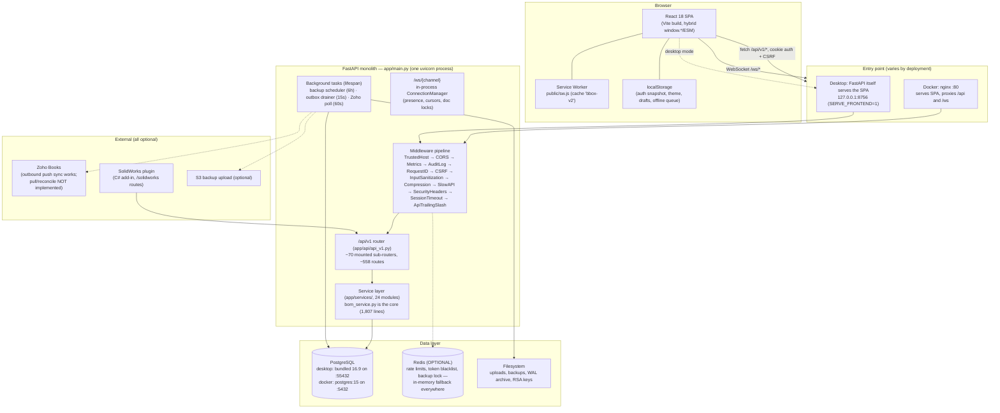
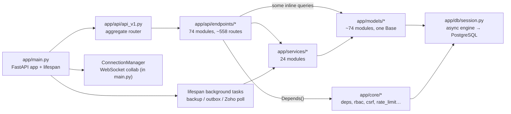
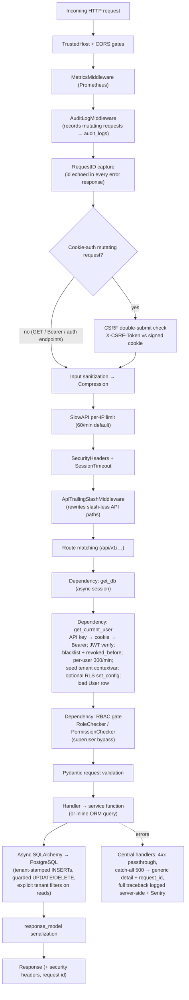
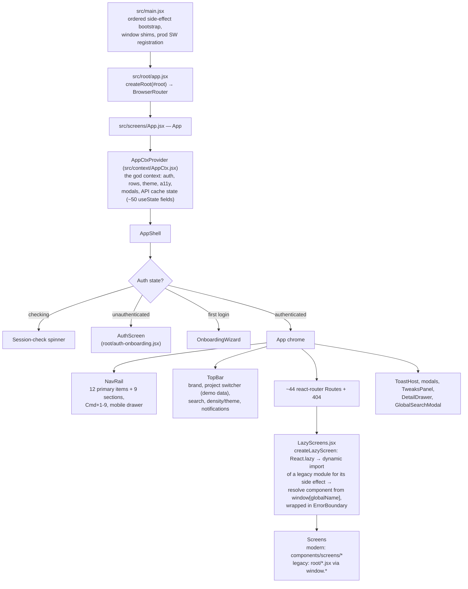
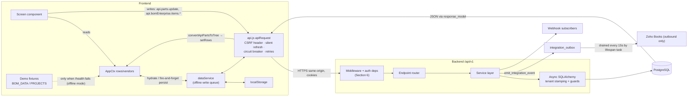

# PROJECT_ARCHITECTURE.md — Blackbox BOM Tool

> **Audience**: developers new to this codebase, including people new to FastAPI/React in general.
> **Scope**: the live project at `bom tool v1/bom-tool/` — backend, database, frontend, and packaging.
> **Sourcing**: this document is grounded in a full read-only audit of the codebase (backend core, all 74 API endpoint modules, ~74 SQLAlchemy models + 50 Alembic migrations, the frontend shell and screens, and the desktop/Docker packaging), refreshed against the code after the August 2026 fix pass (`docs/audit-2026-08/FIX_COVERAGE.md`: 43 of 74 findings fixed). Where a feature is a **mock or stub, it is called out plainly** — this document does not pretend unfinished things are finished. Where the audit found something broken and the code now shows it fixed, this document says so and cites the fix.
>
> Related documents you will see referenced throughout: `backend/docs/ARCHITECTURE.md`, `backend/docs/API_REFERENCE.md`, `backend/docs/MODULE_REFERENCE.md`, `backend/docs/SYSTEM_WORKFLOW.md`, `backend/docs/FEATURE_CATALOG.md`, `backend/docs/data-dictionary.md`, `backend/docs/TESTING_AND_VALIDATION.md`, `backend/docs/deployment-runbook.md`, `INSTALL.md`, `desktop/DESKTOP_PACKAGING.md`, `desktop/DURABILITY.md`, `frontend/MIGRATION_MAP.md`, `frontend/OPEN_ITEMS.md`, and `backend/docs/OPEN_ITEMS.md`.

---

## Table of Contents

1. [What This System Is](#1-what-this-system-is)
2. [System Architecture at 10,000 Feet](#2-system-architecture-at-10000-feet)
3. [Deployment Models](#3-deployment-models)
4. [Repository & Folder Structure](#4-repository--folder-structure)
5. [Backend Architecture](#5-backend-architecture)
6. [Request Lifecycle](#6-request-lifecycle)
7. [API Architecture](#7-api-architecture)
8. [Database Architecture](#8-database-architecture)
9. [Frontend Architecture](#9-frontend-architecture)
10. [State Management](#10-state-management)
11. [End-to-End Data Flow](#11-end-to-end-data-flow)
12. [Sequence: Login + Initial Data Load](#12-sequence-login--initial-data-load)
13. [Application Lifecycle](#13-application-lifecycle)
14. [Known Gaps, Stubs, and Sharp Edges](#14-known-gaps-stubs-and-sharp-edges)
15. [Glossary](#15-glossary)

---

## 1. What This System Is

The Blackbox BOM Tool is a **multi-tenant Bill of Materials (BOM) management platform** for manufacturing: parts and vendors, multi-level BOMs with cost/mass rollups, procurement (purchase orders, price history, supplier scorecards), quality and regulated-industry workflows (ECO/ECN, CAPA, FAI, NCR, 21 CFR Part 11 e-signatures, RoHS/REACH), manufacturing execution (work orders, routings, work centers), and integrations (SolidWorks CAD, Zoho Books accounting, webhooks, a supplier portal).

Two principles shape almost every architectural decision:

1. **Local-first.** The product must run entirely on a customer's own machine or network — a Windows desktop installer bundles PostgreSQL, the backend, and the built frontend into one process tree with **no required internet connectivity**. Cloud services (Redis, S3, Sentry, Zoho) are *optional accelerators*, never hard dependencies. You will see this repeatedly: Redis with in-memory fallbacks, best-effort update checks that never raise, HSTS gated on TLS so the plain-HTTP desktop bundle isn't broken.
2. **Single process, broad surface.** Rather than microservices, this is a deliberate **monolith**: one async FastAPI process serves the JSON API, WebSockets, and (in desktop mode) the built React SPA. That keeps the desktop bundle simple — one launcher, one backend executable, one database — at the cost of a very large single codebase (~558 API routes, ~74 DB models).

---

## 2. System Architecture at 10,000 Feet



**Why a monolith?** The desktop installer (see [Section 3](#3-deployment-models)) must produce a single self-managing process tree on an end user's Windows machine. Every extra service (a separate worker, a message broker) would be another thing the launcher has to install, start, monitor, and update. So background work runs as `asyncio` tasks *inside* the API process, WebSocket state lives in an in-process `ConnectionManager`, and Redis is strictly optional.

---

## 3. Deployment Models

Two parallel deployment models coexist and are both maintained. Full details are in `desktop/DESKTOP_PACKAGING.md` and `INSTALL.md`.

### 3.1 Windows desktop (the primary, local-first path)

```
launcher.exe (PyInstaller onefile, desktop/launcher.py)
 ├─ generates %ProgramData%\BlackboxBOM\.env once (SECRET_KEY, ENCRYPTION_KEY, POSTGRES_PASSWORD…)
 ├─ starts bundled PostgreSQL 16.9  → 127.0.0.1:55432  (fsync on, WAL archiving for PITR)
 ├─ starts backend.exe (uvicorn app.main:app) → 127.0.0.1:8756, SERVE_FRONTEND=1
 └─ opens the browser at http://127.0.0.1:8756 ; tray/console loop; clean shutdown in reverse order
```

- Installed by Inno Setup (`desktop/installer.iss`) to `%ProgramFiles%\BlackboxBOM`; user data lives in `%ProgramData%\BlackboxBOM` (`pgdata`, `backups`, `wal_archive`, `uploads`, `rsa_keys`, `.env`) and **survives updates and uninstall** unless the user explicitly opts into deletion.
- Auto-update (`desktop/updater.py`): best-effort check of a `feed.json` (semver compare, SHA-256 verify, silent Inno install). Offline = no update, never an error — local-first.
- **Known gap (important):** in bundled `backend.exe` mode the launcher never stamps/upgrades Alembic — the schema comes only from `Base.metadata.create_all` at startup. Future *migration-only* schema changes (ALTERs, data backfills) will not auto-apply on desktop installs. Tracked in `desktop/DESKTOP_PACKAGING.md` and `backend/docs/OPEN_ITEMS.md`.
- **Fixed (was a known gap):** `backend/scripts/pitr_restore.py` now branches on `os.name == "nt"` and uses `copy` on Windows vs `cp` on Linux/containers, so a desktop point-in-time restore no longer hard-fails on Unix-only paths/commands. WAL archiving and restore both work on desktop today. See `desktop/DURABILITY.md`.

### 3.2 Docker (server / team deployment)

`docker-compose.yml` at the repo root: `postgres:15-alpine` + `redis:7` + backend (`backend/Dockerfile`, entrypoint waits for Postgres, runs `scripts/init_db.py`, seeds RBAC once, starts uvicorn on `:8000` with `SKIP_CREATE_ALL=true`) + frontend (Vite build → `nginx:alpine` serving the SPA and proxying `/api` and `/ws`). `backend/docker-compose.prod.yml` is a fuller enterprise stack (pgbouncer, pgbackrest, minio, celery, prometheus/grafana/loki) — enumerated but beyond this doc's scope; see `backend/docs/deployment-runbook.md`.

### 3.3 Port map (worth memorizing)

| Thing | Desktop | Docker |
|---|---|---|
| PostgreSQL | 127.0.0.1:**55432** (bundled 16.9) | db:**5432** (postgres:15) |
| Backend API | 127.0.0.1:**8756** | backend:**8000** |
| Frontend | served *by the backend* | nginx :**80** |
| Redis | not present (in-memory fallbacks) | redis:**6379** |

---

## 4. Repository & Folder Structure

```
bom-tool/
├── backend/
│   ├── app/
│   │   ├── main.py              # App wiring: middleware, lifespan, WebSockets, SPA serving
│   │   ├── core/                # Cross-cutting concerns (the "how requests are allowed to happen" layer)
│   │   │   ├── config.py        #   pydantic-settings: .env + optional Vault, secret entropy checks
│   │   │   ├── security.py      #   JWT (RS256), RSA keypair generation, token blacklist
│   │   │   ├── deps.py          #   get_current_user / get_db — the auth dependency chain
│   │   │   ├── rbac.py          #   RoleChecker / PermissionChecker, role hierarchy
│   │   │   ├── csrf.py          #   double-submit CSRF cookie (HMAC-signed)
│   │   │   ├── rate_limit.py    #   slowapi limiter, Redis-first with in-memory fallback
│   │   │   ├── security_headers.py  # HSTS/CSP/XFO middleware
│   │   │   ├── tenant_context.py    # contextvar holding the current tenant id
│   │   │   ├── tenant_events.py     # SQLAlchemy listeners enforcing tenant isolation
│   │   │   ├── tenant_middleware.py # DEAD CODE — written but deliberately not registered
│   │   │   ├── session_timeout.py   # misnamed; only re-validates JWT exp (no inactivity logic)
│   │   │   ├── audit_middleware.py  # writes mutating requests to audit_logs
│   │   │   ├── backup.py            # pg_dump/pg_basebackup pipeline, encryption, retention
│   │   │   ├── ws_auth.py / client_ip.py
│   │   ├── db/                  # session.py (engine + get_db), base.py (Base), rls.py (Postgres RLS helpers)
│   │   ├── models/              # ~74 SQLAlchemy model modules, one shared Base
│   │   ├── schemas/             # Pydantic schemas (only ~20 of 74 endpoint files use these; rest inline)
│   │   ├── api/
│   │   │   ├── api_v1.py        # THE aggregate router — mounts ~70 sub-routers at /api/v1
│   │   │   └── endpoints/       # 74 endpoint modules (~558 routes) — every router that exists is now mounted (see §7.3)
│   │   ├── services/            # 24 service modules (bom_service, auth_service, inventory_service…)
│   │   ├── integrations/        # integration event emitter, outbox
│   │   └── tests/               # 112 test entries (+ backend/tests/, 6 modules)
│   ├── alembic/versions/        # 50 migration files, ONE linear head: 050_rfq_headers_created_by_nullable
│   ├── scripts/                 # init_db, db_backup, pitr_restore, docker-entrypoint.sh, health checks
│   ├── seed_db.py               # demo tenant + 5 parts / 4 vendors / 2 projects (dev only)
│   └── docs/                    # ARCHITECTURE.md, API_REFERENCE.md, data-dictionary.md, …
├── frontend/
│   ├── api.js                   # ~1,445-line API client (NOTE: at frontend root, not src/)
│   ├── src/
│   │   ├── main.jsx             # ORDERED side-effect bootstrap (import order is load-bearing!)
│   │   ├── config.js            # API_BASE '/api/v1' (same-origin), WS base
│   │   ├── globals.js           # central ESM re-export hub for the migration
│   │   ├── context/AppCtx.jsx   # the "god context" — nearly all shell state
│   │   ├── screens/App.jsx      # AppShell: auth gate, onboarding gate, ~44 <Route>s
│   │   ├── components/          # NavRail, TopBar, LazyScreens, screens/, modals/, advanced/, ui/
│   │   ├── root/                # ~20 LEGACY modules that self-register on window.* (mid-migration)
│   │   ├── services/            # dataService.js (offline queue), screenDataBridge.js (API-or-localStorage)
│   │   └── utils/               # storage.js (localStorage), bom.js (tree conversion)
│   ├── public/sw.js             # service worker
│   ├── vite.config.ts           # vendor-only manualChunks (circular-import TDZ safety — do not "fix")
│   └── MIGRATION_MAP.md / OPEN_ITEMS.md
├── desktop/                     # launcher.py, build.py, installer.iss, updater.py, DURABILITY.md
├── docker-compose.yml, install.ps1/.bat, INSTALL.md
├── solidworks-plugin/           # C# net48 COM add-in (separate build, talks to /api/v1/solidworks)
└── .github/workflows/           # ci.yml, postgres-ci.yml, solidworks-plugin.yml
```

**Why this shape?** `app/core/` isolates *policy* (who may do what, how requests are shaped) from *domain logic* (`app/services/`) and *routing* (`app/api/endpoints/`). The frontend's split between `src/root/` (legacy `window.*` modules) and `src/components/` (modern ES modules) is not a design choice but a **snapshot of an in-progress migration** — see [Section 9.1](#91-the-hybrid-migration-windowglobals--es-modules).

---

## 5. Backend Architecture

### 5.1 Module relationships



The intended layering is **endpoint → service → model → DB**. In practice this is only *partially* adopted: heavyweight domains (BOM, auth, inventory, quality, work orders, ECO) go through real service modules, while many smaller endpoint files still run inline SQLAlchemy queries and define inline Pydantic models. This inconsistency is a known hygiene item, not a hidden design — treat the service layer as the pattern to copy for new code.

### 5.2 Configuration (`app/core/config.py`)

One `pydantic-settings` class reads `.env` (with optional HashiCorp Vault overlay) and **validates secrets aggressively**: Shannon-entropy checks (≥80 bits) and weak-secret detection, with a hard failure in production if secrets are missing or weak. *Why*: the desktop launcher generates secrets automatically, but server operators type them by hand — the entropy gate catches "changeme" before it ships. Database URL, Redis URL, backup settings, `ENABLE_RLS`, `SERVE_FRONTEND`, etc. all live here; treat `Settings` as the single source of configuration truth.

### 5.3 Authentication

Three ways in, tried in this order inside `get_current_user` (`app/core/deps.py`):

1. **`X-API-Key` header** — API keys are stored bcrypt-hashed and looked up by an indexed prefix; checked for expiry, rate-limited at 120/min per key, `last_used_at` updated. In production, superuser-owned keys additionally require the owner to have MFA enabled. Two fixes worth knowing about (`docs/audit-2026-08/fix2_api-key-security.md`):
   - **Scopes are now enforced, not just stored.** A key only ever carries `["read", "write"]` (the default `POST /api-keys` assigns both; a caller can narrow it). `GET/HEAD/OPTIONS` require `read`, everything else requires `write`; an unrecognised/missing scope is a **403**, not a silent pass. Default-deny: a key with no scopes, or a malformed `scopes` value, grants nothing.
   - **Key prefixes are now unique per key.** Every issued key used to get the literal prefix `"bkb"`, so the lookup (`WHERE key_prefix = ...` then `scalar_one_or_none()`) raised an unhandled `MultipleResultsFound` the moment a second active key existed anywhere in the system. Keys are now minted as `bkb<12 hex chars>_<url-safe secret>` — the random hex is folded into the prefix itself, so the indexed lookup is unique again.
2. **`access_token` cookie** — the normal browser path. The SPA never stores tokens in JS; the backend sets an HttpOnly cookie.
3. **`Authorization: Bearer` header** — for programmatic/plugin clients. *Caveat*: if both cookie and Bearer are present, **the cookie wins** — a known latent trap documented in [Section 14](#14-known-gaps-stubs-and-sharp-edges).

Tokens are **RS256 JWTs** by default. On first run the backend auto-generates an RSA-4096 keypair and encrypts the private PEM with a passphrase derived from `ENCRYPTION_KEY` (`app/core/security.py`). *Why RS256 over the simpler HS256*: verification needs only the public key, so future satellite components (e.g. the SolidWorks plugin host) can verify tokens without holding the signing secret. Revocation is two-layered: a per-token `jti` blacklist and a per-user `revoked_before` timestamp ("log out everywhere"), both Redis-backed with fallbacks.

After a successful token verify, `get_current_user` seeds the **tenant contextvar** from the JWT claims, optionally pins Postgres RLS (`set_config('app.current_tenant', …)`), loads the `User` row, and re-pins the tenant from the authoritative DB row.

### 5.4 Authorization (RBAC)

`app/core/rbac.py` provides `RoleChecker` / `PermissionChecker` FastAPI dependencies plus prebuilt gates (`require_viewer`, `require_admin`, `require_parts_write`, …). Roles and permissions are resolved from the database per request against a static hierarchy:

```
superadmin > admin > engineering / procurement / finance > viewer
```

Permissions are `resource:action` strings (e.g. `parts:write`). `isSuperuser` bypasses all checks, and `get_current_superuser` additionally demands enabled MFA in production. **Note**: the frontend's role switcher in the nav rail is explicitly *UI-only demo behavior* — real enforcement is entirely backend-side.

### 5.5 Multi-tenancy — the most important subsystem to understand

Every business table carries a `tenantId` column (NOT NULL, FK → `tenants.id`, via `TenantAwareMixin` in `app/models/mixins.py`). Isolation is enforced in **two layers**:

**Layer 1 — application-side (primary):** a request-scoped contextvar (`app/core/tenant_context.py`) holds the current tenant id; SQLAlchemy event listeners (`app/core/tenant_events.py`) then:
- auto-populate `tenantId` on INSERT ✅ *works*;
- raise `PermissionError` on cross-tenant UPDATE/DELETE at flush ✅ *works*;
- auto-filter ORM SELECTs by tenant ✅ **fixed — this now works.** An earlier version of the listener read a nonexistent attribute (`execute_state.mapper_`), silently no-op'd on the resulting `AttributeError`, and the automatic filter was dead code (documented in an earlier pass of this audit). It has since been fixed to use `execute_state.bind_mapper` — the correct SQLAlchemy 2.x attribute — and, importantly, the fix is **not** wrapped in a `try/except`: if the attribute name ever moves again, the app fails loudly instead of quietly stopping isolation a second time. Every ORM `SELECT` against a `TenantAwareMixin` model now gets a `WHERE "tenantId" = :current_tenant` clause injected automatically. Non-ORM (raw `text()`) `SELECT`s are explicitly **not** touched — the listener has no way to know which column carries the tenant on an arbitrary raw query — and now logs a warning (not a false "blocked" claim) so those bypasses stay auditable. **Raw SQL and bulk Core `update()`/`delete()` statements still require an explicit tenant filter** (`tenant_sql_clause()` / `get_tenant_id()`) — the ORM listener cannot see them. The August 2026 fix pass closed several concrete instances of this: `bulk_delete_parts` (was fully unscoped), the bulk BOM-item delete endpoint (was a Core `delete()` filtered only by id), and a systemic raw-SQL tenant bypass across several `routing_api.py` write endpoints. One residual gap tracked as deferred: `routing_api.py`'s `list`/`get_process_plan` *reads* are still tenant-unscoped (only the inserts were fixed) — see `docs/audit-2026-08/FIX_COVERAGE.md`.

**Layer 2 — Postgres Row-Level Security (opt-in backstop):** migration `040_postgres_rls_tenant_isolation` adds `FORCE RLS` + a `tenant_isolation` policy (`"tenantId" = current_setting('app.current_tenant')::int`) on every tenant-scoped table, with a narrow `app.rls_bootstrap` escape hatch so login can read `users`/`api_keys`/`user_mfa` before a tenant is known. Enabled only when `ENABLE_RLS=true` *at migration time* — flipping the flag later requires downgrade/re-upgrade of migration 040 (documented in the migration itself).

A ready-made `TenantIsolationMiddleware` exists (`app/core/tenant_middleware.py`) but is **deliberately not registered**; tenant context is set inside `get_current_user` instead. *Why*: setting the tenant inside the auth dependency guarantees it derives from a *verified* identity, not from anything the middleware guessed earlier. The middleware file is effectively dead code.

Deliberately **global** (non-tenant) tables exist: substance/regulation reference data (RoHS/REACH) and `compliance_packs`/`part_certifications`. The latter carry per-part data accessed via raw SQL — the main residual isolation surface to be careful with.

### 5.6 Request-shaping middleware (CSRF, rate limits, headers)

- **CSRF** (`app/core/csrf.py`): double-submit cookie signed with HMAC-SHA256(`SECRET_KEY`). Applies to cookie-authenticated *mutating* requests; Bearer-authenticated requests and the auth entry endpoints are exempt. *Why*: cookies are sent automatically by browsers, so cookie-auth needs CSRF protection; header-based auth cannot be forged cross-origin.
- **Rate limiting** (`app/core/rate_limit.py` + slowapi): layered — per-IP 60/min default, per-user 300/min, per-API-key 120/min, per-IP WebSocket 30/min. All Redis-first with in-memory fallbacks. Client IP comes from `get_client_ip()`, which only trusts `X-Forwarded-For` when `BEHIND_PROXY=true` (spoofing protection).
- **Security headers** (`app/core/security_headers.py`): HSTS only when TLS is on (so the HTTP desktop bundle isn't bricked), environment-differentiated CSP (trusted-types + report-uri in prod), `X-Frame-Options: DENY`, Permissions-Policy.
- **Audit logging** (`app/core/audit_middleware.py`): every mutating request is written to the `audit_logs` table with 3-retry background writes, drained at shutdown.
- **`ApiTrailingSlashMiddleware`**: a raw-ASGI path rewriter so `/api/v1/parts` and `/api/v1/parts/` both work — necessary because the SPA catch-all route would otherwise swallow redirect behavior in desktop mode.
- **`SessionTimeoutMiddleware`**: misnamed — despite the name it implements **no inactivity timeout**; it only re-validates the JWT `exp` claim (production only), which the auth dependency already does. Treat as redundant/dead.

### 5.7 WebSockets (real-time collaboration)

`WS /ws/{channel}` in `app/main.py`, authenticated by JWT (query param or header, `app/core/ws_auth.py`, blacklist-checked), rate-limited per IP. An in-process `ConnectionManager` fans out presence, cursors, typing indicators, **document locks**, and document updates on tenant-scoped channel names. Because state is in-process, this only works single-instance — consistent with the desktop model, but a scaling constraint for multi-worker server deployments. Two previously-known lock bugs are **fixed**: `doc_locks` is now keyed by `(channel, document_id)` rather than a bare document id, so two tenants/projects can no longer collide on the same numeric doc id; and `ConnectionManager.disconnect()` now walks `doc_locks` for the disconnecting user and releases (and broadcasts the release of) every lock they held, so a crashed tab no longer locks a document forever. Separately, the per-IP WebSocket rate limiter's Redis-backed counter was fixed (finding "A13") to use a float timestamp + a unique member per connection instead of `int(time.time())` as both the sorted-set score *and* member — the old version collapsed an entire burst of connections within the same second into one counted attempt. **Note the same class of bug still exists, unfixed, in the per-user and per-API-key HTTP rate limiters** in `app/core/deps.py` (`_check_redis_rate_limit` still uses `int(time.time())` for both score and member) — tracked as a deferred low-severity item in `docs/audit-2026-08/FIX_COVERAGE.md`.

### 5.8 Backups (`app/core/backup.py`)

The backend shells out to `pg_dump`/`pg_basebackup` via asyncio subprocesses; outputs are gzipped and chunk-encrypted with Fernet, verified with `pg_restore --list`, recorded in `backup_history`, retained in daily/weekly/monthly/yearly tiers, optionally uploaded to S3, with WAL-archive cleanup and webhook/email failure alerts. A scheduler task runs every `BACKUP_SCHEDULE_HOURS` (default 6). **Two previously high-severity bugs here are now fixed:**
- Encrypted *physical* (`pg_basebackup`) backups used to be unrestorable — they were encrypted in a stream of length-prefixed Fernet chunks, but restore called a single-shot `fernet.decrypt(f.read())`, which always raised `InvalidToken`. Restore now uses the same chunked `_stream_decrypt` as encryption, matching format on both sides.
- Backup-failure alert emails used to never send — `_send_email_alert` referenced `settings.APP_NAME`, which didn't exist on `Settings`, so every call raised (and swallowed) an `AttributeError`. `Settings.APP_NAME` is now a real field (`"Blackbox BOM"` default) and the alert path works.

Still confirm your own restore procedure end-to-end before depending on it in production — see `desktop/DURABILITY.md`.

---

## 6. Request Lifecycle

Every HTTP request to the API travels through this pipeline (middleware registration order in `main.py` is the *reverse* of execution order; what's shown here is **execution order**):



**Why this order matters:** host/CORS rejection happens before anything expensive; audit capture happens early so even failed requests are recorded; CSRF runs before the body is processed; rate limiting runs before route logic so abuse can't reach the DB; and auth (a *dependency*, not middleware) runs last so route-level code always sees a verified user + tenant. Error responses deliberately leak nothing beyond a generic message and a `request_id` you can grep in server logs.

---

## 7. API Architecture

### 7.1 Shape

Everything is mounted under **`/api/v1`** by one aggregate router, `app/api/api_v1.py`, which `include_router`s ~70 sub-routers with per-domain prefixes (`/parts`, `/bom`, `/inventory`, `/eco`, `/quality`, `/integrations/zoho_books`, …), plus a SAML router, `/metrics` (Prometheus, auth-gated), `/health`, and `/health/detailed`. In total: **~558 routes across 74 endpoint modules**. The complete endpoint inventory lives in `backend/docs/API_REFERENCE.md`; per-module details in `backend/docs/MODULE_REFERENCE.md`.

**`/health/detailed` is now auth-gated** (`Depends(get_current_user)`) — it used to require no authentication at all and leaked internal row counts and system info to anyone who hit the URL. The handler also now strips the response's `security`/`authentication` blocks rather than reporting them: those blocks used to echo hardcoded values (e.g. `csrf_protection: true`) regardless of whether that was actually true at runtime — fabricated status presented as fact. `/metrics` and plain `/health` are unchanged (`/metrics` was already auth-gated; `/health` intentionally stays anonymous so container/process health checks — see `docker-compose.yml` — don't need credentials).

Outside `/api/v1`, `app/main.py` itself serves:

- `GET /` — SPA index (desktop mode) or a JSON welcome;
- `GET /health` — DB + backup health;
- `WS /ws/{channel}` — collaboration;
- `/assets` static mount + a **catch-all `GET /{full_path:path}`** registered *last*, which serves the built React SPA for any non-API path. *Why last*: FastAPI matches routes in order, so the catch-all must lose to every real API route.

### 7.2 Domain map (all genuinely implemented unless marked)

| Domain | Prefix(es) | Notes |
|---|---|---|
| Auth & identity | `/auth`, `/sso`, `/sessions`, `/api-keys`, `/rbac`, `/tenants`, `/users`, `/teams` | login/refresh/MFA/SSO (Google/GitHub/Microsoft OAuth2 + SAML); tenants is superuser-only |
| Parts & catalog | `/parts`, `/part-vendors`, `/catalogs`, `/barcodes`, `/price-history` | |
| BOM | `/bom` (bom_enterprise), `/bom-items`, `/bom-templates` | explosion, rollups, snapshots, **`POST /bom/compare` exists and works**, baselines, variants, where-used — thin wrappers over `bom_service.py` |
| Procurement | `/procurement`, `/po-orders`, `/contracts`, `/supplier-scorecards`, `/kanban`, `/order-tracking`, `/make-vs-buy`, `/should-cost` | ⚠ `/procurement` and `/po-orders` are **two API surfaces over the same PO tables** |
| Quality / regulated | `/quality`, `/capas`, `/fai`, `/deviations`, `/eco`, `/esignatures`, `/compliance`, `/substance-compliance`, `/traceability` | Part 11 e-signatures are read-only/write-once by design |
| Manufacturing | `/work-orders`, `/manufacturing` (routings + work centers/labor — two routers share this prefix) | |
| Inventory | `/inventory` | warehouses, bins, stock, transactions, valuations |
| Integrations | `/integrations`, `/integrations/zoho_books`, `/erp-connectors`, `/webhooks`, `/solidworks`, `/cad`, `/supplier-portal` | see stubs below |
| Tooling & ops | `/ocr` (real Tesseract), `/scraping` (real httpx), `/export` (real XLSX/PDF), `/import` (CSV), `/search`, `/analytics`, `/dashboards`, `/backup`, `/audit-logs`, `/notifications`, `/user-sync`, `/ai` | |

### 7.3 Honest labels: stubs, partials, and dead routers

- **ERP sync is a stub.** `POST /erp-connectors/{id}/sync` explicitly records "ERP sync is not implemented for this connector type — no network" and does nothing. Connector CRUD/logs/test-connection are real; actual ERP data exchange **does not exist**.
- **Zoho Books is intentionally half-built.** OAuth connect, org selection, **outbound push** sync, status and mappings work. **Pull / reconcile / conflict-resolution endpoints return an explicit "not implemented in this build"** response (increment 2a of a staged plan).
- **"AI" features are not ML.** `/ai` demand forecasting is a deterministic seasonal-multiplier formula over PO history with fabricated confidence numbers (tagged `statistical_ma`). Functional, but do not present it as machine learning.
- **Fixed — five previously-orphaned routers are now mounted.** `derivatives.py`, `formulas.py`, `graph.py` (the where-used knowledge graph, at `/graph`), `planning.py` (PO-from-BOM generation, at `/planning`), and `solidworks_contract.py` (SolidWorks add-in property-mapping CRUD, at `/solidworks` alongside `solidworks_integration.py`) were all fully implemented but only imported in `endpoints/__init__.py`, never `include_router`'d — so their features had no HTTP surface at all (audit finding "A9"). All five now have explicit prefixes in `app/api/api_v1.py` and are reachable. If you're reading an older description of this codebase that lists these as dead endpoints, that has been fixed.
- **Duplicate surfaces to be aware of:** `cad.py` re-implements several `/solidworks` routes with its own inline logic; `/bom-templates` vs `/bom/templates` are two separate template systems; `po_order.py` vs `procurement.py` (above). Prefer the service-backed variant when extending.
- **Path oddities that are load-bearing for clients:** `/sessions/sessions/*`, `/calendar/calendar-events`, `/compliance/compliance/*` — double-prefix artifacts that the frontend mirrors. Don't "fix" one side without the other.

---

## 8. Database Architecture

### 8.1 ORM and migrations

- **Async SQLAlchemy 2.0** with ~74 model modules registered on a single `Base` (`app/db/base.py`, imported en masse by `app/models/__init__.py`).
- **Alembic**: 50 migration files forming a **single linear chain with exactly one head: `050_rfq_headers_created_by_nullable`**. ⚠ Numbering trap: three files share the `041_` prefix, and `041_zoho_books_sync_tables` actually revises `044` — the *chain* is authoritative, the *filenames* are not. Always run `alembic heads`/`alembic history`, never infer order from names. The three most recent migrations: `048_index_foreign_keys` (missing FK indexes), `049_restore_check_constraints` (re-adds CHECK constraints an earlier migration had silently dropped), `050_rfq_headers_created_by_nullable` (loosens `RfqHeader.created_by` to nullable so a deleted user doesn't orphan an RFQ under a NOT NULL column paired with `ondelete="SET NULL"` — see `backend/app/models/supplier_portal.py`).
- Two previously-tracked Postgres bootstrap bugs (VARCHAR(32) `alembic_version`; `env.py` ignoring `.env`) are **both fixed** in `alembic/env.py`.
- `Base.metadata.create_all` still runs at startup by default (opt-out `SKIP_CREATE_ALL`) — deprecated but retained because the desktop bundle depends on it (see Section 3.1). On servers, Docker sets `SKIP_CREATE_ALL=true` and migrations run via `scripts/init_db.py`.
- The full column-level reference is `backend/docs/data-dictionary.md`.

### 8.2 Key table groups

| Group | Tables | Why it's shaped this way |
|---|---|---|
| Tenancy & identity | `tenants`, `users`, `user_roles`, roles/permissions, `api_keys`, `user_mfa` | `users.email`/`username` are **globally** unique (cross-tenant login), unlike every other business key which is unique per `(tenantId, …)` |
| Item master | `parts` (+ `part_tags`, `part_compliance`, `part_vendors`, `price_history`) | tenant-scoped `uq(tenantId, pn)`; money as `Numeric(18,4)` |
| BOM | `boms`, `bom_items_master` (self-referential `parent_item_id` hierarchy), **`bom_closures`** | closure table stores every ancestor→descendant pair with depth so **explosion and where-used are one indexed query** instead of a recursive walk; maintained incrementally by `bom_service` |
| Legacy BOM | `bom_templates` + `bom_items` (JSON `bomData`, deprecated) | superseded by `bom_items_master` rows |
| Inventory | `warehouses`, `bin_locations`, `inventory`, `inventory_transactions`, `inventory_reservations` | |
| Compliance | tenant-scoped `compliance`; **global** `compliance_packs`/`part_certifications`; global substance reference data (042) vs tenant-owned compositions/declarations (043) and evaluation caches (044) | reference data (RoHS lists, REACH regs) is world-shared by nature, so it's deliberately non-tenant |
| Integrations | `zoho_sync_state`/`_cursor`/`_log` (three-way-merge baselines, poll cursors, conflict log), `integration_connections`/`_external_links`/`_outbox`, `sw_property_mappings`, `sw_pending_changes`, `part_derivatives` | outbox pattern: writes queue integration events transactionally; a lifespan task drains them every 15s |

### 8.3 DB interaction rules (what actually protects you)

1. **INSERTs**: `tenantId` is auto-stamped from the contextvar — you don't set it manually. ✅
2. **UPDATE/DELETE via the ORM** (loading an object then mutating/deleting it): cross-tenant writes raise `PermissionError` at flush. ✅
3. **SELECTs via the ORM**: automatically filtered by tenant — a `WHERE "tenantId" = :current_tenant` clause is injected for you (Section 5.5). ✅ *This was broken in an earlier pass of this audit; it is fixed now.*
4. **Raw SQL (`text()`) and bulk Core `update()`/`delete()` statements are the one place the ORM listeners cannot help you** — they see no ORM entities to filter. These must be scoped by hand with `tenant_sql_clause()` / `get_tenant_id()`. This is the residual isolation surface: the August 2026 fix pass closed several concrete leaks here (`bulk_delete_parts`, the bulk BOM-item delete endpoint, several `routing_api.py` writes) but at least one read path (`routing_api.py` list/get) is still tenant-unscoped and tracked as deferred.
5. **RLS**, if enabled, backstops all of the above at the database level regardless of whether the application layer got it right.

### 8.4 Seeding

`seed_db.py` creates a "Blackbox Factories" tenant with 5 parts, 4 vendors, 2 projects, and a draft BOM per project; an admin user is created **only** if `SEED_ADMIN_PASSWORD` is set and the environment is not production. ⚠ It bootstraps schema via `create_all` and never stamps `alembic_version` — a seeded DB diverges from a migration-managed one. Use it for local demos only; use `scripts/init_db.py` for anything real.

---

## 9. Frontend Architecture

### 9.1 The hybrid migration (window.* globals + ES modules)

The frontend began life as a single-file `window.*`-globals monolith and is **mid-migration** to a modern Vite + React 18 + React Router v7 ES-module app. Both worlds coexist *by design* (documented in `frontend/MIGRATION_MAP.md` and the `main.jsx` header):

- **Legacy world** — `src/root/*.jsx` (~20 modules: icons, overlays, modals, bom-editor, dashboard, enterprise screens…). Each file *self-registers* its components on `window` (e.g. `window.Icon`, `window.App`) as an import side effect.
- **Modern world** — `src/components/**`, `src/screens/`, `src/context/` use normal ES imports, ideally through the central re-export hub **`src/globals.js`** ("import from here instead of window").

Two consequences every contributor must internalize:

1. **Import order in `src/main.jsx` is load-bearing.** It imports, in order: i18n → the plain-JS data layer (`../api.js`, `../data.js`, `../projects.js`, `../cloud-sync.js`) → the legacy `root/*.jsx` modules → *finally* `root/app.jsx`, which mounts React. Reordering these breaks components that read `window.Icon` etc. at module scope (NavRail/TopBar currently do — a known landmine).
2. **`vite.config.ts`'s `manualChunks` restriction is deliberate.** Only a `react/react-dom/scheduler` vendor chunk is split; everything else stays together because the `root/*.jsx` modules are mutually circular and finer chunking previously caused TDZ ("Cannot access X before initialization") crashes in production builds. Do not "optimize" this without breaking the cycles first.

### 9.2 Component hierarchy



`createLazyScreen` is the bridge between the two worlds: it dynamic-imports a legacy module *purely for its `window` registration side effect*, then hands the resulting global to `React.lazy`. Several screens chain a prerequisite import of `root/bom-editor.jsx` because they need helpers it registers. This gives real route-level code splitting for ~44 screens despite the legacy module format.

### 9.3 Routing

React Router v7 owns the URL. For backward compatibility, `AppCtx` also derives a legacy `route` *string* from `location.pathname` (`"/"` → `"dashboard"`) and exposes `setRoute(r) = navigate("/" + r)`; legacy code navigates through a `window.__nav` shim. New code should use React Router APIs directly; the string route exists only until the migration completes.

### 9.4 The API client (`frontend/api.js` — note: at frontend *root*, not `src/`)

One ~1,445-line module builds every endpoint group (~60 of them, mirroring the backend's prefixes) on top of a single `apiRequest()` with substantial resilience machinery:

- **Same-origin base `/api/v1`** from `src/config.js` (overridable via `window.__BBOX_CONFIG` for cross-origin dev); the WebSocket base derives from `location`. *Why same-origin*: in both deployments (desktop's single process, Docker's nginx) frontend and API share an origin, which makes cookie auth and CSRF simple.
- **Cookie auth** — `credentials: 'include'`, tokens never stored in JS (XSS can't steal what isn't there).
- **CSRF** — reads the `csrf_token` cookie and sends `X-CSRF-Token` on every non-GET (matching Section 5.6).
- **Deduplicated silent refresh** — on a 401, all in-flight requests share *one* `POST /auth/refresh` promise; on success the original request retries exactly once; a genuinely unauthorized outcome triggers the global logout handler; **transient failures (429/5xx/network) soft-fail without logging out** — deliberately, so a flaky network doesn't eject a local-first user.
- **Per-resource circuit breaker** — 5 failures within 30s on a path's first segment (e.g. `parts`) opens the circuit and fast-fails for 30s. **Fixed** (audit finding "A4"): a deterministic 4xx (anything 400–499 except 408/429) is now tagged with its status and treated as neither retryable nor a circuit failure — retrying a 404 can never succeed, and counting it used to take a whole resource offline for 30s after five of them (e.g. a screen probing for an optional record).
- **Bounded retries** — 2 retries with linear backoff, honoring `Retry-After` on 429. **Fixed**: non-idempotent methods (`POST`/`PUT`/`PATCH`/`DELETE`) are no longer auto-retried on a transient (network/5xx) failure — the request may already have been applied server-side, so a blind retry risked a duplicate write. Only `GET`/`HEAD`/`OPTIONS` retry now; deterministic 4xx errors are re-thrown immediately regardless of method.

Everything is exported as the aggregate `api` object *and* mirrored to `window.api` / individual `window.*API` shims for the legacy world.

### 9.5 Service worker & offline

`public/sw.js` (cache name `bbox-v2`) uses **network-first** for navigations, `/index.html`, and `/api/*` (cache fallback) and **cache-first** for other same-origin assets; on activate it deletes *all* old caches — a self-healing response to a past stale-bundle incident. Registered in production only. ⚠ Reality check: nothing ever `cache.put`s the app shell or API responses, so **true offline reload does not currently work** — the offline fallback path is effectively dead code, and the cache-first branch is broader than its own comment claims. The app's *practical* offline story is instead the demo-fixture fallback described next.

### 9.6 The screen reality map — REAL vs PARTIAL vs MOCK

This is essential context for anyone reading the UI: roughly **30 screens are REAL** (fully API-wired), **~31 PARTIAL** (mix of real API + fabricated/local-only pieces), and **~66 MOCK** (demo-era fabricated data). The audit corroborated the split by direct source reads; the tracker is `frontend/OPEN_ITEMS.md`.

| Class | Meaning | Representative examples |
|---|---|---|
| **REAL** — copy these patterns | `api.*`/`apiRequest` + loading spinner + honest error state, **no fabricated fallback** | AuditTrailScreen, CatalogsScreen, WorkQueueScreen, ZohoBooksScreen, IntegrationsScreen, ProcurementScreen, enterprise screens (dashboards, routing, work centers, labor, API keys), tenant admin, bom-editor *writes*, WebSocket collaboration |
| **PARTIAL** | some real calls, some fabrication or missing writes | AnalyticsScreen (2–3 real KPIs; **all trend charts hardcoded**), DiffScreen (real compare on hardcoded BOM ids 1/2; version diffs fabricated; "Export diff" is a fake toast), OCRScreen (real extract; "Apply to part" only toasts), VendorsScreen (toggles mutate local state only), ECRScreen, ComplianceScreen (hardcodes every part to "valid"), CalendarScreen (never calls the existing calendar API), mobile scanner (real lookups; simulated barcode scan) |
| **MOCK** — fabricated, do not trust the numbers | DashboardScreen budget/"API Uptime 99.98%", ActivityScreen (**injects a random fake event every 15s**), AIAssistant (regex canned replies), QMSDashboard + NCRScreen (fake NCR/CAPA/FAI rows despite real endpoints existing), InventoryScreen in prod-additions (stock synthesized from part-number char codes), PDM vault tree, price-alert/RFQ/inflation/scrape/find-alternates modals, AuditLogModal (duplicates the REAL AuditTrailScreen with fake data) |

*Why it looks like this*: the MOCK components are demo-era showcase UI that predates the backend. Nearly every mocked domain already has a working endpoint exposed in `api.js`/`screenDataBridge.js`, so rewiring is UI plumbing, not backend work. The team's newer code comments ("honest failure — do not fall back to fabricated rows") show the converged standard.

---

## 10. State Management

There is **no Redux/Zustand**. State lives in four layers:

1. **`AppCtx` (src/context/AppCtx.jsx)** — one provider holding ~50 `useState` fields: auth/user, the BOM `rows` tree, vendors, theme/density/accessibility (stamped onto `document.documentElement` in layout effects), modal state, API-connection state, popover refs. *Why one context*: it mirrors the legacy monolith's single shared scope, which made the migration tractable. *Cost*: the context value is rebuilt every render without `useMemo`, so nearly every interaction re-renders every consumer — a known performance item.
2. **`utils/storage.js` (localStorage)** — persisted slices: auth snapshot, theme, a11y, role, notifications, saved views, drafts.
3. **`services/dataService.js`** — an offline/online sync bridge with a write queue: when `/health` succeeds it flips online, `syncAll()`s queued writes, refreshes parts from the API, and runs `migrateToBackend()` (a one-time localStorage → Postgres bridge, matching the backend's `/user-sync` endpoints).
4. **`services/screenDataBridge.js`** — wraps `window.api` with "API-first, localStorage-fallback" accessors that many screens read through.

**The rows pipeline** (the single most important data path): backend parts + BOM items → `convertApiPartsToTree` (`utils/bom.js`) → `ctx.rows` → screens. ⚠ Critical gotcha: `convertApiPartsToTree` returns a **flat array** — rows have **no `.children`** — but the demo-fixture shape (`rows[0].children`) is still assumed at a handful of call sites (`frontend/src/components/modals/BOMTemplatesModal.jsx`, `frontend/src/root/detail-drawer.jsx`, `frontend/src/components/screens/AnalyticsScreen.jsx` as of this pass — most of the earlier, larger set of legacy call sites the previous audit found have since been cleaned up, but these three remain). Those components **crash precisely when the app is genuinely connected to the backend**. If you touch anything reading `ctx.rows`, use a safe flatten helper, never `rows[0].children`.

**Offline/demo mode**: if the health check fails, `apiConnected=false` and the static fixtures `BOM_DATA` (`data.js`) / `PROJECTS` (`projects.js`) populate rows/vendors. The TopBar's project switcher and its four projects (ATLAS/HORIZON/…) are **hard-coded demo data** even when connected, and structural BOM edits fall back to a hardcoded `bomId = … || 1` — both known issues.

---

## 11. End-to-End Data Flow



Reading this diagram: **reads** hydrate `AppCtx` from the API (with fixtures only as an offline fallback), **writes** go straight through `api.js` to the backend, and **side effects** (Zoho, webhooks) leave through a transactional outbox drained asynchronously — so an integration being down never blocks a user's save. That outbox pattern is the local-first principle applied to integrations: the primary system must function with the cloud absent.

---

## 12. Sequence: Login + Initial Data Load

```mermaid
sequenceDiagram
    autonumber
    actor U as User
    participant AS as AuthScreen (frontend)
    participant AC as AppCtx (frontend)
    participant AJ as api.js
    participant BE as FastAPI /api/v1
    participant DB as PostgreSQL

    U->>AS: enter credentials, submit
    AS->>AJ: api.auth.login(email, password)
    AJ->>BE: POST /api/v1/auth/login (auth-entry: exempt from CSRF/refresh)
    BE->>DB: load user, verify password (MFA step if enabled)
    DB-->>BE: user row
    BE-->>AJ: 200 + Set-Cookie access_token (HttpOnly JWT) + csrf_token cookie
    AJ-->>AS: user object
    AS->>AC: setAuthed(user), storage.auth.set(user)

    Note over AC: Session validation & hydration (also runs on every app boot)
    AC->>AJ: api.auth.getMe()
    AJ->>BE: GET /auth/me (cookie sent automatically)
    BE->>BE: verify JWT (RS256), check jti blacklist,<br/>seed tenant contextvar, load User
    BE-->>AC: current user (transient failure = stay logged in;<br/>only a failed refresh triggers logout)

    AC->>AJ: api.health.check()
    AJ->>BE: GET /health
    BE-->>AC: ok → dataService.setOnline(true) + syncAll() queued offline writes

    AC->>AJ: dataService.refresh("parts")
    AJ->>BE: GET /parts (tenant-filtered in service layer)
    BE->>DB: SELECT parts WHERE tenantId = current tenant
    DB-->>BE: parts
    BE-->>AC: parts → setApiParts

    par parallel loads
        AC->>BE: GET /vendors
        AC->>BE: GET /projects
        AC->>BE: GET /bom/{bomId}/items (hydrate real bom_items_master lines)
    end
    BE-->>AC: lists
    AC->>AC: convertApiPartsToTree(apiParts, apiBomItems) → setRows (FLAT array!)
    AC->>AJ: dataService.migrateToBackend() (one-time localStorage → /user-sync)
    AC-->>U: AppShell renders NavRail + TopBar + routed screen

    alt Backend unreachable (local-first fallback)
        AC--xBE: health check fails
        AC->>AC: apiConnected=false, rows/vendors from BOM_DATA/PROJECTS fixtures
        Note over AS: ⚠ Known issue: a 500 during login is treated like<br/>network failure and grants offline UI access<br/>(backend authz still protects real data)
    end
```

Two design choices worth noticing: (1) the browser never sees the JWT — it lives in an HttpOnly cookie, and `api.js` only manages the CSRF token; (2) session validation distinguishes *transient* failures (network blips, 5xx — keep the session) from *authoritative* rejection (refresh definitively failed — log out). That distinction is what makes the app usable on a flaky LAN, per the local-first principle.

---

## 13. Application Lifecycle

### 13.1 Backend startup (FastAPI lifespan, `app/main.py`)

Order matters; each step exists for a reason:

1. **DB engine init** with 5-attempt exponential backoff (`app/db/session.py`) — on desktop, Postgres may still be warming up when the backend starts.
2. **`Base.metadata.create_all`** unless `SKIP_CREATE_ALL` — deprecated (Alembic is the source of truth after migration 022) but retained as the desktop bundle's only schema mechanism. On a fresh server DB this can mask migration drift; Docker disables it.
3. **Register tenant-isolation ORM event listeners** (`tenant_events.py`) — must exist before any request touches the ORM.
4. **Start the background job-queue worker.**
5. **Init the slowapi limiter** (Redis if reachable, else in-memory).
6. **Startup health checks** (`scripts/startup_health_check`).
7. **Spawn three long-lived asyncio tasks**: backup scheduler (every `BACKUP_SCHEDULE_HOURS`, default 6h), integration outbox drainer (15s tick), Zoho Books inbound poll (60s tick).

### 13.2 Backend shutdown

Drain pending audit-log writes → stop the queue worker → cancel the three background tasks → dispose the DB engine. *Why drain audits first*: mutating requests that completed must be recorded even during shutdown, or the audit trail lies.

### 13.3 Frontend boot

`main.jsx` ordered imports (Section 9.1) → `root/app.jsx` mounts `BrowserRouter > App` → `AppCtxProvider` restores persisted state from localStorage → session check + hydration (Section 12) → `AppShell` gates through *checking → AuthScreen → OnboardingWizard → shell*, restoring the originally-requested route from `sessionStorage` after login. In production the service worker registers last.

### 13.4 Desktop process lifecycle

`launcher.exe` → single-instance lock → ensure `.env`/pgdata → `pg_ctl start` + `pg_isready` poll → spawn `backend.exe` → open browser → tray loop. Shutdown reverses: stop uvicorn first, then `pg_ctl stop -m fast` (so the app never writes to a dying database).

---

## 14. Known Gaps, Stubs, and Sharp Edges

This section exists so newcomers don't rediscover these the hard way. Severity labels come from the audit; the primary tracker is `docs/audit-2026-08/FIX_COVERAGE.md` (43 of 74 findings fixed, 31 deferred), with `backend/docs/OPEN_ITEMS.md` and `frontend/OPEN_ITEMS.md` as longer-running logs.

**Still open (genuinely current):**

| Area | Issue |
|---|---|
| Desktop | **Bundled desktop installs never run Alembic** — schema via `create_all` only; migration-only changes (an `ALTER`, a backfill) won't apply on update. Still true; not touched by the August 2026 fix pass. |
| API | `routing_api.py`'s `list`/`get_process_plan` **reads are still tenant-unscoped** (the write paths were fixed — Section 5.5/8.3). Deferred. |
| Rate limiting | The per-user and per-API-key Redis rate limiters in `app/core/deps.py` still use `int(time.time())` as both the sorted-set score and member, so a burst within the same second under-counts. The WebSocket rate limiter had the identical bug and was fixed; these two were not. Deferred, low severity. |
| Frontend | **`rows[0].children` crash pattern** — down to 3 call sites (`BOMTemplatesModal.jsx`, `detail-drawer.jsx`, `AnalyticsScreen.jsx`) from a larger set the previous audit found, but still throws exactly when the app is genuinely connected to the backend, because hydrated rows are flat. |
| Frontend | Several fabricated-data findings remain **deferred as "dead layer"** — the file exists and has the bug, but it is not reachable from `src/main.jsx`'s live router, so it's lower priority than a mounted screen with the same problem: `AutoScrapeModal`, `ImportRFQsModal`, `QuoteHistoryModal`, `SettingsModal`, `ProfileModal`, and parts of `DiffScreen`/`AnalyticsScreen`/`ProcurementScreen`. See Section 9.6 and `docs/audit-2026-08/FIX_COVERAGE.md`'s "Deferred — grouped" section. |
| CI | `postgres-ci.yml`'s fresh-install job is the real schema gate (verifies migration head 050 on real Postgres). See `backend/docs/TESTING_AND_VALIDATION.md`. |

**Fixed since the last pass of this document** (listed so you don't go looking for bugs that no longer exist):

| Area | What was wrong | What changed |
|---|---|---|
| Tenancy | Automatic ORM `SELECT` tenant filter was dead code (`tenant_events.py` read a nonexistent `execute_state.mapper_`, swallowed the `AttributeError`). | Uses `execute_state.bind_mapper` (correct SQLAlchemy 2.x attribute), deliberately **not** wrapped in try/except. ORM SELECTs on tenant-aware models are now actually filtered. See Section 5.5. |
| Tenancy | `bulk_delete_parts` and the bulk BOM-item delete endpoint had zero tenant scoping (Core `delete()` filtered only by id). | Both now scope by tenant explicitly; several `routing_api.py` raw-SQL *write* endpoints got the same fix. |
| Backups | Encrypted physical (`pg_basebackup`) backups could never be restored — chunk-encrypted on write, single-shot Fernet decrypt on read → always `InvalidToken`. | Restore now uses the matching chunked `_stream_decrypt`. |
| Backups | Backup-failure alert emails never sent — `_send_email_alert` referenced `settings.APP_NAME`, which didn't exist, and the `AttributeError` was swallowed. | `Settings.APP_NAME` is now a real field; the alert path works. |
| Desktop | PITR restore was not Windows-aware (hardcoded Unix paths + `cp`). | Branches on `os.name == "nt"` and uses `copy` on Windows. |
| API | Five fully-implemented routers (`planning`, `derivatives`, `formulas`, `graph`, `solidworks_contract`) were imported but never mounted — unreachable over HTTP. | All five now have prefixes in `api_v1.py`. See Section 7.3. |
| API | `GET /health/detailed` required no authentication and leaked internal row counts/system info; it also echoed hardcoded `security`/`authentication` status blocks that were never checked against real config. | Now `Depends(get_current_user)`-gated, and the fabricated blocks are stripped from the response. See Section 7.1. |
| Security | Every API key got the literal prefix `"bkb"`, so a second active key anywhere caused an unhandled `MultipleResultsFound` on lookup. | Prefixes are now unique per key (`bkb<hex>_...`); scopes (`read`/`write`) are enforced with default-deny. See Section 5.3. |
| Frontend | `mobile-scanner.jsx` called `toast()` without importing it — `ReferenceError` on several paths. | Import added. |
| Frontend | Per-resource circuit breaker counted and retried 4xx responses — five 404s could lock out a whole resource for 30s; retries also applied to non-idempotent methods (duplicate-write risk). | 4xx (except 408/429) is now tagged and excluded from both retry and circuit-breaker accounting; only idempotent methods (`GET`/`HEAD`/`OPTIONS`) auto-retry. See Section 9.4. |
| Frontend | `enterprise-screens.jsx`'s currency conversion called an external exchange-rate API with a hardcoded key. | Now calls the backend's own `/enterprise/exchange-rates` endpoint. |
| CI | Several `ci.yml` jobs were broken as written (alembic run against an empty fresh Postgres, a build-push job with no matching root Dockerfile, a Postgres service-name mismatch, a superseded legacy test suite still gating merges). | Fixed in commit `c6d4565`; `postgres-ci.yml` remains the authoritative schema gate regardless. |

### Intentional stubs (not bugs — just don't oversell them)

- **ERP connector sync**: explicit no-op ("not implemented … no network").
- **Zoho Books pull/reconcile/conflicts**: explicit "not implemented in this build" (outbound push works).
- **`/ai` endpoints**: deterministic heuristics labeled as AI; not ML.
- **~66 MOCK frontend screens/modals** (Section 9.6): fabricated demo data, most with real endpoints already available to wire up.

### Medium (be aware when touching these areas)

`SessionTimeoutMiddleware` implements no inactivity timeout (still just re-validates JWT `exp`, confirmed unchanged); `tenant_middleware.py` is unregistered dead code (confirmed still true — `main.py` explicitly comments on why); cookie-vs-Bearer precedence trap in `deps.py`; `parts.primary_vendor_id` has `ON DELETE CASCADE` (deleting a vendor deletes its parts!) along with other over-aggressive cascades; both BOM item models have semantically **inverted parent/children relationships**; `bom_items_master` cost columns are `Numeric(10,4)` vs the `18,4` standard (overflow risk on large assemblies); inventory reference-type validation disagrees between Python and the DB CHECK; the service worker caches non-hashed assets forever and provides no real offline shell; multipart uploads in `api.js` bypass CSRF/refresh/circuit-breaker (still true — they call `fetch()` directly and attach CSRF headers manually rather than going through `apiRequest()`); login treats a 500 as "offline" and grants UI access; `app/core/job_queue.py`'s `enqueue_job()` and its registered handlers have no caller anywhere in the codebase — the queue worker starts at lifespan (Section 13.1) but nothing currently enqueues work onto it, so it is effectively idle infrastructure. (WebSocket doc-lock cross-tenant collision and leak-on-disconnect, previously listed here, are **fixed** — see the table above.)

---

## 15. Glossary

| Term | Meaning here |
|---|---|
| **BOM** | Bill of Materials — the hierarchical parts list for a product; "explosion" = expanding all levels, "where-used" = the reverse lookup. |
| **Closure table** | `bom_closures`: precomputed ancestor/descendant pairs so tree queries are one indexed SELECT. |
| **Tenant** | One customer organization; every business row carries `tenantId`. |
| **RLS** | Postgres Row-Level Security — DB-enforced tenant filtering; opt-in second layer here (`ENABLE_RLS` + migration 040). |
| **Contextvar** | Python async-safe "thread-local"; carries the current tenant id through a request. |
| **Lifespan** | FastAPI's startup/shutdown hook, where engines, listeners, and background tasks are managed. |
| **Outbox pattern** | Integration events written to a DB table in the same transaction as the business change, delivered later by a background drainer. |
| **Double-submit CSRF** | The anti-forgery scheme: a signed cookie whose value must be echoed in the `X-CSRF-Token` header. |
| **PITR** | Point-In-Time Recovery — restoring Postgres to a moment using a base backup + archived WAL. |
| **god context** | Informal name for `AppCtx.jsx`, the single React context holding nearly all shell state. |
| **REAL / PARTIAL / MOCK** | The frontend screen classification: fully API-wired / mixed / fabricated demo data (Section 9.6). |
| **window.* shim** | Legacy pattern where modules register components on the global `window` object instead of exporting them. |

---

*Document generated from a comprehensive read-only audit (backend core, API surface, database schema, frontend shell/UI, and packaging). If code and this document disagree, trust the code — and update this document.*
