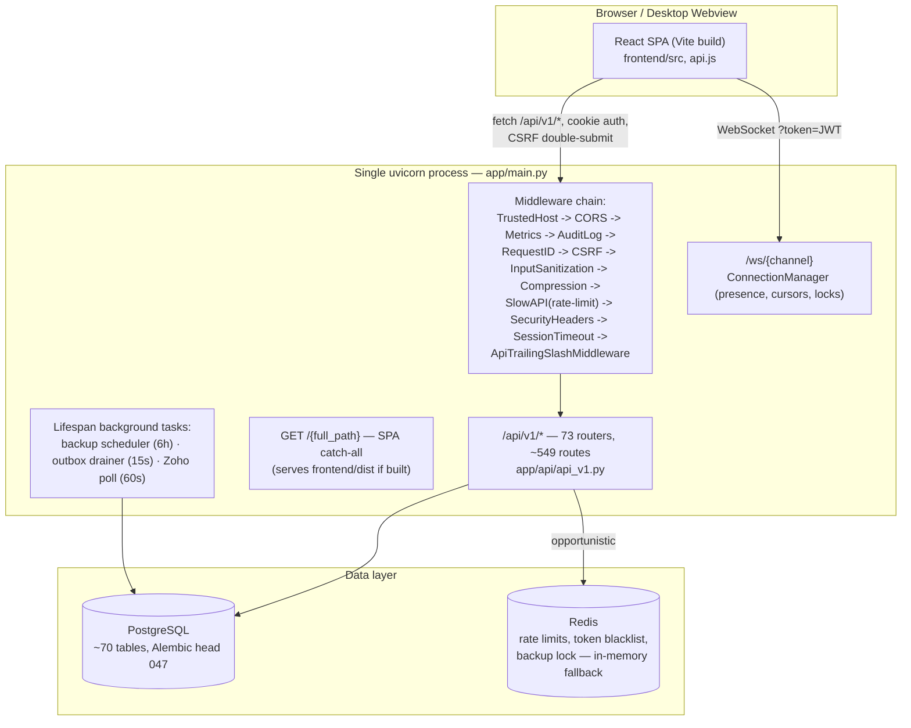
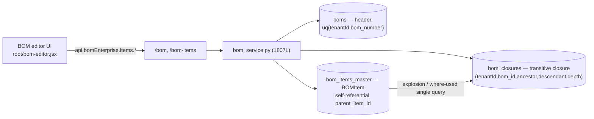
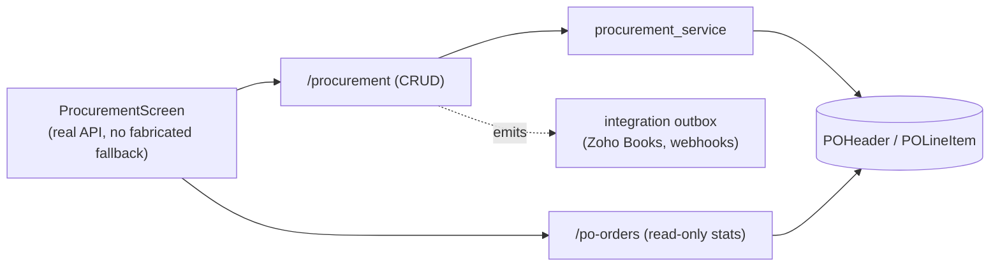
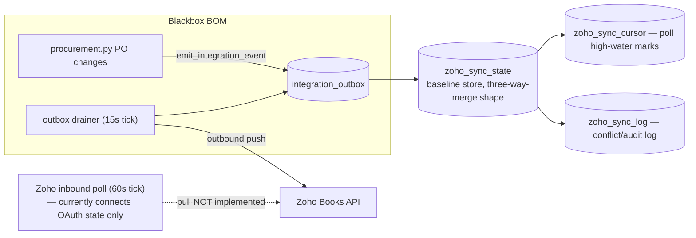
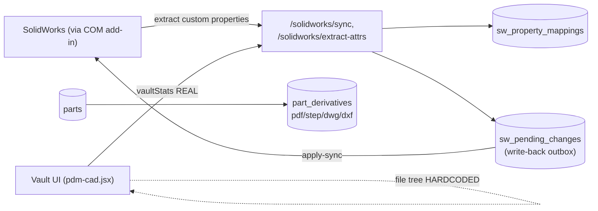

# Blackbox BOM — Project Features Documentation

> **Audience:** new engineers, product stakeholders, support staff, and auditors who need an honest, complete picture of what this product actually does today — feature by feature.
>
> **Scope:** the live project at `bom tool v1/bom-tool/` — a FastAPI backend (`backend/`), a Vite/React frontend (`frontend/`), a Windows desktop bundle (`desktop/`), and a Docker deployment path (root `docker-compose.yml`, `backend/docker-compose.prod.yml`).
>
> **Grounding:** every claim below is taken from a read-only, file-and-line-level audit of the codebase — backend core (`app/main.py`, `app/core/*`, `app/db/*`), the full API surface (73 endpoint routers, ~549 routes, 24 service modules), the database schema (≈70 SQLAlchemy models, 47 Alembic migrations), the frontend architecture and UI layer (screens, modals, legacy `root/*.jsx`), and the desktop/Docker/CI packaging. **Nothing in this document is aspirational.** Where a feature is a stub, a mock, or unreachable, that is stated plainly and marked with the status badges defined in [Section 1](#1-how-to-read-this-document). This document does not replace the deeper reference material already in the repo — `ARCHITECTURE.md`, `FEATURE_CATALOG.md`, `MODULE_REFERENCE.md`, `OPEN_ITEMS.md`, `DATA_HANDLING.md`, `DEPLOYMENT_GUIDE.md`, `DISASTER_RECOVERY_RUNBOOK.md`, and `desktop/DESKTOP_PACKAGING.md` / `desktop/DURABILITY.md` — it is a feature-by-feature companion to them, cross-referenced throughout.

---

## Table of contents

- [1. How to read this document](#1-how-to-read-this-document)
- [2. At-a-glance feature status matrix](#2-at-a-glance-feature-status-matrix)
- [3. System architecture overview](#3-system-architecture-overview)
- [4. Platform foundations: auth, RBAC, multi-tenancy, security](#4-platform-foundations-auth-rbac-multi-tenancy-security)
- [5. BOM editor and BOM management](#5-bom-editor-and-bom-management)
- [6. Parts / components master](#6-parts--components-master)
- [7. Vendors](#7-vendors)
- [8. Procurement / purchase orders](#8-procurement--purchase-orders)
- [9. Inventory](#9-inventory)
- [10. Catalogs](#10-catalogs)
- [11. Documents](#11-documents)
- [12. Compliance: 21 CFR Part 11, RoHS/REACH, compliance packs](#12-compliance-21-cfr-part-11-rohsreach-compliance-packs)
- [13. Zoho Books sync](#13-zoho-books-sync)
- [14. SolidWorks / CAD integration](#14-solidworks--cad-integration)
- [15. Dashboards and analytics](#15-dashboards-and-analytics)
- [16. Supplier portal](#16-supplier-portal)
- [17. ECO / ECN / ECR change management](#17-eco--ecn--ecr-change-management)
- [18. Authentication and SSO](#18-authentication-and-sso)
- [19. Additional backend capabilities](#19-additional-backend-capabilities)
  - [19.1 Quality management (CAPA, FAI, NCR, deviations, inspections)](#191-quality-management-capa-fai-ncr-deviations-inspections)
  - [19.2 Manufacturing (work orders, routings, work centers, labor)](#192-manufacturing-work-orders-routings-work-centers-labor)
  - [19.3 ERP connectors](#193-erp-connectors)
  - [19.4 Webhooks and third-party provider config](#194-webhooks-and-third-party-provider-config)
  - [19.5 OCR, web scraping, barcodes](#195-ocr-web-scraping-barcodes)
  - [19.6 Backup, restore, and disaster recovery](#196-backup-restore-and-disaster-recovery)
  - [19.7 Desktop packaging and deployment](#197-desktop-packaging-and-deployment)
- [20. Cross-cutting concerns](#20-cross-cutting-concerns)
- [21. Consolidated known-issues register](#21-consolidated-known-issues-register)
- [22. Consolidated future-improvements roadmap](#22-consolidated-future-improvements-roadmap)
- [23. File reference index](#23-file-reference-index)

---

## 1. How to read this document

Every feature is tagged with exactly one status badge, assigned from the audit evidence, not from what the UI claims:

| Badge | Meaning |
|---|---|
| 🟢 **REAL** | Fully wired end-to-end: a real UI action calls a real API endpoint, backed by a real service/DB write, with honest error states (no fabricated fallback data). |
| 🟡 **PARTIAL** | Some of the flow is real (e.g., reads from the API) but part of it is faked, hardcoded, silently falls back to demo fixtures, or a "save" action doesn't actually persist. |
| 🔴 **MOCK** | The screen/modal is disconnected from the backend: `setTimeout`-simulated fetches, `Math.random()`-generated data, or hardcoded arrays presented as if real, even though a real backend endpoint for the same data usually already exists. |
| ⚪ **STUB** | The backend endpoint exists and is reachable, but explicitly returns "not implemented" or performs a documented no-op (this is disclosed by the code itself, not a bug we're guessing at). |
| ⚫ **DEAD** | Fully implemented backend code (router + service) that is **never mounted** into the running application — it is unreachable over HTTP no matter what the frontend does. |

A single feature area can contain a mix of these — e.g., BOM editing is 🟢 REAL for structural edits but the "Diff" screen inside it is 🟡 PARTIAL. Each section below states the badge per capability, not just once for the whole area.

Per the required documentation shape, each feature section below covers, in order: **Purpose → Business value → User workflow → Internal workflow → Data flow → Validation → Error handling → Dependencies → Status → Future improvements.**

---

## 2. At-a-glance feature status matrix

| # | Feature area | Status | One-line reality check |
|---|---|---|---|
| 1 | BOM editor & management | 🟢 REAL (core) / 🟡 PARTIAL (diff, templates overlap) | Explosion, rollups, snapshots, compare, baselines, variants are real; the visual Diff screen fabricates its comparison data. |
| 2 | Parts / components master | 🟢 REAL / 🟡 PARTIAL | CRUD is real; the parts screen injects a few fabricated "library-only" demo rows alongside real ones. |
| 3 | Vendors | 🟢 REAL (backend) / 🟡 PARTIAL (UI toggle) | Vendor CRUD API is real; the "preferred/active" toggle in the UI only changes local state, never calls the API. |
| 4 | Procurement / POs | 🟢 REAL | Two overlapping but functioning API surfaces (`/procurement`, `/po-orders`); UI has no fabricated fallback. |
| 5 | Inventory | 🟢 REAL (backend) / 🔴 MOCK (one screen) | Backend inventory/warehouse/kanban APIs are real and complete; `prod-additions.jsx` `InventoryScreen` invents stock numbers from part-number character codes instead of calling them. |
| 6 | Catalogs | 🟢 REAL | CRUD, folder import, part attach/detach all call real endpoints with no fallback. |
| 7 | Documents | 🟢 REAL (backend) / 🟡 PARTIAL (UI fallback) | Upload/versioning/folders are real; the Documents screen silently falls back to static demo data on failure. |
| 8 | Compliance (Part 11, RoHS/REACH, packs) | 🟢 REAL (backend) / 🟡 PARTIAL (UI) | Full compliance data model and API exist; the compliance UI screen hardcodes every part's RoHS/REACH/conflict-minerals status to "valid" instead of calling the per-part status endpoint. |
| 9 | Zoho Books sync | 🟡 PARTIAL (by design) | OAuth connect + outbound push sync + status/mappings work; pull, reconcile, and conflict-resolution endpoints explicitly return "not implemented in this build." |
| 10 | SolidWorks / CAD | 🟢 REAL (backend) / 🔴 MOCK (PDM vault UI) | Bidirectional sync API (652 lines) is real; the PDM vault screen's file tree is hardcoded and only `vaultStats` is real. |
| 11 | Dashboards & analytics | 🟡 PARTIAL / 🔴 MOCK (one) | `/analytics` and `/dashboards` real endpoints back 2-3 KPIs; most trend charts are hardcoded. The main `DashboardScreen` (budget, uptime, activity) is fully fabricated. |
| 12 | Supplier portal | 🟢 REAL | Supplier login, RFQ respond/award, price-update approve/reject are real, separate-auth endpoints. |
| 13 | ECO / ECN / ECR | 🟢 REAL (backend) / 🟡 PARTIAL (UI) | Full ECO/ECN/ECR API with e-signature approve/implement is real; the ECR screen is localStorage-first with a fabricated seed list layered on top. |
| 14 | Auth / SSO / RBAC | 🟢 REAL | JWT (RS256) + refresh, MFA, Google/GitHub/Microsoft OAuth2, SAML, API keys, RBAC — all real and unusually hardened for this project stage. |
| 15 | Quality (CAPA/FAI/NCR) | 🟢 REAL (backend) / 🔴 MOCK (2 UI screens) | Full quality API/service exists; `qms-dashboard.jsx` and the `NCRScreen` in `power-features.jsx` both fabricate data instead of calling it. |
| 16 | Manufacturing (WO/routing) | 🟢 REAL | Work orders, routings, process plans, work centers, labor tracking all call real endpoints. |
| 17 | ERP connectors | 🟡 PARTIAL / ⚪ STUB (sync) | CRUD, logs, test-connection are real; `POST /{id}/sync` is an explicit no-op with no network call. |
| 18 | Webhooks | 🟢 REAL | Subscription CRUD, delivery log, retry, test — real, and it is the one integration screen that is *not* duplicated by a mock modal (though `WebhooksModal` in `power-features.jsx` is a separate, mocked duplicate). |
| 19 | OCR / scraping / barcodes | 🟢 REAL (backend + most UI) / 🔴 MOCK (1 modal) | Real Tesseract OCR and real `httpx` scraping exist and are wired; `InternetScrapeModal` fakes a scrape with `setTimeout` instead of calling `scrapingAPI`. |
| 20 | Backup / disaster recovery | 🟡 PARTIAL (high-severity gaps) | Backup pipeline is extensive and mostly real, but failure-alert emails can never send (code bug) and encrypted physical-backup restores are cryptographically broken. |
| 21 | Desktop packaging | 🟢 REAL (high-severity gap) | Full installer/updater/bundled-Postgres pipeline works, but the installed `backend.exe` never stamps Alembic, so future real migrations won't auto-apply on desktop installs. |
| 22 | Planning (PO-from-BOM) | ⚫ DEAD | Fully implemented (`planning.py` + `planning_service.py`, 195 lines) but never mounted in `api_v1.py` — unreachable via any HTTP call. |

---

## 3. System architecture overview

Blackbox BOM is a **local-first, single-process FastAPI monolith** with a React SPA, designed to run equally well as a one-click Windows desktop install or a Docker Compose stack — see `ARCHITECTURE.md`, `desktop/DESKTOP_PACKAGING.md`, and `DEPLOYMENT_GUIDE.md` for the full story. This section gives just enough context for the feature sections that follow to make sense.



Key architectural facts every feature section below depends on:

- **Auth model:** cookie-based JWT (RS256, auto-generated RSA-4096 key) or API key or Bearer token; see [Section 18](#18-authentication-and-sso) and `app/core/deps.py`.
- **Multi-tenancy:** every business table carries a `tenantId` column (`TenantAwareMixin`). Isolation is enforced in two layers — an ORM event-listener layer (primary, but see the **critical** bug in [Section 20](#20-cross-cutting-concerns)) and an opt-in Postgres Row-Level-Security layer (`ENABLE_RLS`, migration `040`).
- **Two API surfaces coexist for some resources** (documented per-feature below) because the codebase evolved two parallel implementations rather than refactoring the old one out — e.g., `/procurement` vs `/po-orders`, `/bom-templates` vs `/bom/templates`, `cad.py` vs `solidworks_integration.py`.
- **Frontend is mid-migration**: a legacy `window.*`-global monolith (`src/root/*.jsx`, ~1,094 remaining `window.*` references) coexists with newer ES-module screens (`src/components/screens`, `src/components/advanced`). Newer screens follow an honest "real data or a clear empty/error state" pattern; many legacy `root/*.jsx` screens are demo-era mocks. This split is the single biggest reason a given feature can be simultaneously "the backend is real" and "the screen you're looking at is fake" — always check both halves.
- **Desktop vs Docker are two different deployment models** sharing the same backend code — see [Section 19.7](#197-desktop-packaging-and-deployment).

---

## 4. Platform foundations: auth, RBAC, multi-tenancy, security

*(Foundational — every feature below depends on this layer. Full detail in [Section 18](#18-authentication-and-sso) for auth/SSO specifically; this section covers the surrounding security envelope.)*

**Purpose.** Every request into the system must be authenticated, authorized for the specific action, and scoped to the correct tenant, without the application developer having to remember to do all three by hand on every single endpoint.

**Business value.** This is what makes the product safe to sell to more than one customer on shared infrastructure (multi-tenant SaaS) while also being safe to run fully offline on one machine (local-first desktop). It is also what regulated customers (medical device, aerospace) will audit first.

**Internal workflow** (request pipeline, `app/main.py:326-357`):

```mermaid
sequenceDiagram
    participant C as Client
    participant TH as TrustedHost/CORS
    participant AU as AuditLog + RequestID
    participant CSRF as CSRFMiddleware
    participant RL as SlowAPI rate limit
    participant DEP as get_current_user (deps.py)
    participant RBAC as RoleChecker/PermissionChecker
    participant ORM as Tenant-filtered ORM

    C->>TH: HTTP request
    TH->>AU: allowed host + CORS ok
    AU->>CSRF: request-id stamped, mutating request logged
    CSRF->>RL: double-submit cookie verified (Bearer exempt)
    RL->>DEP: per-IP 60/min ok
    DEP->>DEP: API key OR cookie OR Bearer JWT verified,\nblacklist + revoked_before checked, per-user 300/min
    DEP->>RBAC: tenant contextvar seeded from JWT, re-pinned from User row
    RBAC->>ORM: role hierarchy + resource:action permission checked
    ORM->>ORM: before_insert stamps tenantId;\nbefore_flush blocks cross-tenant UPDATE/DELETE
    ORM-->>C: response (generic error detail + request_id on 500)
```

**Validation & error handling.** Pydantic models validate request bodies; `RequestValidationError`, `HTTPException`, `RateLimitExceeded`, and a catch-all 500 handler all return a generic `detail` plus a `request_id` for correlation, while the full traceback is logged server-side and sent to Sentry (`app/main.py:228-277`). Mutating requests are audit-logged to `audit_logs` with retry-on-failure, drained at shutdown (`app/core/audit_middleware.py`).

**Dependencies.** PostgreSQL (or SQLite for tests), optional Redis (rate limiting/blacklist fall back to in-memory if Redis is unavailable), `app/core/security.py` for the RSA keypair.

**Status: 🟢 REAL**, and unusually well-hardened for the project's stage — entropy-validated secrets with production hard-fails, RS256 JWTs with server-side revocation, layered rate limits, two-layer tenant isolation, TLS-gated security headers tuned for the local-first HTTP desktop bundle.

**Known issues** (see [Section 20](#20-cross-cutting-concerns) and [21](#21-consolidated-known-issues-register) for full detail and severities):
- **Critical:** the automatic per-request tenant SELECT filter (`app/core/tenant_events.py`) is dead code on this SQLAlchemy version — `ORMExecuteState.mapper_` does not exist in SQLAlchemy 2.0.48, so the filter silently no-ops on every ORM read. Verified at runtime against the project's own virtualenv. Read isolation today rests entirely on explicit per-service filters plus the opt-in RLS layer.
- Non-ORM (`text()`) SELECTs are only *logged* as a warning, never blocked, by the same module.
- `SessionTimeoutMiddleware` doesn't implement any inactivity timeout despite its name (`session_timeout.py`) — it just redundantly re-checks the JWT `exp` claim.
- WebSocket rate limiting has three separate weaknesses (in-memory reset-by-cycling-IPs, proxy-IP collision, 1-second bucket resolution) — see `app/main.py` notes in the findings.

**Future improvements.**
1. Fix `tenant_events.py` to use `execute_state.bind_mapper` — this is a one-line change that restores real automatic read isolation.
2. Make non-ORM raw SQL SELECTs fail closed (raise) rather than warn-and-continue when they touch a tenant table without `tenant_sql_clause()`.
3. Either implement real inactivity timeout in `SessionTimeoutMiddleware` or rename/remove it so the name isn't misleading.
4. Route WebSocket rate limiting through `get_client_ip()` consistently with the HTTP path.

---

## 5. BOM editor and BOM management

**Purpose.** Let engineers build, structure, and maintain a multi-level Bill of Materials for a product: add/remove/reorder parts, nest sub-assemblies, attach images and custom attributes, and track how the BOM changes over time.

**Business value.** The BOM is the core artifact of the entire product — procurement, cost rollups, compliance, manufacturing, and quality all key off it. Getting explosion, cost rollup, and revision history right is the product's reason to exist.

**User workflow.**
1. User opens a project's BOM in the BOM editor screen (backed by `root/bom-editor.jsx`).
2. Adds a part as a new line, optionally nested under a parent line to build assembly structure, sets `find_number` and quantity.
3. Reorders lines via drag-and-drop, attaches an image or custom attributes to a line.
4. Views roll-up totals (quantity, cost, mass) computed for the whole tree.
5. Takes a **snapshot** at a milestone, later **compares** two snapshots/revisions, or promotes one to a **baseline**.
6. Optionally creates **variants** (e.g., a configuration option) and exports/imports the BOM (XLSX/CSV/PDF).

**Internal workflow.** The thin router `app/api/endpoints/bom_enterprise.py` (342 lines, mounted at `/bom`, router-level `require_viewer` auth) delegates essentially everything to `app/services/bom_service.py` (1,807 lines) — CRUD, explosion, quantity/cost/mass rollups, snapshots, compare, baselines, variants, export/import, templates. A parallel, smaller CRUD router `app/api/endpoints/bom_items.py` (163 lines, `/bom-items`) handles individual line CRUD + bulk operations + reorder.

**Data flow / data model.**

Structural edits made in the editor call `api.bomEnterprise.items.update/reorder/delete` and `api.parts.update`, targeting real `bom_items_master` rows — this is a REAL write path, not a demo overlay. Explosion and where-used queries use the `bom_closures` transitive-closure table (added in migration `039`) specifically so multi-level traversal is a single query rather than a recursive one.

**Validation.** Line quantities are `Numeric(10,4)`; the header/BOM number is unique per tenant. `exclude_from_bom` flags let a line be tracked without contributing to rollups.

**Error handling.** Router-level `require_viewer` auth guard rejects unauthorized access before any service code runs; service-layer errors surface as standard HTTPException JSON.

**Dependencies.** Parts master ([Section 6](#6-parts--components-master)) for line items, Documents ([Section 11](#11-documents)) for line images, Revisions/ECO ([Section 17](#17-eco--ecn--ecr-change-management)) for change tracking, real-time collaboration ([Section 19](#19-additional-backend-capabilities) → WebSockets) for concurrent-edit presence/locks.

**Status by sub-capability:**

| Sub-capability | Status | Notes |
|---|---|---|
| CRUD, explosion, rollups, where-used, snapshots, baselines, variants, export/import | 🟢 REAL | Backed by `bom_service.py`; `POST /bom/compare` is live and correctly wired (an older "missing" gap report about this endpoint is stale — verified present at `bom_enterprise.py:324`, matching frontend `api.js:907`). |
| Structural edits from the editor UI | 🟢 REAL | Calls `api.bomEnterprise.items.update/reorder/delete`, `api.parts.update`, `api.documents.upload` against real backend rows. |
| **Diff screen** (visual compare UI) | 🟡 PARTIAL | Calls `api.bomEnterprise.compare` but with **hardcoded** `bomId`s (1, 2); the displayed "v3.1.0 vs v3.0.0" diff content is fully fabricated; "Export diff" is a fake toast that does nothing. Should instead source real BOM IDs and use `revisionsAPI`. |
| BOM templates | 🟡 PARTIAL (duplicate systems) | Two separate template systems exist: `/bom-templates` (`bom_templates.py` CRUD+load) and `/bom/templates` (+`/apply`) inside `bom_enterprise.py` — functionally overlapping, not unified. |
| `bomId` threading in the app shell | 🟡 PARTIAL | `AppCtx.jsx` falls back to a **hardcoded `bomId = 1`** whenever the current project object lacks a real id (`project?.id || project?.bomId || data?.project?.id || 1`) — the code's own comment admits "no real bom_id is threaded through yet." Once multiple real BOMs exist, this risks structural edits landing on the wrong BOM. |
| BOM-tree rendering after real API hydration | 🟡 PARTIAL (crash risk) | `convertApiPartsToTree` (`utils/bom.js:25`) returns a **flat** array with no `.children`. At least 6 legacy screens/modals assume the old demo shape `rows[0].children` (`AnalyticsScreen.jsx` lines 1022/1220/1293/1488/1546/1629, `CostSimulatorModal.jsx:14`, `VendorDetailModal.jsx:13`, `overlays.jsx:2189`, `detail-drawer.jsx:26`) and will throw a `TypeError` on render **once the app is genuinely connected to a real, populated backend** — i.e., this bug fires exactly when the feature is working as intended, not when it's broken. |

**Future improvements.**
1. Fix the flat-vs-tree mismatch once, in a shared `utils/bom.js` helper, and have every consuming screen use it — this is the single highest-leverage frontend fix in the whole codebase because it currently punishes real backend usage.
2. Thread a real `bom_id` through the app shell instead of the `|| 1` fallback.
3. Rebuild the Diff screen against `revisionsAPI`/`bom.compare` with real BOM IDs instead of hardcoded ones, and make "Export diff" actually export.
4. Consolidate the two BOM-template systems into one.

---

## 6. Parts / components master

**Purpose.** Maintain the tenant's single source of truth for every part/component: part number, description, cost, vendor, category, RoHS/REACH identity fields, tags, and compliance links.

**Business value.** Every other module (BOM, procurement, inventory, compliance, quality) references parts by this master record — data quality here directly drives data quality everywhere else.

**User workflow.** Search/browse parts, view/edit a part's detail (cost, primary vendor, category, RoHS `is_article`/`eee_category`/`part_kind` fields), bulk-delete, check for duplicate part numbers before creating a new one, attach documents/images, view where a part is used across BOMs.

**Internal workflow.** `app/api/endpoints/parts.py` (120 lines, `/parts`) delegates to `part_service`, offering CRUD, bulk-delete, and `check-duplicates`. Parts carry a tenant-scoped unique key on both part number and barcode (`uq(tenantId,pn)`, `uq(tenantId,barcode)`), `Numeric(18,4)` money fields, and status/category `CHECK` constraints. `primary_vendor_id` is a foreign key to `vendors.id`.

**Data flow.** UI (`root/parts-screen.jsx`, `components/screens`) → `api.parts.*` → `/parts` router → `part_service` → `parts` table (+ M2M `part_tags`, `part_compliance`).

**Validation.** DB-level uniqueness on part number and barcode per tenant; status/category enforced by CHECK constraints; money fields standardized to `Numeric(18,4)` (migration `033`).

**Error handling.** Standard REST error responses; `check-duplicates` endpoint exists specifically so the UI can warn before a conflicting insert instead of relying on the DB error.

**Dependencies.** Vendors ([Section 7](#7-vendors)) for `primary_vendor_id`, Catalogs ([Section 10](#10-catalogs)) for catalog membership, Documents for attachments, Compliance ([Section 12](#12-compliance-21-cfr-part-11-rohsreach-compliance-packs)) for RoHS/REACH identity fields.

**Status: 🟢 REAL** for the API and CRUD screen flow.

**Known issue (🟡 PARTIAL):** `parts-screen.jsx` injects a small number of fabricated "library-only" parts into the catalog view alongside real ones, with a comment literally saying this is done "for realism" (`parts-screen.jsx:45`) — this is cosmetic filler mixed into otherwise-real data, which can mislead a user auditing what parts actually exist.

**Known DB-level issue (high severity, from schema audit):** `parts.primary_vendor_id` is `ForeignKey('vendors.id', ondelete='CASCADE')` — **deleting a vendor hard-deletes every part that references it as primary vendor.** This should be `SET NULL`. The same overly-aggressive `CASCADE` pattern recurs elsewhere (`boms.created_by`, `bom_templates.createdById`, `inventory_transactions.performed_by` all cascade-delete on user removal, destroying historical/audit data).

**Future improvements.**
1. Remove the fabricated "library-only" demo rows from the real parts catalog view, or clearly badge them as non-inventory reference items.
2. Change `primary_vendor_id` and the other audit/ownership foreign keys from `CASCADE` to `SET NULL` so deleting a vendor or user doesn't silently delete parts, BOMs, templates, or inventory history.

---

## 7. Vendors

**Purpose.** Maintain the tenant's supplier master: name, contact info, and a preferred/active status used for sourcing decisions; feed into supplier scorecards and part-vendor linkage.

**Business value.** Sourcing and procurement teams need one clean vendor list rather than free-text vendor names scattered across parts and POs.

**User workflow.** View/search vendors, create/edit a vendor, bulk-delete, mark a vendor preferred or active/inactive, review a vendor's scorecard.

**Internal workflow.** `app/api/endpoints/vendors.py` (164 lines, `/vendors`): CRUD + bulk-delete, backed by a `vendors` table with `uq(tenantId, name)`. `part_vendors.py` (227 lines, `/part-vendors`) manages the many-to-many part↔vendor link (e.g., alternate suppliers per part). `supplier_scorecard.py` (128 lines) is a separate CRUD for scorecards.

**Data flow.** `VendorsScreen` reads `ctx.vendors`, which is API-hydrated when connected or seeded from the demo fixture otherwise (see [Section 3](#3-system-architecture-overview) on the hybrid architecture).

**Status:**

| Sub-capability | Status |
|---|---|
| Vendor CRUD API, part-vendor linkage, scorecards | 🟢 REAL |
| "Preferred" / "Active" toggle in `VendorsScreen` | 🟡 PARTIAL — **mutates local state only; never calls `vendorsAPI.update`.** A user flipping this toggle believes they've changed the vendor record; nothing is persisted server-side. |

**Validation.** Vendor name unique per tenant.

**Error handling.** Standard REST errors; no special handling noted.

**Dependencies.** Parts (primary vendor FK), Procurement/POs, Supplier Portal ([Section 16](#16-supplier-portal)).

**Future improvements.**
1. Wire the preferred/active toggle to `vendorsAPI.update` so the UI action matches its visible effect.
2. Given the `parts.primary_vendor_id` CASCADE issue noted in [Section 6](#6-parts--components-master), add a confirmation step before vendor deletion that shows how many parts/BOMs would be affected.

---

## 8. Procurement / purchase orders

**Purpose.** Create and manage purchase orders against vendors, track PO line items, alerts (e.g., overdue), and cost history.

**Business value.** Purchasing is where BOM data turns into real spend — accurate PO tracking is core to cost control and supplier accountability.

**User workflow.** Create a PO for a vendor with line items, monitor PO status and alerts, review price history and landed cost, advance a PO through its lifecycle stages, review order-tracking/shipment updates.

**Internal workflow.** Two API surfaces exist over the **same underlying models** (`POHeader`/`POLineItem` in `app/models/po_models.py`):
- `app/api/endpoints/procurement.py` (149 lines, `/procurement`): PO CRUD + alerts + advance, via `procurement_service`, and emits integration events (`app.integrations.events.emit_integration_event`) on changes — this is the hook Zoho Books outbound sync and webhooks key off.
- `app/api/endpoints/po_order.py` (166 lines, `/po-orders`): a read-only list/stats/get surface over the same tables using raw `SELECT`s.

`order_tracking.py` (411 lines, `/order-tracking`) is a separate, richer CRUD + stats + shipment-stage-advance feature layered on top. `price_history.py` (101 lines) tracks price history + landed cost per part/vendor. `contract.py` (192 lines) manages vendor contracts and pricing agreements. `kanban.py` (157 lines) implements reorder triggers and low-stock alerts, tied to inventory.

**Data flow.**


**Validation.** Standard field validation via Pydantic request models (inline, not `app.schemas`, per the router's convention).

**Error handling.** `ProcurementScreen` has a documented 10-second timeout race on its API calls and does **not** fall back to fabricated data on failure (a "reference implementation" pattern per the audit).

**Dependencies.** Vendors, Parts (for line items), Inventory (kanban triggers), Zoho Books / Webhooks (event emission on PO changes).

**Status: 🟢 REAL**, with a structural duplication issue rather than a functionality gap: `/procurement` and `/po-orders` are two API surfaces for one resource, which is confusing for integrators and a maintenance burden, but neither is fake.

**Future improvements.**
1. Consolidate `/po-orders` (read-only) into `/procurement` as query/list endpoints, deprecating the separate router.
2. Document clearly which surface external integrators (Zoho, ERP connectors, webhooks) should target.

---

## 9. Inventory

**Purpose.** Track physical stock across warehouses and bin locations: on-hand quantity, transactions (receipts/issues/transfers/adjustments), reservations, and valuation.

**Business value.** Connects the paper BOM/procurement world to what's actually on the shelf — needed for accurate available-to-promise, reorder triggers, and cost-of-goods reporting.

**User workflow.** View stock by warehouse/bin, adjust or transfer stock, reserve stock against an order, review transaction history, run a valuation report, respond to low-stock kanban alerts.

**Internal workflow.** `app/api/endpoints/inventory_api.py` (293 lines, `/inventory`, router-level `require_viewer`): warehouses, bins, stock, `adjust`/`transfer`/`reserve`, transactions, valuation reports, via `inventory_service.py` (358 lines). `kanban.py` layers reorder-trigger CRUD and low-stock alerts on top, including a stock-update endpoint.

**Data model.** `warehouses`, `bin_locations` (`uq(warehouse_id, bin_code)`), `inventory` (`uq(part, warehouse, bin, lot)` + status CHECK), `inventory_transactions`, `inventory_reservations` — the latter two use a Python event-listener to validate `reference_type` values.

**Data flow.** UI → `api.inventory.*` → `/inventory` → `inventory_service` → `inventory`/`inventory_transactions`/`inventory_reservations` tables.

**Validation.** DB CHECK constraint on transaction `reference_type` restricts to `po, work_order, transfer, adjustment, sales_order, return`.

**Error handling.** Standard REST errors — but see the schema-level mismatch noted below, which surfaces as an unexpected 500/IntegrityError rather than a clean validation error.

**Dependencies.** Parts, Procurement (PO receipts feed inventory), Kanban/reorder alerts, Analytics (valuation reporting).

**Status:**

| Sub-capability | Status |
|---|---|
| Warehouses/bins/stock/adjust/transfer/reserve/transactions/valuation API | 🟢 REAL |
| Kanban low-stock alerts and reorder triggers | 🟢 REAL |
| `InventoryScreen` in `frontend/src/root/prod-additions.jsx` | 🔴 **MOCK** — stock levels, reorder points, and bin assignments are **synthesized from character codes of the part number** rather than calling `api.inventory.list` / `kanban.lowStockAlerts`. This screen looks plausible but shows numbers that have no relationship to real inventory. |

**Known schema bug (medium severity):** the Python `ALLOWED_REFERENCE_TYPES` set in `app/models/inventory.py` (`{po, work_order, transfer, adjustment, receipt, issue, return}`) does **not match** the database `CHECK` constraint (`'po','work_order','transfer','adjustment','sales_order','return'`). `'receipt'`/`'issue'` pass the Python validator but violate the DB constraint on Postgres (an `IntegrityError` at flush); `'sales_order'` is DB-legal but Python-rejected. `InventoryReservation` additionally allows `'sales_order'`/`'forecast'` with **no DB CHECK at all**.

**Known schema bug (medium severity):** `uq_inventory_part_location_lot` (part, warehouse, bin, lot) — `bin_location_id` and `lot_number` are nullable, and under Postgres's default NULLS-DISTINCT semantics this allows unlimited duplicate rows for the same part/warehouse when bin/lot are both NULL, which is the most common (un-binned, un-lotted) case. The Zoho sync tables solve the identical problem correctly with a partial unique index; inventory does not.

**Future improvements.**
1. Rewrite `InventoryScreen` (`prod-additions.jsx`) to call the real inventory/kanban APIs — the backend for this already exists in full.
2. Reconcile the Python `ALLOWED_REFERENCE_TYPES` set with the DB CHECK constraint (pick one canonical list) and add the missing CHECK on `InventoryReservation`.
3. Add a partial unique index for the common NULL-bin/NULL-lot case, mirroring the pattern already used in `zoho_sync.py`.

---

## 10. Catalogs

**Purpose.** Group parts into named catalogs (e.g., an approved-vendor list, a product-family library), including bulk import from a folder.

**Business value.** Lets engineering/procurement curate reusable, approved subsets of the parts master rather than working against the entire (potentially huge) parts table.

**User workflow.** Create a catalog, import parts from a folder, add/remove parts from a catalog, deactivate a catalog, browse catalog contents.

**Internal workflow.** `app/api/endpoints/catalogs.py` (188 lines, `/catalogs`, RBAC `parts_read`/`parts_write`) delegates to `catalog_service.py` (418 lines): CRUD, `from-folder` import, deactivate, and parts add/list/remove. Data model: `catalogs` and `part_catalogs` M2M, both tenant-scoped (migration `045`), with `uq(tenantId, catalog_code)` and `uq(tenantId, part_id, catalog_id)`.

**Data flow.** UI (`CatalogsScreen`, one of the audit's cited "reference implementation" screens) → `api.catalogs.*` → `catalog_service` → `catalogs`/`part_catalogs` tables.

**Validation.** Catalog code unique per tenant; part-catalog pairing unique per tenant.

**Error handling.** `CatalogsScreen` is explicitly called out as following the honest-failure pattern: loading spinner, real error empty-state, **no fabricated fallback data**.

**Dependencies.** Parts master.

**Status: 🟢 REAL** across API and UI — no known issues flagged in the audit for this feature.

**Future improvements.** None flagged specifically; general recommendation to keep this screen as the template other legacy screens are rewritten toward (see [Section 20](#20-cross-cutting-concerns)).

---

## 11. Documents

**Purpose.** Store and version files (drawings, datasheets, certificates, images) organized into folders, and attach them to BOM lines, parts, or other records.

**Business value.** Centralizes controlled documentation instead of leaving it in email attachments or local drives — a prerequisite for any regulated-industry customer.

**User workflow.** Create folders, upload a file (hashed on upload), view/download versions, browse/attach documents to a BOM line or part.

**Internal workflow.** `app/api/endpoints/documents.py` (210 lines, `/documents`): folders, upload (SHA-hash, stored under the env-configured `UPLOAD_DIR`), versions, CRUD.

**Data flow.** UI (`DocumentsScreen`) → `api.documents.*` → `/documents` → filesystem (`UPLOAD_DIR`) + `documents` table (BOM line images reference this table via `bom_items_master.image_document_id`, `ON DELETE SET NULL`).

**Validation.** File hashing on upload for integrity/versioning.

**Error handling.** `DocumentsScreen` calls the real list/folders endpoints but **silently falls back to static demo data** (`data.docs`) if the call fails — meaning a genuine backend outage looks to the user like "the app has some documents," not "something is wrong."

**Dependencies.** BOM editor (line images), Parts, uploads bypass CSRF/refresh handling (see below).

**Status: 🟡 PARTIAL** — real backend, real UI wiring, but with a silent-fallback failure mode that masks outages, plus a cross-cutting frontend issue: `documentsAPI.upload` uses a raw `fetch()` call that has **no CSRF header, no 401 silent-refresh retry, and no circuit breaker** (the same gap affects `ocrAPI.upload`, `bulkImportAPI.upload`, and `catalogsAPI.importUpload`). If the backend enforces CSRF on multipart POSTs, uploads fail outright; with an expired access token, uploads hard-fail instead of transparently refreshing.

**Future improvements.**
1. Replace the silent fallback-to-demo-data with an honest error state, consistent with `CatalogsScreen`/`AuditTrailScreen`.
2. Route all four upload call sites through a CSRF-aware, refresh-aware fetch helper shared with `apiRequest()`.

---

## 12. Compliance: 21 CFR Part 11, RoHS/REACH, compliance packs

**Purpose.** Support regulated-industry requirements: tamper-evident electronic signatures (Part 11), substance/material compliance declarations against RoHS/REACH reference data, and generic "compliance pack" checklists (e.g., ISO 9001, AS9100).

**Business value.** This is the feature set that lets the product be sold into medical device, aerospace, and other regulated manufacturing — it is a differentiator versus a plain BOM/PLM tool.

**User workflow.**
- **Part 11 e-signatures:** view a read-only, write-once log of electronic signatures tied to approval actions (e.g., ECO approval — see [Section 17](#17-eco--ecn--ecr-change-management)).
- **RoHS/REACH:** declare a part's material composition, review substance declarations, check a part's or BOM's overall compliance status against restricted-substance thresholds.
- **Compliance packs:** attach a standard's checklist (e.g., AS9100) to parts, certify a part, view a compliance dashboard.

**Internal workflow.**
- `esignature_api.py` (48 lines, `/esignatures`): read-only listing; signatures are write-once by design (no update/delete endpoints exist — this is intentional, not an oversight).
- `compliance_api.py` (473 lines, `/compliance`): compliance records CRUD (careful `{compliance_id:int}` path converter specifically to avoid shadowing the `/packs` route), packs, part certification, dashboard.
- `substance_compliance_api.py` (125 lines, `/substance-compliance`): substances CRUD, part composition, part/BOM compliance evaluation — thin wrapper over `substance_compliance_service.py` (754 lines, the largest service in this domain).

**Data model** (from the schema audit): global, system-owned reference data — `substances`, `substance_groups`, `regulation_versions`, `restricted_substance_entries`, `rohs_exemptions` (migration `042`, **no `tenantId`** — shared across all tenants because it's regulatory reference data, not customer data) — versus tenant-owned `part_materials`/`part_material_substances`/`substance_declarations`/`exemption_claims` (migration `043`) and cached `compliance_evaluations`/`reach_obligations` (migration `044`). Separately, `compliance_packs`/`compliance_pack_items`/`part_certifications` (migration `041_compliance_pack_tables`) are **deliberately not tenant-scoped either**, mirroring an external live database's DDL — but `part_certifications.part_id` foreign-keys into tenant-scoped `parts`, and these tables get **no RLS policy** (RLS only auto-attaches to tables with a `tenantId` column) and **no automatic ORM filter**. `compliance_api.py` accesses them via raw SQL, so any endpoint that forgets a manual tenant filter can leak certification data across tenants.

**Validation.** Substance/regulation reference data is versioned (`regulation_versions`) so evaluations can be re-run against a specific regulatory snapshot.

**Error handling.** Standard REST errors on the backend.

**Dependencies.** Parts (composition/certification target), ECO ([Section 17](#17-eco--ecn--ecr-change-management)) for e-signature-backed approvals, BOM (for BOM-level compliance rollup).

**Status:**

| Sub-capability | Status |
|---|---|
| Part 11 e-signature listing (backend) | 🟢 REAL — read-only, write-once by design. |
| Compliance records/packs/certification/dashboard API | 🟢 REAL |
| RoHS/REACH substance compliance API | 🟢 REAL |
| **Compliance UI screen** (`components/advanced/ComplianceScreen.jsx`) | 🟡 **PARTIAL** — it does fetch the real compliance dashboard/packs/parts endpoints, but then **hardcodes every part's `rohs`/`reach`/`conflict` field to `'valid'`** instead of calling the per-part status endpoint, and falls back to 3 fabricated certificate rows on failure. A user could see "compliant" on a part that is not, in fact, evaluated. |

**Known tenant-isolation gap (medium severity, schema audit):** as described above, `compliance_packs`/`part_certifications` are global tables holding per-part certification data with no RLS backstop — this is the main residual cross-tenant exposure surface identified in the schema audit.

**Future improvements.**
1. **High priority:** fix `ComplianceScreen.jsx` to call the real per-part compliance-status endpoint instead of hardcoding `'valid'` — this is a regulated-feature correctness issue, not cosmetic.
2. Add an explicit tenant-scoping join or view for `part_certifications` reads so raw-SQL endpoints can't accidentally cross tenants, since RLS can't cover this table automatically.
3. Remove the fabricated 3-row certificate fallback in the UI in favor of an honest empty/error state.

---

## 13. Zoho Books sync

**Purpose.** Two-way accounting sync with Zoho Books for parts/items, vendors/contacts, purchase orders, and cost, so procurement/finance data doesn't have to be re-entered in both systems.

**Business value.** Removes duplicate data entry between the BOM/procurement system and the accounting system of record, and is being built as a standalone effort on its own branch (see project memory: `feat/zoho-books`, developed in parallel with the regulated-industry track).

**User workflow (what actually works today).** Connect a Zoho organization via OAuth, select the org, view sync status and field mappings, trigger an outbound push of parts/vendors/POs/costs from Blackbox BOM → Zoho Books.

**What does NOT work yet (by explicit design, not a bug):** pulling data *from* Zoho Books into Blackbox BOM, reconciliation, and conflict resolution. The router's own docstring (`zoho_books.py:11`) states these return "not implemented in this build."

**Internal workflow.** `app/api/endpoints/zoho_books.py` (395 lines, `/integrations/zoho_books`): OAuth flow, org selection, outbound push sync, status/mappings — all implemented. Backed at the lifespan level by a **60-second poll background task** (`app/main.py` lifespan) and an **integration outbox drainer** (15-second tick) that also serves webhooks — POs and other changes emit events via `app.integrations.events.emit_integration_event`, which land in `integration_outbox` and get drained/delivered.

**Data flow.**


**Data model.** `zoho_sync_state` (baseline store with `uq(tenantId, entity_type, entity_id)` plus a **partial unique index** on `external_id WHERE NOT NULL` — correctly handles "not yet synced" rows, unlike the inventory table's equivalent problem noted in [Section 9](#9-inventory)), `zoho_sync_cursor` (poll cursors), `zoho_sync_log` (conflict/audit log). These reuse the generic `integration_connections`/`integration_external_links`/`integration_outbox` tables shared with other integrations (ERP connectors, webhooks).

**Validation.** The sync-state table's schema is explicitly shaped for a three-way merge (local baseline vs local current vs remote current) even though the merge/reconcile logic that would use it (pull + conflict resolution) isn't implemented yet — the groundwork is real, the consuming logic is not.

**Error handling.** Standard REST errors on the implemented endpoints; the unimplemented endpoints return an explicit, documented "not implemented" response rather than silently failing or pretending to succeed.

**Dependencies.** Procurement/POs (source of outbound events), the generic Integrations framework (`integrations.py`, shared with ERP connectors and webhooks), Redis/DB for the outbox.

**Status: 🟡 PARTIAL by design** — OAuth connect, outbound push, status/mappings: 🟢 REAL. Pull/reconcile/conflict-resolve: ⚪ **STUB** (explicitly documented as not implemented, this build). See also `Zoho Books integration` in project memory for the broader parallel-branch plan.

**Future improvements.**
1. Implement the inbound pull path using the already-provisioned `zoho_sync_cursor` high-water-mark table.
2. Implement three-way-merge conflict detection/resolution using `zoho_sync_state`'s baseline-store shape (the schema was clearly designed for this already).
3. Surface `zoho_sync_log` conflicts in the `ZohoBooksScreen` UI (which is otherwise a REAL, correctly-wired screen) so users can see and act on sync issues, not just successful pushes.

---

## 14. SolidWorks / CAD integration

**Purpose.** Keep part/BOM data in sync with SolidWorks CAD models: extract custom properties from CAD files into part attributes, push BOM structure changes back to CAD, manage a PDM-style vault of CAD files and derivatives (PDF/STEP/DWG/DXF), and license the SolidWorks add-in.

**Business value.** Engineering teams live in CAD; forcing a second, manual data-entry pass into the BOM tool is a major adoption blocker. Bidirectional, low-friction sync is a core differentiator for a mechanical-hardware-focused BOM tool.

**User workflow.** From the SolidWorks add-in (`solidworks-plugin/`, a C# .NET Framework 4.8 COM add-in) or the web UI: sync CAD properties into part attributes, push BOM structure to CAD, view sync status/pending changes, browse a "vault" tree of CAD files with derivative artifacts, activate a plugin license.

**Internal workflow.** `app/api/endpoints/solidworks_integration.py` (652 lines, `/solidworks`, router-level `require_viewer`) is the largest single endpoint file in the backend: bidirectional sync, BOM structure exchange, image handling, change notifications/tracking, vault stats/tree, `extract-attrs`, license verify/activate. A **second, smaller router** `app/api/endpoints/cad.py` (211 lines, `/cad`) re-implements `sync`/`apply-sync`/`extract-attrs`/`vault/stats`/`vault/tree` with **self-contained ORM logic that does not share a service module** with `solidworks_integration.py` — i.e., the same-named CAD features exist twice, independently.

**Data model.** `sw_property_mappings` (`uq(tenantId, sw_property)`) maps SolidWorks custom properties to part fields; `sw_pending_changes` is a write-back outbox for changes queued to push into CAD (`part_id` `ON DELETE SET NULL`); `part_derivatives` (migration `047`) stores typed derivative files per part (`kind` CHECK: `pdf|step|dwg|dxf|other`, `uq(tenantId, part_id, kind)`).

**Data flow.**


**Validation.** `part_derivatives` kind is DB-constrained to the 5 known file types; property mappings are unique per tenant.

**Error handling.** Standard REST errors; the SolidWorks plugin build itself is only a "best-effort compile guard" in CI (`.github/workflows/solidworks-plugin.yml`), not a full test suite.

**Dependencies.** Parts master (target of extracted attributes), Documents (derivative storage), a working SolidWorks + COM add-in install on the engineering desktop (out of scope of this web/backend audit).

**Status:**

| Sub-capability | Status |
|---|---|
| `/solidworks` bidirectional sync, BOM structure, notifications, vault stats, extract-attrs, license verify/activate | 🟢 REAL |
| `/cad` (`cad.py`) sync/apply-sync/extract-attrs/vault | 🟡 PARTIAL / duplicate — functionally real but **duplicates** `/solidworks` logic independently, risking the two surfaces drifting out of sync with each other over time. |
| `solidworks_contract.py` (property-mappings + generate-part-number) | ⚫ **DEAD** — fully implemented (87 lines + a 206-line service) but **never mounted** in `api_v1.py`; unreachable over HTTP. |
| **PDM vault UI** (`root/pdm-cad.jsx`) | 🔴 **MOCK-heavy** — only `cadAPI.vaultStats` is real; the entire `FILES_BY_PATH` vault file tree is **hardcoded**, the current user is hardcoded to `'E. Chen'`, and the code contains its own admission: `// Try API first, fall back to mock` (line 1545). |
| Derivative links CRUD (`derivatives.py`) | ⚫ **DEAD** — implemented but never mounted. |

**Future improvements.**
1. Pick one CAD sync implementation (`solidworks_integration.py` is the larger, more complete one) and delete or fully deprecate the other (`cad.py`) rather than maintaining two.
2. Mount `solidworks_contract.py` and `derivatives.py` in `api_v1.py` (a small, low-risk change) if their features are wanted, or formally retire the dead code if not.
3. Rebuild the PDM vault UI's file tree against the real vault-tree endpoint that already exists in `solidworks_integration.py` — the backend capability is there; only the UI needs rewiring.

---

## 15. Dashboards and analytics

**Purpose.** Give managers and executives roll-up visibility: KPIs, trends, category breakdowns, vendor scorecards, and role-specific dashboards (e.g., procurement dashboard vs engineering dashboard).

**Business value.** Turns operational data (parts, POs, BOM costs) into decisions — the difference between a data-entry tool and a management tool.

**User workflow.** Open a role-based dashboard, review trend charts, category/vendor breakdowns, drill into a specific KPI.

**Internal workflow.** `analytics.py` (173 lines, `/analytics`): dashboard/trends/categories/vendor-scorecard SQL aggregates — genuinely implemented as real aggregate queries. `dashboards_api.py` (30 lines, `/dashboards`): 4 role dashboards, a thin delegate to `dashboard_service.py` (219 lines).

**Data flow.** UI → `analyticsAPI.dashboard()` / `.categories()` → real SQL aggregation → response used for 2-3 KPI tiles. **Everything else on the analytics screens is hardcoded** rather than calling `analyticsAPI.trends(range)`, which exists and is unused by the frontend.

**Status by screen:**

| Sub-capability | Status |
|---|---|
| `/analytics` and `/dashboards` backend endpoints | 🟢 REAL |
| **`AnalyticsScreen.jsx`** | 🟡 PARTIAL — 2-3 KPIs real; **all trend charts and lead-time/risk/on-time KPIs are hardcoded**, despite a real `analyticsAPI.trends(range)` endpoint sitting unused. Also carries the `rows[0].children` crash risk described in [Section 5](#5-bom-editor-and-bom-management). |
| **`root/dashboard.jsx` `DashboardScreen`** | 🔴 **MOCK** — a `WORKSPACE_BUDGET` module-level constant with fake period multipliers, a **literal hardcoded string "API Uptime 99.98%"**, and fabricated admin-activity feed entries. "Save budget" mutates the in-memory constant and **persists nowhere** — there is currently no backend budgets endpoint at all, so this can't be trivially fixed without new backend work. |
| **`root/qms-dashboard.jsx` `QMSDashboard`** | 🔴 **MOCK** — the code contains a literal `// Mock fetch` comment; NCR/CAPA/FAI rows are fabricated via `setTimeout` instead of calling the real `api.quality.ncr.list`, `capaAPI.list`, `faiAPI.list` (see [Section 19.1](#191-quality-management-capa-fai-ncr-deviations-inspections)). |

**Future improvements.**
1. Wire `AnalyticsScreen` trend charts to the existing, unused `analyticsAPI.trends(range)` endpoint — no backend work needed.
2. Rebuild `DashboardScreen` to source uptime/activity from `/health`, `/health/detailed`, and `api.auditLogs.list` rather than literals and fabricated feeds; scope a real budgets feature (backend + UI) if that capability is actually wanted.
3. Rewire `QMSDashboard` to the real quality/CAPA/FAI endpoints — this is pure UI plumbing since the backend already exists.

---

## 16. Supplier portal

**Purpose.** Give external suppliers a separate, limited-access portal to respond to RFQs, submit/negotiate price updates, and view relevant order status — without giving them a full internal user account.

**Business value.** Reduces email/phone back-and-forth for quoting and price negotiation, and creates an auditable record of supplier responses.

**User workflow (supplier side).** Log in via a supplier-specific login, view assigned RFQs, submit a quote/response, see price-update requests and approve/reject or counter, view order/shipment info relevant to them.

**User workflow (internal side).** Manage supplier-portal users, review and approve/reject incoming price updates, award RFQs.

**Internal workflow.** `app/api/endpoints/supplier_portal.py` (405 lines, `/supplier-portal`): supplier login (separate from the main JWT auth — a distinct, scoped credential path), supplier users, price-update approve/reject, RFQ respond/award.

**Data flow.** External supplier browser → `/supplier-portal/*` (separate auth boundary from `/auth`) → supplier-portal service logic → shared PO/pricing tables, gated so a supplier only sees their own records.

**Validation.** Supplier-scoped access control prevents a supplier from seeing another supplier's RFQs/prices (implementation detail internal to the router; not separately audited at the line level beyond confirming the endpoints exist and are implemented).

**Error handling.** Standard REST errors.

**Dependencies.** Vendors (a supplier-portal account maps to a vendor), Procurement (RFQs/POs), Price History/Contracts (pricing agreements).

**Status: 🟢 REAL** — `root/integration-screens.jsx`'s `SupplierPortal` screen is cited in the UI audit as one of the genuinely wired screens (`supplierPortalAPI`).

**Known duplicate-mock issue:** `PriceAlertsModal` and `RFQCompareModal` (both in the legacy `root/*.jsx` mock set) fabricate hardcoded alert/quote data instead of using `priceHistoryAPI` or `supplierPortalAPI.listPriceUpdates` — these are separate, older UI surfaces covering similar ground to the real Supplier Portal screen, which is a source of user confusion (same kind of record, different truthiness in different screens — see [Section 20](#20-cross-cutting-concerns)).

**Future improvements.**
1. Retire or rewire `PriceAlertsModal` and `RFQCompareModal` to call the real supplier-portal/price-history APIs so there's one truthful surface for this data, not two.
2. Document the supplier-portal auth boundary explicitly (it's a materially different trust boundary than internal user auth and deserves its own security review pass).

---

## 17. ECO / ECN / ECR change management

**Purpose.** Formal engineering change control: Engineering Change Orders/Notices/Requests, with line items, approval workflow, e-signature-backed approve/implement actions, impact analysis, and notifications.

**Business value.** This is the regulatory and quality backbone for any hardware company that needs traceable, approved change history (ties directly into Part 11 e-signatures, [Section 12](#12-compliance-21-cfr-part-11-rohsreach-compliance-packs)).

**User workflow.** Create an ECR (request), route it for review, convert to an ECO (order) with line items, approve (e-signed), implement, review change impact and notifications.

**Internal workflow.** `app/api/endpoints/eco_api.py` (314 lines, `/eco`, router-level `require_viewer`): ECO/ECN/ECR CRUD, items, `action`, `approve`, `implement`, `impact`, notifications — via `eco_service.py` (352 lines). Approve/implement actions are backed by the Part 11 e-signature mechanism described in [Section 12](#12-compliance-21-cfr-part-11-rohsreach-compliance-packs).

**Data flow.** UI → `api.eco.*` → `/eco` → `eco_service` → ECO/ECN/ECR tables + esignature write on approve/implement.

**Status:**

| Sub-capability | Status |
|---|---|
| ECO/ECN/ECR backend API, e-signature approve/implement | 🟢 REAL |
| **`components/advanced/ECRScreen.jsx`** | 🟡 PARTIAL — the record store is **localStorage-first with a fabricated seed list of ECRs**; however, `api.eco.create` (backing the record) and `api.eco.action` (the e-signed approve/implement step) **are real**. The gap is specifically that the screen's *list view* doesn't call `api.eco.list` to source what it displays — it should. |

**Validation.** Approve/implement actions require a valid e-signature per the Part 11 model.

**Error handling.** Standard REST errors on the backend; the frontend's localStorage-first pattern means a failed sync could silently diverge from server state (not separately verified beyond the audit's characterization).

**Dependencies.** Parts/BOM (change targets), Compliance/Part 11 (e-signatures), Notifications (change alerts).

**Future improvements.**
1. Replace the localStorage seed list in `ECRScreen.jsx` with `api.eco.list`, keeping the already-real create/action calls as-is.
2. Add a reconciliation pass so any offline-queued ECR edits are clearly surfaced (not silently dropped or overwritten) when the app comes back online.

---

## 18. Authentication and SSO

**Purpose.** Verify user identity and manage sessions, including enterprise SSO (Google/GitHub/Microsoft OAuth2, SAML), MFA, API keys, and RBAC.

**Business value.** Table-stakes for any B2B SaaS or on-prem enterprise tool; SSO/SAML specifically unblocks enterprise procurement processes that require it.

**User workflow.** Register/login with email+password, optionally complete MFA, or sign in via Google/GitHub/Microsoft/SAML; manage sessions (view/revoke active sessions), issue/rotate/revoke API keys for machine-to-machine access; forgot/reset/change password; superusers manage tenants and role/permission assignments.

**Internal workflow.**
- `auth.py` (265 lines, `/auth`): login, plugin-login, refresh, register, `me`, full MFA flow, logout, revoke-all, forgot/reset/change-password — via `auth_service.py` (549 lines).
- `sso.py` (255 lines, `/sso`): OAuth2 providers/authorize/callback/unlink for Google/GitHub/Microsoft.
- A dedicated SAML router (`app.core.saml_sso`) is mounted directly in `api_v1.py` alongside the aggregate router.
- `api_keys.py` (108 lines, `/api-keys`): list/create/rotate/revoke, prefix-indexed, bcrypt-hashed.
- `sessions.py` (153 lines, `/sessions`): list/revoke/revoke-all/stats.
- `roles_permissions.py` (144 lines, `/rbac`): roles/permissions CRUD + assign/unassign, via `roles_service`.
- `tenants.py` (385 lines, `/tenants`, **superuser-only** router dependency): tenant CRUD, user assignment/transfer.

**Data flow / token model** (see [Section 4](#4-platform-foundations-auth-rbac-multi-tenancy-security) for the full request-pipeline diagram): JWTs are RS256-signed with an **auto-generated RSA-4096 keypair** on first run, the private key PEM-encrypted with an `ENCRYPTION_KEY`-derived passphrase. Revocation is server-side via a `jti` blacklist plus a per-user `revoked_before` timestamp, both checked in Redis (falls back in-memory). API keys are prefix-indexed for fast lookup, then bcrypt-verified, with their own per-key rate limit and expiry.

**Validation.** `config.py` enforces Shannon-entropy (≥80 bits) and weak-secret validation on `SECRET_KEY`/`ENCRYPTION_KEY`, with a **production hard-fail** if secrets are missing or weak. Superusers additionally require enabled MFA in production (`get_current_superuser`, `deps.py:280-298`).

**Error handling.** Auth failures return standard 401/403; the CSRF layer explicitly exempts the auth endpoints themselves and Bearer-header requests (so a login flow isn't blocked by needing a CSRF token before you have a session).

**Dependencies.** Redis (optional, for blacklist/rate-limit — falls back in-memory), an SMTP-capable email service for password reset (not separately audited here), RBAC ([Section 4](#4-platform-foundations-auth-rbac-multi-tenancy-security)) for authorization after authentication.

**Status: 🟢 REAL** across the board — this is one of the most solid areas of the codebase per the audit.

**Known low-severity issues:**
- `get_current_user` gives the `access_token` cookie **precedence over** the `Authorization` Bearer header — a stale cookie can silently shadow a valid Bearer token. Not directly exploitable cross-origin, but a latent trap for anyone integrating via Bearer tokens while a browser session cookie is also present.
- The auto-generated RSA private key is written with **default file permissions** (no explicit `chmod 0600` / Windows ACL tightening) — mitigated by the passphrase encryption, but relies on `ENCRYPTION_KEY` secrecy on the same host.
- **Frontend-side offline-login bypass (medium severity):** `AuthScreen.onSignIn` in `src/screens/App.jsx` treats **any error matching network patterns, OR the literal string "Internal server error,"** as "we're offline" and grants local UI access with arbitrary credentials (`storage.auth.set` + `setAuthed(u)`). Treating a 500 (which proves the server *is* reachable and just failed) the same as a genuine network-loss is an authentication-UX hole — the backend still protects real data, but the client shows the full app shell to unverified credentials whenever the server errors.

**Future improvements.**
1. Make Bearer-header precedence over cookie explicit and documented, or flip the precedence, so integrators aren't surprised.
2. Restrict the RSA private key file's permissions at generation time (platform-appropriate ACL/chmod).
3. Narrow the frontend's offline-login bypass to genuine network-unreachable errors only, excluding any response that indicates the server was actually reached (including 5xx).

---

## 19. Additional backend capabilities

These are real, substantial features that exist in the codebase beyond the explicitly-named list above. They are included because the brief calls for documenting "every feature that actually exists."

### 19.1 Quality management (CAPA, FAI, NCR, deviations, inspections)

**Purpose.** Standard manufacturing-quality workflows: Non-Conformance Reports, Corrective/Preventive Actions, First Article Inspection, deviations, inspection plans/records, with reporting.

**Internal workflow.** `quality_api.py` (301 lines, `/quality`, router-level `require_viewer`): inspection plans/records, NCRs + actions + CAPA link, 3 reports — via `quality_service.py`. Separate dedicated routers: `capa.py` (121 lines, CRUD + verify), `fai.py` (133 lines, CRUD + submit/approve), `deviation.py` (134 lines, CRUD + submit/approve).

**Status:**

| Sub-capability | Status |
|---|---|
| Quality/NCR/CAPA/FAI/deviation backend API | 🟢 REAL |
| `root/qms-dashboard.jsx` `QMSDashboard` | 🔴 MOCK (see [Section 15](#15-dashboards-and-analytics)) |
| `power-features.jsx` `NCRScreen` | 🔴 **MOCK** — 4 hardcoded NCRs, independently duplicating the QMS dashboard's mock. |

**Future improvements.** Rewire both mock screens to `api.quality.ncr.list`, `capaAPI.list`, `faiAPI.list` — no backend work required, since `screenDataBridge.js` already exposes real bridges for these domains.

### 19.2 Manufacturing (work orders, routings, work centers, labor)

**Purpose.** Shop-floor execution: work orders with operations and material issue, routings/process plans, work-center capacity/scheduling, labor-rate and timesheet tracking, and cost/efficiency reporting.

**Internal workflow.** `work_order_api.py` (247 lines, `/work-orders`): WO CRUD, actions, operations start/complete, materials issue, efficiency/daily reports, via `work_order_service.py` (437 lines). `routing_api.py` (215 lines, `/manufacturing`): routings + operations, process-plans + steps. `resource_api.py` (210 lines, also `/manufacturing`): work-centers, capacity, schedules, labor-rates, timesheets, labor-cost. *(Note: `routing_api.py` and `resource_api.py` share the `/manufacturing` prefix — a routing collision risk flagged in the API-surface audit, though both currently register distinct sub-paths without an actual clash.)*

**Status: 🟢 REAL** — the UI screen for work orders (`power-features.jsx` `WorkOrdersScreen`) reads through `screenDataBridge`, consistent with a real-data pattern.

**Future improvements.** Split `routing_api.py` and `resource_api.py` onto distinct prefixes to remove the latent collision risk before either file grows further.

### 19.3 ERP connectors

**Purpose.** Let the system register generic ERP system connections and exchange data with them.

**Internal workflow.** `erp_connectors.py` (220 lines, `/erp-connectors`): connector CRUD + logs + `test-connection` are genuinely implemented. **`POST /{connector_id}/sync` is an explicit, self-documenting no-op** — it records a sync-log entry stating "ERP sync is not implemented for this connector type — no network," and performs no actual data exchange.

**Status: 🟡 PARTIAL / ⚪ STUB on the one core verb (sync).** CRUD/logs/test-connection: 🟢 REAL.

**Confirmed bug (high severity):** `frontend/src/root/integration-screens.jsx:49` calls `erpConnectorsAPI.logs("latest")`, which hits `GET /erp-connectors/latest/logs`. The backend declares `get_sync_logs(connector_id: int)` (`erp_connectors.py:193-194`), so passing the literal string `"latest"` **always fails path validation with a 422**. The frontend silently swallows this in a `.catch()`, so the failure is invisible to the user — the "latest sync logs" view for ERP connectors never actually shows anything, every single time.

**Future improvements.**
1. Fix the frontend to pass a real connector ID, or add a backend `/erp-connectors/latest/logs` alias endpoint — either resolves the confirmed 422.
2. Implement real sync for at least one ERP connector type, or relabel the feature clearly as "connection management only, no live sync yet" in the UI so users don't believe data is flowing.

### 19.4 Webhooks and third-party provider config

**Purpose.** Let external systems subscribe to Blackbox BOM events (webhooks) and let Blackbox BOM be configured with ClickUp/Zoho Cliq provider credentials for outbound notifications.

**Internal workflow.** `webhooks.py` (112 lines, `/webhooks`): subscription CRUD, deliveries, test, retry — via `webhook_service.py` (265 lines). `integrations.py` (144 lines, `/integrations`): provider config for `clickup`, `cliq`, `zoho_books`, test, deliveries — the same outbox/drain mechanism described in [Section 13](#13-zoho-books-sync) backs all three.

**Status: 🟢 REAL.** The `WebhooksScreen` (in `root/integration-screens.jsx`) is genuinely wired to `webhooksAPI`. **However**, a separate, older `WebhooksModal` in `power-features.jsx` is a duplicate 🔴 **MOCK** surface — hardcoded Slack/Acme/Zapier hook entries, plus a conditional-hooks-usage bug noted in the UI audit (a React hooks-rules violation: it returns `null` before calling `useState`, which changes hook count between renders and can throw "Rendered more hooks than during the previous render").

**Future improvements.**
1. Retire `WebhooksModal` in favor of the real `WebhooksScreen` so there's one truthful webhook surface.
2. Fix the hooks-rules violation in `WebhooksModal` regardless (move the early `return null` after all hook calls), if the modal is kept around during transition.

### 19.5 OCR, web scraping, barcodes

**Purpose.** Reduce manual data entry: OCR a datasheet/invoice image into structured fields, scrape a vendor website for part/price data, generate/scan barcodes and QR codes for parts.

**Internal workflow.** `ocr.py` (266 lines, `/ocr`): `extract`/`extract-file`/`confirm` — real Tesseract OCR + regex field extraction. `scraping.py` (106 lines, `/scraping`): `scrape` + history — real `httpx` fetch + regex extraction (not a headless browser; works only against pages amenable to simple HTML regex parsing). `barcodes.py` (108 lines, `/barcodes`): generate/image/QR per part.

**Status:**

| Sub-capability | Status |
|---|---|
| OCR extract/upload, scraping fetch+extract, barcode generation | 🟢 REAL |
| `OCRScreen` — "Apply to part" button | 🟡 PARTIAL — extraction and upload are real, but **"Apply to part" only shows a toast and never calls `api.parts.update`** — the extracted data never actually lands on the part record. It also fakes a 1,100ms "re-extract" spinner. |
| `InternetScrapeModal` | 🔴 **MOCK** — a `setTimeout` fake scrape returning canned Digi-Key/Mouser results, instead of calling the real `scrapingAPI`. |
| `mobile-scanner.jsx` | 🟡 PARTIAL / **crash bug** — real `api.parts.list` search, `api.barcodes.lookup`, and PO-receiving flow, **but `simulateScan` picks a random demo barcode instead of decoding a real camera scan**, and the file calls `toast()` at 7 call sites (lines 42, 87, 117, 448, 460, 482, 596) **without ever importing `toast`** — every camera-denied, lookup-failure, receive, or inventory action on this screen throws `ReferenceError: toast is not defined` and crashes. |

**Future improvements.**
1. **High priority bug fix:** add the missing `toast` import to `mobile-scanner.jsx` — a one-line fix that unblocks an entire mobile workflow.
2. Wire `OCRScreen`'s "Apply to part" button to `api.parts.update`.
3. Rewire `InternetScrapeModal` to the real `scrapingAPI`.
4. Implement actual camera-based barcode decoding in the mobile scanner (currently simulated), likely via a device camera + decode library.

### 19.6 Backup, restore, and disaster recovery

**Purpose.** Protect against data loss: scheduled encrypted database backups, point-in-time recovery via WAL archiving, verified restore, and disaster-recovery tooling.

**Internal workflow.** `app/core/backup.py` shells out to `pg_dump`/`pg_basebackup` via async subprocesses, gzip-compresses and chunk-encrypts (Fernet) outputs, records history in `backup_history` via raw SQL, verifies with `pg_restore --list`, supports S3 upload, tiered retention cleanup, WAL-archive cleanup, and webhook/email failure alerts. `backup.py` (263 lines, `/backup`, superuser-gated) exposes history/create/physical/verify/pipeline/cleanup/PITR-restore/restore/latest over this. A background scheduler runs every `BACKUP_SCHEDULE_HOURS` (default 6h) as one of the three lifespan background tasks.

**Status: 🟡 PARTIAL** — extensive and mostly real, but with **two high-severity defects that undermine the disaster-recovery story specifically**:

1. **Failure-alert emails can never send.** `_send_email_alert` references `settings.APP_NAME`, which doesn't exist on the `Settings` class (`config.py` only defines `PROJECT_NAME`). The resulting `AttributeError` is swallowed by a broad `except Exception`, so **backup-failure notifications silently never fire** — an operator would have no idea backups had started failing.
2. **Encrypted physical backups cannot be restored.** `create_physical_backup` encrypts using a length-prefixed, multi-chunk Fernet stream format (`_stream_encrypt`), but `restore_physical_backup` decrypts with a single `fernet.decrypt(f.read())` call expecting one token. The 4-byte chunk-length prefix makes the file structurally invalid for single-shot decryption, so **decryption always raises `InvalidToken`** for stream-encrypted files — the PITR recovery path for encrypted basebackups is broken. (The logical/`pg_dump` restore path correctly uses the matching `_stream_decrypt` and is not affected.)

**Other known issues (medium/low, from the audit):**
- `restore_physical_backup` uses `tarfile.extractall()` with no member filtering — a tar-slip path-traversal risk if a backup archive is tampered with, plus an in-memory full-file decrypt that risks OOM on large basebackups. (Python 3.12+'s `extractall(filter='data')` would close this.)
- Webhook alert payloads are signed with `sha256(payload + secret)` instead of proper HMAC (`hmac.new()`), inconsistent with the correct pattern already used in `csrf.py`, and vulnerable to length-extension.
- Physical-backup failures store/emit the **raw** `str(e)` as the error message, leaking internal paths, whereas the logical-backup path deliberately sanitizes to a generic message.
- **Desktop-specific:** `pitr_restore.py` hardcodes a Unix path (`/var/lib/postgresql/wal_archive`) and a Unix `cp` restore command, ignoring the `WAL_ARCHIVE_DIR` the desktop launcher actually sets — a desktop PITR restore would fail at first WAL replay, even though WAL archiving itself works correctly on desktop (the launcher writes a correct Windows `copy /Y` archive command). This is tracked in the repo's own `OPEN_ITEMS.md` under "PITR/WAL live verification."

**Dependencies.** PostgreSQL client tools (`pg_dump`, `pg_basebackup`, `pg_restore`) on PATH, optional S3 credentials, optional Redis (backup mutex lock).

**Future improvements.**
1. **Fix immediately:** change `settings.APP_NAME` to `settings.PROJECT_NAME` in `_send_email_alert` — a one-line fix that restores backup-failure alerting.
2. **Fix immediately:** align `restore_physical_backup`'s decryption with the stream format `create_physical_backup` actually writes (use `_stream_decrypt`, matching the logical path).
3. Add member-path filtering to the tar extraction, or upgrade to `extractall(filter='data')` where the Python version allows.
4. Replace the ad-hoc `sha256(payload+secret)` webhook signature with real HMAC.
5. Make `pitr_restore.py` platform-aware (read `WAL_ARCHIVE_DIR`, use `copy` on Windows) so desktop PITR restores actually work.

### 19.7 Desktop packaging and deployment

**Purpose.** Ship the whole product — backend, frontend, and a real Postgres instance — as a single-click Windows installer that requires no separate database or web server setup, consistent with the project's local-first principle.

**Internal workflow.** `desktop/launcher.py` (the single entry point, installed via Inno Setup, `desktop/installer.iss`) bootstraps a bundled, portable PostgreSQL 16.9 cluster on first run (`initdb --auth=trust`, then tightened to `scram-sha-256`), configures it for durability (`fsync=on`, `synchronous_commit=on`, WAL archiving to `DATA_DIR\wal_archive`), starts it, then launches the bundled `backend.exe` (a PyInstaller build of the same FastAPI app) which serves both the API and the built React SPA on `http://127.0.0.1:8756`. `DATA_DIR` (`%ProgramData%\BlackboxBOM`) persists across both updates and uninstalls by default — deletion requires an explicit opt-in. `desktop/updater.py` performs best-effort, SHA-256-verified, silent auto-updates that never raise on failure (a genuine offline machine just doesn't see an update, consistent with the local-first principle).

**Status: 🟢 REAL and thoughtfully engineered**, but with one **high-severity gap**: when running as the installed `backend.exe` (the normal end-user case), the database schema is created **only** via the FastAPI lifespan's `Base.metadata.create_all` — **Alembic's `alembic_version` is never stamped**. This works fine for a brand-new install (create_all builds the full current schema), but it means **future schema changes shipped as real Alembic migrations (column alters, data backfills) will not auto-apply on existing desktop installs** — the packaging documentation itself flags this as a known, currently-deferred gap. The `python` fallback mode (used in development, when no `backend.exe` is present) correctly runs `scripts.init_db`, which does stamp/upgrade via Alembic.

**Dependencies.** No end-user prerequisites (Postgres and the backend are bundled); build-machine prerequisites are Python 3.11+, Node LTS, PyInstaller, Inno Setup 6, and network access for one-time EDB Postgres binary download.

**Future improvements.**
1. Teach `backend_entry.py` (the PyInstaller-bundled entry point) to call `scripts.init_db.bootstrap_database()` on the compiled-exe path too, so desktop installs get real Alembic-managed upgrades exactly like dev/Docker installs — this fix is explicitly already scoped in the repo's own documentation, just not yet implemented.
2. Wire the currently-dead `desktop/postgresql.conf.template` into the launcher, or delete it, since it's advertised as seeding first-run config but is never actually read.
3. Add CI coverage for the desktop path — the current `desktop/tests/test_updater.py` (24 solid unit tests) isn't run by any GitHub Actions workflow, and there's no automated installer/launcher smoke test.

---

## 20. Cross-cutting concerns

A few issues recur across many of the features above and are worth calling out once, centrally, rather than repeating per-section:

**1. The "duplicate reality" problem.** Several record types are represented by *two* UI surfaces with *different* truthfulness — one real, one mock — which is confusing for users and dangerous for anyone trusting the wrong one:
- Webhooks: `WebhooksScreen` (real) vs `WebhooksModal` (mock).
- Audit log: `AuditTrailScreen` (real) vs `AuditLogModal` (mock, fabricated events).
- Quality: real `/quality`, `/capas`, `/fai` endpoints vs `QMSDashboard` + `NCRScreen` (both mock).
- Pricing/RFQ: real Supplier Portal + Price History APIs vs `PriceAlertsModal`/`RFQCompareModal` (mock).
- CAD/PDM: real `/solidworks` vault stats vs `pdm-cad.jsx`'s hardcoded file tree.
The general remediation pattern is always the same: point the mock UI at the real endpoint that (in every one of these cases) **already exists**, rather than building new backend work.

**2. The flat-vs-tree BOM shape mismatch** (detailed in [Section 5](#5-bom-editor-and-bom-management)) is the single highest-impact bug in the whole codebase because it fires specifically when a real, connected backend returns real, API-hydrated data — the crash is invisible in demo/offline mode and appears exactly when the product is being used for real.

**3. Two-API-surface duplication** recurs for reasons of accretion rather than deliberate design: `/procurement` vs `/po-orders`, `/bom-templates` vs `/bom/templates`, `/cad` vs `/solidworks`. None of these are bugs individually, but each is a maintenance and integration-clarity cost, and the two surfaces can (and in the CAD case, do) drift apart in capability over time.

**4. Dead (unmounted) but fully-implemented routers.** Five routers are imported in `app/api/endpoints/__init__.py` but never `include_router`'d in `api_v1.py`, so they are completely unreachable over HTTP no matter what the frontend does: `derivatives.py`, `formulas.py`, `graph.py`, `planning.py`, `solidworks_contract.py`. The most consequential of these is **`planning.py`** — a fully working PO-from-BOM generation and planning-summary feature (backed by a 195-line service) that a user might reasonably expect to exist (it's referenced conceptually elsewhere) but simply cannot be reached. Mounting all five is a low-risk, few-line fix in `api_v1.py` if the features are wanted; otherwise they should be formally retired to reduce confusion for future maintainers.

**5. Multi-tenancy has one critical, one architectural gap.** The **critical** one — the dead automatic ORM SELECT filter in `tenant_events.py` — is detailed in [Section 4](#4-platform-foundations-auth-rbac-multi-tenancy-security) and [Section 21](#21-consolidated-known-issues-register). The **architectural** one is that a handful of tables are deliberately global/non-tenant (substance reference data, compliance packs) by design, but `part_certifications` — which holds genuinely per-tenant certification *data*, not reference data — rides along in that global set and has no RLS or automatic-filter backstop ([Section 12](#12-compliance-21-cfr-part-11-rohsreach-compliance-packs)).

**6. Money and quantity column precision is inconsistent.** The project standardized on `Numeric(18,4)` for money (migration `033`) and `Numeric(10,4)` for quantities (migration `034`), but `bom_items_master.unit_cost_snapshot`/`extended_cost` and `inventory.unit_cost`/`inventory_transactions.total_cost` are still `Numeric(10,4)` — a max of 999,999.9999, which a large assembly line's extended cost (quantity × unit cost) can realistically overflow.

**7. Frontend is mid-migration and this shows up as small, sharp edges** rather than one big problem: ~1,094 remaining `window.*` references, two coexisting toast hosts with different accessibility semantics, inconsistent `'warn'` vs `'warning'` toast kinds, ~726 remaining inline styles, and a documented incident history around stale service-worker caches (now mitigated by a cache-purge-on-activate policy, though the cache-first branch still caches more file types than its own comment claims it does).

---

## 21. Consolidated known-issues register

Ranked by severity as assessed in the underlying audits. File:line references are given where the audit provided them.

### Critical
| Area | Issue |
|---|---|
| Multi-tenancy | `app/core/tenant_events.py`'s automatic ORM SELECT tenant filter is dead code — `ORMExecuteState.mapper_` doesn't exist in SQLAlchemy 2.0.48; verified at runtime to leak rows across tenants when relied on alone. Read isolation currently depends entirely on explicit per-service filters + opt-in RLS. |

### High
| Area | Issue |
|---|---|
| Backup (`backend/app/core/backup.py`) | `settings.APP_NAME` doesn't exist → backup-failure email alerts silently never send (exception swallowed). |
| Backup (`backend/app/core/backup.py`) | Encrypted physical/PITR backups cannot be restored — stream-encrypt vs single-shot-decrypt format mismatch always raises `InvalidToken`. |
| Schema (`app/models/part.py`) | `parts.primary_vendor_id` cascades on vendor delete, destroying parts; same pattern on `boms.created_by`, `bom_templates.createdById`, `inventory_transactions.performed_by`. |
| Backend API surface | Five fully-implemented routers never mounted: `derivatives.py`, `formulas.py`, `graph.py`, `planning.py` (PO-from-BOM), `solidworks_contract.py`. |
| Frontend contract | `integration-screens.jsx:49` passes the literal `"latest"` into an `int` path param → guaranteed 422 on ERP connector logs, silently swallowed. |
| Frontend runtime | `mobile-scanner.jsx` calls `toast()` 7 times without importing it → `ReferenceError` crash on camera-denied/lookup-failure/receive/inventory actions. |
| Frontend runtime | `AnalyticsScreen.jsx` (6 locations) + 4 other components assume `rows[0].children` on a flat array returned by `convertApiPartsToTree` → `TypeError` crash exactly when real, connected data is present. |
| Frontend runtime | `GlobalSearchModal.jsx` references `Icon.Package`/`Icon.Shield`/`Icon.Alert`, none of which exist in `root/icons.jsx` → React "Element type is invalid" crash. |
| Frontend/CSP | `enterprise-screens.jsx` `CurrencyScreen` hardcodes a live exchangerate-api.com API key in client source and calls an external service, contradicting local-first and mismatched against the two dev servers' differing CSP configs. |
| Desktop packaging | Installed `backend.exe` never stamps Alembic — real future migrations won't auto-apply on existing desktop installs. |
| Desktop packaging | `pitr_restore.py` hardcodes Unix paths/`cp`, ignoring `WAL_ARCHIVE_DIR` — desktop PITR restore fails at first WAL replay. |
| CI | Several `ci.yml` jobs are likely broken as written (migrations run against an empty DB the way `postgres-ci.yml` itself documents as failing; a referenced root Dockerfile that doesn't exist; a missing `--junitxml` flag the reporter step expects; a service-name mismatch in deploy). |

### Medium (selected — see per-section detail above for full list)
- Non-ORM raw-SQL SELECTs bypass tenant isolation with only a misleading warning log, not a block.
- `InventoryTransaction`'s Python-allowed `reference_type` values don't match the DB CHECK constraint.
- `uq_inventory_part_location_lot` allows unlimited duplicate rows when bin/lot are both NULL (no partial unique index, unlike the Zoho tables).
- `compliance_packs`/`part_certifications` are global tables with no RLS/automatic-filter backstop despite holding per-tenant certification data.
- `ComplianceScreen.jsx` hardcodes every part's RoHS/REACH/conflict status to `"valid"` instead of calling the real per-part endpoint.
- Frontend circuit breaker in `api.js` counts and retries deterministic 4xx errors, which can open a resource's circuit from five ordinary 404s.
- Upload endpoints (`documentsAPI`, `ocrAPI`, `bulkImportAPI`, `catalogsAPI.importUpload`) bypass CSRF headers and silent-refresh retry.
- `erp-connectors` `POST /{id}/sync` is a documented no-op with no real network call.
- `VendorsScreen`'s preferred/active toggle mutates local state only, never calls the API.
- `DashboardScreen` fabricates uptime, budget, and activity-feed data with no backing endpoint for budgets at all.
- `ECRScreen.jsx` sources its list view from a fabricated localStorage seed even though create/approve actions are real.

### Low (representative — see per-section detail above)
- Cookie precedence over Bearer header in `get_current_user`.
- Auto-generated RSA private key uses default file permissions.
- `sessions.py`, `calendar_events.py`, `country_history.py` all have doubled URL-prefix paths (e.g. `/sessions/sessions/...`).
- Two coexisting toast hosts with divergent accessibility markup.
- `AIAssistant`'s canned regex replies and undefined `window.aiAssistant.complete`.
- Placeholder "BB" SVG app icons; no real PNG icon set; manifest theme colors don't match brand colors used elsewhere in the app.

---

## 22. Consolidated future-improvements roadmap

Grouped by effort/impact, based on the audits' own prioritization notes.

**Quick wins (single-file, low-risk, high-value):**
1. Fix `settings.APP_NAME` → `settings.PROJECT_NAME` in `backup.py` (restores backup-failure alerting).
2. Add the missing `toast` import to `mobile-scanner.jsx` (unblocks the mobile workflow entirely).
3. Add the three missing icons (`Package`/`Shield`/`Alert`) to `root/icons.jsx`, or map them to existing icons.
4. Fix `tenant_events.py` to use `execute_state.bind_mapper` instead of the nonexistent `mapper_` (restores automatic tenant read isolation).
5. Mount the five dead routers (`derivatives`, `formulas`, `graph`, `planning`, `solidworks_contract`) in `api_v1.py`, or formally retire them.
6. Change `parts.primary_vendor_id` and the other audit-trail foreign keys from `CASCADE` to `SET NULL`.
7. Fix the ERP connector "latest logs" 422 (pass a real connector ID, or add a `/latest/logs` alias).

**Medium effort (one feature area, UI-plumbing-only since the backend already exists):**
1. Replace `utils/bom.js`'s flat-array assumption problem across the ~6 call sites that expect `rows[0].children` — write one shared safe-tree helper and use it everywhere.
2. Rewire the mock screens/modals to their already-existing real endpoints: `QMSDashboard`, `NCRScreen`, `InventoryScreen` (prod-additions), `InternetScrapeModal`, `PriceAlertsModal`, `RFQCompareModal`, `WebhooksModal`, `AuditLogModal`, `FindAlternatesModal`, `pdm-cad.jsx`'s vault tree.
3. Fix `ComplianceScreen.jsx` to call the real per-part compliance status instead of hardcoding `"valid"`.
4. Wire `VendorsScreen`'s preferred/active toggle to `vendorsAPI.update`.
5. Wire `OCRScreen`'s "Apply to part" to `api.parts.update`.
6. Rebuild the `DiffScreen` against real BOM IDs and `revisionsAPI`.
7. Consolidate duplicate API surfaces: `/procurement` + `/po-orders`; `/bom-templates` + `/bom/templates`; `/cad` + `/solidworks`.

**Larger initiatives (real backend or cross-cutting work):**
1. Implement Zoho Books pull + reconcile + conflict resolution using the already-provisioned `zoho_sync_cursor`/`zoho_sync_state` schema.
2. Implement real ERP connector sync for at least one connector type (currently a documented no-op).
3. Make desktop's `backend.exe` path run real Alembic migrations (stamp + upgrade), not just `create_all`, so future schema changes actually reach installed desktops.
4. Make `pitr_restore.py` platform-aware for Windows desktop PITR.
5. Fix the encrypted-physical-backup restore format mismatch, and add tar-extraction path filtering.
6. Reconcile inventory's Python-vs-DB `reference_type` sets and add the missing partial unique index for NULL bin/lot rows.
7. Wire actual CI gates: fix the migrations-against-empty-DB job, add `--junitxml`, correct the deploy service name, and bring desktop/Playwright/load tests into the pipeline.
8. Scope and build a real budgets feature (backend + UI) if `DashboardScreen`'s budget concept is a genuine product requirement, since no backend support for it exists today.

---

## 23. File reference index

Key files cited throughout this document, for quick navigation (all paths relative to `bom tool v1/bom-tool/` unless noted):

**Backend core:** `backend/app/main.py`, `backend/app/core/config.py`, `backend/app/core/security.py`, `backend/app/core/deps.py`, `backend/app/core/rbac.py`, `backend/app/core/rate_limit.py`, `backend/app/core/security_headers.py`, `backend/app/core/csrf.py`, `backend/app/core/tenant_events.py`, `backend/app/core/tenant_context.py`, `backend/app/core/tenant_middleware.py` (dead), `backend/app/core/backup.py`, `backend/app/core/audit_middleware.py`, `backend/app/core/session_timeout.py`, `backend/app/core/ws_auth.py`, `backend/app/core/client_ip.py`, `backend/app/db/session.py`, `backend/app/db/rls.py`, `backend/app/db/base.py`.

**API surface:** `backend/app/api/api_v1.py`, `backend/app/api/endpoints/*.py` (73 routers — key ones cited by name throughout this doc), `backend/app/services/*.py` (24 services, notably `bom_service.py`, `substance_compliance_service.py`, `work_order_service.py`).

**Data model / migrations:** `backend/app/models/*.py`, `backend/alembic/versions/*.py` (47 files, single linear chain, head `047_solidworks_integration`), `backend/alembic/env.py`, `backend/seed_db.py`.

**Frontend:** `frontend/src/main.jsx`, `frontend/src/root/app.jsx`, `frontend/src/screens/App.jsx`, `frontend/src/context/AppCtx.jsx`, `frontend/api.js`, `frontend/src/config.js`, `frontend/src/globals.js`, `frontend/src/components/LazyScreens.jsx`, `frontend/src/components/NavRail.jsx`, `frontend/src/components/TopBar.jsx`, `frontend/public/sw.js`, `frontend/vite.config.ts`, plus the many `frontend/src/root/*.jsx` legacy modules and `frontend/src/components/{screens,advanced,modals}/*.jsx` newer modules named throughout.

**Desktop/deployment:** `desktop/launcher.py`, `desktop/build.py`, `desktop/installer.iss`, `desktop/updater.py`, `desktop/fetch_postgres.ps1`, `desktop/DESKTOP_PACKAGING.md`, `desktop/DURABILITY.md`, `docker-compose.yml`, `backend/docker-compose.prod.yml`, `backend/scripts/docker-entrypoint.sh`, `.github/workflows/ci.yml`, `.github/workflows/postgres-ci.yml`, `.github/workflows/solidworks-plugin.yml`.

**Related repo documentation to read alongside this file:** `ARCHITECTURE.md`, `FEATURE_CATALOG.md`, `MODULE_REFERENCE.md`, `OPEN_ITEMS.md`, `DATA_HANDLING.md`, `DEPLOYMENT_GUIDE.md`, `DISASTER_RECOVERY_RUNBOOK.md`, `PROJECT_ARCHITECTURE.md`, `PRIORITIZED_IMPROVEMENT_PLAN.md`, `RECOMMENDED_MAJOR_IMPROVEMENTS.md`, `desktop/DESKTOP_PACKAGING.md`, `desktop/DURABILITY.md`, `frontend/OPEN_ITEMS.md`, `frontend/MIGRATION_MAP.md` (referenced by the frontend audit as the source of the "Phase 3 complete" window-shim migration plan).

---

*This document was generated from a set of independent, read-only subsystem audits (backend core, API surface, database schema, frontend architecture, frontend UI classification, and packaging/deployment/testing). No source files were modified in the production of this document or the audits underlying it. Where the audits' language was itself uncertain (e.g., "plausible," "not separately verified"), that uncertainty has been preserved rather than smoothed over.*
