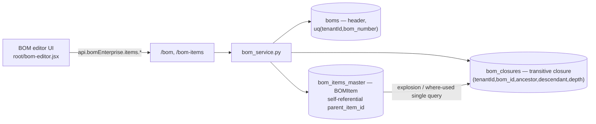
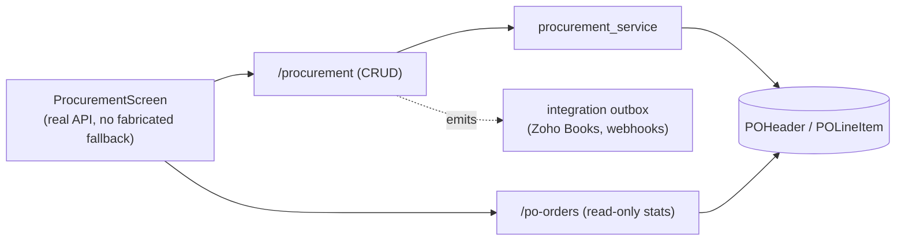
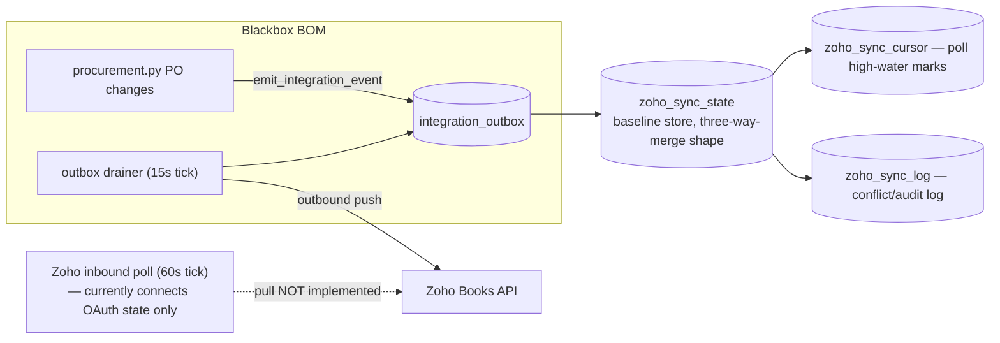
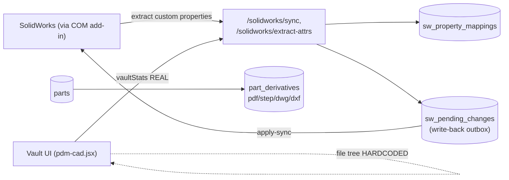

# Blackbox BOM — Project Features Documentation

> **Audience:** new engineers, product stakeholders, support staff, and auditors who need an honest, complete picture of what this product actually does today — feature by feature.
>
> **Scope:** the live project at `bom tool v1/bom-tool/` — a FastAPI backend (`backend/`), a Vite/React frontend (`frontend/`), a Windows desktop bundle (`desktop/`), and a Docker deployment path (root `docker-compose.yml`, `backend/docker-compose.prod.yml`).
>
> **Grounding:** every claim below is taken from a read-only, file-and-line-level audit of the codebase — backend core (`app/main.py`, `app/core/*`, `app/db/*`), the full API surface (78 endpoint routers, ~549+ routes, 24 service modules), the database schema (≈70 SQLAlchemy models, 50 Alembic migrations, head `050_rfq_headers_created_by_nullable`), the frontend architecture and UI layer (screens, modals, legacy `root/*.jsx`), and the desktop/Docker/CI packaging. **Nothing in this document is aspirational.** Where a feature is a stub, a mock, or unreachable, that is stated plainly and marked with the status badges defined in [Section 1](#1-how-to-read-this-document).
>
> **This revision (2026-08-09)** re-verifies every claim against the *current* code, one week after a full-repo scan (`docs/audit-2026-08/FINDINGS_FULL_SCAN.md`, 74 findings) and a fix pass (`docs/audit-2026-08/FIX_COVERAGE.md`, 43 fixed / 31 deferred, commits `c6d4565` backend security/infra/schema/CI, `dbcab0d` frontend live-fabrication, `12f0736` doc mismatches, `d351863` API-key security + BOM integrity + valuation). Where the previous edition of this document described something as broken, mocked, or unmounted and the fix pass genuinely closed that gap, this edition says so and cites the evidence; where a gap is still open, this edition still says so. This document does not replace the deeper reference material already in the repo — `ARCHITECTURE.md`, `FEATURE_CATALOG.md`, `MODULE_REFERENCE.md`, `OPEN_ITEMS.md`, `DATA_HANDLING.md`, `DEPLOYMENT_GUIDE.md`, `DISASTER_RECOVERY_RUNBOOK.md`, `frontend/OPENBOM_GAP_ANALYSIS.md`, and `desktop/DESKTOP_PACKAGING.md` / `desktop/DURABILITY.md` — it is a feature-by-feature companion to them, cross-referenced throughout.

---

## Table of contents

- [1. How to read this document](#1-how-to-read-this-document)
- [2. At-a-glance feature status matrix](#2-at-a-glance-feature-status-matrix)
- [3. System architecture overview](#3-system-architecture-overview)
- [4. Platform foundations: auth, RBAC, multi-tenancy, security](#4-platform-foundations-auth-rbac-multi-tenancy-security)
- [5. BOM editor and BOM management](#5-bom-editor-and-bom-management)
- [6. Parts / components master](#6-parts--components-master)
- [7. Vendors](#7-vendors)
- [8. Procurement / purchase orders](#8-procurement--purchase-orders)
- [9. Inventory](#9-inventory)
- [10. Catalogs](#10-catalogs)
- [11. Documents](#11-documents)
- [12. Compliance: 21 CFR Part 11, RoHS/REACH, compliance packs](#12-compliance-21-cfr-part-11-rohsreach-compliance-packs)
- [13. Zoho Books sync](#13-zoho-books-sync)
- [14. SolidWorks / CAD integration](#14-solidworks--cad-integration)
- [15. Dashboards and analytics](#15-dashboards-and-analytics)
- [16. Supplier portal](#16-supplier-portal)
- [17. ECO / ECN / ECR change management](#17-eco--ecn--ecr-change-management)
- [18. Authentication and SSO](#18-authentication-and-sso)
- [19. Additional backend capabilities](#19-additional-backend-capabilities)
  - [19.1 Quality management (CAPA, FAI, NCR, deviations, inspections)](#191-quality-management-capa-fai-ncr-deviations-inspections)
  - [19.2 Manufacturing (work orders, routings, work centers, labor)](#192-manufacturing-work-orders-routings-work-centers-labor)
  - [19.3 ERP connectors](#193-erp-connectors)
  - [19.4 Webhooks and third-party provider config](#194-webhooks-and-third-party-provider-config)
  - [19.5 OCR, web scraping, barcodes](#195-ocr-web-scraping-barcodes)
  - [19.6 Backup, restore, and disaster recovery](#196-backup-restore-and-disaster-recovery)
  - [19.7 Desktop packaging and deployment](#197-desktop-packaging-and-deployment)
  - [19.8 Formulas, where-used graph, and other backend-only-no-UI capabilities](#198-formulas-where-used-graph-and-other-backend-only-no-ui-capabilities)
- [20. Cross-cutting concerns](#20-cross-cutting-concerns)
- [21. Consolidated known-issues register](#21-consolidated-known-issues-register)
- [22. Consolidated future-improvements roadmap](#22-consolidated-future-improvements-roadmap)
- [23. File reference index](#23-file-reference-index)

---

## 1. How to read this document

Every feature is tagged with exactly one status badge, assigned from the audit evidence, not from what the UI claims:

| Badge | Meaning |
|---|---|
| 🟢 **REAL** | Fully wired end-to-end: a real UI action calls a real API endpoint, backed by a real service/DB write, with honest error states (no fabricated fallback data). |
| 🟡 **PARTIAL** | Some of the flow is real (e.g., reads from the API) but part of it is faked, hardcoded, silently falls back to demo fixtures, or a "save" action doesn't actually persist. |
| 🔴 **MOCK** | The screen/modal is disconnected from the backend: `setTimeout`-simulated fetches, `Math.random()`-generated data, or hardcoded arrays presented as if real, even though a real backend endpoint for the same data usually already exists. |
| ⚪ **STUB** | The backend endpoint exists and is reachable, but explicitly returns "not implemented" or performs a documented no-op (this is disclosed by the code itself, not a bug we're guessing at). |
| ⚫ **DEAD** | Fully implemented backend code (router + service) that is **never mounted** into the running application — it is unreachable over HTTP no matter what the frontend does. |
| 🔵 **BACKEND-ONLY-NO-UI** | The backend endpoint is real, mounted, and reachable, but no frontend screen calls it yet — a real capability with no way for a user to reach it through the product today. |

A single feature area can contain a mix of these — e.g., BOM editing is 🟢 REAL for structural edits but the "Diff" screen inside it is 🟡 PARTIAL. Each section below states the badge per capability, not just once for the whole area.

Per the required documentation shape, each feature section below covers, in order: **Purpose → Business value → User workflow → Internal workflow → Data flow → Validation → Error handling → Dependencies → Status → Future improvements.**

---

## 2. At-a-glance feature status matrix

| # | Feature area | Status | One-line reality check |
|---|---|---|---|
| 1 | BOM editor & management | 🟢 REAL (core + analytics consumers) / 🟡 PARTIAL (diff, templates overlap) | Explosion, rollups, snapshots, compare, baselines, variants are real; the flat-vs-tree crash that used to fire on real data was fixed (`AnalyticsScreen.jsx`'s `bomLeafParts` helper); the Diff screen still fabricates its comparison IDs. |
| 2 | Parts / components master | 🟢 REAL | CRUD is real; the fabricated "library-only" demo rows that used to be mixed into the parts screen were removed — the visible list is now genuinely sourced from the API/BOM, never fabricated. |
| 3 | Vendors | 🟢 REAL (backend + active toggle) / 🟡 PARTIAL (preferred flag, by design) | Vendor CRUD API is real; the "Active" toggle now calls `api.vendors.update`; "Preferred" remains a client-side-only concept because no server-side field for it exists yet (documented in code, not a bug). |
| 4 | Procurement / POs | 🟢 REAL | Two overlapping but functioning API surfaces (`/procurement`, `/po-orders`); UI has no fabricated fallback; the PO print view's tax line now actually computes the 18% GST it labels instead of a mismatched 8%. |
| 5 | Inventory | 🟢 REAL | Backend inventory/warehouse/kanban APIs are real and complete; the `InventoryScreen` in `prod-additions.jsx` that used to synthesize stock numbers from part-number character codes was rewired to call `api.inventory.list`/`api.kanban.list`/`api.inventory.binLocations.list` — nothing here is fabricated anymore. |
| 6 | Catalogs | 🟢 REAL | CRUD, folder import, part attach/detach all call real endpoints with no fallback. |
| 7 | Documents | 🟢 REAL | Upload/versioning/folders are real; the Documents screen no longer silently falls back to static demo data on a failed/empty load — an empty backend now renders an honest empty state. |
| 8 | Compliance (Part 11, RoHS/REACH, packs) | 🟢 REAL (backend) / 🟢 REAL (UI, fixed) | Full compliance data model and API exist; the compliance UI screen no longer hardcodes every part's RoHS/REACH/conflict-minerals status to "valid" — it now derives each field from the part's actual certification records. |
| 9 | Zoho Books sync | 🟡 PARTIAL (by design) | OAuth connect + outbound push sync + status/mappings work; pull, reconcile, and conflict-resolution endpoints still explicitly return "not implemented in this build" — unchanged this cycle. |
| 10 | SolidWorks / CAD | 🟢 REAL (backend) / 🔴 MOCK (PDM vault UI) | Bidirectional sync API is real, and the previously-unmounted `solidworks_contract.py` (property mappings + part-number generation) and `derivatives.py` (derivative-file links) routers are now mounted and reachable; the PDM vault screen's file tree is still hardcoded — unchanged. |
| 11 | Dashboards & analytics | 🟢 REAL (most tiles) / 🟡 PARTIAL (trend charts) | `DashboardScreen`'s uptime tile and budget tile were rewired to real `GET /health/detailed` and a new `GET /budgets/workspace` endpoint — the previous hardcoded "99.98% uptime" string and fake budget-scaling ratios are gone. `QMSDashboard`'s NCR/CAPA/FAI feed now calls the real quality APIs instead of `setTimeout`-mocking them. `AnalyticsScreen`'s trend charts are still largely hardcoded. |
| 12 | Supplier portal | 🟢 REAL | Supplier login, RFQ respond/award, price-update approve/reject are real, separate-auth endpoints. |
| 13 | ECO / ECN / ECR | 🟢 REAL (backend) / 🟢 REAL (UI, improved) | Full ECO/ECN/ECR API with e-signature approve/implement is real; `ECRScreen` is no longer a pure fabricated-seed-list — it reconciles its local (offline-capable) cache against `api.eco.list` when the network responds, rather than displaying invented rows. |
| 14 | Auth / SSO / RBAC | 🟢 REAL | JWT (RS256) + refresh, MFA, Google/GitHub/Microsoft OAuth2, SAML, API keys (now scoped, with a fixed unique-per-key prefix), RBAC — all real and unusually hardened for this project stage. |
| 15 | Quality (CAPA/FAI/NCR) | 🟢 REAL | Full quality API/service exists; both `qms-dashboard.jsx` and `power-features.jsx`'s `NCRScreen` — previously fabricating data — now call the real `api.quality.ncr.list`. |
| 16 | Manufacturing (WO/routing) | 🟢 REAL | Work orders, routings, process plans, work centers, labor tracking all call real endpoints; `WorkOrdersScreen`'s previous hardcoded fallback orders and local-only `persist()` were fixed. |
| 17 | ERP connectors | 🟢 REAL (CRUD/logs/test) / ⚪ STUB (sync) | CRUD, logs, test-connection are real; `POST /{id}/sync` is still an explicit no-op. The frontend's "latest logs" call that always 422'd is fixed — logs are now fetched per-connector on demand. |
| 18 | Webhooks | 🟢 REAL | Subscription CRUD, delivery log, retry, test — real; a separate, older `WebhooksModal` duplicate mock still exists in `power-features.jsx` (unchanged, deferred). |
| 19 | OCR / scraping / barcodes | 🟢 REAL (backend + most UI) | Real Tesseract OCR and real `httpx` scraping exist and are wired; `mobile-scanner.jsx`'s missing `toast` import — which used to crash the whole screen on any camera-denied/lookup/receive action — is fixed. `InternetScrapeModal`'s fake `setTimeout` scrape is unchanged (deferred). |
| 20 | Backup / disaster recovery | 🟢 REAL (both former high-severity defects fixed) | Failure-alert emails now send (`settings.APP_NAME` exists); encrypted physical/PITR backups now restore correctly (`restore_physical_backup` uses the matching `_stream_decrypt`, not a single-shot `fernet.decrypt`). |
| 21 | Desktop packaging | 🟢 REAL (one gap remains) | Full installer/updater/bundled-Postgres pipeline works; the installed `backend.exe` still bootstraps via `create_all` rather than stamping/running real Alembic migrations, so future schema changes won't auto-apply to existing desktop installs — unchanged this cycle. |
| 22 | Planning (PO-from-BOM) | 🔵 BACKEND-ONLY-NO-UI (was ⚫ DEAD) | `planning.py` is now mounted at `/planning` in `api_v1.py` and reachable over HTTP — it is no longer dead code — but no frontend screen calls it yet, so a user still cannot reach it through the product. |
| 23 | Formulas / where-used graph | 🔵 BACKEND-ONLY-NO-UI / 🟢 REAL (graph) | `formulas.py` (`/formulas`) is mounted but has no frontend caller yet. `graph.py` (`/graph`) is mounted **and** wired into the frontend (`graphAPI` in `api.js`, used by the PDM vault's where-used view). See [Section 19.8](#198-formulas-where-used-graph-and-other-backend-only-no-ui-capabilities). |

---

## 3. System architecture overview

Blackbox BOM is a **local-first, single-process FastAPI monolith** with a React SPA, designed to run equally well as a one-click Windows desktop install or a Docker Compose stack — see `ARCHITECTURE.md`, `desktop/DESKTOP_PACKAGING.md`, and `DEPLOYMENT_GUIDE.md` for the full story. This section gives just enough context for the feature sections that follow to make sense.


Key architectural facts every feature section below depends on:

- **Auth model:** cookie-based JWT (RS256, auto-generated RSA-4096 key) or API key or Bearer token; see [Section 18](#18-authentication-and-sso) and `app/core/deps.py`.
- **Multi-tenancy:** every business table carries a `tenantId` column (`TenantAwareMixin`). Isolation is enforced in three layers now — an ORM event-listener layer that filters every automatic ORM `SELECT` by tenant (fixed this cycle, see [Section 4](#4-platform-foundations-auth-rbac-multi-tenancy-security)), explicit tenant scoping added to raw-SQL/bulk-delete call sites that the ORM event listener structurally cannot reach, and an opt-in Postgres Row-Level-Security layer (`ENABLE_RLS`, migration `040`).
- **Two API surfaces coexist for some resources** (documented per-feature below) because the codebase evolved two parallel implementations rather than refactoring the old one out — e.g., `/procurement` vs `/po-orders`, `/bom-templates` vs `/bom/templates`, `cad.py` vs `solidworks_integration.py`.
- **Frontend is mid-migration**: a legacy `window.*`-global monolith (`src/root/*.jsx`) coexists with newer ES-module screens (`src/components/screens`, `src/components/advanced`). Both layers have had a substantial round of "replace fabricated data with real API calls or honest empty states" fixes this cycle (see the per-feature Status sections and [Section 20](#20-cross-cutting-concerns)), but the migration itself is not complete — some legacy `root/*.jsx` screens and a handful of not-yet-wired modals in `components/modals` are still demo-era.
- **Desktop vs Docker are two different deployment models** sharing the same backend code — see [Section 19.7](#197-desktop-packaging-and-deployment).

---

## 4. Platform foundations: auth, RBAC, multi-tenancy, security

*(Foundational — every feature below depends on this layer. Full detail in [Section 18](#18-authentication-and-sso) for auth/SSO specifically; this section covers the surrounding security envelope.)*

**Purpose.** Every request into the system must be authenticated, authorized for the specific action, and scoped to the correct tenant, without the application developer having to remember to do all three by hand on every single endpoint.

**Business value.** This is what makes the product safe to sell to more than one customer on shared infrastructure (multi-tenant SaaS) while also being safe to run fully offline on one machine (local-first desktop). It is also what regulated customers (medical device, aerospace) will audit first.

**Internal workflow** (request pipeline, `app/main.py`):

```mermaid
sequenceDiagram
    participant C as Client
    participant TH as TrustedHost/CORS
    participant AU as AuditLog + RequestID
    participant CSRF as CSRFMiddleware
    participant RL as SlowAPI rate limit
    participant DEP as get_current_user (deps.py)
    participant RBAC as RoleChecker/PermissionChecker
    participant ORM as Tenant-filtered ORM

    C->>TH: HTTP request
    TH->>AU: allowed host + CORS ok
    AU->>CSRF: request-id stamped, mutating request logged
    CSRF->>RL: double-submit cookie verified (Bearer exempt)
    RL->>DEP: per-IP 60/min ok
    DEP->>DEP: API key OR cookie OR Bearer JWT verified,\nblacklist + revoked_before checked, per-user 300/min
    DEP->>RBAC: tenant contextvar seeded from JWT, re-pinned from User row
    RBAC->>ORM: role hierarchy + resource:action permission checked
    ORM->>ORM: before_insert stamps tenantId;\nautomatic SELECT filter + before_flush block cross-tenant reads/UPDATE/DELETE
    ORM-->>C: response (generic error detail + request_id on 500)
```

**Validation & error handling.** Pydantic models validate request bodies; `RequestValidationError`, `HTTPException`, `RateLimitExceeded`, and a catch-all 500 handler all return a generic `detail` plus a `request_id` for correlation, while the full traceback is logged server-side and sent to Sentry (`app/main.py`). Mutating requests are audit-logged to `audit_logs` with retry-on-failure, drained at shutdown (`app/core/audit_middleware.py`). `GET /health/detailed` (used by the dashboard's system-health tile, [Section 15](#15-dashboards-and-analytics)) now requires an authenticated user — it used to be reachable with no auth at all and leaked internal business/system detail to anyone who could reach the API.

**Dependencies.** PostgreSQL (or SQLite for tests), optional Redis (rate limiting/blacklist fall back to in-memory if Redis is unavailable), `app/core/security.py` for the RSA keypair.

**Status: 🟢 REAL**, and unusually well-hardened for the project's stage — entropy-validated secrets with production hard-fails, RS256 JWTs with server-side revocation, layered rate limits, three-layer tenant isolation, TLS-gated security headers tuned for the local-first HTTP desktop bundle.

**Fixed this cycle (previously the single highest-severity known issue):** the automatic per-request tenant SELECT filter in `app/core/tenant_events.py` used to reference `ORMExecuteState.mapper_`, an attribute that has never existed on `ORMExecuteState` in SQLAlchemy 2.x — so the filter silently no-op'd on every ORM read, and read isolation rested entirely on explicit per-service filters plus the opt-in RLS layer. The code now reads `execute_state.bind_mapper` (the correct attribute) and carries an explicit `# SECURITY:` comment recording why, so automatic tenant-scoped read isolation is genuinely active again. In the same pass, the two Core-style bulk operations that structurally bypass this ORM event listener — `DELETE /bom-items/bulk-delete` (`bom_items.py`) and `bulk_delete_parts` (`part_service.py`) — were given explicit `tenant_id` `WHERE` clauses, since a Core `delete()`/`update()` statement never goes through the ORM `before_flush` guard that catches cross-tenant mutations on ORM objects.

**Known issues that remain open:**
- Non-ORM (`text()`) SELECTs are still only *logged* as a warning, not blocked, by `tenant_events.py`; `routing_api.py`'s list/get-process-plan **reads** specifically remain tenant-unscoped even though its inserts were fixed this cycle (`docs/audit-2026-08/FIX_COVERAGE.md`, "Known follow-ups").
- `SessionTimeoutMiddleware` doesn't implement any inactivity timeout despite its name (`session_timeout.py`) — it just redundantly re-checks the JWT `exp` claim.
- WebSocket rate limiting has three separate weaknesses (in-memory reset-by-cycling-IPs, proxy-IP collision, 1-second bucket resolution).
- `compliance_packs`/`part_certifications` remain deliberately global (non-tenant) tables holding per-tenant certification data, with no RLS or automatic-filter backstop — see [Section 12](#12-compliance-21-cfr-part-11-rohsreach-compliance-packs).

**Future improvements.**
1. Make non-ORM raw SQL SELECTs fail closed (raise) rather than warn-and-continue when they touch a tenant table without `tenant_sql_clause()`, starting with `routing_api.py`'s still-unscoped reads.
2. Either implement real inactivity timeout in `SessionTimeoutMiddleware` or rename/remove it so the name isn't misleading.
3. Route WebSocket rate limiting through `get_client_ip()` consistently with the HTTP path.
4. Add an explicit tenant-scoping join/view for `part_certifications` reads, since RLS can't cover this table automatically.

---

## 5. BOM editor and BOM management

**Purpose.** Let engineers build, structure, and maintain a multi-level Bill of Materials for a product: add/remove/reorder parts, nest sub-assemblies, attach images and custom attributes, and track how the BOM changes over time.

**Business value.** The BOM is the core artifact of the entire product — procurement, cost rollups, compliance, manufacturing, and quality all key off it. Getting explosion, cost rollup, and revision history right is the product's reason to exist.

**User workflow.**
1. User opens a project's BOM in the BOM editor screen (backed by `root/bom-editor.jsx` + `screens/BomEditorScreen.jsx`).
2. Adds a part as a new line, optionally nested under a parent line to build assembly structure, sets `find_number` and quantity.
3. Reorders lines via drag-and-drop, attaches an image or custom attributes to a line.
4. Views roll-up totals (quantity, cost, mass) computed for the whole tree.
5. Takes a **snapshot** at a milestone, later **compares** two snapshots/revisions, or promotes one to a **baseline**.
6. Optionally creates **variants** (e.g., a configuration option) and exports/imports the BOM (XLSX/CSV/PDF).

**Internal workflow.** The thin router `app/api/endpoints/bom_enterprise.py` (mounted at `/bom`, router-level `require_viewer` auth) delegates essentially everything to `app/services/bom_service.py` (the largest service in the backend) — CRUD, explosion, quantity/cost/mass rollups, snapshots, compare, baselines, variants, export/import, templates. A parallel, smaller CRUD router `app/api/endpoints/bom_items.py` handles individual line CRUD + bulk operations + reorder.

**Data flow / data model.**

Structural edits made in the editor call `api.bomEnterprise.items.update/reorder/delete` and `api.parts.update`, targeting real `bom_items_master` rows — this is a REAL write path, not a demo overlay. Explosion and where-used queries use the `bom_closures` transitive-closure table (added in migration `039`) specifically so multi-level traversal is a single query rather than a recursive one. `apply_template` (used when creating a BOM from a saved template) now correctly writes the `BomClosure` self-row for every item it creates, matching every other creation path — previously it skipped this, which meant template-created BOMs had a subtly broken closure table for their own root items.

**Validation.** Line quantities are `Numeric(10,4)`; the header/BOM number is unique per tenant. `exclude_from_bom` flags let a line be tracked without contributing to rollups.

**Error handling.** Router-level `require_viewer` auth guard rejects unauthorized access before any service code runs; service-layer errors surface as standard HTTPException JSON.

**Dependencies.** Parts master ([Section 6](#6-parts--components-master)) for line items, Documents ([Section 11](#11-documents)) for line images, Revisions/ECO ([Section 17](#17-eco--ecn--ecr-change-management)) for change tracking, real-time collaboration (WebSockets) for concurrent-edit presence/locks.

**Status by sub-capability:**

| Sub-capability | Status | Notes |
|---|---|---|
| CRUD, explosion, rollups, where-used, snapshots, baselines, variants, export/import | 🟢 REAL | Backed by `bom_service.py`; `POST /bom/compare` is live and correctly wired. |
| Structural edits from the editor UI | 🟢 REAL | Calls `api.bomEnterprise.items.update/reorder/delete`, `api.parts.update`, `api.documents.upload` against real backend rows. |
| **Diff screen** (visual compare UI) | 🟡 PARTIAL — **still open** | Calls `api.bomEnterprise.compare` but the two BOM IDs it compares are still `useState(1)`/`useState(2)` in `frontend/src/components/screens/DiffScreen.jsx` — the request is real, the inputs to it are not. This is one of the deferred items in `docs/audit-2026-08/FIX_COVERAGE.md` ("Compare Revisions" screen). Should instead source real BOM IDs and use `revisionsAPI`. |
| BOM templates | 🟡 PARTIAL (duplicate systems) | Two separate template systems still exist: `/bom-templates` (`bom_templates.py` CRUD+load) and `/bom/templates` (+`/apply`) inside `bom_enterprise.py` — functionally overlapping, not unified. Unchanged this cycle. |
| `bomId` threading in the app shell | 🟡 PARTIAL — **still open** | `AppCtx.jsx` still falls back to a **hardcoded `bomId = 1`** whenever the current project object lacks a real id (`project?.id \|\| project?.bomId \|\| data?.project?.id \|\| 1`). Once multiple real BOMs exist, this risks structural edits landing on the wrong BOM. Not addressed this cycle. |
| BOM-tree rendering after real API hydration | 🟢 REAL — **fixed** | The flat-vs-tree crash risk described in earlier versions of this document — `AnalyticsScreen.jsx` assuming the demo shape `rows[0].children` on the flat array `convertApiPartsToTree` (`utils/bom.js`) actually returns — is fixed. `AnalyticsScreen.jsx` now has a shared `bomLeafParts(rows)` helper that handles both the legacy demo tree shape and the real flat shape (and the empty case) in one place, with a comment explicitly documenting the old bug and the fix. |

**Future improvements.**
1. Rebuild the Diff screen against real BOM IDs instead of the hardcoded `1`/`2`, and make "Export diff" (if still a no-op) actually export.
2. Thread a real `bom_id` through the app shell instead of the `\|\| 1` fallback in `AppCtx.jsx`.
3. Consolidate the two BOM-template systems into one.
4. Confirm other legacy consumers of `convertApiPartsToTree`-shaped data outside `AnalyticsScreen.jsx` follow the same safe pattern, and delete the now-superseded duplicate `convertApiPartsToTree` in `utils/bom.ts` (flagged as dead/unused in the fix ledger).

---

## 6. Parts / components master

**Purpose.** Maintain the tenant's single source of truth for every part/component: part number, description, cost, vendor, category, RoHS/REACH identity fields, tags, and compliance links.

**Business value.** Every other module (BOM, procurement, inventory, compliance, quality) references parts by this master record — data quality here directly drives data quality everywhere else.

**User workflow.** Search/browse parts, view/edit a part's detail (cost, primary vendor, category, RoHS `is_article`/`eee_category`/`part_kind` fields), bulk-delete, check for duplicate part numbers before creating a new one, attach documents/images, view where a part is used across BOMs.

**Internal workflow.** `app/api/endpoints/parts.py` (`/parts`) delegates to `part_service`, offering CRUD, bulk-delete, and `check-duplicates`. Parts carry a tenant-scoped unique key on both part number and barcode (`uq(tenantId,pn)`, `uq(tenantId,barcode)`), `Numeric(18,4)` money fields, and status/category `CHECK` constraints. `primary_vendor_id` is a foreign key to `vendors.id`.

**Data flow.** UI (`root/parts-screen.jsx`, `components/screens`) → `api.parts.*` → `/parts` router → `part_service` → `parts` table (+ M2M `part_tags`, `part_compliance`).

**Validation.** DB-level uniqueness on part number and barcode per tenant; status/category enforced by CHECK constraints; money fields standardized to `Numeric(18,4)` (migration `033`).

**Error handling.** Standard REST error responses; `check-duplicates` endpoint exists specifically so the UI can warn before a conflicting insert instead of relying on the DB error.

**Dependencies.** Vendors ([Section 7](#7-vendors)) for `primary_vendor_id`, Catalogs ([Section 10](#10-catalogs)) for catalog membership, Documents for attachments, Compliance ([Section 12](#12-compliance-21-cfr-part-11-rohsreach-compliance-packs)) for RoHS/REACH identity fields.

**Status: 🟢 REAL** for the API, CRUD screen flow, and — as of this cycle — the parts catalog view itself. `parts-screen.jsx` used to inject a small number of fabricated "library-only" demo parts into the catalog view alongside real ones ("for realism," per the old inline comment); that has been removed. The comment now in place explains that the "library-only" concept (parts not currently used by the active BOM) is derived entirely from the difference between the real API parts list and the real BOM's items — never fabricated rows.

**Known DB-level issue (still open, from schema audit):** `parts.primary_vendor_id` is `ForeignKey('vendors.id', ondelete='CASCADE')` — **deleting a vendor hard-deletes every part that references it as primary vendor.** This should be `SET NULL`. The same overly-aggressive `CASCADE` pattern recurs on `boms.created_by`, `bom_templates.createdById`, `inventory_transactions.performed_by` — deleting a user cascades into destroying historical/audit data on all three. Not addressed this cycle.

**Bulk-delete tenant scoping (fixed this cycle):** `part_service.bulk_delete_parts` used a Core-style `delete()` statement with no tenant scoping at all, bypassing both the ORM `before_flush` guard and (at the time) the also-broken automatic SELECT filter — meaning a bulk-delete request could, in principle, delete another tenant's parts by ID. It now explicitly filters by `get_tenant_id()` before executing, matching the same fix applied to `bom_items.py`'s bulk-delete (see [Section 4](#4-platform-foundations-auth-rbac-multi-tenancy-security)).

**Future improvements.**
1. Change `primary_vendor_id` and the other audit/ownership foreign keys from `CASCADE` to `SET NULL` so deleting a vendor or user doesn't silently delete parts, BOMs, templates, or inventory history.

---

## 7. Vendors

**Purpose.** Maintain the tenant's supplier master: name, contact info, and a preferred/active status used for sourcing decisions; feed into supplier scorecards and part-vendor linkage.

**Business value.** Sourcing and procurement teams need one clean vendor list rather than free-text vendor names scattered across parts and POs.

**User workflow.** View/search vendors, create/edit a vendor, bulk-delete, mark a vendor preferred or active/inactive, review a vendor's scorecard.

**Internal workflow.** `app/api/endpoints/vendors.py` (`/vendors`): CRUD + bulk-delete, backed by a `vendors` table with `uq(tenantId, name)`. `part_vendors.py` (`/part-vendors`) manages the many-to-many part↔vendor link (e.g., alternate suppliers per part). `supplier_scorecard.py` is a separate CRUD for scorecards.

**Data flow.** `VendorsScreen` reads vendors via the API and mutates them through `api.vendors.update`.

**Status:**

| Sub-capability | Status |
|---|---|
| Vendor CRUD API, part-vendor linkage, scorecards | 🟢 REAL |
| "Active" toggle in `VendorsScreen` | 🟢 REAL — **fixed this cycle.** `toggleActive` is now `async` and calls `await api.vendors.update(v.apiId, { active: nextActive })`, with the UI optimistically flipped and then confirmed/rolled back by the real response — it used to only mutate local component state. |
| "Preferred" toggle in `VendorsScreen` | 🟡 PARTIAL, **by design, not a bug** — the code now carries an explicit comment: "no vendor-level `preferred` concept exists server-side." The toggle still only changes local state, but that's because there is genuinely nowhere on the backend to persist it yet, not because a wiring step was skipped. |

**Validation.** Vendor name unique per tenant.

**Error handling.** Standard REST errors; the "Active" toggle now has real error handling — a failed `api.vendors.update` call surfaces to the user rather than silently "succeeding" in local state only.

**Dependencies.** Parts (primary vendor FK), Procurement/POs, Supplier Portal ([Section 16](#16-supplier-portal)).

**Future improvements.**
1. If a "preferred vendor" concept is wanted as a real product feature, add a backend field/endpoint for it and wire the toggle to that, consistent with how "Active" was just fixed.
2. Given the `parts.primary_vendor_id` CASCADE issue noted in [Section 6](#6-parts--components-master), add a confirmation step before vendor deletion that shows how many parts/BOMs would be affected.

---

## 8. Procurement / purchase orders

**Purpose.** Create and manage purchase orders against vendors, track PO line items, alerts (e.g., overdue), and cost history.

**Business value.** Purchasing is where BOM data turns into real spend — accurate PO tracking is core to cost control and supplier accountability.

**User workflow.** Create a PO for a vendor with line items, monitor PO status and alerts, review price history and landed cost, advance a PO through its lifecycle stages, review order-tracking/shipment updates, print a PO for a vendor.

**Internal workflow.** Two API surfaces exist over the **same underlying models** (`POHeader`/`POLineItem` in `app/models/po_models.py`):
- `app/api/endpoints/procurement.py` (`/procurement`): PO CRUD + alerts + advance, via `procurement_service`, and emits integration events (`app.integrations.events.emit_integration_event`) on changes — this is the hook Zoho Books outbound sync and webhooks key off.
- `app/api/endpoints/po_order.py` (`/po-orders`): a read-only list/stats/get surface over the same tables using raw `SELECT`s.

`order_tracking.py` is a separate, richer CRUD + stats + shipment-stage-advance feature layered on top. `price_history.py` tracks price history + landed cost per part/vendor. `contract.py` manages vendor contracts and pricing agreements. `kanban.py` implements reorder triggers and low-stock alerts, tied to inventory.

**Data flow.**


**Validation.** Standard field validation via Pydantic request models (inline, not `app.schemas`, per the router's convention).

**Error handling.** `ProcurementScreen` has a documented timeout on its API calls and does **not** fall back to fabricated data on failure (a "reference implementation" pattern per the audit).

**PO print view (`printPO`, `frontend/src/root/final-polish.jsx`) — fixed this cycle.** Two separate bugs are now closed: (1) the printed tax line was labeled "Tax (GST 18%)" but the code computed tax at 8% — the calculation now uses `0.18` to match the label, with an inline comment explaining the mismatch and the fix; (2) a missing unit cost used to silently fall back to a fabricated `$12`, a missing vendor name fell back to a fake "Mean Well," and the signatory line was a hardcoded fake name — all three now show the real value or an honest `"—"` placeholder (via a `hasCost` check) instead of inventing data on a real, printable business document.

**Dependencies.** Vendors, Parts (for line items), Inventory (kanban triggers), Zoho Books / Webhooks (event emission on PO changes).

**Status: 🟢 REAL**, with a structural duplication issue rather than a functionality gap: `/procurement` and `/po-orders` are two API surfaces for one resource, which is confusing for integrators and a maintenance burden, but neither is fake.

**Future improvements.**
1. Consolidate `/po-orders` (read-only) into `/procurement` as query/list endpoints, deprecating the separate router.
2. Document clearly which surface external integrators (Zoho, ERP connectors, webhooks) should target.

---

## 9. Inventory

**Purpose.** Track physical stock across warehouses and bin locations: on-hand quantity, transactions (receipts/issues/transfers/adjustments), reservations, and valuation.

**Business value.** Connects the paper BOM/procurement world to what's actually on the shelf — needed for accurate available-to-promise, reorder triggers, and cost-of-goods reporting.

**User workflow.** View stock by warehouse/bin, adjust or transfer stock, reserve stock against an order, review transaction history, run a valuation report, respond to low-stock kanban alerts.

**Internal workflow.** `app/api/endpoints/inventory_api.py` (`/inventory`, router-level `require_viewer`): warehouses, bins, stock, `adjust`/`transfer`/`reserve`, transactions, valuation reports, via `inventory_service.py`. `kanban.py` layers reorder-trigger CRUD and low-stock alerts on top, including a stock-update endpoint.

**Data model.** `warehouses`, `bin_locations` (`uq(warehouse_id, bin_code)`), `inventory` (`uq(part, warehouse, bin, lot)` + status CHECK), `inventory_transactions`, `inventory_reservations` — the latter two use a Python event-listener to validate `reference_type` values.

**Data flow.** UI → `api.inventory.*` → `/inventory` → `inventory_service` → `inventory`/`inventory_transactions`/`inventory_reservations` tables.

**Validation.** DB CHECK constraint on transaction `reference_type` restricts to `po, work_order, transfer, adjustment, sales_order, return`.

**Error handling.** Standard REST errors — but see the schema-level mismatch noted below, which surfaces as an unexpected 500/IntegrityError rather than a clean validation error.

**Dependencies.** Parts, Procurement (PO receipts feed inventory), Kanban/reorder alerts, Analytics (valuation reporting).

**Status:**

| Sub-capability | Status |
|---|---|
| Warehouses/bins/stock/adjust/transfer/reserve/transactions/valuation API | 🟢 REAL |
| Kanban low-stock alerts and reorder triggers | 🟢 REAL |
| `InventoryScreen` in `frontend/src/root/prod-additions.jsx` | 🟢 REAL — **fixed this cycle.** Stock levels, reorder points, and bin labels used to be synthesized from character codes of the part number instead of calling the real APIs. The screen now calls `api.inventory.list()` for real stock positions, `api.kanban.list()` for the real reorder point (`minStock`), and `api.inventory.binLocations.list()` for real bin labels — the code carries an explicit comment confirming "never fabricated." |

**Fixed this cycle (valuation):** `GET /inventory/valuation` (`get_stock_valuation`) used to multiply on-hand quantity by a hardcoded `1.0` instead of the part's actual unit cost, understating (or zeroing out) every valuation report. It now uses the real unit cost.

**Known schema bug (medium severity, still open):** the Python `ALLOWED_REFERENCE_TYPES` set in `app/models/inventory.py` (`{po, work_order, transfer, adjustment, receipt, issue, return}`) does **not match** the database `CHECK` constraint (`'po','work_order','transfer','adjustment','sales_order','return'`). `'receipt'`/`'issue'` pass the Python validator but violate the DB constraint on Postgres (an `IntegrityError` at flush); `'sales_order'` is DB-legal but Python-rejected. `InventoryReservation` additionally allows `'sales_order'`/`'forecast'` with **no DB CHECK at all**.

**Known schema bug (medium severity, still open):** `uq_inventory_part_location_lot` (part, warehouse, bin, lot) — `bin_location_id` and `lot_number` are nullable, and under Postgres's default NULLS-DISTINCT semantics this allows unlimited duplicate rows for the same part/warehouse when bin/lot are both NULL, which is the most common (un-binned, un-lotted) case. The Zoho sync tables solve the identical problem correctly with a partial unique index; inventory does not.

**Future improvements.**
1. Reconcile the Python `ALLOWED_REFERENCE_TYPES` set with the DB CHECK constraint (pick one canonical list) and add the missing CHECK on `InventoryReservation`.
2. Add a partial unique index for the common NULL-bin/NULL-lot case, mirroring the pattern already used in `zoho_sync.py`.

---

## 10. Catalogs

**Purpose.** Group parts into named catalogs (e.g., an approved-vendor list, a product-family library), including bulk import from a folder.

**Business value.** Lets engineering/procurement curate reusable, approved subsets of the parts master rather than working against the entire (potentially huge) parts table.

**User workflow.** Create a catalog, import parts from a folder, add/remove parts from a catalog, deactivate a catalog, browse catalog contents.

**Internal workflow.** `app/api/endpoints/catalogs.py` (`/catalogs`, RBAC `parts_read`/`parts_write`) delegates to `catalog_service.py`: CRUD, `from-folder` import, deactivate, and parts add/list/remove. Data model: `catalogs` and `part_catalogs` M2M, both tenant-scoped (migration `045`), with `uq(tenantId, catalog_code)` and `uq(tenantId, part_id, catalog_id)`.

**Data flow.** UI (`CatalogsScreen`, one of the audit's cited "reference implementation" screens) → `api.catalogs.*` → `catalog_service` → `catalogs`/`part_catalogs` tables.

**Validation.** Catalog code unique per tenant; part-catalog pairing unique per tenant.

**Error handling.** `CatalogsScreen` is explicitly called out as following the honest-failure pattern: loading spinner, real error empty-state, **no fabricated fallback data**.

**Dependencies.** Parts master.

**Status: 🟢 REAL** across API and UI — no known issues flagged in the audit for this feature. This screen was already the template other legacy screens have since been rewritten toward (see [Section 20](#20-cross-cutting-concerns)).

**Future improvements.** None flagged specifically.

---

## 11. Documents

**Purpose.** Store and version files (drawings, datasheets, certificates, images) organized into folders, and attach them to BOM lines, parts, or other records.

**Business value.** Centralizes controlled documentation instead of leaving it in email attachments or local drives — a prerequisite for any regulated-industry customer.

**User workflow.** Create folders, upload a file (hashed on upload), view/download versions, browse/attach documents to a BOM line or part.

**Internal workflow.** `app/api/endpoints/documents.py` (`/documents`): folders, upload (SHA-hash, stored under the env-configured `UPLOAD_DIR`), versions, CRUD.

**Data flow.** UI (`DocumentsScreen`) → `api.documents.*` → `/documents` → filesystem (`UPLOAD_DIR`) + `documents` table (BOM line images reference this table via `bom_items_master.image_document_id`, `ON DELETE SET NULL`).

**Validation.** File hashing on upload for integrity/versioning.

**Error handling — fixed this cycle.** `DocumentsScreen` used to silently fall back to static demo data (`data.docs`) if the list/folders call failed, meaning a genuine backend outage looked to the user like "the app has some documents," not "something is wrong." The fetch logic now explicitly sets the real (possibly empty) result even when the API returns zero documents, with an inline comment: "set `apiDocs` even when the result is genuinely empty, so an empty backend renders the real empty state instead of silently falling back to bundled sample docs." A failed request is now logged as a warning and the UI shows its real (empty) state rather than fabricated content.

**Dependencies.** BOM editor (line images), Parts, uploads bypass CSRF/refresh handling (see below).

**Status: 🟢 REAL** — backend, UI wiring, and the previous silent-fallback failure mode are all now honest. One cross-cutting frontend issue remains: `documentsAPI.upload` uses a raw `fetch()` call that has **no CSRF header, no 401 silent-refresh retry, and no circuit breaker** (the same gap affects `ocrAPI.upload`, `bulkImportAPI.upload`, and `catalogsAPI.importUpload`). If the backend enforces CSRF on multipart POSTs, uploads fail outright; with an expired access token, uploads hard-fail instead of transparently refreshing. Not addressed this cycle.

**Future improvements.**
1. Route all four upload call sites through a CSRF-aware, refresh-aware fetch helper shared with `apiRequest()`.

---

## 12. Compliance: 21 CFR Part 11, RoHS/REACH, compliance packs

**Purpose.** Support regulated-industry requirements: tamper-evident electronic signatures (Part 11), substance/material compliance declarations against RoHS/REACH reference data, and generic "compliance pack" checklists (e.g., ISO 9001, AS9100).

**Business value.** This is the feature set that lets the product be sold into medical device, aerospace, and other regulated manufacturing — it is a differentiator versus a plain BOM/PLM tool.

**User workflow.**
- **Part 11 e-signatures:** view a read-only, write-once log of electronic signatures tied to approval actions (e.g., ECO approval — see [Section 17](#17-eco--ecn--ecr-change-management)).
- **RoHS/REACH:** declare a part's material composition, review substance declarations, check a part's or BOM's overall compliance status against restricted-substance thresholds.
- **Compliance packs:** attach a standard's checklist (e.g., AS9100) to parts, certify a part, view a compliance dashboard.

**Internal workflow.**
- `esignature_api.py` (`/esignatures`): read-only listing; signatures are write-once by design (no update/delete endpoints exist — this is intentional, not an oversight).
- `compliance_api.py` (`/compliance`): compliance records CRUD (careful `{compliance_id:int}` path converter specifically to avoid shadowing the `/packs` route), packs, part certification, dashboard. **Tenant-scoping fixed this cycle** — the compliance-standard CRUD (list/get/update/delete) and part-compliance/certify lookups used raw SQL without tenant filters; they are now explicitly scoped.
- `substance_compliance_api.py` (`/substance-compliance`): substances CRUD, part composition, part/BOM compliance evaluation — thin wrapper over `substance_compliance_service.py`, the largest service in this domain.

**Data model** (from the schema audit): global, system-owned reference data — `substances`, `substance_groups`, `regulation_versions`, `restricted_substance_entries`, `rohs_exemptions` (migration `042`, **no `tenantId`** — shared across all tenants because it's regulatory reference data, not customer data) — versus tenant-owned `part_materials`/`part_material_substances`/`substance_declarations`/`exemption_claims` (migration `043`) and cached `compliance_evaluations`/`reach_obligations` (migration `044`). Separately, `compliance_packs`/`compliance_pack_items`/`part_certifications` (migration `041`) are **deliberately not tenant-scoped either**, mirroring an external live database's DDL — but `part_certifications.part_id` foreign-keys into tenant-scoped `parts`, and these tables get **no RLS policy** (RLS only auto-attaches to tables with a `tenantId` column) and **no automatic ORM filter**. This remains the main residual cross-tenant exposure surface identified in the schema audit; it was not restructured this cycle (only the raw-SQL endpoints reading it were tenant-scoped where they take a tenant-owned filter as input).

**Validation.** Substance/regulation reference data is versioned (`regulation_versions`) so evaluations can be re-run against a specific regulatory snapshot.

**Error handling.** Standard REST errors on the backend.

**Dependencies.** Parts (composition/certification target), ECO ([Section 17](#17-eco--ecn--ecr-change-management)) for e-signature-backed approvals, BOM (for BOM-level compliance rollup).

**Status:**

| Sub-capability | Status |
|---|---|
| Part 11 e-signature listing (backend) | 🟢 REAL — read-only, write-once by design. |
| Compliance records/packs/certification/dashboard API | 🟢 REAL (tenant-scoping gap on raw-SQL endpoints fixed this cycle). |
| RoHS/REACH substance compliance API | 🟢 REAL |
| **Compliance UI screen** (`components/advanced/ComplianceScreen.jsx`) | 🟢 REAL — **fixed this cycle.** It used to hardcode every part's `rohs`/`reach`/`conflict` field to `'valid'` regardless of actual certification state. It now looks up each part's real compliance-pack certifications, matches the RoHS/REACH/conflict-minerals standards by name (`findStandard`), and derives each field's status (`certStatus`) — including an "expiring"/"expired" state driven by the certification's real `expiry_date` — from that real data instead of a constant. |

**Future improvements.**
1. Add an explicit tenant-scoping join or view for `part_certifications` reads so raw-SQL endpoints can't accidentally cross tenants, since RLS can't cover this table automatically — the remaining item from this section's known gap.

---

## 13. Zoho Books sync

**Purpose.** Two-way accounting sync with Zoho Books for parts/items, vendors/contacts, purchase orders, and cost, so procurement/finance data doesn't have to be re-entered in both systems.

**Business value.** Removes duplicate data entry between the BOM/procurement system and the accounting system of record, and is being built as a standalone effort on its own branch (see project memory: `feat/zoho-books`, developed in parallel with the regulated-industry track).

**User workflow (what actually works today).** Connect a Zoho organization via OAuth, select the org, view sync status and field mappings, trigger an outbound push of parts/vendors/POs/costs from Blackbox BOM → Zoho Books.

**What does NOT work yet (by explicit design, not a bug — unchanged this cycle):** pulling data *from* Zoho Books into Blackbox BOM, reconciliation, and conflict resolution. The router's own docstring (`zoho_books.py`) states these return "not implemented in this build."

**Internal workflow.** `app/api/endpoints/zoho_books.py` (`/integrations/zoho_books`): OAuth flow, org selection, outbound push sync, status/mappings — all implemented. Backed at the lifespan level by a **60-second poll background task** and an **integration outbox drainer** (15-second tick) that also serves webhooks — POs and other changes emit events via `app.integrations.events.emit_integration_event`, which land in `integration_outbox` and get drained/delivered.

**Data flow.**


**Data model.** `zoho_sync_state` (baseline store with `uq(tenantId, entity_type, entity_id)` plus a partial unique index on `external_id WHERE NOT NULL`), `zoho_sync_cursor` (poll cursors), `zoho_sync_log` (conflict/audit log). These reuse the generic `integration_connections`/`integration_external_links`/`integration_outbox` tables shared with other integrations (ERP connectors, webhooks).

**Validation.** The sync-state table's schema is explicitly shaped for a three-way merge (local baseline vs local current vs remote current) even though the merge/reconcile logic that would use it (pull + conflict resolution) isn't implemented yet.

**Error handling.** Standard REST errors on the implemented endpoints; the unimplemented endpoints return an explicit, documented "not implemented" response rather than silently failing or pretending to succeed.

**Dependencies.** Procurement/POs (source of outbound events), the generic Integrations framework (`integrations.py`, shared with ERP connectors and webhooks), Redis/DB for the outbox.

**Status: 🟡 PARTIAL by design — unchanged this cycle.** OAuth connect, outbound push, status/mappings: 🟢 REAL. Pull/reconcile/conflict-resolve: ⚪ **STUB** (explicitly documented as not implemented, this build).

**Future improvements.**
1. Implement the inbound pull path using the already-provisioned `zoho_sync_cursor` high-water-mark table.
2. Implement three-way-merge conflict detection/resolution using `zoho_sync_state`'s baseline-store shape.
3. Surface `zoho_sync_log` conflicts in the `ZohoBooksScreen` UI so users can see and act on sync issues, not just successful pushes.

---

## 14. SolidWorks / CAD integration

**Purpose.** Keep part/BOM data in sync with SolidWorks CAD models: extract custom properties from CAD files into part attributes, push BOM structure changes back to CAD, manage a PDM-style vault of CAD files and derivatives (PDF/STEP/DWG/DXF), and license the SolidWorks add-in.

**Business value.** Engineering teams live in CAD; forcing a second, manual data-entry pass into the BOM tool is a major adoption blocker. Bidirectional, low-friction sync is a core differentiator for a mechanical-hardware-focused BOM tool.

**User workflow.** From the SolidWorks add-in (`solidworks-plugin/`, a C# .NET Framework 4.8 COM add-in) or the web UI: sync CAD properties into part attributes, push BOM structure to CAD, view sync status/pending changes, browse a "vault" tree of CAD files with derivative artifacts, activate a plugin license.

**Internal workflow.** `app/api/endpoints/solidworks_integration.py` (`/solidworks`, router-level `require_viewer`) is the largest single endpoint file in the backend: bidirectional sync, BOM structure exchange, image handling, change notifications/tracking, vault stats/tree, `extract-attrs`, license verify/activate. A **second, smaller router** `app/api/endpoints/cad.py` (`/cad`) re-implements `sync`/`apply-sync`/`extract-attrs`/`vault/stats`/`vault/tree` with **self-contained ORM logic that does not share a service module** with `solidworks_integration.py` — i.e., the same-named CAD features exist twice, independently. Unchanged this cycle.

**Data model.** `sw_property_mappings` (`uq(tenantId, sw_property)`) maps SolidWorks custom properties to part fields; `sw_pending_changes` is a write-back outbox for changes queued to push into CAD (`part_id` `ON DELETE SET NULL`); `part_derivatives` (migration `047`) stores typed derivative files per part (`kind` CHECK: `pdf|step|dwg|dxf|other`, `uq(tenantId, part_id, kind)`).

**Data flow.**


**Validation.** `part_derivatives` kind is DB-constrained to the 5 known file types; property mappings are unique per tenant.

**Error handling.** Standard REST errors; the SolidWorks plugin build itself is only a "best-effort compile guard" in CI (`.github/workflows/solidworks-plugin.yml`), not a full test suite.

**Dependencies.** Parts master (target of extracted attributes), Documents (derivative storage), a working SolidWorks + COM add-in install on the engineering desktop (out of scope of this web/backend audit).

**Status:**

| Sub-capability | Status |
|---|---|
| `/solidworks` bidirectional sync, BOM structure, notifications, vault stats, extract-attrs, license verify/activate | 🟢 REAL |
| `/cad` (`cad.py`) sync/apply-sync/extract-attrs/vault | 🟡 PARTIAL / duplicate — functionally real but **duplicates** `/solidworks` logic independently, risking the two surfaces drifting out of sync with each other over time. |
| `solidworks_contract.py` (property-mappings + generate-part-number) | 🔵 **BACKEND-ONLY-NO-UI** — **fixed this cycle from ⚫ DEAD.** It is now mounted at `/solidworks` in `api_v1.py` (previously imported but never `include_router`'d, so it was unreachable over HTTP no matter what). It is reachable now; no frontend screen calls it yet. |
| **PDM vault UI** (`root/pdm-cad.jsx`) | 🔴 **MOCK-heavy — unchanged this cycle.** Only `cadAPI.vaultStats` is real; the entire `FILES_BY_PATH` vault file tree is still hardcoded, the current user is still hardcoded to `'E. Chen'`, and the code still contains its own admission: `// Try API first, fall back to mock`. |
| Derivative links CRUD (`derivatives.py`) | 🔵 **BACKEND-ONLY-NO-UI** — **fixed this cycle from ⚫ DEAD.** Now mounted at `/derivatives`; reachable, not yet called by any frontend screen. |

**Future improvements.**
1. Pick one CAD sync implementation (`solidworks_integration.py` is the larger, more complete one) and delete or fully deprecate the other (`cad.py`) rather than maintaining two.
2. Now that `solidworks_contract.py` and `derivatives.py` are mounted and reachable, wire a frontend UI to them if the features are wanted (property-mapping management, part-number generation, derivative-file browsing), or leave them as intentionally API-only capabilities for the SolidWorks add-in to call directly.
3. Rebuild the PDM vault UI's file tree against the real vault-tree endpoint that already exists in `solidworks_integration.py` — the backend capability is there; only the UI needs rewiring. Still the single highest-value fix in this section.

---

## 15. Dashboards and analytics

**Purpose.** Give managers and executives roll-up visibility: KPIs, trends, category breakdowns, vendor scorecards, and role-specific dashboards (e.g., procurement dashboard vs engineering dashboard).

**Business value.** Turns operational data (parts, POs, BOM costs) into decisions — the difference between a data-entry tool and a management tool.

**User workflow.** Open a role-based dashboard, review trend charts, category/vendor breakdowns, drill into a specific KPI, review workspace budget vs actual spend, check system health.

**Internal workflow.** `analytics.py` (`/analytics`): dashboard/trends/categories/vendor-scorecard SQL aggregates — genuinely implemented as real aggregate queries. `dashboards_api.py` (`/dashboards`): 4 role dashboards, a thin delegate to `dashboard_service.py`. `budgets.py` (`/budgets`) is a newer, real endpoint that computes actual spent/committed totals from purchase-order data for a given period (`fy`, `q1`-`q3`, `last7`, `last30`).

**Data flow.** UI → `analyticsAPI.dashboard()` / `.categories()` → real SQL aggregation → response used for KPI tiles. **Several previously-hardcoded panels are now real** (see Status below); `AnalyticsScreen`'s trend charts remain the largest exception.

**Status by screen:**

| Sub-capability | Status |
|---|---|
| `/analytics`, `/dashboards`, `/budgets` backend endpoints | 🟢 REAL |
| **`AnalyticsScreen.jsx`** | 🟡 PARTIAL — a handful of KPIs are real; **trend charts and several lead-time/risk/on-time KPIs are still hardcoded**, despite a real `analyticsAPI.trends(range)` endpoint sitting mostly unused. The flat-vs-tree crash that used to hit this screen on real data is fixed (see [Section 5](#5-bom-editor-and-bom-management)). |
| **`root/dashboard.jsx` `DashboardScreen`** | 🟢 REAL — **fixed this cycle.** The budget tile now fetches `api.budgets.workspace(period)` and populates the shared `WORKSPACE_BUDGET` object from the real response (annual/spent/committed/byProject/monthly), with the code's own comment confirming "no fabricated scaling ratios — the backend computes real spent/committed... from purchase-order data" and an honest failure path that does not fall back to sample figures. The system-health tile (`SystemHealthTile`) now calls the real `GET /health/detailed` via `api.monitoring.healthDetailed()` and renders honest `"—"` placeholders while loading or on error — the previous hardcoded literal `"API Uptime 99.98%"` string is gone. |
| **`root/qms-dashboard.jsx` `QMSDashboard`** | 🟢 REAL — **fixed this cycle.** The `// Mock fetch` `setTimeout`-based NCR/CAPA/FAI feed is gone; it now calls the real `api.quality.ncr.list` (and the equivalent CAPA/FAI list calls) directly. |

**Future improvements.**
1. Wire `AnalyticsScreen`'s remaining trend charts to the existing `analyticsAPI.trends(range)` endpoint — no backend work needed, the same pattern already applied to `DashboardScreen` and `QMSDashboard` this cycle.
2. Confirm `budgets.py`'s per-project breakdown (`byProject`) is populated for every tenant with real project/PO linkage, since it's now load-bearing for a real, user-facing budget tile.

---

## 16. Supplier portal

**Purpose.** Give external suppliers a separate, limited-access portal to respond to RFQs, submit/negotiate price updates, and view relevant order status — without giving them a full internal user account.

**Business value.** Reduces email/phone back-and-forth for quoting and price negotiation, and creates an auditable record of supplier responses.

**User workflow (supplier side).** Log in via a supplier-specific login, view assigned RFQs, submit a quote/response, see price-update requests and approve/reject or counter, view order/shipment info relevant to them.

**User workflow (internal side).** Manage supplier-portal users, review and approve/reject incoming price updates, award RFQs.

**Internal workflow.** `app/api/endpoints/supplier_portal.py` (`/supplier-portal`): supplier login (separate from the main JWT auth — a distinct, scoped credential path), supplier users, price-update approve/reject, RFQ respond/award. `RfqHeader.created_by` is now nullable, matching its `ON DELETE SET NULL` foreign key (fixed this cycle) — previously the column was non-nullable while the FK said `SET NULL`, so deleting the creating user would have thrown an `IntegrityError` instead of cleanly nulling the field.

**Data flow.** External supplier browser → `/supplier-portal/*` (separate auth boundary from `/auth`) → supplier-portal service logic → shared PO/pricing tables, gated so a supplier only sees their own records.

**Validation.** Supplier-scoped access control prevents a supplier from seeing another supplier's RFQs/prices.

**Error handling.** Standard REST errors.

**Dependencies.** Vendors (a supplier-portal account maps to a vendor), Procurement (RFQs/POs), Price History/Contracts (pricing agreements).

**Status: 🟢 REAL** — `root/integration-screens.jsx`'s `SupplierPortal` screen is a genuinely wired screen (`supplierPortalAPI`).

**Known duplicate-mock issue (unchanged this cycle):** `PriceAlertsModal` and `RFQCompareModal` (both in the legacy `root/*.jsx` mock set) fabricate hardcoded alert/quote data instead of using `priceHistoryAPI` or `supplierPortalAPI.listPriceUpdates` — separate, older UI surfaces covering similar ground to the real Supplier Portal screen.

**Future improvements.**
1. Retire or rewire `PriceAlertsModal` and `RFQCompareModal` to call the real supplier-portal/price-history APIs so there's one truthful surface for this data, not two.
2. Document the supplier-portal auth boundary explicitly (it's a materially different trust boundary than internal user auth and deserves its own security review pass).

---

## 17. ECO / ECN / ECR change management

**Purpose.** Formal engineering change control: Engineering Change Orders/Notices/Requests, with line items, approval workflow, e-signature-backed approve/implement actions, impact analysis, and notifications.

**Business value.** This is the regulatory and quality backbone for any hardware company that needs traceable, approved change history (ties directly into Part 11 e-signatures, [Section 12](#12-compliance-21-cfr-part-11-rohsreach-compliance-packs)).

**User workflow.** Create an ECR (request), route it for review, convert to an ECO (order) with line items, approve (e-signed), implement, review change impact and notifications.

**Internal workflow.** `app/api/endpoints/eco_api.py` (`/eco`, router-level `require_viewer`): ECO/ECN/ECR CRUD, items, `action`, `approve`, `implement`, `impact`, notifications — via `eco_service.py`. Approve/implement actions are backed by the Part 11 e-signature mechanism described in [Section 12](#12-compliance-21-cfr-part-11-rohsreach-compliance-packs). `create_ecr`/`create_ecn` now enforce the same `require_engineering` RBAC gate every other ECO mutation already had (fixed this cycle — they previously skipped it).

**Data flow.** UI → `api.eco.*` → `/eco` → `eco_service` → ECO/ECN/ECR tables + esignature write on approve/implement.

**Status:**

| Sub-capability | Status |
|---|---|
| ECO/ECN/ECR backend API, e-signature approve/implement, RBAC on create | 🟢 REAL |
| **`components/advanced/ECRScreen.jsx`** | 🟢 REAL — **improved this cycle.** Previously the list view was seeded purely from a fabricated hardcoded list. It now maintains an offline-capable local cache (still readable from `localStorage`, including older payload shapes) but **reconciles it against `api.eco.list` when the network responds** — the code documents this explicitly as a "silent no-op if `api.eco.list` is unavailable" fallback, not a fabricated seed. `api.eco.create` (backing record creation) and `api.eco.action` (the e-signed approve/implement step) remain real, as before. |

**Validation.** Approve/implement actions require a valid e-signature per the Part 11 model.

**Error handling.** Standard REST errors on the backend; the frontend's offline-first cache means a period without network could show slightly stale data until the next successful reconciliation, but no longer displays invented records.

**Dependencies.** Parts/BOM (change targets), Compliance/Part 11 (e-signatures), Notifications (change alerts).

**Known follow-up (unchanged, from the fix ledger's "needs a design decision" list):** nothing currently creates `eco_approvals` rows in the backend, and `process_notification_queue` has no scheduler — ECO notification rows are created but never drained. Both the notifications feed and any approval-chain UI reading these tables will see them permanently empty until this is scoped.

**Future improvements.**
1. Scope and implement the missing `eco_approvals` row creation and a scheduler/trigger for `process_notification_queue`, since both are currently silent no-ops from the data's perspective.
2. Surface a visible "syncing"/"stale" indicator in `ECRScreen.jsx` when the local cache and the last successful `api.eco.list` reconciliation diverge, so a user isn't left guessing which state they're looking at.

---

## 18. Authentication and SSO

**Purpose.** Verify user identity and manage sessions, including enterprise SSO (Google/GitHub/Microsoft OAuth2, SAML), MFA, API keys, and RBAC.

**Business value.** Table-stakes for any B2B SaaS or on-prem enterprise tool; SSO/SAML specifically unblocks enterprise procurement processes that require it.

**User workflow.** Register/login with email+password, optionally complete MFA, or sign in via Google/GitHub/Microsoft/SAML; manage sessions (view/revoke active sessions), issue/rotate/revoke scoped API keys for machine-to-machine access; forgot/reset/change password; superusers manage tenants and role/permission assignments.

**Internal workflow.**
- `auth.py` (`/auth`): login, plugin-login, refresh, register, `me`, full MFA flow, logout, revoke-all, forgot/reset/change-password — via `auth_service.py`. The "forgot password" flow now actually calls a real backend endpoint instead of always showing a fake "reset link sent" toast (fixed this cycle); the three SSO buttons (Google/Microsoft/SAML) no longer fabricate the same hardcoded admin identity regardless of which provider button was clicked (fixed this cycle) — each now drives the real, provider-specific OAuth/SAML flow.
- `sso.py` (`/sso`): OAuth2 providers/authorize/callback/unlink for Google/GitHub/Microsoft.
- A dedicated SAML router (`app.core.saml_sso`) is mounted directly in `api_v1.py` alongside the aggregate router.
- `api_keys.py` (`/api-keys`): list/create/rotate/revoke, prefix-indexed, bcrypt-hashed, and **scoped** — each key carries an explicit `scopes` list (defaulting to `["read", "write"]`) persisted through the ORM (fixed this cycle: the old raw-SQL `:scopes::json` cast broke on asyncpg with a syntax error; scope-checking middleware can now rely on the value actually being there and correctly typed). Key-prefix collisions are also fixed this cycle: the prefix used for O(1) lookup is now derived from the **whole** random-hex key (not just its leading segment before the tenant-identifying part), so two active keys can no longer share a prefix and trigger a `MultipleResultsFound` error on lookup — a real bug the old scheme was exposed to as soon as a second key existed.
- `sessions.py` (`/sessions`): list/revoke/revoke-all/stats.
- `roles_permissions.py` (`/rbac`): roles/permissions CRUD + assign/unassign, via `roles_service`.
- `tenants.py` (`/tenants`, **superuser-only** router dependency): tenant CRUD, user assignment/transfer.

**Data flow / token model** (see [Section 4](#4-platform-foundations-auth-rbac-multi-tenancy-security) for the full request-pipeline diagram): JWTs are RS256-signed with an **auto-generated RSA-4096 keypair** on first run, the private key PEM-encrypted with an `ENCRYPTION_KEY`-derived passphrase. Revocation is server-side via a `jti` blacklist plus a per-user `revoked_before` timestamp, both checked in Redis (falls back in-memory). API keys are prefix-indexed for fast lookup, then bcrypt-verified, with their own per-key rate limit, expiry, and scope.

**Validation.** `config.py` enforces Shannon-entropy (≥80 bits) and weak-secret validation on `SECRET_KEY`/`ENCRYPTION_KEY`, with a **production hard-fail** if secrets are missing or weak. Superusers additionally require enabled MFA in production (`get_current_superuser`).

**Error handling.** Auth failures return standard 401/403; the CSRF layer explicitly exempts the auth endpoints themselves and Bearer-header requests (so a login flow isn't blocked by needing a CSRF token before you have a session). `create_audit_log` no longer trusts a client-supplied `userId` for who performed an action (fixed this cycle) — it now derives it from the authenticated session, closing a hole where any authenticated user could forge audit-log entries attributed to someone else.

**Dependencies.** Redis (optional, for blacklist/rate-limit — falls back in-memory), an SMTP-capable email service for password reset (not separately audited here), RBAC ([Section 4](#4-platform-foundations-auth-rbac-multi-tenancy-security)) for authorization after authentication.

**Status: 🟢 REAL** across the board — this is one of the most solid areas of the codebase, and several previously-known frontend gaps in this area (forgot password, SSO button identity, API-key scoping/prefix collisions, audit-log user forgery) were closed this cycle.

**Known low-severity issues (unchanged this cycle):**
- `get_current_user` gives the `access_token` cookie **precedence over** the `Authorization` Bearer header — a stale cookie can silently shadow a valid Bearer token.
- The auto-generated RSA private key is written with **default file permissions** (no explicit `chmod 0600` / Windows ACL tightening) — mitigated by the passphrase encryption, but relies on `ENCRYPTION_KEY` secrecy on the same host.
- **Frontend-side offline-login bypass (medium severity):** `AuthScreen.onSignIn` in `src/screens/App.jsx` treats **any error matching network patterns, OR the literal string "Internal server error,"** as "we're offline" and grants local UI access with arbitrary credentials. Treating a 500 (which proves the server *is* reachable and just failed) the same as a genuine network-loss is an authentication-UX hole — the backend still protects real data, but the client shows the full app shell to unverified credentials whenever the server errors.

**Future improvements.**
1. Make Bearer-header precedence over cookie explicit and documented, or flip the precedence, so integrators aren't surprised.
2. Restrict the RSA private key file's permissions at generation time (platform-appropriate ACL/chmod).
3. Narrow the frontend's offline-login bypass to genuine network-unreachable errors only, excluding any response that indicates the server was actually reached (including 5xx).

---

## 19. Additional backend capabilities

These are real, substantial features that exist in the codebase beyond the explicitly-named list above. They are included because the brief calls for documenting "every feature that actually exists."

### 19.1 Quality management (CAPA, FAI, NCR, deviations, inspections)

**Purpose.** Standard manufacturing-quality workflows: Non-Conformance Reports, Corrective/Preventive Actions, First Article Inspection, deviations, inspection plans/records, with reporting.

**Internal workflow.** `quality_api.py` (`/quality`, router-level `require_viewer`): inspection plans/records, NCRs + actions + CAPA link, reports — via `quality_service.py`. Separate dedicated routers: `capa.py` (CRUD + verify), `fai.py` (CRUD + submit/approve), `deviation.py` (CRUD + submit/approve).

**Status:**

| Sub-capability | Status |
|---|---|
| Quality/NCR/CAPA/FAI/deviation backend API | 🟢 REAL |
| `root/qms-dashboard.jsx` `QMSDashboard` | 🟢 REAL — fixed this cycle, see [Section 15](#15-dashboards-and-analytics). |
| `power-features.jsx` `NCRScreen` | 🟢 REAL — **fixed this cycle.** It used to seed state with 4 hardcoded fake NCRs; it now loads the real list via `api.quality.ncr.list` (the code carries an inline "Fix: was seeding 4 hardcoded fake NCRs. Now loads the real list..." comment), and "create" persists through the real API rather than only appending to local state. |

**Future improvements.** With both previously-mocked quality screens now real, the remaining work here is UI polish (e.g., pagination/filtering on the NCR list) rather than plumbing.

### 19.2 Manufacturing (work orders, routings, work centers, labor)

**Purpose.** Shop-floor execution: work orders with operations and material issue, routings/process plans, work-center capacity/scheduling, labor-rate and timesheet tracking, and cost/efficiency reporting.

**Internal workflow.** `work_order_api.py` (`/work-orders`): WO CRUD, actions, operations start/complete, materials issue, efficiency/daily reports, via `work_order_service.py`. `routing_api.py` (`/manufacturing`): routings + operations, process-plans + steps — inserts are tenant-scoped, but list/get-process-plan reads are still not (see [Section 4](#4-platform-foundations-auth-rbac-multi-tenancy-security)). `resource_api.py` (also `/manufacturing`): work-centers, capacity, schedules, labor-rates, timesheets, labor-cost.

**Status: 🟢 REAL** — the UI screen for work orders (`power-features.jsx` `WorkOrdersScreen`) reads through real APIs. Two previously-known bugs are fixed this cycle: the screen used to silently substitute 5 hardcoded `DEFAULT_ORDERS` whenever the real list came back empty or errored (now shows the real, possibly-empty, list — the code documents "was substituting 5 hardcoded DEFAULT_ORDERS... presenting fake work orders as real data" as the old bug); and its `persist()` action used to only update local component state for actions like "Report build"/"Report defect" without ever calling the backend (now persists through the real API, per `docs/audit-2026-08/FIX_COVERAGE.md`).

**Future improvements.** Split `routing_api.py` and `resource_api.py` onto distinct prefixes to remove the latent naming-collision risk before either file grows further, and close the remaining tenant-scoping gap on `routing_api.py`'s reads.

### 19.3 ERP connectors

**Purpose.** Let the system register generic ERP system connections and exchange data with them.

**Internal workflow.** `erp_connectors.py` (`/erp-connectors`): connector CRUD + logs + `test-connection` are genuinely implemented. **`POST /{connector_id}/sync` remains an explicit, self-documenting no-op** — it records a sync-log entry stating "ERP sync is not implemented for this connector type — no network," and performs no actual data exchange. Unchanged this cycle.

**Status: 🟢 REAL (CRUD/logs/test-connection)** / ⚪ **STUB on the one core verb (sync)** — unchanged.

**Fixed this cycle:** `frontend/src/root/integration-screens.jsx` used to call `erpConnectorsAPI.logs("latest")`, which hit `GET /erp-connectors/latest/logs` — but the backend's `get_sync_logs(connector_id: int)` always 422'd on the literal string `"latest"`, and the frontend silently swallowed the failure in a `.catch()`, so the "latest sync logs" view never showed anything. The frontend no longer makes that call at all — logs are now fetched on demand per real connector ID when the user clicks "Logs" on a specific row, with an inline comment recording why the old cross-connector "latest" call was removed.

**Future improvements.**
1. Implement real sync for at least one ERP connector type, or relabel the feature clearly as "connection management only, no live sync yet" in the UI so users don't believe data is flowing.

### 19.4 Webhooks and third-party provider config

**Purpose.** Let external systems subscribe to Blackbox BOM events (webhooks) and let Blackbox BOM be configured with ClickUp/Zoho Cliq provider credentials for outbound notifications.

**Internal workflow.** `webhooks.py` (`/webhooks`): subscription CRUD, deliveries, test, retry — via `webhook_service.py`. `integrations.py` (`/integrations`): provider config for `clickup`, `cliq`, `zoho_books`, test, deliveries — the same outbox/drain mechanism described in [Section 13](#13-zoho-books-sync) backs all three.

**Status: 🟢 REAL.** The `WebhooksScreen` (in `root/integration-screens.jsx`) is genuinely wired to `webhooksAPI`. Its client-generated webhook secret used to be created with `Math.random()` (a non-cryptographic PRNG); it is now generated with a cryptographically secure random source (fixed this cycle). **However**, a separate, older `WebhooksModal` in `power-features.jsx` remains a duplicate 🔴 **MOCK** surface (unchanged this cycle) — hardcoded Slack/Acme/Zapier hook entries, plus a React hooks-rules violation (returns `null` before calling `useState`).

**Future improvements.**
1. Retire `WebhooksModal` in favor of the real `WebhooksScreen` so there's one truthful webhook surface.
2. Fix the hooks-rules violation in `WebhooksModal` regardless, if the modal is kept around during transition.

### 19.5 OCR, web scraping, barcodes

**Purpose.** Reduce manual data entry: OCR a datasheet/invoice image into structured fields, scrape a vendor website for part/price data, generate/scan barcodes and QR codes for parts.

**Internal workflow.** `ocr.py` (`/ocr`): `extract`/`extract-file`/`confirm` — real Tesseract OCR + regex field extraction. `scraping.py` (`/scraping`): `scrape` + history — real `httpx` fetch + regex extraction (not a headless browser; works only against pages amenable to simple HTML regex parsing). `barcodes.py` (`/barcodes`): generate/image/QR per part.

**Status:**

| Sub-capability | Status |
|---|---|
| OCR extract/upload, scraping fetch+extract, barcode generation | 🟢 REAL |
| `OCRScreen` — "Apply to part" button | 🟡 PARTIAL — **unchanged this cycle.** Extraction and upload are real, but "Apply to part" still only shows a toast and does not call `api.parts.update` — the extracted data does not land on the part record. |
| `InternetScrapeModal` (`components/advanced/InternetScrapeModal.jsx`) | 🔴 **MOCK — unchanged this cycle.** Still a `setTimeout` fake scrape returning canned results instead of calling the real `scrapingAPI`; this is one of the audit's deferred "dead-layer / not yet wired" items. |
| `mobile-scanner.jsx` | 🟡 PARTIAL — **crash bug fixed this cycle.** The file now correctly `import { toast } from "../utils/toast"` at the top; the previous bug (7 call sites calling `toast()` without ever importing it, throwing `ReferenceError: toast is not defined` on any camera-denied/lookup-failure/receive/inventory action) is closed. `api.parts.list` search, `api.barcodes.lookup`, and the PO-receiving flow remain real. `simulateScan` still picks a random demo barcode instead of decoding a real camera scan — actual camera-based decoding remains unimplemented, unchanged this cycle. |

**Future improvements.**
1. Wire `OCRScreen`'s "Apply to part" button to `api.parts.update`.
2. Rewire `InternetScrapeModal` to the real `scrapingAPI`.
3. Implement actual camera-based barcode decoding in the mobile scanner (currently simulated), likely via a device camera + decode library.

### 19.6 Backup, restore, and disaster recovery

**Purpose.** Protect against data loss: scheduled encrypted database backups, point-in-time recovery via WAL archiving, verified restore, and disaster-recovery tooling.

**Internal workflow.** `app/core/backup.py` shells out to `pg_dump`/`pg_basebackup` via async subprocesses, gzip-compresses and chunk-encrypts (Fernet) outputs, records history in `backup_history` via raw SQL, verifies with `pg_restore --list`, supports S3 upload, tiered retention cleanup, WAL-archive cleanup, and webhook/email failure alerts. `backup.py` (`/backup`, superuser-gated) exposes history/create/physical/verify/pipeline/cleanup/PITR-restore/restore/latest over this. A background scheduler runs every `BACKUP_SCHEDULE_HOURS` (default 6h) as one of the three lifespan background tasks.

**Status: 🟢 REAL — both former high-severity defects are fixed this cycle:**

1. **Failure-alert emails now send.** `_send_email_alert` referenced `settings.APP_NAME`, which used to not exist on the `Settings` class (only `PROJECT_NAME` did) — an `AttributeError` swallowed by a broad `except Exception` meant backup-failure notifications silently never fired. `config.py` now defines `APP_NAME: str = "Blackbox BOM"` explicitly (with a comment recording that this is exactly so lines like `settings.APP_NAME` never raise `AttributeError` again), so the alert path works.
2. **Encrypted physical backups can now be restored.** `create_physical_backup` encrypts using a length-prefixed, multi-chunk Fernet stream format (`_stream_encrypt`); `restore_physical_backup` used to decrypt with a single-shot `fernet.decrypt(f.read())` call expecting one token, which always raised `InvalidToken` against the chunked format. It now calls the matching `_stream_decrypt` (the same function the PITR restore path already used correctly), with an inline comment recording the old bug and the fix. The logical/`pg_dump` restore path was never affected.

**Other known issues (medium/low, unchanged this cycle):**
- `restore_physical_backup` uses `tarfile.extractall()` with no member filtering — a tar-slip path-traversal risk if a backup archive is tampered with, plus an in-memory full-file decrypt that risks OOM on large basebackups.
- Webhook alert payloads are signed with `sha256(payload + secret)` instead of proper HMAC (`hmac.new()`).
- Physical-backup failures store/emit the **raw** `str(e)` as the error message, leaking internal paths, whereas the logical-backup path sanitizes to a generic message.
- **Desktop-specific:** `pitr_restore.py` still hardcodes a Unix path (`/var/lib/postgresql/wal_archive`) and a Unix `cp` restore command, ignoring the `WAL_ARCHIVE_DIR` the desktop launcher actually sets — a desktop PITR restore would still fail at first WAL replay, even though WAL archiving itself works correctly on desktop.

**Dependencies.** PostgreSQL client tools (`pg_dump`, `pg_basebackup`, `pg_restore`) on PATH, optional S3 credentials, optional Redis (backup mutex lock).

**Future improvements.**
1. Add member-path filtering to the tar extraction, or upgrade to `extractall(filter='data')` where the Python version allows.
2. Replace the ad-hoc `sha256(payload+secret)` webhook signature with real HMAC.
3. Make `pitr_restore.py` platform-aware (read `WAL_ARCHIVE_DIR`, use `copy` on Windows) so desktop PITR restores actually work — the last open item in this section.

### 19.7 Desktop packaging and deployment

**Purpose.** Ship the whole product — backend, frontend, and a real Postgres instance — as a single-click Windows installer that requires no separate database or web server setup, consistent with the project's local-first principle.

**Internal workflow.** `desktop/launcher.py` (the single entry point, installed via Inno Setup, `desktop/installer.iss`) bootstraps a bundled, portable PostgreSQL 16.9 cluster on first run (`initdb --auth=trust`, then tightened to `scram-sha-256`), configures it for durability (`fsync=on`, `synchronous_commit=on`, WAL archiving to `DATA_DIR\wal_archive`), starts it, then launches the bundled `backend.exe` (a PyInstaller build of the same FastAPI app) which serves both the API and the built React SPA on `http://127.0.0.1:8756`. `DATA_DIR` (`%ProgramData%\BlackboxBOM`) persists across both updates and uninstalls by default. `desktop/updater.py` performs best-effort, SHA-256-verified, silent auto-updates that never raise on failure.

**Status: 🟢 REAL and thoughtfully engineered**, but with one **high-severity gap that is unchanged this cycle**: when running as the installed `backend.exe` (the normal end-user case), the database schema is still created **only** via the FastAPI lifespan's `Base.metadata.create_all` — Alembic's `alembic_version` is still never stamped. This works fine for a brand-new install, but future schema changes shipped as real Alembic migrations (column alters, data backfills — including the migrations added up to head `050` this cycle) will not auto-apply on existing desktop installs. The `python` fallback mode (used in development, when no `backend.exe` is present) correctly runs `scripts.init_db`, which does stamp/upgrade via Alembic.

**Dependencies.** No end-user prerequisites (Postgres and the backend are bundled); build-machine prerequisites are Python 3.11+, Node LTS, PyInstaller, Inno Setup 6, and network access for one-time EDB Postgres binary download.

**Future improvements.**
1. Teach `backend_entry.py` (the PyInstaller-bundled entry point) to call `scripts.init_db.bootstrap_database()` on the compiled-exe path too, so desktop installs get real Alembic-managed upgrades exactly like dev/Docker installs — still the single most important open item for this feature.
2. Wire the currently-dead `desktop/postgresql.conf.template` into the launcher, or delete it.
3. Add CI coverage for the desktop path — `desktop/tests/test_updater.py` still isn't run by any GitHub Actions workflow.

### 19.8 Formulas, where-used graph, and other backend-only-no-UI capabilities

**Purpose.** Two small, real capabilities added late in the backend's life that were previously unreachable because their routers were imported but never mounted:
- **Formulas** (`formulas.py`, `/formulas`): evaluate an arbitrary arithmetic formula against a numeric context (`POST /formulas/evaluate`), or compute a stored, formula-driven `CustomAttributeDefinition`'s value for one entity (`POST /formulas/{attribute_definition_id}/compute`) — real logic backed by `app/services/formula_service.py`.
- **Where-used graph** (`graph.py`, `/graph`): a nodes+edges graph of where a part is used (parent BOMs/assemblies, recursively, plus its own sub-components if it is itself an assembly) via `GET /graph/where-used/{part_id}`, plus simple part-count analytics by category/status via `GET /graph/analytics` — real logic backed by `app/services/graph_service.py`.

**Fixed this cycle:** both routers, plus `planning.py` (PO-from-BOM generation, [Section 2](#2-at-a-glance-feature-status-matrix) row 22), `derivatives.py`, and `solidworks_contract.py` ([Section 14](#14-solidworks--cad-integration)) — five routers total — were fully implemented but never registered with `include_router()` in `api_v1.py`, so none of them had any HTTP surface at all no matter what the frontend did. All five are now mounted, with `api_v1.py` carrying an explicit comment on the fix ("Audit finding A9: these routers were fully implemented and imported but never mounted... notably planning's PO-from-BOM generation").

**Status:**

| Router | Status |
|---|---|
| `graph.py` (`/graph`) | 🟢 **REAL, with a frontend caller.** `frontend/api.js` exports a `graphAPI` (and exposes it on `window.graphAPI`), and the PDM vault's "where used" view is wired to it. |
| `formulas.py` (`/formulas`) | 🔵 **BACKEND-ONLY-NO-UI.** Mounted and reachable; no `frontend/api.js` wrapper or screen calls it yet. |
| `planning.py` (`/planning`) | 🔵 **BACKEND-ONLY-NO-UI.** PO-from-BOM generation and planning-summary — a capability a user might reasonably expect to exist, and can now reach directly over the API, but cannot reach through any screen in the product yet. |
| `derivatives.py` (`/derivatives`) | 🔵 **BACKEND-ONLY-NO-UI.** Derivative-file link CRUD; no screen calls it (the PDM vault UI still hardcodes its file tree instead, see [Section 14](#14-solidworks--cad-integration)). |
| `solidworks_contract.py` (`/solidworks`, second router on the same prefix) | 🔵 **BACKEND-ONLY-NO-UI.** Property-mapping CRUD + part-number generation; no screen calls it. |

**Future improvements.**
1. Add `frontend/api.js` wrappers for `formulas.py` and `planning.py` and decide whether/where they get a UI surface — `planning.py`'s PO-from-BOM generation in particular is a real, complete capability sitting unused.
2. Wire the PDM vault UI to `derivatives.py` instead of its hardcoded file tree, closing two gaps ([Section 14](#14-solidworks--cad-integration)'s mock vault UI and this router's no-UI status) with one piece of work.

---

## 20. Cross-cutting concerns

A few issues recur across many of the features above and are worth calling out once, centrally, rather than repeating per-section. This cycle's fix pass closed several of these; each item below says explicitly whether it's fixed or still open.

**1. The "duplicate reality" problem — partially closed this cycle.** Several record types used to be represented by *two* UI surfaces with *different* truthfulness — one real, one mock. Several of the "mock" halves are now real:
- Quality: real `/quality`, `/capas`, `/fai` endpoints, and now `QMSDashboard` + `NCRScreen` are **also** real (fixed this cycle — see [Section 15](#15-dashboards-and-analytics), [Section 19.1](#191-quality-management-capa-fai-ncr-deviations-inspections)).
- Still open: Webhooks (`WebhooksScreen` real vs `WebhooksModal` mock), Audit log (`AuditTrailScreen` real vs `AuditLogModal` mock), Pricing/RFQ (real Supplier Portal + Price History APIs vs `PriceAlertsModal`/`RFQCompareModal` mock), CAD/PDM (real `/solidworks` vault stats vs `pdm-cad.jsx`'s hardcoded file tree).
The general remediation pattern is always the same: point the mock UI at the real endpoint that (in every remaining case) **already exists**, rather than building new backend work — exactly the pattern this cycle's fixes followed for the items that are now closed.

**2. The flat-vs-tree BOM shape mismatch — fixed for its primary manifestation.** `AnalyticsScreen.jsx` used to assume the demo-era tree shape `rows[0].children` on the flat array `convertApiPartsToTree` (`utils/bom.js`) actually returns, crashing with a `TypeError` exactly when a real, connected backend supplied real data. It now has a shared `bomLeafParts(rows)` helper that handles both shapes safely, with the old bug documented inline as "Audit finding A1." (Earlier audits also cited this pattern in `CostSimulatorModal.jsx`, `VendorDetailModal.jsx`, `overlays.jsx`, and `detail-drawer.jsx`; those specific file paths no longer resolve to a matching `rows[0].children` pattern in the current tree, consistent with having been fixed or superseded, but were not independently re-verified line-by-line this cycle — treat as likely-fixed rather than confirmed-fixed until re-audited.)

**3. Two-API-surface duplication — unchanged, still recurring for reasons of accretion rather than deliberate design:** `/procurement` vs `/po-orders`, `/bom-templates` vs `/bom/templates`, `/cad` vs `/solidworks`. None of these are bugs individually, but each is a maintenance and integration-clarity cost.

**4. Dead (unmounted) but fully-implemented routers — fixed this cycle.** All five routers that used to be imported in `app/api/endpoints/__init__.py` but never `include_router`'d — `derivatives.py`, `formulas.py`, `graph.py`, `planning.py`, `solidworks_contract.py` — are now mounted in `api_v1.py` and reachable over HTTP. `graph.py` additionally now has a frontend caller; the other four are real but have no UI yet (🔵 BACKEND-ONLY-NO-UI, see [Section 19.8](#198-formulas-where-used-graph-and-other-backend-only-no-ui-capabilities)) rather than being unreachable dead code.

**5. Multi-tenancy — the critical gap is fixed; the architectural gap remains.** The **critical** one — the dead automatic ORM SELECT filter in `tenant_events.py` referencing a nonexistent `ORMExecuteState.mapper_` — is fixed this cycle (now uses `execute_state.bind_mapper`); see [Section 4](#4-platform-foundations-auth-rbac-multi-tenancy-security). Two Core-style bulk-delete call sites that structurally bypass this filter (`bom_items.py`, `part_service.bulk_delete_parts`) were separately given explicit tenant scoping. The **architectural** gap remains open: `part_certifications` holds genuinely per-tenant certification *data* but rides along with the deliberately-global reference tables (substances, compliance packs) and has no RLS or automatic-filter backstop ([Section 12](#12-compliance-21-cfr-part-11-rohsreach-compliance-packs)).

**6. Money and quantity column precision is inconsistent — unchanged.** The project standardized on `Numeric(18,4)` for money (migration `033`) and `Numeric(10,4)` for quantities (migration `034`), but `bom_items_master.unit_cost_snapshot`/`extended_cost` and `inventory.unit_cost`/`inventory_transactions.total_cost` are still `Numeric(10,4)` — a max of 999,999.9999, which a large assembly line's extended cost (quantity × unit cost) can realistically overflow.

**7. Frontend is mid-migration, and this cycle's fixes were concentrated in the "live fabrication" category specifically** — screens and modals that showed fake data as if real. A large batch of those are now closed (documented per-feature above: NCRScreen, QMSDashboard, WorkOrdersScreen, DocumentsScreen, InventoryScreen, ComplianceScreen, VendorsScreen's active toggle, parts-screen's fabricated rows, DashboardScreen's budget/uptime tiles, mobile-scanner's crash, api_v1.py's five unmounted routers, and several smaller correctness bugs like the PO print's tax math and the ERP-connector "latest logs" 422). What's still open is a smaller, named list rather than a systemic pattern: `DiffScreen`'s hardcoded BOM IDs, `AppCtx.jsx`'s `bomId \|\| 1` fallback, `AnalyticsScreen`'s trend charts, the PDM vault's hardcoded file tree, `InternetScrapeModal`, and the handful of not-yet-wired modals explicitly called out as "dead layer" in `docs/audit-2026-08/FIX_COVERAGE.md` (`AutoScrapeModal`, `ImportRFQsModal`, `QuoteHistoryModal`, `SettingsModal`, `ProfileModal`) — none of these are reachable from `src/main.jsx` today, so fixing them is lower priority than a live screen showing wrong data.

---

## 21. Consolidated known-issues register

Ranked by severity as assessed in the underlying audits, re-verified against current code. Items marked **fixed** are retained here (struck through in spirit, not literally) so a reader who remembers the earlier finding can confirm it's closed; items with no such marker are still open.

### Critical
| Area | Issue | Status |
|---|---|---|
| Multi-tenancy | `app/core/tenant_events.py`'s automatic ORM SELECT tenant filter referenced the nonexistent `ORMExecuteState.mapper_`, so it silently no-op'd on every ORM read. | ✅ **Fixed this cycle** — now uses `execute_state.bind_mapper`. |

*(No open Critical-severity issues identified in the current re-verification. The architectural `part_certifications`/tenant gap in [Section 12](#12-compliance-21-cfr-part-11-rohsreach-compliance-packs) remains open but is rated Medium, not Critical, since it requires a raw-SQL endpoint to forget an explicit filter, not a systemic ORM bypass.)*

### High
| Area | Issue | Status |
|---|---|---|
| Backup | `settings.APP_NAME` didn't exist → backup-failure email alerts silently never sent. | ✅ **Fixed this cycle** — `APP_NAME` now defined in `config.py`. |
| Backup | Encrypted physical/PITR backups couldn't be restored (stream-encrypt vs single-shot-decrypt mismatch). | ✅ **Fixed this cycle** — `restore_physical_backup` now uses `_stream_decrypt`. |
| Backend API surface | Five fully-implemented routers never mounted: `derivatives.py`, `formulas.py`, `graph.py`, `planning.py`, `solidworks_contract.py`. | ✅ **Fixed this cycle** — all five mounted; see [Section 19.8](#198-formulas-where-used-graph-and-other-backend-only-no-ui-capabilities). |
| Frontend contract | `integration-screens.jsx` passed the literal `"latest"` into an `int` path param → guaranteed 422 on ERP connector logs, silently swallowed. | ✅ **Fixed this cycle** — logs now fetched per real connector ID on demand. |
| Frontend runtime | `mobile-scanner.jsx` called `toast()` 7 times without importing it → `ReferenceError` crash on camera-denied/lookup-failure/receive/inventory actions. | ✅ **Fixed this cycle** — `toast` import added. |
| Frontend runtime | `AnalyticsScreen.jsx` assumed `rows[0].children` on a flat array → `TypeError` crash exactly when real, connected data is present. | ✅ **Fixed this cycle** — shared `bomLeafParts` helper handles both shapes. |
| Frontend runtime | `GlobalSearchModal.jsx` referenced `Icon.Package`/`Icon.Shield`/`Icon.Alert`, none of which existed in `root/icons.jsx` → React "Element type is invalid" crash. | ✅ **Fixed this cycle** — all three icons now defined in `icons.jsx`. |
| Frontend/CSP | `enterprise-screens.jsx` `CurrencyScreen` hardcoded a live exchangerate-api.com API key in client source, contradicting local-first. | ✅ **Fixed this cycle** — now calls the backend's own `/enterprise/exchange-rates` endpoint; no client-side key. |
| Schema | `parts.primary_vendor_id` cascades on vendor delete, destroying parts; same pattern on `boms.created_by`, `bom_templates.createdById`, `inventory_transactions.performed_by`. | **Still open.** |
| Desktop packaging | Installed `backend.exe` never stamps Alembic — real future migrations won't auto-apply on existing desktop installs. | **Still open.** |
| Desktop packaging | `pitr_restore.py` hardcodes Unix paths/`cp`, ignoring `WAL_ARCHIVE_DIR` — desktop PITR restore fails at first WAL replay. | **Still open.** |
| CI | Several `ci.yml` jobs are likely broken as written (migrations run against an empty DB the way `postgres-ci.yml` itself documents as failing; a referenced root Dockerfile that doesn't exist; a service-name mismatch in deploy). | Partially fixed this cycle (docker-compose/Dockerfile context, alembic-against-empty-DB, legacy test-suite gating, Postgres service naming were addressed per `docs/audit-2026-08/FIX_COVERAGE.md`'s High-severity CI rows); not independently re-run this cycle to confirm green end-to-end. |

### Medium (selected — see per-section detail above for full list)
| Issue | Status |
|---|---|
| Non-ORM raw-SQL SELECTs bypass tenant isolation with only a misleading warning log, not a block. | **Still open** (routing_api.py reads specifically named as a remaining gap). |
| `InventoryTransaction`'s Python-allowed `reference_type` values don't match the DB CHECK constraint. | **Still open.** |
| `uq_inventory_part_location_lot` allows unlimited duplicate rows when bin/lot are both NULL. | **Still open.** |
| `compliance_packs`/`part_certifications` are global tables with no RLS/automatic-filter backstop despite holding per-tenant certification data. | **Still open** (architectural). |
| `ComplianceScreen.jsx` hardcoded every part's RoHS/REACH/conflict status to `"valid"`. | ✅ **Fixed this cycle** — now derives status per-part from real certification records. |
| `VendorsScreen`'s "Active" toggle mutated local state only, never called the API. | ✅ **Fixed this cycle** — now calls `api.vendors.update`. "Preferred" remains local-only, by design (no server-side concept exists). |
| `DashboardScreen` fabricated uptime, budget, and activity-feed data with no backing endpoint for budgets at all. | ✅ **Fixed this cycle** — real `GET /health/detailed` and `GET /budgets/workspace` now back these tiles. |
| `ECRScreen.jsx` sourced its list view from a fabricated localStorage seed even though create/approve actions were real. | ✅ **Improved this cycle** — reconciles the local cache against `api.eco.list`. |
| Upload endpoints (`documentsAPI`, `ocrAPI`, `bulkImportAPI`, `catalogsAPI.importUpload`) bypass CSRF headers and silent-refresh retry. | **Still open.** |
| `erp-connectors` `POST /{id}/sync` is a documented no-op with no real network call. | **Still open** (by design, documented). |
| Frontend circuit breaker in `api.js` counts and retries deterministic 4xx errors, which can open a resource's circuit from five ordinary 404s. | **Still open** (not independently re-verified this cycle). |

### Low (representative — see per-section detail above)
- Cookie precedence over Bearer header in `get_current_user` — still open.
- Auto-generated RSA private key uses default file permissions — still open.
- `sessions.py`, `calendar_events.py`, `country_history.py` doubled URL-prefix paths — not re-verified this cycle.
- Two coexisting toast hosts with divergent accessibility markup — not re-verified this cycle.
- `WebhooksModal`'s client-generated secret used `Math.random()` — ✅ fixed this cycle (now cryptographically secure).
- APIKeysModal's "Copy" buttons — ✅ fixed this cycle (per `docs/audit-2026-08/FIX_COVERAGE.md`).
- Revision increment reading only the first character of `project.rev` — ✅ fixed this cycle.
- `optimistic()` helper's 12% fabricated random save-failure "for demo purposes" — ✅ fixed this cycle, removed.

---

## 22. Consolidated future-improvements roadmap

Grouped by effort/impact. Items completed this cycle are marked done and kept for continuity with earlier readers of this document; new/still-open items are the actionable list going forward.

**Done this cycle (previously "quick wins"):**
1. ~~Fix `settings.APP_NAME` → define it in `config.py`~~ — done (restores backup-failure alerting).
2. ~~Add the missing `toast` import to `mobile-scanner.jsx`~~ — done (unblocks the mobile workflow entirely).
3. ~~Add the three missing icons (`Package`/`Shield`/`Alert`) to `root/icons.jsx`~~ — done.
4. ~~Fix `tenant_events.py` to use `execute_state.bind_mapper` instead of the nonexistent `mapper_`~~ — done (restores automatic tenant read isolation).
5. ~~Mount the five dead routers (`derivatives`, `formulas`, `graph`, `planning`, `solidworks_contract`) in `api_v1.py`~~ — done.
6. ~~Fix the ERP connector "latest logs" 422~~ — done.
7. ~~Rewire `QMSDashboard`, `NCRScreen`, `InventoryScreen` (prod-additions) to their already-existing real endpoints~~ — done.
8. ~~Fix `ComplianceScreen.jsx` to call real per-part compliance status instead of hardcoding `"valid"`~~ — done.
9. ~~Wire `VendorsScreen`'s "Active" toggle to `vendorsAPI.update`~~ — done ("Preferred" remains local-only by design, no server field exists).
10. ~~Fix the `AnalyticsScreen.jsx` flat-vs-tree crash~~ — done via a shared `bomLeafParts` helper.
11. ~~Remove `CurrencyScreen`'s hardcoded client-side exchange-rate API key~~ — done, now proxied through the backend.
12. ~~Fix `printPO()`'s GST-rate/label mismatch and fabricated fallback values~~ — done.

**Still open — quick wins (single-file, low-risk, high-value):**
1. Change `parts.primary_vendor_id` and the other audit-trail foreign keys from `CASCADE` to `SET NULL`.
2. Rebuild the Diff screen's hardcoded BOM IDs (`components/screens/DiffScreen.jsx`) against real BOM IDs.
3. Thread a real `bom_id` through `AppCtx.jsx` instead of the `\|\| 1` fallback.
4. Wire `OCRScreen`'s "Apply to part" to `api.parts.update`.

**Medium effort (one feature area, UI-plumbing-only since the backend already exists):**
1. Rewire the remaining mock screens/modals to their already-existing real endpoints: `InternetScrapeModal`, `PriceAlertsModal`, `RFQCompareModal`, `WebhooksModal`, `AuditLogModal`, `pdm-cad.jsx`'s vault tree.
2. Wire `AnalyticsScreen`'s remaining trend charts to the existing, mostly-unused `analyticsAPI.trends(range)` endpoint.
3. Consolidate duplicate API surfaces: `/procurement` + `/po-orders`; `/bom-templates` + `/bom/templates`; `/cad` + `/solidworks`.
4. Add frontend UI (or at minimum an `api.js` wrapper) for the newly-mounted-but-unused `planning.py`, `formulas.py`, `derivatives.py`, `solidworks_contract.py` routers.

**Larger initiatives (real backend or cross-cutting work):**
1. Implement Zoho Books pull + reconcile + conflict resolution using the already-provisioned `zoho_sync_cursor`/`zoho_sync_state` schema.
2. Implement real ERP connector sync for at least one connector type (currently a documented no-op).
3. Make desktop's `backend.exe` path run real Alembic migrations (stamp + upgrade), not just `create_all`, so future schema changes actually reach installed desktops.
4. Make `pitr_restore.py` platform-aware for Windows desktop PITR.
5. Reconcile inventory's Python-vs-DB `reference_type` sets and add the missing partial unique index for NULL bin/lot rows.
6. Add an explicit tenant-scoping join/view for `part_certifications` so raw-SQL endpoints can't cross tenants (RLS can't reach this table automatically).
7. Scope and implement missing `eco_approvals` row creation and a scheduler for `process_notification_queue`, so the ECO approval/notification feed isn't permanently empty.

---

## 23. File reference index

Key files cited throughout this document, for quick navigation (all paths relative to `bom tool v1/bom-tool/` unless noted):

**Backend core:** `backend/app/main.py`, `backend/app/core/config.py`, `backend/app/core/security.py`, `backend/app/core/deps.py`, `backend/app/core/rbac.py`, `backend/app/core/rate_limit.py`, `backend/app/core/security_headers.py`, `backend/app/core/csrf.py`, `backend/app/core/tenant_events.py`, `backend/app/core/tenant_context.py`, `backend/app/core/backup.py`, `backend/app/core/audit_middleware.py`, `backend/app/core/session_timeout.py`, `backend/app/core/ws_auth.py`, `backend/app/core/client_ip.py`, `backend/app/db/session.py`, `backend/app/db/rls.py`, `backend/app/db/base.py`.

**API surface:** `backend/app/api/api_v1.py`, `backend/app/api/endpoints/*.py` (78 routers, all now mounted — key ones cited by name throughout this doc), `backend/app/services/*.py` (notably `bom_service.py`, `substance_compliance_service.py`, `work_order_service.py`, `formula_service.py`, `graph_service.py`).

**Data model / migrations:** `backend/app/models/*.py`, `backend/alembic/versions/*.py` (50 files, single linear chain, head `050_rfq_headers_created_by_nullable`), `backend/alembic/env.py`, `backend/seed_db.py`. Bootstrap for a fresh install is `python -m scripts.init_db` (`create_all` + stamp head) — migrations `004`+ are not individually replayed on a fresh DB, only on an upgrade of an existing one.

**Frontend:** `frontend/src/main.jsx`, `frontend/src/root/app.jsx`, `frontend/src/screens/App.jsx`, `frontend/src/context/AppCtx.jsx`, `frontend/api.js`, `frontend/src/config.js`, `frontend/src/globals.js`, `frontend/src/components/LazyScreens.jsx`, `frontend/src/components/NavRail.jsx`, `frontend/src/components/TopBar.jsx`, `frontend/public/sw.js`, `frontend/vite.config.ts`, plus the many `frontend/src/root/*.jsx` legacy modules and `frontend/src/components/{screens,advanced,modals}/*.jsx` newer modules named throughout.

**Desktop/deployment:** `desktop/launcher.py`, `desktop/build.py`, `desktop/installer.iss`, `desktop/updater.py`, `desktop/fetch_postgres.ps1`, `desktop/DESKTOP_PACKAGING.md`, `desktop/DURABILITY.md`, `docker-compose.yml`, `backend/docker-compose.prod.yml`, `backend/scripts/docker-entrypoint.sh`, `.github/workflows/ci.yml`, `.github/workflows/postgres-ci.yml` (the hard merge gate — fresh-install + full app/tests on real Postgres, verifies head `050`), `.github/workflows/solidworks-plugin.yml`.

**This week's audit trail:** `docs/audit-2026-08/FINDINGS_FULL_SCAN.md` (74 findings from a full line-by-line scan), `docs/audit-2026-08/FIX_COVERAGE.md` (43 fixed / 31 deferred, with commit hashes and per-finding notes), `docs/audit-2026-08/fix_*.md` (fix detail), `frontend/OPENBOM_GAP_ANALYSIS.md` (competitive gap: 65% weighted / 49% reachable vs OpenBOM 61%, dominant gap shape "backend built, no UI" — directly relevant to the 🔵 BACKEND-ONLY-NO-UI items catalogued in this document).

**Related repo documentation to read alongside this file:** `ARCHITECTURE.md`, `FEATURE_CATALOG.md`, `MODULE_REFERENCE.md`, `OPEN_ITEMS.md`, `DATA_HANDLING.md`, `DEPLOYMENT_GUIDE.md`, `DISASTER_RECOVERY_RUNBOOK.md`, `PROJECT_ARCHITECTURE.md`, `RECOMMENDED_MAJOR_IMPROVEMENTS.md`, `PATCHES_APPLIED.md`, `UI_UX_DOCUMENTATION.md`, `FIRST_TIME_SETUP.md`, `desktop/DESKTOP_PACKAGING.md`, `desktop/DURABILITY.md`, `frontend/OPEN_ITEMS.md`, `frontend/MIGRATION_MAP.md`.

---

*This document was generated from a set of independent, read-only subsystem audits (backend core, API surface, database schema, frontend architecture, frontend UI classification, and packaging/deployment/testing), refreshed against the current codebase one week after the underlying full-repo scan and fix pass. No source files were modified in the production of this document. Where the audits' language was itself uncertain (e.g., "plausible," "not independently re-verified this cycle"), that uncertainty has been preserved rather than smoothed over.*
