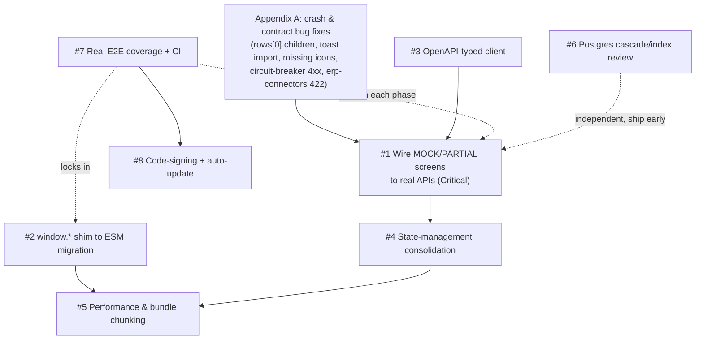
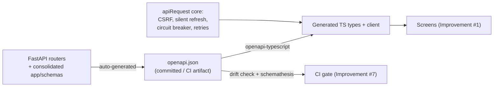

# Recommended Major Improvements — The Big Roadmap

> **Status:** Recommendation document only. Nothing in this file has been implemented.
> **Scope:** The eight structural improvements that would move Blackbox BOM from "impressive demo with a real backend hiding behind it" to "trustworthy product where every pixel reflects the database."
> **Grounding:** Every claim below comes from the read-only subsystem audits (backend core, API surface, database schema, frontend architecture, frontend UI classification, and packaging/CI/testing). File paths and line numbers are quoted from those audits. Where a feature is a **mock** or a **stub**, this document says so plainly, and where a target endpoint does not exist in the backend, this document says that plainly too — nothing here invents functionality that was not found in the audits.
> **Related documents:** `frontend/OPEN_ITEMS.md`, `frontend/MIGRATION_MAP.md`, `desktop/DESKTOP_PACKAGING.md`, `desktop/DURABILITY.md`, `DISASTER_RECOVERY_RUNBOOK.md`, `INSTALL.md`, `backend/TEST_FAILURES_TRIAGE.md`.

---

## Table of Contents

1. [Executive Summary](#executive-summary)
2. [How to Read This Document](#how-to-read-this-document)
3. [Priority & Dependency Overview](#priority--dependency-overview)
4. [Improvement #1 — Wire the ~66 MOCK + 31 PARTIAL Frontend Screens to Real Backend APIs](#improvement-1--wire-the-66-mock--31-partial-frontend-screens-to-real-backend-apis)
5. [Improvement #2 — Finish the window.* Shim → ES Module Migration](#improvement-2--finish-the-window-shim--es-module-migration)
6. [Improvement #3 — Contract-First, OpenAPI-Typed API Client](#improvement-3--contract-first-openapi-typed-api-client)
7. [Improvement #4 — State-Management Consolidation](#improvement-4--state-management-consolidation)
8. [Improvement #5 — Frontend Performance: Large Components, Re-renders, Bundle Chunking](#improvement-5--frontend-performance-large-components-re-renders-bundle-chunking)
9. [Improvement #6 — Postgres Index, Cascade & Constraint Review](#improvement-6--postgres-index-cascade--constraint-review)
10. [Improvement #7 — Real End-to-End Test Coverage (and a CI That Actually Gates)](#improvement-7--real-end-to-end-test-coverage-and-a-ci-that-actually-gates)
11. [Improvement #8 — Code-Signing + Auto-Update Hardening](#improvement-8--code-signing--auto-update-hardening)
12. [Appendix A — Critical Bug Fixes That Should Ride Along](#appendix-a--critical-bug-fixes-that-should-ride-along)
13. [Appendix B — Cross-Reference Map](#appendix-b--cross-reference-map)

---

## Executive Summary

The audits found a striking asymmetry:

- **The backend is real.** ~549 routes across 73 endpoint routers, genuinely implemented (only two intentional stubs were found in the whole surface: the ERP connector sync no-op in `backend/app/api/endpoints/erp_connectors.py:171` and the Zoho Books pull/reconcile endpoints in `backend/app/api/endpoints/zoho_books.py`). BOM explosion, rollups, snapshots, compare, quality/CAPA/FAI, inventory, work orders, webhooks, audit logs, analytics — all exist and work.
- **A large slice of the frontend does not talk to it.** The UI audit corroborated a split of roughly **~30 REAL / ~31 PARTIAL / ~66 MOCK** screens and modals (out of ~127 total). MOCK screens fabricate data with `setTimeout` "fetches", `Math.random()` feeds, and hardcoded arrays (fake actors "E. Chen"/"M. Park", a fake uptime string "99.98%", fake vendor quotes, inventory synthesized from part-number character codes).

**This is the root cause of "the UI is not in sync."** The UI is not out of sync with the backend in the sense of stale caches or timing — most of the out-of-sync screens were *never connected to the backend in the first place*. Improvement #1 is therefore the single highest-leverage item in this document, and almost all of it is frontend plumbing, not new backend work: the endpoints already exist, and `frontend/src/services/screenDataBridge.js` already exposes real bridges for most of the mocked domains.

The remaining seven improvements make that wiring safe, fast, and durable: finishing the `window.*` → ES module migration (which currently blocks bundle chunking and causes load-order crashes), generating a typed client from the backend's OpenAPI schema (so contract mismatches like the confirmed `GET /erp-connectors/latest/logs` 422 become compile-time errors instead of silently-swallowed runtime failures), consolidating the five-layer state-management mess into one owner, fixing data-loss `ON DELETE CASCADE` foreign keys and a dead tenant-isolation filter in Postgres, building an E2E suite that runs against a real backend instead of fixtures, and hardening the desktop code-signing/auto-update path (which today can ship database migrations that never apply on already-installed machines).

---

## How to Read This Document

Each improvement follows the same template:

| Field | Meaning |
|---|---|
| **Problem** | What is wrong today, with file/line evidence from the audits |
| **Why it matters** | The user-visible or business consequence |
| **Current limitation** | What the existing code can and cannot do |
| **Recommended solution** | Concrete, phased plan |
| **Benefits** | What you get when it lands |
| **Risks** | What could go wrong during/after the change |
| **Effort** | S (< 1 person-week), M (1–3 pw), L (3–6 pw), XL (6+ pw) |
| **Priority** | Critical / High / Medium / Low |
| **Dependencies** | Which other improvements (or bug fixes) must/should land first |

Beginner note on two recurring words used throughout this document:

- A **mock** is UI code that *pretends* to load data — it renders hardcoded or randomly generated values and never calls the network. It looks alive in a demo and lies in production.
- A **shim** is a compatibility bridge — here, legacy modules that register themselves on the browser's global `window` object (`window.Icon`, `window.api`, `window.toast`) so other files can use them without `import` statements. It works only if every file loads in exactly the right order.

---

## Priority & Dependency Overview

### Scoreboard

| # | Improvement | Priority | Effort | Depends on |
|---|---|---|---|---|
| 1 | Wire MOCK/PARTIAL screens to real APIs | **Critical** | XL | Appendix A crash fixes; helped by #3 |
| 2 | window.* shim → ES module migration | **High** | L | — (already mid-flight per `frontend/MIGRATION_MAP.md`) |
| 3 | OpenAPI-typed client / contract-first | **High** | M–L | Backend schema consolidation (part of this item) |
| 4 | State-management consolidation | **High** | L | Interacts with #1, #2 |
| 5 | Performance (components, re-renders, chunking) | **Medium** | M–L | #2 (chunking), #4 (re-renders) |
| 6 | Postgres index/cascade review | **High** | M | Independent; ship early (data-loss risk) |
| 7 | Real E2E coverage + CI gating | **High** | M–L | Land alongside #1 to lock in progress |
| 8 | Code-signing + auto-update hardening | **Medium–High** | M | #7 for CI automation |

### Dependency graph

Reading the graph: **#6 (database) and Appendix A (crash fixes) can start today.** #1 is the headline and should begin immediately, adopting the typed client from #3 as it becomes available. #2 runs in parallel (it is already a documented, phased migration). #5 is gated behind #2 and #4. #7 should grow with every phase so re-wired screens never regress back to mocks.

---

## Improvement #1 — Wire the ~66 MOCK + 31 PARTIAL Frontend Screens to Real Backend APIs

> **Priority: Critical — this is the root cause of "UI not in sync".**

### Problem

The UI audit classified the frontend's ~127 screens/modals into three buckets and corroborated the split by direct source reads (not just a grep pass):

- **REAL (~30):** call `apiRequest()`/`api.*`, show honest loading and error states, no fabricated fallback. Examples: `AuditTrailScreen`, `CatalogsScreen`, `WorkQueueScreen`, `ZohoBooksScreen`, `IntegrationsScreen`, `ProcurementScreen`, the enterprise/integration screens in `frontend/src/root/enterprise-screens.jsx` and `frontend/src/root/integration-screens.jsx`, `TenantsAdminScreen`, the write paths of `root/bom-editor.jsx`, and `root/collaboration.jsx` (WebSocket presence).
- **PARTIAL (~31):** fetch *some* real data, then silently fall back to (or blend in) fabricated data, or perform reads for real but fake the writes (e.g. a button that only shows a success toast).
- **MOCK (~66):** never touch the network for their main content. `setTimeout` "fetches", `Math.random()` event feeds, hardcoded arrays, fake users.

Meanwhile the backend audit confirmed that almost every one of these fabricated domains has a **real, implemented endpoint** already mounted under `/api/v1` (`backend/app/api/api_v1.py`), and `frontend/api.js` already contains ~60 endpoint groups covering them. Only two intentional stubs exist anywhere in the 549-route surface (ERP sync, Zoho pull/reconcile — both are called out explicitly below). The rest of the gap is pure UI plumbing.

### Why it matters

- **Users see data that does not exist.** `ActivityScreen` invents a random team event every 15 seconds and presents it as real activity. The dashboard shows a literal `"API Uptime 99.98%"` string. The inventory screen synthesizes stock levels from part-number character codes. In a manufacturing/procurement tool, fabricated numbers are worse than missing numbers — they can drive a real purchasing or compliance decision.
- **Users' actions silently do nothing.** OCR's "Apply to part" only toasts; DiffScreen's "Export diff" is a fake toast; VendorsScreen's preferred/active toggles mutate local state only and are lost on reload; `FindAlternatesModal`'s "Swap" toasts without doing anything.
- **The same record type shows different data in different places.** `WebhooksScreen` (REAL) vs `WebhooksModal` (MOCK); `AuditTrailScreen` (REAL) vs `AuditLogModal` (MOCK); real quality endpoints vs the mocked `QMSDashboard`/`NCRScreen`. This is exactly what "the UI is not in sync" feels like from the inside — two screens claiming to show the same thing disagree.
- **The crashes punish real usage.** The `(ctx?.rows || BOM_DATA.rows)[0].children` pattern (see Appendix A) throws precisely when the app *is* connected to the backend, because API-hydrated rows are a flat array with no `.children`. The demo path works; the real path crashes.

### Current limitation

- The frontend boots from static fixtures (`frontend/data.js` `BOM_DATA`, `frontend/projects.js` `PROJECTS`) via `frontend/src/context/AppCtx.jsx`, then hydrates from the API when `/health` succeeds — but only the `rows`/vendors/projects pipeline hydrates. Everything else that reads seeded ctx state or module-level constants stays fake forever.
- Mock components are concentrated in the legacy demo-era files: `frontend/src/root/*.jsx` (`dashboard.jsx`, `qms-dashboard.jsx`, `power-features.jsx`, `prod-additions.jsx`, `pdm-cad.jsx`, `overlays.jsx`, `modals-extra.jsx`) and `frontend/src/components/advanced/` modals.
- A handful of backend items block or complicate wiring (detailed below): one confirmed contract bug, two intentional backend stubs, and five fully-implemented routers that were never mounted.

### The wiring map — MOCK screens → target endpoints

Everything in this table exists in `frontend/api.js` and/or `frontend/src/services/screenDataBridge.js` unless marked otherwise. **Where the backend piece does not exist, that is stated plainly — do not invent it in the UI.**

| Component | File | What is fake today | Wire to (real, existing) |
|---|---|---|---|
| `ActivityScreen` | `frontend/src/components/screens/ActivityScreen.jsx` | Hardcoded actors E.Chen/M.Park; `setInterval` injects a random fake event every 15s (lines 27–80); "Mine only" hardcodes `'E. Chen'` (line 90) | `GET /api/v1/audit-logs` via `api.auditLogs.list` — the REAL `AuditTrailScreen` already demonstrates the pattern |
| `DashboardScreen` | `frontend/src/root/dashboard.jsx` | `WORKSPACE_BUDGET` module constant with fake period multipliers; `"API Uptime 99.98%"` literal; fabricated admin activity; "Save budget" mutates the constant and persists nowhere | `GET /api/v1/analytics/dashboard` (`analyticsAPI.dashboard`). **A budgets endpoint does not exist in the backend** — either add one or remove the budget editor; do not keep the fake save |
| `AIAssistant` | components/advanced | Regex-driven canned `mockReply`; `window.aiAssistant.complete` is referenced but never defined anywhere | `/api/v1/ai/*` (`aiAPI`): demand-forecast, interchangeability, validation (`ai_features.py`). **Be honest in the UI:** the backend "AI" is deterministic heuristics (a seasonal multiplier over PO history, `ai_features.py:98–155`, tagged `statistical_ma`, with fuzzy `ilike` part-name matching that can mis-attribute demand), not ML — label it accordingly, don't market it as AI-powered |
| `InternetScrapeModal` | components/advanced | `setTimeout` fake scrape; canned Digi-Key/Mouser results | `POST /api/v1/scraping` (`scrapingAPI`) — a real `httpx` fetch + regex extraction exists (`scraping.py`) |
| `PriceAlertsModal` | components/advanced | Hardcoded alerts + trend arrays | `/api/v1/price-history` (`priceHistoryAPI`) and `screenData.procurement.alerts` (bridge already exists) |
| `RFQCompareModal` | components/advanced | Hardcoded part `EL-PSU-240W` + 4 fabricated vendor quotes | `/api/v1/supplier-portal` RFQ + price-update endpoints (`supplierPortalAPI.listPriceUpdates`; RFQ respond/award are implemented in `supplier_portal.py`) |
| `InflationAnalysisModal` | components/advanced | Hardcoded category inflation series | `GET /api/v1/analytics/trends` (`analyticsAPI.trends`) + `/api/v1/price-history` |
| `QMSDashboard` | `frontend/src/root/qms-dashboard.jsx` | Literal `// Mock fetch` `setTimeout` with fake NCR/CAPA/FAI rows | `GET /api/v1/quality/...` (NCR list via `api.quality.ncr.list`), `GET /api/v1/capas` (`capaAPI.list`), `GET /api/v1/fai` (`faiAPI.list`) — all implemented (`quality_api.py`, `capa.py`, `fai.py`) |
| `NCRScreen` | `frontend/src/root/power-features.jsx` | 4 hardcoded NCRs; duplicates the QMS mock | `/api/v1/quality` NCR endpoints — or delete the screen and keep one quality surface |
| `WebhooksModal` | `frontend/src/root/power-features.jsx` | Hardcoded slack/acme/zapier hooks; also a Rules-of-Hooks bug (early `return null` before `useState`, line 1504→1506) | `/api/v1/webhooks` (`webhooksAPI`) — **the REAL `WebhooksScreen` already uses it**; strongly prefer deleting the mock modal |
| `ScheduledReportsModal`, `EmailParseModal` | `frontend/src/root/power-features.jsx` | Hardcoded rows | **No matching scheduling router exists in the audited backend surface.** Either build the endpoint first or hide these modals; do not ship fake rows |
| `InventoryScreen` | `frontend/src/root/prod-additions.jsx` | Stock/reorder/bin synthesized from part-number `charCode`s | `GET /api/v1/inventory` (`api.inventory.list`; warehouses/bins/stock/valuation all real in `inventory_api.py`) + `GET /api/v1/kanban` low-stock alerts (`kanban.py`) |
| `FindAlternatesModal` | `frontend/src/root/overlays.jsx` | Fake alternates by string-mangling the part number, fabricated vendors/stock; "Swap" toasts without doing anything | `POST /api/v1/scraping` for a live lookup. **A dedicated cross-reference/alternates endpoint does not exist** — flag as new backend work if the feature is wanted as-is |
| `AuditLogModal` | `frontend/src/root/modals-extra.jsx` | Fabricated audit events; duplicates the REAL `AuditTrailScreen` | `GET /api/v1/audit-logs` — or delete the modal and deep-link to `AuditTrailScreen` |
| PDM vault | `frontend/src/root/pdm-cad.jsx` | Only `cadAPI.vaultStats` is real; the `FILES_BY_PATH` vault tree is hardcoded; `ME='E. Chen'`; source comment "Try API first, fall back to mock" (line 1545) | `GET /api/v1/cad/vault/stats`, `GET /api/v1/cad/vault/tree` (`cad.py`) and/or the `/api/v1/solidworks` vault endpoints (`solidworks_integration.py`, 652L, the larger and more complete of the two). Note the duplication between `cad.py` and `solidworks_integration.py` (see #3) — pick one surface before wiring further |

### The wiring map — PARTIAL screens → what is missing

| Component | File | Real part | Fake part → wire to |
|---|---|---|---|
| `AnalyticsScreen` | `frontend/src/components/screens/AnalyticsScreen.jsx` | 2–3 KPIs via `analyticsAPI.dashboard`/`categories` | ALL trend charts + lead/risk/on-time KPIs are hardcoded → `analyticsAPI.trends(range)` (`GET /api/v1/analytics/trends`). Also carries the `rows[0].children` crash at 6 call sites (Appendix A) |
| `DiffScreen` | components/screens | `api.bomEnterprise.compare` call is real | BOM ids are hardcoded `1, 2`; the v3.1.0/v3.0.0 diffs are fully fabricated; "Export diff" is a fake toast → thread real BOM ids; use `revisionsAPI` (`GET /api/v1/revisions`) for version history. Note: `POST /api/v1/bom/compare` is confirmed live (`bom_enterprise.py:324`, backed by `bom_service.compare_boms`) and the frontend payload already matches it — the previously-briefed "missing /bom/compare" gap is stale and should not be re-investigated |
| `DocumentsScreen` | components/screens | `api.documents.list`/`folders` | Silent fallback to static `data.docs` masks failures → replace with honest error/empty states (`/api/v1/documents`) |
| `OCRScreen` | components/screens | `api.ocr.extract`/`upload` (real Tesseract backend) | "Apply to part" only toasts → call `api.parts.update` (`PUT /api/v1/parts/{id}`); remove the fake 1100ms re-extract spinner |
| `VendorsScreen` | components/screens | Reads `ctx.vendors` (API-hydrated or seed) | Preferred/active toggles mutate local state only → `vendorsAPI.update` (`PUT /api/v1/vendors/{id}`) |
| `ECRScreen` | `frontend/src/components/advanced/ECRScreen.jsx` | `api.eco.create` backing record + `api.eco.action` e-sign approve/implement | List is localStorage-first with fabricated seed ECRs → list from `api.eco.list` (`GET /api/v1/eco`) |
| `ComplianceScreen` | `frontend/src/components/advanced/ComplianceScreen.jsx` | Fetches compliance dashboard/packs/parts | Then hardcodes every part `rohs/reach/conflict='valid'` and falls back to 3 fabricated cert rows → use `complianceAPI.parts.status` per part (`/api/v1/compliance/...`) — this one matters for the regulated-industry roadmap, since a fake "valid" status is a compliance risk, not just a UX one |
| `CalendarScreen` | components/screens | — | localStorage + fabricated seed events; never calls the existing calendar API → `GET`/`POST /api/v1/calendar/calendar-events` (`calendar_events.py`; note the doubled path segment is a known wart, see #3) |
| `AuthScreen` | `frontend/src/root/auth-onboarding.jsx` | `App.jsx` wraps `onSignIn` in real `api.auth.login` | Fake 700ms latency; SSO button fabricates `admin@blackbox.com`; forgot-password only toasts → `/api/v1/sso` providers/authorize (real Google/GitHub/Microsoft OAuth2 in `sso.py`), `/api/v1/auth/forgot-password` (real in `auth.py`) |
| `mobile-scanner` | `frontend/src/root/mobile-scanner.jsx` | `api.parts.list` search, `api.barcodes.lookup`, PO receiving | `simulateScan` picks random demo codes (no real camera decode); missing `toast` import crashes every error path (Appendix A) → implement real barcode decode and fix the import |
| `parts-screen` | `frontend/src/root/parts-screen.jsx` | Catalog from ctx rows | Injects fabricated "library-only" parts "for realism" (line 45) → remove; source everything from `api.parts.list` |
| `detail-drawer` | `frontend/src/root/detail-drawer.jsx` | Row data real | Comments/approvals come from seeded ctx; `data.rows[0].children` crash pattern (line 26) → `/api/v1/comments`, `/api/v1/approvals` |
| `ApprovalsScreen` | `frontend/src/root/final-polish.jsx` | dataService refresh | `ctx.approvals` seeded from `INITIAL_APPROVALS`; writes only via bridge → call `approvalsAPI` (`/api/v1/approvals`) directly |
| `WorkOrdersScreen` | `frontend/src/root/power-features.jsx` | via `screenData.workOrders` bridge | Move to the `api` work-orders group (`/api/v1/work-orders`, full CRUD + operations + reports in `work_order_api.py`) |

### Backend items that are part of this improvement

These are small backend changes without which some screens cannot be wired honestly:

1. **Mount the five dead routers.** `derivatives.py`, `formulas.py`, `graph.py`, `planning.py`, `solidworks_contract.py` are imported in `backend/app/api/endpoints/__init__.py` but never `include_router`'d anywhere — verified unreachable over HTTP (no `<name>.router` reference exists outside the import). `planning.py` is the **PO-from-BOM generation and planning-summary** feature, fully implemented (`planning_service.py`, 195L) yet dead. The audit calls the fix "a 5-line change in `api_v1.py`."
2. **Fix the confirmed contract bug.** `frontend/src/root/integration-screens.jsx:49` calls `erpConnectorsAPI.logs("latest")` → `GET /erp-connectors/latest/logs`, but `erp_connectors.py:193–194` declares `get_sync_logs(connector_id: int)`, so the literal string `"latest"` fails path validation with a 422 every single time and the frontend swallows it in a `.catch()`. Either pass a real connector id or add a `/latest/logs` alias route.
3. **Surface the two intentional backend stubs honestly.** `POST /erp-connectors/{id}/sync` is an explicit no-op that records "ERP sync is not implemented for this connector type — no network" (`erp_connectors.py:171`); Zoho Books pull/reconcile/conflict-resolve return an explicit "not implemented in this build" response (`zoho_books.py`, docstring line 11 — OAuth connect, outbound push sync, and status/mappings ARE real and functional today). The UI must show these as "not available yet," not as spinners or fake success toasts.

### Recommended solution

**Phase 0 — unblock (days).** Land the Appendix A crash fixes first, because they fire exactly when screens connect to real data: the `rows[0].children` flat-vs-tree crash (6+ files), the `mobile-scanner.jsx` missing `toast` import, `GlobalSearchModal`'s nonexistent `Icon.Package`/`Icon.Shield`/`Icon.Alert`, the `WebhooksModal` Rules-of-Hooks violation, and the `apiRequest` circuit breaker counting 4xx as outages.

**Phase 1 — kill the liars (1–2 weeks).** Rewire or delete every MOCK that duplicates an existing REAL screen (`WebhooksModal`, `AuditLogModal`, `NCRScreen` vs. the quality endpoints). Deleting is often better than rewiring: one surface per record type, so users never see the same thing described two different ways.

**Phase 2 — rewire by domain (4–8 weeks, parallelizable).** Work domain-by-domain (quality → inventory → analytics/dashboard → procurement modals → PDM/CAD → calendar/activity), copying the established REAL pattern verbatim — the audit explicitly names `AuditTrailScreen`, `CatalogsScreen`, and `WorkQueueScreen` as reference implementations: `apiRequest`/`api.*` + loading `Spinner` + honest `EmptyState` on error + **no fabricated fallback**. The codebase already converged on this pattern in its newer code (comments like "R9 fix" and "Honest failure — do not fall back to fabricated/sample rows" appear in the audited files); the mocks are demo-era leftovers, not a house style to preserve.

**Phase 3 — finish the PARTIALs (2–4 weeks).** Replace silent fallbacks with honest empty/error states; make every fake write (OCR apply, vendor toggles, diff export, alternates swap) either perform the real mutation or disappear from the UI.

**Phase 4 — guard (ongoing).** Add a lint/CI rule that greps for the mock signatures (`setTimeout(...resolve`, `Math.random()` in data paths, `// Mock fetch`) in screen files, and add an E2E smoke test per rewired screen (see #7) so screens cannot silently regress to fixtures in a later change.

**Definition of done per screen:** renders from the API, shows a spinner while loading, shows an honest error/empty state on failure, performs real mutations against the backend, and has no hardcoded business data left in the file.

### Benefits

- Directly fixes "UI not in sync" at its root — the UI becomes a view of the database, full stop.
- Unlocks already-paid-for backend value (the quality suite, inventory, planning/PO-from-BOM, supplier portal, analytics trends) that users currently cannot reach at all.
- Removes actively misleading data (fake activity, fake uptime, fake compliance "valid" statuses) — a genuine trust issue, and for the regulated-industry roadmap, a genuine compliance issue.

### Risks

- **Volume:** roughly 97 non-REAL components. Mitigate with domain batching, the reference-implementation pattern, and deleting duplicates instead of rewiring them.
- **Latent crashes surface as mocks disappear** — that is precisely what the `rows[0].children` bug is. Phase 0 plus per-screen E2E smoke tests (#7) are the mitigation.
- **Perceived regression:** honest empty states look "emptier" than rich fake data on a fresh install. Consider a clearly-labeled demo-data seeding path (the backend already has `backend/seed_db.py`) rather than in-UI fabrication.

### Effort / Priority / Dependencies

- **Effort:** XL (the largest item in this document, but highly parallelizable and mostly mechanical after the first domain is done).
- **Priority:** **Critical.**
- **Dependencies:** Appendix A fixes (hard), #3 typed client (soft — start #1 immediately, adopt the typed client per-domain as it lands), #7 E2E coverage (soft — grow it alongside).

---

## Improvement #2 — Finish the window.* Shim → ES Module Migration

### Problem

The frontend is a **hybrid**: `frontend/src/main.jsx` performs *ordered side-effect imports* — i18n first, then the plain-JS data layer (`../api.js`, `../data.js`, `../projects.js`, `../cloud-sync.js`), then ~20 legacy `frontend/src/root/*.jsx` modules that each self-register components on `window` (e.g. `window.Icon` at `src/root/icons.jsx:474`, `window.App`, `window.TweaksPanel`), and only *then* `root/app.jsx`, which mounts React. Per `frontend/OPEN_ITEMS.md` (v1.48), **~1,094 `window.*` references remain**. `frontend/MIGRATION_MAP.md` documents the intended end state; `frontend/src/globals.js` is the ESM re-export hub ("Phase 3 complete") but its API list omits eleven newer API groups (`workOrdersAPI`, `ecoAPI`, `esignatureAPI`, `substanceComplianceAPI`, `inventoryAPI`, `qualityAPI`, `userDataSyncAPI`, `calendarEventsAPI`, `catalogsAPI`, `tenantsAPI`, `bomItemsAPI`), so the "import from here instead of window" promise is incomplete.

Concrete failures already caused by the shim pattern (from the audits):

- **Load-order landmine:** `NavRail.jsx` (lines 15–106) and `TopBar.jsx` (lines 16–20) reference `Icon` in module-scope JSX *without importing it* — it resolves via `window.Icon` only because `main.jsx` happens to import `icons.jsx` first. Reordering imports, or importing `NavRail` standalone (e.g. in a test), throws `ReferenceError` at module evaluation. `globals.js` already exports `Icon` — the files simply don't use it.
- **Missed conversion = production crash:** the v1.48 migration converted 290 `window.toast` calls to ES imports across 50 files and removed the global guard patterns — but missed `frontend/src/root/mobile-scanner.jsx`, which still calls `toast()` at 7 sites. Every camera-denied / lookup-failure / receive / inventory path now throws `ReferenceError`.
- **Bundle chunking is blocked:** `frontend/vite.config.ts` deliberately restricts `manualChunks` to a single react/react-dom/scheduler vendor chunk **because the `root/*.jsx` modules are mutually circular** and manual splitting previously produced TDZ ("Cannot access 'X' before initialization") crashes — this is why Improvement #5's chunking work is gated on this item.
- **Lazy-loading indirection:** `frontend/src/components/LazyScreens.jsx`'s `createLazyScreen(importFn, globalName)` dynamic-imports a legacy module *purely for its window-registration side effect*, then reads the component off `window[globalName]`, wrapping it in an `ErrorBoundary` with a diagnostic panel if the global never registered. Several screens (`PartsScreen`, `BomShell`, `VendorsScreen`, `ProcurementScreen`) must first chain a prerequisite import of the large `root/bom-editor.jsx` just to obtain `LeadHeat`/`Sparkline`/`STATUS_CLASS` globals.
- Navigation mixes `window.__nav?.()` (e.g. `ActivityScreen` line 198) with React Router's `setRoute`; some screens self-register (`window.WorkQueueScreen = ...`) while others use plain exports.

### Why it matters

Every `window.*` reference is an invisible dependency that no tool can see: the bundler cannot tree-shake or split it, tests cannot import a file in isolation, TypeScript/ESLint cannot check it, and correctness depends entirely on a hand-maintained import order inside `main.jsx`. The mobile-scanner crash is the proof case: the migration is *safe when complete and dangerous when partial* — every remaining window-consumer is a potential missed conversion waiting to ship.

### Current limitation

- Any module that is imported before its window-provider registers crashes at evaluation time.
- Circular dependencies among `root/*.jsx` prevent any code-splitting beyond the single vendor chunk (a load-bearing comment in `vite.config.ts` records the past incident).
- New code cannot rely on `globals.js` alone because its re-export list is stale relative to the newer API groups.

### Recommended solution

1. **Complete `globals.js` first (S).** Add the eleven missing API groups so every consumer has a clean import target. This turns each subsequent conversion into a mechanical find-and-replace.
2. **Convert consumers before providers.** For each of the ~1,094 references: add the explicit import from `globals.js` (or the source module) while keeping the window registration temporarily. Start with the known landmines: explicit `Icon` imports in `NavRail.jsx`/`TopBar.jsx`.
3. **Break the `root/*.jsx` cycles.** Extract the shared leaf utilities that cause cycles (e.g. `LeadHeat`, `Sparkline`, `STATUS_CLASS` out of `bom-editor.jsx`) into dependency-free modules. This is the specific unlock that `manualChunks` in #5 needs.
4. **Retire `LazyScreens`' window indirection.** Once a screen module has a real export, `createLazyScreen` becomes plain `React.lazy(() => import('...'))` — delete the `window[globalName]` resolution and the prerequisite-import chains it required.
5. **Enforce with lint, not discipline.** Add an ESLint rule (`no-restricted-globals`, or a custom rule) that fails CI on new `window.<KnownGlobal>` references, with a shrinking allowlist. The `window.toast` incident shows grep-based one-shot migrations leave stragglers; a linter catches them permanently, going forward.
6. **Remove providers last.** When a global's consumer count reaches zero, delete the `window.X = ...` registration and remove `X` from the allowlist. Track progress in `frontend/MIGRATION_MAP.md`, as already practiced.

### Benefits

- Eliminates an entire class of load-order crashes (two already shipped: the `toast` incident, and the latent `Icon` landmine waiting to happen).
- Unlocks real route-level code splitting (#5) — the single-vendor-chunk restriction exists only because of the `root/*.jsx` cycles.
- Files become independently importable, which makes unit tests per screen possible (#7).
- Static analysis (ESLint, tsc, and the typed client in #3) finally sees the whole dependency graph instead of guessing at `window` shapes.

### Risks

- Cycle-breaking refactors in `root/*.jsx` can reintroduce TDZ crashes — exactly the incident `vite.config.ts`'s comment records. Mitigate by converting consumers first (no behavior change), breaking cycles in small PRs, and keeping the E2E smoke suite (#7) running on every PR.
- The dual system persists throughout the migration; the lint allowlist is what keeps it shrinking instead of drifting back up.

### Effort / Priority / Dependencies

- **Effort:** L (mechanical but wide; the v1.48 migration proved ~300 references per batch is a feasible pace).
- **Priority:** **High.**
- **Dependencies:** none to start; #5 depends on this. Coordinate with #1 so rewired screens are converted to explicit imports as they are touched anyway.

---

## Improvement #3 — Contract-First, OpenAPI-Typed API Client

### Problem

The API contract between backend and frontend is maintained **by hand on both sides**, and it shows:

- **Confirmed mismatch:** `integration-screens.jsx:49` sends the string `"latest"` into an `int` path parameter → guaranteed 422, silently swallowed (`erp_connectors.py:193`).
- **Stale beliefs travel:** a previously-briefed claim that "the frontend calls `/bom/compare` but it's missing" turned out to be **false** on direct inspection — `POST /api/v1/bom/compare` exists (`bom_enterprise.py:324`, backed by `bom_service.compare_boms`) and the frontend payload (`{bom_id_1, bom_id_2}`) matches it exactly. Teams were reasoning about the contract from memory, in both directions, which a generated client would have made unnecessary.
- **Schema sprawl:** only **20 of 73** endpoint modules import from `app/schemas`; the other ~53 define inline Pydantic models per file, and some endpoints return raw dicts with no `response_model` at all.
- **Path warts that a generator would have flagged immediately:** doubled prefixes `/api/v1/sessions/sessions/...` (`sessions.py`), `/calendar/calendar-events` (`calendar_events.py`), `/compliance/compliance/...` (already knowingly mirrored by `frontend/api.js:1007–1026`); a trailing-slash special case `'/esignatures/'`; two routers sharing the `/enterprise` prefix (`service_bom.py` + `enterprise_ext_api.py`) and two sharing `/manufacturing` (`routing_api.py` + `resource_api.py`).
- **Duplicate surfaces for one resource:** `po_order.py` (`/po-orders`, read-only raw selects) vs. `procurement.py` (`/procurement`, full CRUD via a service) over the *same* `POHeader`/`POLineItem` models; `cad.py` re-implements five `/solidworks` routes with its own self-contained ORM logic; two separate BOM-template systems (`/bom-templates` vs. `/bom/templates` inside `bom_enterprise.py`).
- `frontend/api.js` is a single ~1,445-line hand-written file (~60 endpoint groups) with no type information at all.

### Why it matters

Every hand-maintained pair of (backend route, frontend caller) is a place where the two can silently drift — and #1 is about to add dozens of new callers, all hand-written under time pressure. Without a generated, typed client, the erp-connectors class of bug (wrong parameter type, wrong path, wrong payload shape) can only be found at runtime, and — because the frontend's error handling frequently `.catch()`es silently — often not even then.

### Current limitation

- FastAPI already generates a full OpenAPI document (this is built into FastAPI and is how `/docs` works), but nothing in this codebase consumes it: no generated types, no generated client, no CI contract check.
- Inline per-file Pydantic models mean the OpenAPI schema names are noisy and sometimes duplicated, which makes generated types unpleasant to use until the schemas are consolidated.
- Nothing today prevents a backend PR from renaming a field and shipping while the frontend still sends the old name — the failure surfaces as a runtime 422 or a silently-empty field, not a build error.

### Recommended solution

1. **Snapshot the schema (S).** Export `openapi.json` at build time and commit it (or publish it as a CI artifact). Add a CI job that regenerates it and fails on an uncommitted diff — this alone makes every contract change *visible in code review*.
2. **Generate TypeScript types + client (M).** Use `openapi-typescript` (types) plus a thin typed fetch wrapper (e.g. `openapi-fetch`), or a full generator of choice. **Critically: keep `apiRequest()`'s hard-won behaviors** — cookie auth with deduplicated silent refresh, the CSRF double-submit header, the per-resource circuit breaker, bounded retry with `Retry-After` handling — by making the generated client call through the existing core rather than replacing it. While in there, fix the Appendix A gap where multipart uploads (`documentsAPI.upload`, `ocrAPI.upload`, `bulkImportAPI.upload`, `catalogsAPI.importUpload`) currently bypass CSRF/refresh entirely via raw `fetch`.
3. **Adopt per-domain during #1.** As each screen domain is rewired, its calls move from the hand-written `api.js` groups to the new typed client. `api.js` shrinks gradually instead of requiring a big-bang cutover.
4. **Consolidate backend schemas (M, parallel).** Move the ~53 files' inline models into `app/schemas`, add `response_model` where raw dicts are currently returned, and normalize the path warts (alias-then-deprecate the doubled prefixes — keep `/sessions/sessions/...` responding while introducing the clean path, since desktop installs update on their own schedule and cannot be forced to upgrade instantly). Decide the canonical surface for each duplicated resource (`procurement.py` over `po_order.py`; `/solidworks` over `cad.py`'s copies; one BOM-template system, not two) and deprecate the loser explicitly.
5. **Contract tests in CI (S).** Schemathesis (or an equivalent fuzzer) exercises endpoints against the live schema; combine with the `openapi.json` drift check from step 1.

### Benefits

- Contract mismatches become **compile-time errors** in the frontend and **red CI** on the backend — the `"latest"`-into-`int` class of bug becomes structurally impossible to ship.
- The 549-route surface becomes self-documenting for every future screen touched in #1.
- Backend schema consolidation pays down the inline-model sprawl and the duplicate-surface confusion at the same time, as a side effect rather than a separate project.

### Risks

- Generated types are only as good as the schema — raw-dict endpoints produce `unknown`/loose types until `response_model` is added (this is actually a feature: it makes visible exactly where the contract is currently undefined).
- Path normalization can break stale desktop clients if done as a rename instead of alias-then-deprecate.
- Generator lock-in is minor as long as the generated client stays a thin layer on top of the existing `apiRequest` core rather than replacing its behaviors.

### Effort / Priority / Dependencies

- **Effort:** M for the generation pipeline + client; M for backend schema consolidation (parallelizable router-by-router).
- **Priority:** **High** (it multiplies the safety of #1, which is about to touch nearly every screen).
- **Dependencies:** none to start; consumed incrementally by #1; enforced going forward by #7.

---

## Improvement #4 — State-Management Consolidation

### Problem

Client state is spread across **five competing layers** with no single owner:

1. **A god-context:** `frontend/src/context/AppCtx.jsx` holds ~50 `useState` fields in one provider (rows, vendors, modal, theme, a11y, density tweaks via `window.useTweaks`, auth, API cache state, popover refs). The context value is a fresh ~70-key object on **every** render with **no `useMemo`** (lines 426–503), so *every* consumer re-renders on *any* of those ~25 state slices changing. It also assigns `window.apiConnected` and `window.AppCtx` **during render** (lines 51, 424) — an impure render side effect that is fragile under React StrictMode/concurrent rendering.
2. **Static fixtures blended with live data:** `switchProject` (line 238) replaces `rows`/rollup with `PROJECTS` fixture data **even when the API is connected**; `TopBar.jsx` hard-codes four demo projects (ATLAS/HORIZON/ATLAS-LITE/NEBULA) and a subassembly jump list; `NavRail.jsx` falls back to the user "Elena Chen" and ships a client-side "Switch role (demo)" menu (permissions are explicitly UI-only per the AppCtx comment, with no server-side enforcement implied).
3. **Three different persistence layers:** `localStorage` via `utils/storage.js`, plus `dataService.js` (an offline write queue / online-sync bridge), plus `screenDataBridge.js` (API-first with a localStorage fallback) — each with slightly different fallback semantics and no single documented precedence rule.
4. **A hardcoded identity bug:** `bomId = project?.id || project?.bomId || data?.project?.id || 1` (AppCtx line 236 — the code's own comment admits no real `bom_id` is threaded through yet). Structural BOM edits and `api.bomEnterprise.items.list` therefore target **BOM 1** whenever the project object lacks an id. Once multiple real BOMs exist in a tenant, this silently writes to the wrong BOM.
5. **A shape schism:** API-hydrated `ctx.rows` is a **flat array** (`convertApiPartsToTree` in `frontend/src/utils/bom.js:25` returns rows with no `.children` field) while roughly ten call sites still assume the demo tree shape `rows[0].children` — this is the single most common crash class in the app (Appendix A). A fire-and-forget effect `dataService.set('parts', rows)` (line 365) also runs on **every** rows change, including fixture rows, relying entirely on `dataService` to reject writes that shouldn't happen.

### Why it matters

- The god-context's render behavior makes the whole app effectively re-render on nearly every interaction — this is the primary driver behind #5's re-render problem, not a separate issue.
- Two sources of truth (fixtures vs. API) with implicit, code-path-dependent switching is the *mechanism* by which mock data can leak back into a "connected" session — it actively undermines #1 even after a screen has been correctly rewired.
- The `bomId || 1` fallback is a latent **cross-BOM data-corruption** path, not merely a cosmetic bug — it can misdirect real structural writes.

### Current limitation

- There is no server-cache layer: every screen hand-rolls its own fetch/loading/error/staleness handling, which is precisely why "silently fall back to fixtures" felt like a reasonable pattern to whoever wrote it.
- React context cannot be subscribed to selectively — a single provider guarantees the maximal possible re-render blast radius by construction.
- Demo data has no explicit boundary: nothing marks a given row, vendor, or project as fixture-origin versus API-origin.

### Recommended solution

1. **Introduce a server-state library (TanStack Query or equivalent) as the single owner of backend data (M).** Every screen rewired in #1 fetches its data via a query hook keyed by endpoint + params, with caching, request deduplication, and honest `isLoading`/`isError` flags — the REAL-screen pattern, standardized and no longer hand-rolled. Mutations invalidate queries instead of hand-syncing ctx fields.
2. **Split the god-context (M).** Carve `AppCtx` into small, stable-value providers: `AuthCtx`, `ThemeCtx` (theme/a11y/density/accent), `UICtx` (modal/popover/nav) — and *nothing* for server data, since the query layer now owns it. Memoize every provider's value. Move the `window.apiConnected`/`window.AppCtx` assignments into effects (or delete them entirely as #2 removes their remaining consumers).
3. **Thread real identity (S–M).** Replace `bomId || 1` with an explicit, required `bomId` sourced from the route or an actual project selection; make BOM-item calls impossible to issue without it (the typed client from #3 can enforce a non-optional parameter at the type level). Replace `TopBar`'s hardcoded project list with real `api.projects` data.
4. **Quarantine demo data (S).** Fixtures (`BOM_DATA`, `PROJECTS`, `INITIAL_*`) should live behind one explicit `demoMode` flag that is *only* ever set when the health check fails (the intentional local-first offline path). No code path may blend fixture and API data within the same session; `switchProject` must not load fixtures while `apiConnected` is true.
5. **One canonical rows shape (S, paired with Appendix A).** Adopt flat-with-parent-refs (what the API already produces) as the canonical shape, provide `toTree()`/`flatten()` helpers in `utils/bom.js`, and migrate every `rows[0].children` call site to use them.
6. **Collapse the persistence layers (M).** `screenDataBridge.js`'s API-first behavior is subsumed by the new query layer; `dataService.js` remains solely responsible for the offline write-queue that the local-first principle requires; `storage.js` keeps only UI preferences (theme, density, collapse state).

### Benefits

- Re-render blast radius collapses (a direct prerequisite for #5), and the fetch/loading/error boilerplate that #1 requires per screen shrinks to roughly five lines instead of hand-rolled state.
- The fixture/live boundary becomes structural instead of a matter of convention — mock data can no longer leak into a connected session by accident.
- Eliminates the `bomId || 1` data-corruption path entirely.

### Risks

- Context splitting touches nearly every screen — do it while screens are already open for #1's rewiring work, not as a separate big-bang refactor.
- The offline/local-first path (a stated project principle) must keep working through this change: the query layer needs an explicit offline story (serve from cache, queue writes via `dataService`), and that path needs its own E2E coverage (#7).

### Effort / Priority / Dependencies

- **Effort:** L overall (M for the query layer, M for the context split, S–M for the identity/demo-data cleanup).
- **Priority:** **High.**
- **Dependencies:** rides along with #1; enables #5.

---

## Improvement #5 — Frontend Performance: Large Components, Re-renders, Bundle Chunking

### Problem

Three compounding performance problems, all documented directly in the audits:

1. **Re-renders:** the unmemoized ~70-key `AppCtx` value means every context consumer re-renders whenever any one of ~25 state slices changes — "nearly every interaction," per the architecture audit (see #4 for the root cause).
2. **Bundle chunking is disabled by design:** `frontend/vite.config.ts` restricts `manualChunks` to a single react/react-dom/scheduler vendor chunk because the mutually-circular `root/*.jsx` modules caused TDZ crashes when previously split (see #2). Route-level `React.lazy` exists for ~44 screens, but each lazy screen loads legacy modules *purely for their window side effects*, and several chain a prerequisite import of the large `root/bom-editor.jsx` just to obtain `LeadHeat`/`Sparkline`/`STATUS_CLASS` globals — so "lazy" screens still drag heavyweight shared modules along with them.
3. **Oversized files and legacy weight:** `frontend/api.js` is ~1,445 lines / 55KB loaded up front as a side-effect import on every boot; roughly 726 inline styles remain against the `ent-*` utility-class migration (per `frontend/OPEN_ITEMS.md`); legacy monolith files such as `root/pdm-cad.jsx`, `root/power-features.jsx`, `root/overlays.jsx`, and `root/enterprise-screens.jsx` each bundle many unrelated screens/modals together, so importing any one of them evaluates all of them.

Adjacent, service-worker-related waste (from the architecture audit of `frontend/public/sw.js`): the cache-first branch actually matches **all** same-origin non-navigation, non-`/api/` requests — not just content-hashed `/assets/*` as its own comment claims — so non-hashed files (`manifest.json`, `bbf-logo.svg`, locale files) get cached forever under the `bbox-v2` cache name until it is manually bumped, partially re-creating the exact stale-bundle incident the v2 rewrite was supposed to fix. Meanwhile nothing ever calls `cache.put()` for the app shell, so the offline fallback is effectively dead code — a true offline reload gets the browser's own error page, not the app, which sits at odds with the project's local-first principle.

### Why it matters

- On the desktop bundle (the backend serves `frontend/dist` on `127.0.0.1:8756`), download size matters less — but parse/evaluate cost, re-render churn, and memory pressure still hit every user on every launch and every keystroke.
- For any browser-served deployment (the Docker/nginx path in `docker-compose.yml`), the single-chunk bundle means first paint pays the cost of all ~44 screens at once.
- Stale-asset caching in `sw.js` directly causes "I updated but the UI didn't change" reports — another flavor of "UI not in sync," distinct from but easily confused with Improvement #1's data-freshness problem.

### Current limitation

- Chunking **cannot** be safely enabled until #2 breaks the `root/*.jsx` cycles — this is a hard dependency, recorded in the `vite.config.ts` comment itself.
- Re-render fixes are blocked on the #4 context split; there is no smaller fix available first.
- No performance budget or automated measurement exists in CI today.

### Recommended solution

1. **Measure first (S).** Add `rollup-plugin-visualizer` (or Vite's own build stats) to the build and record a baseline: total JS, per-chunk sizes, and a React Profiler trace of a typical BOM-editing session. Set explicit budgets (e.g. initial JS size, maximum re-renders per keystroke) so subsequent improvements are provable rather than assumed.
2. **Land #4's context split with memoized provider values first (the single biggest re-render win),** then add `React.memo` to heavy leaf components (tables, tree rows) and `useMemo` for derived data (the flatten/rollup computations used in screens like `AnalyticsScreen`).
3. **After #2's cycle-breaking lands: enable real chunking (M).** Split vendor and per-route chunks; let each screen import shared utilities (`LeadHeat`, `Sparkline`, `STATUS_CLASS`) from small leaf modules instead of prerequisite-importing all of `bom-editor.jsx`. Break the multi-screen monoliths (`power-features.jsx`, `enterprise-screens.jsx`, `overlays.jsx`, `pdm-cad.jsx`) into one file per screen as they are touched during #1 anyway.
4. **Split `api.js` by domain (S–M).** As #3's generated client is adopted per-domain, the hand-written `api.js` groups shrink and can be imported per-screen rather than as one 55KB up-front side effect.
5. **Fix `sw.js` to match its own stated policy (S).** Restrict the cache-first branch to `/assets/` (content-hashed files) only; then either implement the offline shell properly (pre-cache `index.html`, `cache.put()` on the network-first path) or delete the dead fallback code entirely so behavior matches the local-first story the project claims.
6. **Virtualize the largest lists (M, as needed, after measurement).** BOM trees/tables with thousands of rows should use windowing (e.g. `react-window`) — evaluate this based on the step-1 measurements rather than applying it by default everywhere.

### Benefits

- Faster launches on desktop, a smaller first paint on the web deployment, and an interaction-latency floor that stops degrading every time a new screen is added.
- Ends the stale-asset flavor of "UI not in sync" that is distinct from (and easily mistaken for) Improvement #1's problem.
- Budgets enforced in CI (#7) keep these gains from silently regressing later.

### Risks

- Chunking too early, before #2's cycles are broken, re-triggers the exact TDZ crash class already recorded in `vite.config.ts`'s comment — respect that dependency and roll changes out behind the E2E smoke suite.
- Service-worker changes are notoriously sticky in production (an old SW can keep controlling old tabs indefinitely); the existing activate-time purge-all-caches behavior in `sw.js` is the safety valve here — keep it even while fixing the caching-scope bug.

### Effort / Priority / Dependencies

- **Effort:** M–L.
- **Priority:** **Medium** overall (but **High** specifically for the cheap `sw.js` correctness fix).
- **Dependencies:** #2 (hard, required for chunking), #4 (hard, required for the re-render fixes), #3 (soft, for splitting `api.js`).

---

## Improvement #6 — Postgres Index, Cascade & Constraint Review

### Problem

The schema audit (47 Alembic migrations, single linear head `047_solidworks_integration`, ~70 model modules) found the overall structure broadly coherent — tenant-scoped unique keys, a closure table for BOM explosion (`bom_closures`, migration 039), partial unique indexes done correctly in the Zoho tables — but surfaced a set of concrete **data-loss and integrity landmines**:

1. **Over-aggressive `ON DELETE CASCADE` on reference/ownership foreign keys (real data loss):**
   - `parts.primary_vendor_id → vendors.id ON DELETE CASCADE` (`app/models/part.py:80`): **deleting a vendor hard-deletes every part that lists it as primary vendor.** This should be `SET NULL`.
   - `boms.created_by → users.id CASCADE` (`app/models/bom.py:35`): deleting a user deletes every BOM they created.
   - `bom_templates.createdById CASCADE` (`app/models/bom_template.py:21–23`): deleting a user deletes their templates.
   - `inventory_transactions.performed_by CASCADE` (`app/models/inventory.py:180`): deleting a user **erases historical inventory audit rows** — a serious problem for a tool with regulated-industry ambitions, where 21 CFR Part 11 e-signatures elsewhere are deliberately write-once precisely to avoid this class of loss.
2. **Check-constraint vs. application-validator mismatch:** `InventoryTransaction`'s Python listener allows `{po, work_order, transfer, adjustment, receipt, issue, return}` (`app/models/inventory.py:133–141, 197–206`) but the DB `CheckConstraint` allows `('po','work_order','transfer','adjustment','sales_order','return')` (lines 171–174) — `'receipt'`/`'issue'` pass the application check and then raise `IntegrityError` at flush time on Postgres; `'sales_order'` is legal at the DB level but rejected by the Python listener. `InventoryReservation` has **no DB CHECK at all**, so it enforces `'sales_order'`/`'forecast'` only in application code.
3. **Unique-constraint NULL hole:** `uq_inventory_part_location_lot` (part, warehouse, bin, lot) includes nullable `bin_location_id`/`lot_number`; under Postgres's default NULLS-DISTINCT semantics, unlimited duplicate rows are allowed for the most common case — un-binned, un-lotted stock — which defeats the entire purpose of the unique constraint. The Zoho sync tables (`app/models/zoho_sync.py:61–69`) already solve this identical problem correctly with **partial unique indexes** — that pattern should simply be copied here.
4. **Numeric overflow risk:** `bom_items_master.unit_cost_snapshot`/`extended_cost` are `Numeric(10,4)` (max 999,999.9999), inconsistent with the project's own `Numeric(18,4)` money standard set by migration 033; `inventory.unit_cost` and `inventory_transactions.total_cost` have the same narrower width. A large assembly line's extended cost (quantity × unit cost) can overflow.
5. **Inverted adjacency lists:** both `BOMItem.children` (`app/models/bom.py:88`) and `BomItem` (`app/models/bom_item.py:38–45`) put `remote_side=[id]` on the attribute *named* `children`, which actually makes it the scalar many-to-one side, with the `parent` backref becoming the collection — the names are semantically backwards. The legacy `BomItem` model additionally hangs `cascade='all, delete-orphan', single_parent=True` on that same inverted side. Any code that trusts the attribute names (`item.children`, `item.parent`) will misbehave.
6. **The single most severe finding in the audits — a dead tenant-isolation filter:** the automatic ORM SELECT tenant filter in `app/core/tenant_events.py:43–69` is dead code. It reads `execute_state.mapper_`, an attribute that **does not exist** on SQLAlchemy 2.0.48's `ORMExecuteState` (only `bind_mapper`/`all_mappers` exist); the resulting `AttributeError` is caught and swallowed, and a runtime reproduction against the project's own virtual environment confirmed the query returned **both tenants' rows** with the listener installed. Read isolation today rests entirely on explicit per-service `WHERE tenantId = ...` filters plus the opt-in Postgres RLS layer (`ENABLE_RLS`, default `False`) — not on the advertised automatic layer. The fix is a one-line change (`mapper_` → `bind_mapper`).
7. **Isolation gap on deliberately global tables:** `part_certifications` (alongside `compliance_packs`/`compliance_pack_items`, `app/models/compliance.py:44–83`) carries per-part certification data but has no `tenantId` column, gets no RLS policy (migration 040 discovers tables to protect by looking for a `tenantId` column), and is accessed exclusively via raw SQL in `compliance_api.py` — any raw-SQL query that forgets a manual tenant filter can leak certification data across tenants.
8. **Hygiene items:** three migration files share the `041_` filename prefix while `041_zoho_books_sync_tables` actually revises `044_compliance_evaluations` — the on-disk numbering does not reflect chain order, which is a trap for anyone inserting a future revision by filename; `seed_db.py` bootstraps via `Base.metadata.create_all` without ever stamping `alembic_version`, so a seeded database diverges from migration-managed DDL; the RLS migration `040` silently no-ops unless `ENABLE_RLS` is true **at the moment the migration runs** — flipping the flag on afterward requires a documented downgrade/re-upgrade dance, since Alembic will not automatically re-run an already-applied revision.

Good news worth recording plainly: the two Postgres-only Alembic bugs previously tracked as open issues (a `VARCHAR(32)` `version_num` column that breaks on longer revision ids; `env.py` ignoring `.env`) are **both already fixed** in `backend/alembic/env.py`.

### Why it matters

Items 1–4 are silent until the day they aren't: a routine "clean up old vendors" action mass-deletes parts; a user-offboarding step erases inventory audit history; a large assembly's cost rollup throws a numeric overflow mid-quarter. Item 6 means the advertised automatic tenant read-isolation layer contributes nothing today — that is exactly the kind of failure that destroys trust in a system of record once discovered.

### Current limitation

- No migration exists yet to correct the FK actions; cross-tenant read protection depends entirely on developer discipline (remembering explicit filters) plus the opt-in RLS layer.
- No test currently asserts FK-action behavior ("deleting a vendor must not delete parts") or checks that the application-level and database-level constraints agree with each other.

### Recommended solution

1. **Ship the one-line fix first:** `tenant_events.py`'s `mapper_` → `bind_mapper`, plus a genuine cross-tenant read test that would have caught the bug originally (the audit notes existing tests only pass today because services already filter explicitly, independent of this broken listener).
2. **Cascade-correction migration (048):** change `parts.primary_vendor_id` to `SET NULL`; change `boms.created_by`, `bom_templates.createdById`, and `inventory_transactions.performed_by` to `SET NULL` (or `RESTRICT` wherever an owner is meant to be mandatory). Write the rule down for future models: **CASCADE only within a true composition relationship** (a BOM cascading to its own items, a tenant cascading to its own rows) — **never on a reference or audit foreign key.** Audit the remaining ~70 models against that one rule while the migration is being written.
3. **Constraint-parity migration:** align `InventoryTransaction`'s DB `CHECK` with the Python `ALLOWED_REFERENCE_TYPES` set (deliberately choose the union), add the missing `CHECK` to `InventoryReservation`, and add a small test that reads both the model's allowed set and the constraint's allowed set from one shared source of truth so they cannot drift apart again.
4. **Partial unique indexes for inventory**, copying the `zoho_sync.py` pattern, on the NULL-ambiguous `(part, warehouse, bin, lot)` combination.
5. **Money-width migration:** widen the four `Numeric(10,4)` money columns identified above to `Numeric(18,4)`, matching the existing 033 standard.
6. **Fix the inverted BOM relationships** in `bom.py`/`bom_item.py` so the attribute named `children` is actually the collection, with a unit test asserting `item.children` returns the child rows.
7. **Decide `part_certifications`'s tenancy explicitly:** either add a `tenantId` column (bringing it under both RLS and ORM filtering) or centralize all of its raw-SQL access behind one audited helper function that always applies `tenant_sql_clause()`.
8. **Index review pass:** with the closure table (`bom_closures`) already well-indexed, verify indexes exist for the hottest FK joins and tenant-scoped list queries that #1's newly-wired screens will start exercising for real (audit-logs filtered by `entityType`, inventory filtered by part/warehouse, quality lists) — measure with `EXPLAIN` on realistic data volumes rather than guessing which indexes matter.
9. **Migration hygiene:** adopt strictly increasing revision ids going forward (no more triple-`041_` collisions), change `seed_db.py` to run `alembic upgrade head` (or at minimum stamp the head) instead of a bare `create_all`, and document the `ENABLE_RLS` re-apply trap explicitly in `INSTALL.md`.

### Benefits

- Eliminates the mass-delete and audit-erasure landmines before real production data accumulates — now is the cheapest time in the product's life to fix these foreign-key actions.
- Application-level and database-level validation stop disagreeing with each other; the inventory dedupe constraint finally dedupes the common case.
- Tenant read isolation becomes genuinely enforced (via a one-line fix) instead of merely advertised in the architecture docs.

### Risks

- Foreign-key-action migrations rewrite constraints on potentially large tables, which briefly locks them — run this in a maintenance window on desktop installs, which also depends on #8 first fixing the desktop migration gap, since desktop installs currently never run Alembic at all in the normal case.
- Widening a numeric column is always safe; *narrowing* one is not — every migration proposed here only widens storage or tightens constraint actions, never the reverse.

### Effort / Priority / Dependencies

- **Effort:** M (a handful of focused migrations plus tests; the index review pass is bounded in scope).
- **Priority:** **High** (the `tenant_events` fix and the vendor-CASCADE fix individually are close to Critical on their own).
- **Dependencies:** none — this can start immediately. It interacts with #8, since desktop installs must actually be able to apply these migrations once they exist.

---

## Improvement #7 — Real End-to-End Test Coverage (and a CI That Actually Gates)

### Problem

The safety net has holes in exactly the places the previous six improvements will need it most:

- **Frontend unit coverage is 4 vitest files** (`apiAuth.test.js`, `AppShell.test.jsx`, `dataService.test.js`, `SyncStatus.test.jsx`) against a very large single-page application. Playwright specs already exist (`frontend/e2e/*.spec.js` — covering a11y, PWA behavior, enterprise screens — plus `frontend/tests/smoke.spec.js`) **but are not wired into any CI workflow at all.**
- **Backend coverage is meaningfully deeper** (112 test entries in `backend/app/tests` plus 6 modules in `backend/tests`, with `requires_postgres`/`slow`/`integration`/`e2e` markers already in place), but the backend E2E suite (`app/tests/e2e/test_critical_paths.py`) and the load tests (`locustfile.py`) are likewise not run in CI.
- **`.github/workflows/ci.yml` has jobs that appear broken as written:** (a) `test-backend` runs `alembic upgrade head` against an empty Postgres instance — the exact failure mode that `postgres-ci.yml`'s own header comment documents (migrations 004+ reference roughly 74 tables that today only exist via `create_all`, which is precisely why `postgres-ci.yml` exists as a separate job); (b) `build-and-push` uses build context `.` with no `file:` argument, but **there is no Dockerfile at the repository root** (only `backend/Dockerfile` and `frontend/Dockerfile`); (c) `dorny/test-reporter` expects `backend/junit.xml`, but the pytest invocation is never given a `--junitxml` flag; (d) the deploy jobs run `docker compose pull api` on the server while every checked-in compose file names the service `backend`, not `api`.
- **The checks that do run mostly don't gate anything:** mypy is invoked with `|| true`, the frontend ESLint step is `2>/dev/null || true`, and `tsc --noEmit` is likewise `|| true`; `postgres-ci.yml`'s SQLite test suite runs `continue-on-error` with roughly 93 documented pre-existing failures tracked in `backend/TEST_FAILURES_TRIAGE.md`. The only hard gates today are `ci.yml`'s questionable `test-backend` job, the vitest job, and `postgres-ci.yml`'s fresh-install job — which itself **hardcodes `EXPECTED_HEAD='041_zoho_books_sync_tables'`** while the real current head is `047_solidworks_integration`, meaning it requires a manual bump on every new migration and is already stale today.
- **The desktop packaging path has zero CI coverage:** `desktop/tests/test_updater.py` (24 solid unit tests covering semver comparison, sha256 verification, and local-first feed behavior) is not run by any workflow and is explicitly excluded from `backend/pytest.ini`'s testpaths; no workflow builds or even smoke-tests the installer or launcher.
- **Environment skew across the project:** CI runs Python 3.12 while the docs say 3.11+; CI Postgres is 15 in `ci.yml` but 16 in `postgres-ci.yml`, versus the bundled desktop Postgres 16.9 and a development Postgres 18 mentioned in `desktop/DURABILITY.md`; backend requirements are version-ranged with **no lock file** at all.

### Why it matters

Improvements #1 through #5 amount to a long campaign of behavior-preserving refactors mixed with behavior-*changing* rewires. Without an E2E suite that exercises real screens against a real backend, every single phase risks a silent regression — and the mock-data era of this very codebase is the demonstrated cost of "it looked fine in the demo." A CI pipeline whose failures don't actually block a merge trains every contributor to ignore it, which is worse than having no CI at all.

### Current limitation

- No test anywhere currently proves "screen X renders data that actually came from Postgres." The `rows[0].children` crash class shipped precisely because nothing runs the UI against real, API-shaped data.
- CI as currently configured cannot catch a broken migration chain on the real head, a contract drift (#3), or a regression in the desktop updater (#8).

### Recommended solution

1. **Fix `ci.yml` first (S).** Replace the bare `alembic upgrade head` in `test-backend` with the same `scripts.init_db` bootstrap that `postgres-ci.yml` already proves works; point `build-and-push` explicitly at `backend/Dockerfile` and `frontend/Dockerfile`; add `--junitxml=junit.xml` to the pytest invocation or drop the test-reporter step; align the deploy job's compose service name to `backend`; derive `EXPECTED_HEAD` dynamically from `alembic heads` output instead of hardcoding it.
2. **Make the linters actually gate (S, staged).** Snapshot the current mypy/ESLint/tsc violation counts as a baseline, fail CI only on *new* violations beyond that baseline, then ratchet the baseline down over time. Apply the identical strategy to the ~93 SQLite-suite failures already triaged in `backend/TEST_FAILURES_TRIAGE.md`: quarantine-mark each one individually so everything unmarked is required to pass.
3. **Stand up a real E2E pipeline (M).** A compose-based CI job running Postgres 16 (matching the bundled desktop version) plus the backend plus the built frontend, seeded via `backend/seed_db.py` (once its alembic-stamping gap is fixed under #6), with Playwright driving the served SPA. Wire in the *already-written* specs (`frontend/e2e/`, `frontend/tests/smoke.spec.js`) as the very first step, since they exist today and simply are not run.
4. **Grow E2E alongside #1, domain by domain (ongoing).** For every screen rewired in #1, add one journey test: log in → open the screen → assert the rendered data actually came from the seeded database (not a fixture) → perform one real mutation → assert it persists across a reload. Explicitly include the two known crash regressions as regression tests: connected-mode BOM screens receiving flat rows, and the mobile-scanner error paths.
5. **Cover the seams the audits specifically flagged (M):** the offline/local-first path (health check fails → demo mode → recovery on reconnect); auth journeys (cookie refresh, logout-on-revocation); the `/api/v1` contract checks introduced by #3 (`openapi.json` drift plus schemathesis); a WebSocket smoke test for the collaboration channel (`/ws/{channel}`).
6. **Add desktop CI (S–M):** run the existing `desktop/tests/test_updater.py` in a workflow (it already exists and already passes — it is simply never invoked); add a Windows job that at minimum builds the PyInstaller launcher and backend, and ideally also compiles `desktop/installer.iss` (the packaging audit notes `iscc` was unavailable in the audit sandbox and the installer script was therefore only statically reviewed) — see #8 for the release-automation angle.
7. **Pin the environment (S):** settle on one Python version (recommend 3.12, and update the docs to match), one CI Postgres version (16, matching the bundle), and add a lock file (`pip-tools` or `uv`) for `backend/requirements.txt`.

### Benefits

- Every subsequent improvement lands behind a real net; rewired screens cannot silently regress back to mocks or crash the moment they see real data.
- CI going red becomes meaningful again, and the migration-head check stops being stale by construction.
- The desktop updater — the one component capable of bricking every installed machine at once — finally has its existing tests actually executed somewhere.

### Risks

- E2E flakiness is the classic failure mode here: keep the suite small and journey-focused, run it against a deterministic seed, and quarantine flaky tests aggressively rather than tolerating a red-but-ignored suite.
- Baseline-ratchet linting only works with discipline to actually ratchet the baseline down over time — assign a clear owner per baseline file.

### Effort / Priority / Dependencies

- **Effort:** M–L (the `ci.yml` repairs are a matter of days; the E2E pipeline itself is 1–2 weeks; ongoing growth is amortized into #1's work).
- **Priority:** **High** — start in parallel with #1's Phase 0.
- **Dependencies:** none to start; #3 supplies the contract checks it will run; #8 consumes the desktop CI jobs it stands up.

---

## Improvement #8 — Code-Signing + Auto-Update Hardening

### Problem

The desktop pipeline (`desktop/build.py` → PyInstaller → Inno Setup → `dist/BlackboxBOM-Setup-<version>.exe` + `feed.json`) and updater (`desktop/updater.py`: semver feed check, SHA-256 verification, silent `/VERYSILENT` install) are well designed for local-first operation overall — the updater never raises on being offline, and the installer preserves `%ProgramData%\BlackboxBOM` across both updates and uninstalls. But the audits found real gaps:

1. **Code signing is optional and ad hoc.** `build.py` only invokes `signtool` if `CODE_SIGN_PFX`/`CODE_SIGN_PW` are set, and there is no evidence of a managed certificate or a signing step anywhere in CI (there is no desktop CI at all today — see #7). Unsigned builds mean SmartScreen warning screens for end users and, more importantly, **the updater's optional Authenticode check has nothing reliable to verify against.**
2. **The update feed is trust-by-transport, not trust-by-signature.** `feed.json` (`{latest, url, sha256, notes}`) is fetched from the `feed_url` recorded in `desktop/version.json`, and the feed file itself is not signed. SHA-256 verifies *integrity of the download against what the feed claims*, but anyone who can tamper with the feed itself (a compromised host, DNS interference, or simply a mistake in the manual publishing process) can point every client at their own binary with a matching hash. Authenticode verification exists in `updater.py` but is *optional*, not required.
3. **Release publishing is manual and order-sensitive.** Per `desktop/DESKTOP_PACKAGING.md`: the exe must be uploaded first, and `feed.json` overwritten second — get that order wrong and clients race a feed pointing at a binary that is missing or mismatched.
4. **The update path can ship migrations that never actually run.** In the normal installed case (the bundled `backend.exe`), the launcher **never stamps or runs Alembic at all** — schema comes purely from `Base.metadata.create_all` inside the FastAPI lifespan (`desktop/launcher.py:82–90`, which documents this as a known, deferred gap). `DESKTOP_PACKAGING.md` §4 step 7 and `updater.py`'s own docstring both still claim the launcher runs `alembic upgrade head` after an update — this is **true only in the dev/python fallback mode**, not the packaged exe mode that every end user actually runs. Consequence: any real migration (an `ALTER`, a data backfill — including everything proposed in Improvement #6) will silently fail to apply on already-installed desktops, because `create_all` only ever adds missing tables and never alters existing ones.
5. **The restore path is not Windows-aware.** `backend/scripts/pitr_restore.py` hardcodes `/var/lib/postgresql/wal_archive` and a Unix `cp`-based restore_command (confirmed by `desktop/DURABILITY.md`'s own 2026-07-19 verification entry; tracked in `OPEN_ITEMS.md` as "PITR/WAL live verification"). Desktop WAL *archiving* itself works correctly (the launcher writes a proper Windows `copy /Y` archive_command), but a desktop PITR **restore** would fail at the very first WAL replay step. Two related backend bugs compound this: encrypted *physical* backups are unrestorable due to a stream-encrypt-vs-single-shot-decrypt format mismatch, and backup-failure emails can never send because of an `AttributeError` on `settings.APP_NAME` (the setting is actually named `PROJECT_NAME`) that is silently swallowed by a broad `except Exception` — both in `backend/app/core/backup.py` (see Appendix A).
6. **Repository hygiene:** `backend/.secret_key` and `desktop/.secret_key` files sit checked into the working tree, alongside multi-megabyte build logs and two full extracted portable-Postgres trees under `desktop/build/` — none of which belong in version control alongside release secrets.

### Why it matters

Auto-update is the one component in this entire system capable of compromising or bricking **every installed machine simultaneously**. And the migration gap quietly caps the whole product's evolution: the moment any schema change ships as a genuine migration — which Improvement #6 explicitly requires — every already-updated desktop install will be running new application code against old, un-migrated schema.

### Current limitation

- Updates correctly touch only `INSTALL_DIR` (data survives, which is good), correctly verify a SHA-256 hash (good), and install silently (good, by design) — but there is no mandatory publisher verification, no signature on the feed itself, no documented rollback story, and no post-update migration execution in the primary (packaged) install mode.

### Recommended solution

1. **Acquire and mandate a signing identity (S–M, mostly a procurement task).** An OV/EV code-signing certificate or a service like Azure Trusted Signing; sign `backend.exe`, the launcher executable (currently `BlackboxBOM.exe`), and the Inno Setup installer itself inside `build.py`; store credentials only in CI secrets, never in the working tree — and remove the `.secret_key` files that are currently checked in.
2. **Make updater verification mandatory, not optional (S).** Once releases are reliably signed, flip `updater.py`'s Authenticode check from optional to required: both sha256 (feed-claimed integrity) **and** Authenticode publisher match (actual authenticity) must pass before anything downloaded is executed. Additionally, sign the feed itself — for example, a detached signature over `feed.json` verified against a public key pinned inside the shipped application — so that a compromised hosting environment alone cannot mint a valid-looking feed. Serve the feed only over HTTPS with a pinned hostname.
3. **Automate publishing (M, alongside #7's desktop CI).** Build a release workflow that does: build → sign → run `desktop/tests/test_updater.py` plus an installer smoke test → upload the exe → *then, and only then,* atomically update `feed.json` — encoding in automation the exact order dependency that `DESKTOP_PACKAGING.md` currently entrusts entirely to a human doing it correctly by hand.
4. **Close the migration gap (M — the audit notes this fix is already scoped, just deferred).** Teach `desktop/backend_entry.py` to call `scripts.init_db.bootstrap_database()` (which already does `create_all` + `alembic stamp head` on a fresh database, and `alembic upgrade head` on an existing one) before starting uvicorn in packaged-exe mode; correct the stale claims currently in `DESKTOP_PACKAGING.md` §4 and in `updater.py`'s docstring. Gate this fix behind `postgres-ci.yml`'s fresh-install job, once its head check is un-hardcoded per Improvement #7.
5. **Add a rollback/recovery story (M).** At minimum: retain the previous installer version locally, take an automatic `pg_dump` (the machinery for this already exists in `backend/scripts/db_backup.py`) immediately before the first post-update migration runs, and document the downgrade procedure explicitly in `DISASTER_RECOVERY_RUNBOOK.md`.
6. **Fix the restore path (S–M).** Make `pitr_restore.py` honor the `WAL_ARCHIVE_DIR` environment variable the launcher already sets, and emit a Windows-correct `copy /Y` restore_command instead of Unix `cp`; fix the two companion `backup.py` bugs (use the correct stream-decrypt routine for physical restores; fix `APP_NAME` → `PROJECT_NAME`) so the disaster-recovery story the durability documentation describes actually works end-to-end on Windows. Re-run and record the live verification already tracked in `desktop/DURABILITY.md`.
7. **Repository hygiene (S).** Add to `.gitignore` and remove the `desktop/build/` extracted-Postgres trees, the multi-megabyte `*.log` build artifacts, the `test_*.db` SQLite files, and both checked-in `.secret_key` files.

### Benefits

- Updates become authenticated, not merely checksummed — the practical difference between "this download wasn't corrupted in transit" and "this genuinely came from Blackbox Factories."
- Schema changes proposed in #6 (and everything that follows it) actually reach every installed desktop, not just fresh installs.
- SmartScreen friction disappears for end users, and the disaster-recovery story stops being strong-on-paper-only.

### Risks

- Certificate procurement has real lead time — start this now even though the item's overall priority is Medium–High, not Critical.
- Making Authenticode verification mandatory before signing is fully reliable in practice would brick every subsequent update — sequence this strictly: sign several releases successfully first, then flip the enforcement switch.
- The very first post-update migration run against real desktop data is the single riskiest event in this whole plan — that is exactly what the pre-migration `pg_dump` in step 5 and #6's deliberately widen-only migrations are designed to protect against.

### Effort / Priority / Dependencies

- **Effort:** M (spread across certificate procurement, `build.py`/`updater.py` changes, the `backend_entry.py` fix, and a new CI workflow).
- **Priority:** **Medium–High** (rises to High the moment #6's migrations are ready to ship to desktop installs).
- **Dependencies:** #7 (for the desktop CI jobs this item needs); #6 (which creates the forcing need for step 4 of this item).

---

## Appendix A — Critical Bug Fixes That Should Ride Along

These are not "major improvements" in their own right, but they gate or amplify the eight items above. Every one is taken directly from the audits; none are speculative.

| # | Bug | Location | Why it belongs on this roadmap |
|---|---|---|---|
| A1 | `(ctx?.rows \|\| BOM_DATA.rows)[0].children` crashes when API data hydrates, because flat rows have no `.children` | `AnalyticsScreen.jsx` lines 1022/1220/1293/1488/1546/1629; `CostSimulatorModal.jsx:14`; `VendorDetailModal.jsx:13`; `overlays.jsx:2189`; `detail-drawer.jsx:26` | Fires exactly when the app is genuinely connected — it punishes REAL usage. Blocks #1; fixed structurally by #4's canonical rows shape |
| A2 | `toast is not defined` — 7 call sites, an import missed by the v1.48 migration | `frontend/src/root/mobile-scanner.jsx` (lines 42, 87, 117, 448, 460, 482, 596) | A one-line fix; the poster child for #2's lint enforcement |
| A3 | Nonexistent icon components `Icon.Package`/`Icon.Shield`/`Icon.Alert` render as `undefined` → "Element type is invalid" | `frontend/src/components/modals/GlobalSearchModal.jsx` lines 154/206/226 vs. `root/icons.jsx`'s defined set | Add the three missing icons or map them to existing ones |
| A4 | The circuit breaker counts deterministic 4xx responses as failures and retries them — five consecutive 404s block an entire resource for 30 seconds with "Service temporarily unavailable" | `frontend/api.js` `apiRequest`, lines 166–192 | Must be fixed before #1 multiplies API traffic; also stop retrying non-idempotent POSTs on network errors (a duplicate-record risk) |
| A5 | Multipart uploads bypass the CSRF header, silent token refresh, and the circuit breaker entirely via raw `fetch` | `frontend/api.js`: `documentsAPI.upload:378`, `ocrAPI.upload:629`, `bulkImportAPI.upload:869`, `catalogsAPI.importUpload:1280` | Fold into #3's client core so uploads get the same protections as every other request |
| A6 | The tenant SELECT auto-filter is dead code (`execute_state.mapper_` doesn't exist in SQLAlchemy 2.0.48; runtime-verified cross-tenant leak) | `backend/app/core/tenant_events.py:43–69` | A one-line fix (`bind_mapper`); the single most severe finding across all the audits. Part of #6 |
| A7 | Encrypted physical backups are unrestorable (stream-encrypt vs. single-shot `fernet.decrypt` format mismatch); backup-failure emails never send (`settings.APP_NAME` AttributeError, silently swallowed — `Settings` actually defines `PROJECT_NAME`); `tarfile.extractall` with no member filtering (tar-slip risk) | `backend/app/core/backup.py` (encrypt at 134–143/541–544 vs. decrypt at 765–770; email at 1061/1080; extractall at 783–784) | The disaster-recovery story depends on these; part of #8 step 6 |
| A8 | `erpConnectorsAPI.logs("latest")` sends a string into an `int` path parameter → guaranteed 422, silently swallowed | `frontend/src/root/integration-screens.jsx:49` vs. `backend/app/api/endpoints/erp_connectors.py:193` | The concrete, confirmed motivating case for #3 |
| A9 | Five fully-implemented routers are imported but never mounted (`derivatives`, `formulas`, `graph`, `planning`, `solidworks_contract`) — PO-from-BOM generation is unreachable over HTTP | `backend/app/api/api_v1.py` / `endpoints/__init__.py` | A roughly 5-line fix; unblocks #1's wiring for the planning domain |
| A10 | The offline-login bypass also accepts HTTP 500 responses (the "Internal server error" string matches the same pattern used to detect network failure) — arbitrary credentials open the full app shell when the server is merely erroring, not unreachable | `frontend/src/screens/App.jsx:308–327` | Keep the local-first offline path for genuine network loss, but a 500 proves the server is reachable — exclude that case explicitly |
| A11 | Collaboration doc locks are keyed by `document_id` alone, colliding across tenants, and are never released when a user disconnects | `backend/app/main.py` `ConnectionManager`, lines 373/504–540 and 391–405 | Matters directly as collaboration features get wired into more screens under #1 |
| A12 | A hardcoded exchange-rate API key committed in client source, plus an external runtime dependency, plus a CSP mismatch between `frontend/serve.py` and `frontend/server.js` (different allowed hosts and different dev ports) | `frontend/src/root/enterprise-screens.jsx:997` | Contradicts the local-first principle; the backend already has real `/enterprise` exchange-rate endpoints (`enterprise_ext_api.py`) — proxy through those instead |
| A13 | WebSocket rate limiting has three compounding weaknesses: the in-memory fallback calls `.clear()` on the whole tracking map once 1,000 IPs are seen (an attacker can reset everyone's window by cycling source IPs); it reads `websocket.client.host` directly instead of the proxy-aware `get_client_ip()`, so behind a proxy every user shares one IP and collectively hits the 30/min cap; and the Redis path's `zadd` uses 1-second-resolution timestamps, undercounting bursts within the same second | `backend/app/main.py` WS rate limiting, around lines 588, 607–608, 629 | Relevant as `root/collaboration.jsx` (already REAL) and its WebSocket channel get exercised by more of the screens rewired under #1 |
| A14 | `assemble_db_connection` interpolates `POSTGRES_PASSWORD` directly into the connection DSN without URL-encoding — a password containing `@`, `:`, `/`, or `#` breaks the connection string | `backend/app/core/config.py`, lines 102–113 | Low severity today, but a silent footgun for #8's desktop `.env` generation and for any future credential rotation; cheap to fix alongside #6 |

---

## Appendix B — Cross-Reference Map

| Document | What it covers | Which improvements reference it |
|---|---|---|
| `frontend/OPEN_ITEMS.md` | v1.48 open items: ~1,094 remaining `window.*` references, ~726 inline styles, PITR/WAL live verification | #2, #5, #8 |
| `frontend/MIGRATION_MAP.md` | The shim → ESM migration plan and progress tracking | #2 |
| `desktop/DESKTOP_PACKAGING.md` | Build pipeline, prerequisites, release publishing (order-sensitive manual steps), dev fast-paths; contains the stale claim that updates run `alembic upgrade head` in packaged mode | #7, #8 |
| `desktop/DURABILITY.md` | Durability contract; a 2026-07-19 verification entry (pg_basebackup smoke test passed; PITR restore and the dead `postgresql.conf.template` flagged); a draft-risk screen inventory | #8, Appendix A |
| `DISASTER_RECOVERY_RUNBOOK.md` | DR procedures; needs the rollback/downgrade additions proposed in #8 step 5 | #8 |
| `INSTALL.md` | Docker install/backup/restore procedures (sections 4–5); should gain the `ENABLE_RLS` re-apply trap note | #6, #7 |
| `backend/TEST_FAILURES_TRIAGE.md` | The ~93 pre-existing SQLite-suite failures to baseline-and-ratchet | #7 |
| `backend/alembic/env.py` | Where the two previously-tracked Postgres fresh-install bugs are already fixed | #6 |
| `.github/workflows/ci.yml`, `.github/workflows/postgres-ci.yml`, `.github/workflows/solidworks-plugin.yml` | The CI surface that needs repair and extension | #7, #8 |

---

### Final word

The order matters less than the *first* step: **start #1 immediately, land Appendix A's Phase-0 fixes in the same week, and let #6's one-line tenant fix and cascade migration ship ahead of everything else.** The audits repeatedly note how much genuinely already works — 549 real backend routes, hardened auth, a coherent multi-tenant schema, a thoughtful local-first desktop story. The product's biggest problem is not missing functionality; it is that the UI still tells demo-era stories instead of showing the real system sitting right underneath it. Wire it up, make the wiring type-safe, and put a test harness around it so it never drifts apart again.
