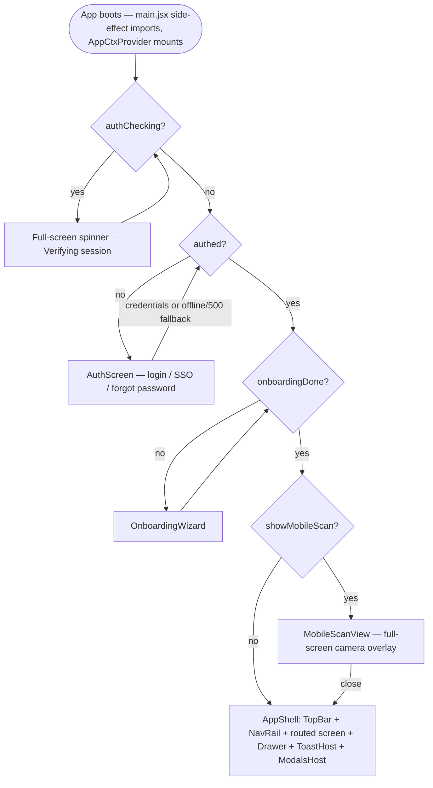

# Blackbox BOM — UI/UX Documentation

**Scope:** the React SPA in `frontend/src` (and the plain-JS shims in `frontend/api.js`, `frontend/src/root/*.jsx`) as it exists mid-migration from a `window.*`-globals monolith to ES modules. This document catalogs every route, screen, modal, panel, toolbar, table, form, filter and interactive control reachable from the authenticated app shell, states what backend endpoint (if any) each one calls, and calls out every UI/UX inconsistency found while compiling it.

**Sources:** this document is grounded in (a) five prior audit passes over the backend core, backend API surface, database schema, frontend architecture, and frontend UI/mock-vs-real classification, (b) `docs/audit-2026-08/FINDINGS_FULL_SCAN.md` and `FIX_COVERAGE.md` (the August 2026 full-line scan and its fix log — 43 of 74 findings fixed, 31 deferred), and (c) direct reads of the live navigation/shell source during this refresh (`src/screens/App.jsx`, `src/root/app.jsx`, `src/components/NavRail.jsx`, `src/components/TopBar.jsx`, `src/components/ModalsHost.jsx`, `src/hooks/useKeyboardShortcuts.js`, `src/utils/offlineAuth.js`, `src/globals.js`, `src/components/LazyScreens.jsx`, every screen under `src/components/screens/`, and a targeted set of modal components under `src/components/modals/` and `src/components/advanced/`). This pass specifically re-verified — against current code, not against the prior audit's text — every crash, mock-data claim and auth-bypass claim carried over from earlier passes; where code and prior write-up disagreed, code wins and the correction is noted inline. Anything not directly re-verified in this pass is attributed to the audit findings and phrased accordingly. **No application source code was modified to produce this document.**

**Legend** used throughout:

| Tag | Meaning |
|---|---|
| **REAL** | Wired to a live, implemented backend endpoint. Failures surface honestly (toast/empty-state); no fabricated fallback data. |
| **PARTIAL** | A mix — some real backend calls plus hardcoded/fabricated data, a silent fallback that masks failures, or a "success" action that never persists. |
| **MOCK** | Nothing behind it. The screen/modal's core data or action is fabricated in the browser (hardcoded arrays, `Math.random()`, `setTimeout` fake latency) even though a real backend endpoint may exist elsewhere. |
| **STUB** | The *backend* endpoint itself is an intentional no-op (documented in the API code), not a frontend shortcoming. |
| **DEAD** | Fully implemented on one side but unreachable — a backend router never mounted, or a frontend component nothing links to. |

---

## 1. System Context (one paragraph)

Blackbox BOM is a single-process, local-first FastAPI backend (`backend/app/main.py`) serving a JSON API under `/api/v1`, WebSockets at `/ws/{channel}`, and — in the packaged desktop build — the compiled React SPA itself via a catch-all route. The frontend is a Vite + React 18 app, routed with `react-router-dom` v7, mid-migration from a `window.*`-global monolith (`src/root/*.jsx`, ~20 legacy files that self-register components on `window`) to ES modules (`src/components/**`), bridged by a central re-export hub, `src/globals.js`. There is no Redux/Zustand store; one "god context" (`src/context/AppCtx.jsx`) holds ~50 `useState` fields (auth, theme, rows, modal state, notifications, etc.) and is consumed everywhere via `AppContext`. All backend calls funnel through one function, `apiRequest()` in `frontend/api.js`, which handles cookie auth, CSRF double-submit, silent token refresh, a per-resource circuit breaker, and bounded retries. This document is entirely about what sits on top of that: the screens, panels and dialogs a user actually clicks through, and — screen by screen — whether the pixels are backed by that real API or are decorative.

---

## 2. Information Architecture & Navigation Map

### 2.1 Rail structure

The primary navigation (`src/components/NavRail.jsx`) is a single vertical rail with two tiers:

- **Workspace (Primary)** — 13 items pinned above any section header, always visible, promoted as the most-used destinations (adds **Members**, `/members`, since the previous pass — team/role administration was promoted out of the Enterprise section into the primary tier).
- **9 labeled sections** (Linear/Jira-style visible headers) — Engineering, Quality, Operations, Supply Chain, Documents, Insights, Connectors, Enterprise, Tools — holding the remaining 33 destinations. Engineering gained **BOM Variants** (`/bom-variants`); Quality gained **Deviations & Waivers** (`/deviations`) and **Serial & Lot Traceability** (`/traceability`) — three brand-new screens, all backed by real endpoints (see §5).

Every nav entry resolves through one lookup table (`GROUPS`, primary-first flattened list), which also drives the `Cmd/Ctrl+1‑9` shortcuts (see §3.4) and the `findNav(routeId)` helper used for page titles/breadcrumbs.

The rail collapses to icon-only (state persisted in `localStorage` via `storage.nav`), and below ~900px width it becomes an off-canvas drawer (scrim + Escape-to-close + focus returned to the hamburger button on close — all three close paths funnel through one state setter, so focus management stays consistent regardless of how the drawer was dismissed).

### 2.2 Navigation map (Mermaid)

```mermaid
flowchart TD
  Root(("Blackbox BOM")) --> Workspace
  Root --> Engineering
  Root --> Quality
  Root --> Operations
  Root --> SupplyChain["Supply Chain"]
  Root --> Documents
  Root --> Insights
  Root --> Connectors
  Root --> Enterprise
  Root --> Tools

  subgraph Workspace ["Workspace — primary rail, always visible"]
    direction TB
    W1["Dashboard  /dashboard"]
    W2["BOM Editor  /bom"]
    W3["Components  /parts"]
    W4["Change Requests  /ecr"]
    W5["Work Orders  /work-orders"]
    W6["My Work  /my-work"]
    W7["Procurement  /procurement"]
    W8["Suppliers  /vendors"]
    W9["Inventory  /inventory"]
    W10["Analytics  /analytics"]
    W11["Integrations  /integrations"]
    W12["Members  /members"]
    W13["Admin  /tenant-admin"]
  end

  subgraph Engineering
    direction TB
    E1["Compare Revisions  /diff"]
    E2["CAD Vault  /pdm"]
    E3["BOM Variants  /bom-variants"]
    E4["Routings and Processes  /routing"]
  end

  subgraph Quality
    direction TB
    Q1["QMS Dashboard  /qms"]
    Q2["Non-Conformance  /ncr"]
    Q3["Deviations and Waivers  /deviations"]
    Q4["Serial and Lot Traceability  /traceability"]
    Q5["Compliance  /compliance"]
  end

  subgraph Operations
    direction TB
    O1["Work Centers  /work-centers"]
    O2["Labor and Timesheets  /labor"]
    O3["Calendar and Timeline  /calendar"]
    O4["Approvals Inbox  /approvals"]
  end

  subgraph SupplyChain ["Supply Chain"]
    direction TB
    S1["Order Tracking  /order-tracking"]
    S2["Supplier Portal  /supplier-portal"]
  end

  subgraph Documents
    direction TB
    D1["Documents  /docs"]
    D2["OCR Upload  /ocr"]
    D3["Bulk Import  /bulk-import"]
    D4["Catalogs  /catalogs"]
  end

  subgraph Insights
    direction TB
    I1["AI and Automation  /ai"]
    I2["Team Activity  /activity"]
    I3["Audit Trail  /audit-trail"]
  end

  subgraph Connectors
    direction TB
    C1["Webhooks  /webhooks"]
    C2["ERP Connectors  /erp"]
    C3["Zoho Books  /zoho-books"]
    C4["Monitoring  /monitoring"]
  end

  subgraph Enterprise
    direction TB
    En1["Enterprise Dashboards  /enterprise-dashboards"]
    En2["Service BOMs  /service-bom"]
    En3["Currency and FX  /currency"]
    En4["Compliance and Numbering  /compliance-autonumber"]
    En5["Custom Attributes  /custom-attributes"]
    En6["API Keys  /api-keys"]
  end

  subgraph Tools
    direction TB
    T1["Mobile Scanner  /scanner"]
  end
```

`/` aliases to `/dashboard`; any unmatched path renders a `FourOhFour` screen with a "Go to Dashboard" action. That is **46 named routes** (verified by counting `<Route>` elements in `src/screens/App.jsx` against `GROUPS` in `NavRail.jsx` — every route id has exactly one nav entry and vice versa) **+ the root alias + the wildcard** — up from the ~42-44 figure in prior passes now that Members, BOM Variants, Deviations & Waivers and Serial & Lot Traceability have shipped screens.

Every route in `App.jsx` is lazy-loaded (`React.lazy` via `src/components/LazyScreens.jsx`), wrapped in its own `ErrorBoundary` and shown behind a shared `<Suspense>` skeleton (`ScreenSkeleton`) while its chunk downloads — a screen crashing does not take down the rest of the app shell. The actual DOM mount happens in `src/root/app.jsx` (`createRoot(...).render(<BrowserRouter><App/></BrowserRouter>)`), which is imported for its side effect from `src/main.jsx` — so `src/screens/App.jsx` (the router documented in this section) **is** the live app, reached in exactly one hop from boot.

### 2.3 Boot / auth-gate sequence

Intended-route restore: while unauthenticated, the current route is written to `sessionStorage.intended_route` on every render; after a successful sign-in the app navigates back to it. This is not the browser back-stack — a hard refresh mid-login still loses in-flight form state in whatever modal was open.

---

## 3. Global Application Chrome

These elements render on every authenticated screen (`AppShell` in `src/screens/App.jsx`).

### 3.1 Skip-to-content link

A visually-hidden `<a href="#main-content">` that becomes visible on focus (absolute→fixed positioning swap on focus/blur). Standard skip-nav pattern; `<main id="main-content">` is the routed screen's mount point. **REAL** (pure client-side accessibility affordance, nothing to wire to a backend).

### 3.2 TopBar (`src/components/TopBar.jsx`)

Left to right:

| Element | Behavior | Backend |
|---|---|---|
| Hamburger (`#nav-toggle-btn`) | Mobile-only; toggles the NavRail drawer. `aria-expanded`, `aria-controls="primary-nav"` wired correctly. | n/a |
| Brand mark (`bbf-logo.svg`) | Static image. | n/a |
| Wordmark + API badge | Shows an "API" badge (olive) when `apiConnected`, an "Offline" badge (orange) when not connected and not loading, plus a `SyncStatus` indicator (offline write-queue status, see `dataService.js`). | Reflects `api.health.check()` from boot. |
| Breadcrumb 1 — "Workspace" | Opens the Settings modal. | Opens a **MOCK/local** modal (see §6). |
| Breadcrumb 2 — Project switcher | Dropdown of 4 **hardcoded demo projects** (ATLAS · Mainframe, HORIZON · Sensor Pod, ATLAS-LITE · Eval Board, NEBULA · IO Module) plus "New project" (toasts only, no-op) and "Manage projects" (opens Settings modal). | **MOCK** — per the frontend architecture audit, these four projects are hardcoded fixtures in `TopBar.jsx`; switching one calls `switchProject()` in `AppCtx.jsx`, which replaces `rows`/`rollup` with static `PROJECTS` fixture data **even when the API is connected**. |
| Breadcrumb 3 — Subassembly jump list | Dropdown of hardcoded subassembly names (Mainframe root, Chassis, Power, Control, I/O) that just navigate to `/bom` and pre-fill the BOM search box with a string match; plus "Compare revisions" → `/diff` and "Project activity" → `/activity`. | **MOCK** — cosmetic jump list, not derived from the actual loaded BOM tree. |
| Breadcrumb 4 — current page | Click re-navigates to the same route and scrolls to top (a no-op refresh affordance), showing the current nav label from `findNav(route)`. | n/a |
| `Presence` | Renders live collaborator avatars from the WebSocket collaboration channel. | **REAL** — backed by the in-process `ConnectionManager` presence/cursor system in `backend/app/main.py` (see the backend core audit; the doc-lock bugs listed there also affect this surface indirectly). |
| Search trigger (`⌘K`) | Opens the **Global Search** modal. | See §6 — no direct network calls found; searches already-loaded client state, not the backend `/search` endpoint. |
| Density segmented control | 3-way (Compact / Normal / Comfortable) toggle, `role="group"`, each option has `aria-pressed`. Persisted via tweaks (`t.density`). | Local UI preference only, by design. |
| Theme segmented control | 3-way (Light / Dark / Match system), same `aria-pressed` pattern; live `matchMedia` tracking for "system". | Local UI preference only, by design. |
| AI copilot button (sparkle icon) | Toggles the floating `AIAssistant` panel. | **MOCK** — see §3.9. |
| Notification bell | Opens a popover list of notifications with a red unread-count badge; "Mark all read" bulk action; clicking an item marks it read and can navigate via `n.route`. | Notification objects are pushed into local state by other UI actions (e.g. the release/approve confirm dialogs manufacture a "System released BOM" notification client-side — see §6). A real `notifications` backend exists (`app/api/endpoints/notifications.py`) but this popover's list is not confirmed in this audit to be backed by `notificationsAPI.list()` — treat as **PARTIAL/unverified**. |
| Settings (gear) button | Opens the Settings modal. | **MOCK/local** (see §6). |

### 3.3 NavRail — account menu (avatar popover)

Clicking the avatar/name button at the foot of the rail opens a popover with, in order: **Profile**, **Workspace settings**, a divider, **API Keys** (modal), **Audit log** (modal), **Share BOM**, **Webhooks** (modal), **Scheduled reports**, **Email auto-parse**, **Landed cost calculator**, **Margin calculator**, **Cost what-if simulator**, a divider, **Notification preferences**, **Product roadmap**, **Take product tour**, **Simulate offline** (calls `toggleOfflineSim()`, a real exported function in `src/services/offlineSim.js` — this used to call an undefined `window.__toggleOffline` global that could never exist, silently doing nothing; it now genuinely flips the app's simulated-offline state, falling back to a toast only if the service itself reports it unavailable), **Plans & pricing**, **Help & shortcuts**, **Open mobile scan view**, a divider, **Switch role (demo)** — five buttons (Admin/Engineering/Procurement/Finance/Viewer) that call `storage.role.set()` and toast "Now viewing as X" — and a final divider before **Sign out** (calls `api.auth.logout()` best-effort, then clears local storage regardless of the API result).

Every item above except **Sign out**, **Take product tour**, and **Switch role** opens one of the modals cataloged in §6 — most of which are **MOCK or local-only**. "Switch role (demo)" is explicitly documented in the codebase (per the AppCtx comment cited in the findings) as **UI-only** — it changes what the nav/labels display, not real RBAC; actual authorization is still enforced server-side by `app/core/rbac.py`.

**Accessibility:** the account button has `aria-haspopup="menu"` and `aria-expanded`; the popover is a floating `Popover` component anchored to the trigger ref (standard pattern; focus-trap behavior not independently re-verified in this pass).

### 3.4 Keyboard shortcuts (`src/hooks/useKeyboardShortcuts.js`)

Verified directly from source:

| Shortcut | Action |
|---|---|
| `Cmd/Ctrl+K` | Opens Global Search modal. |
| `Cmd/Ctrl+P` (outside form fields) | Opens Command Palette modal. |
| `Cmd/Ctrl+Z` (outside form fields) | Calls `runUndo()` — the local undo stack maintained in `power-features.jsx` (`UNDO`/`recordUndo`). |
| `?` (outside form fields) | Opens Help modal. |
| `Cmd/Ctrl+N` | Context-sensitive "create new": opens **New Vendor** on `/vendors`, **New PO** on `/procurement`, else **New Part**. |
| `Cmd/Ctrl+1`–`9` (outside form fields) | Jumps to the 1st–9th item of the flattened `GROUPS` list — i.e. the first 9 of the 13 **Workspace** primary items (Dashboard, BOM Editor, Components, Change Requests, Work Orders, My Work, Procurement, Suppliers, Inventory). **Analytics, Integrations, Members and Admin (items 10–13) have no numeric shortcut** — one more unreachable item than before, since Members was added to the primary tier without extending the shortcut range. |
| `g` then a second key within 800 ms (Vim-style "go to") | `b`→BOM, `c`→Components, `v`→Suppliers, `p`→Procurement, `d`→Dashboard, `a`→Analytics, `i`→Inventory. No `g`-prefixed shortcut exists for any of the other 35 routes. |

None of these are discoverable in the UI except through the Help modal (`?`) — there is no visible shortcut-hint affordance elsewhere (e.g., no "⌘K" chip on the AI button or bell, only on the search trigger).

### 3.5 Toast system — inconsistency

Two toast hosts exist simultaneously: the legacy `ToastHost` (`root/overlays.jsx`, mounted in `AppShell`) with **no `aria-live`/`role` on its items**, and a newer `ui` `Toaster` (portal-based, correct `role="alert"`/`role="status"` + `aria-live`). Depending on which call site fired the toast, the accessibility semantics and even the CSS classnames (`toast` vs `ui-toast`) differ. Additionally, 47 call sites use `kind: "warn"` vs. 1 using `kind: "warning"` (in `mobile-scanner.jsx`) — `ToastHost` only special-cases `"warn"`, so that one call renders with the default icon/style instead of the warning style. Screen readers get inconsistent toast announcements depending on which part of the app raised them.

### 3.6 Detail Drawer (`root/detail-drawer.jsx`, exported as `Drawer`)

Slides in as an overlay when a row is selected outside of the BOM Editor (`selectedRow && route !== "bom"`); shows part/row detail, comments and approvals. Row data itself is real (whatever was clicked); comments/approvals now come from `AppCtx`'s `comments`/`approvals` state, which is refreshed from the real backend via `dataService.refresh("comments"/"approvals")` on mount rather than staying permanently pinned to the original demo seed (a prior-audit finding, now fixed). **Crash fixed:** the old code did `data.rows[0].children`, which assumed the legacy demo BOM shape (single root with `.children`) and threw once `convertApiPartsToTree()`'s **flat array** replaced the demo tree — i.e. it broke exactly when the backend was genuinely connected. The current source (`root/detail-drawer.jsx`, ~line 46) reads `(data.rows?.[0]?.children || [])`, which degrades to an empty array instead of throwing for both the flat-array and empty-rows cases. Verified fixed by direct read; no longer belongs in the crash quick-reference (§10).

### 3.7 Tweaks Panel

`window.TweaksPanel`, rendered inside `AppShell`, with one section ("Appearance") exposing Density (dense/normal/comfortable radio) and Accent color (swatch picker from `ACCENT_PRESETS`), both wired to the same `t.density`/`t.accent` state the TopBar's density/theme controls also touch — i.e. **two different controls in two different places both set density**, redundant surface area rather than a single source of truth.

### 3.8 Command Palette

`CommandPalette` (from `power-features.jsx`) opens via `Cmd/Ctrl+P`. No dedicated on-screen button opens it — it is keyboard-only, unlike Global Search which has both a keyboard shortcut *and* a visible TopBar button. Two "quick action" surfaces exist with overlapping purpose but only one is discoverable without reading the Help modal.

### 3.9 AI Assistant floating panel

Toggled from the TopBar sparkle button. **MOCK** — per the findings, replies are canned via regex matching (`mockReply`), and `window.aiAssistant.complete` — the hook that would call a real backend — is never defined anywhere in the codebase. This is a *different* surface from the **AI and Automation** screen at `/ai` (§5.7.1), which does call the real (if heuristic) backend `ai_features.py` endpoints. The shared "AI" branding between a fully-fake floating widget and a partially-real screen is itself confusing to a user who doesn't know which "AI" they're talking to.

### 3.10 Onboarding Checklist, Product Tour, Network Badge

- **OnboardingChecklist** (`window.OnboardingChecklist`) — a persistent post-onboarding checklist widget; always mounted (not independently re-verified in this pass beyond its registration).
- **ProductTour** — a guided tour overlay, opened from the account menu's "Take product tour."
- **NetworkBadge** — a small always-mounted indicator, presumably surfacing the same online/offline state as the TopBar badge (a second place showing connectivity status — see §7.9).

---

## 4. Authentication & Onboarding

### 4.1 AuthScreen (`root/auth-onboarding.jsx`, exported via `globals.js`)

**Purpose:** email/password sign-in, SSO buttons, "forgot password" link.

**Behavior (verified against `App.jsx`'s `onSignIn` wiring and `src/root/auth-onboarding.jsx`):**
1. Calls `api.auth.login(email, password)` — a **real** call to `POST /api/v1/auth/login` (`app/api/endpoints/auth.py`, cookie-based JWT).
2. On success: stores a **stripped, non-sensitive** user object locally (`storage.auth.set` — no token/password persisted, consistent with cookie-based auth) and restores the pre-login "intended route."
3. **Auth-bypass hole (finding A10) FIXED.** The failure branch used to treat any error whose message looked like a network error *or contained the literal string "Internal server error"* as "offline" and signed the typed credentials in anyway — meaning a real `500` (server reachable, request rejected) opened the app shell to arbitrary credentials. That rule is now a named, unit-tested helper, `isOfflineCapableError()` (`src/utils/offlineAuth.js`), which returns true **only** for genuine transport-level failures: `"Failed to fetch"`, `"NetworkError"`, `"Unable to connect"`, or the API client's circuit breaker's `"temporarily unavailable"` (which — per the related circuit-breaker fix, finding A4 — itself now only opens on transport/5xx failures, not on deterministic 4xx responses). An HTTP 500 is now a **failed login** like any other; only an unreachable server triggers the local-first offline path.
4. The screen still layers a **700 ms artificial `setTimeout`** around the real login call before invoking `onSignIn` — cosmetic latency with no functional effect, unchanged from prior passes.
5. **SSO fixed.** The Google / Microsoft / SAML buttons used to call `onSignIn` with a hardcoded `admin@blackbox.com` identity and no password — a fabricated login, not real SSO. They are now rendered `disabled` with a `title="SSO not configured"` tooltip: honest about not being wired up, rather than faking a sign-in. (The backend does expose `GET /sso/authorize/{provider}` to start a real OAuth flow, but no frontend route yet consumes the `?code&state` redirect it would come back with, so there is nothing to wire the buttons to yet.)
6. **"Forgot password" fixed.** It now calls the real `POST /auth/forgot-password` endpoint via `apiRequest`, showing a success toast only after the call resolves and an inline error otherwise — previously it only showed a fake "reset link sent" toast on a `setTimeout` with no backend call at all.

**Validation:** client-side checks now run before any network call — a valid-looking email (`includes("@")`) and, outside "forgot password" mode, a password of at least 4 characters; failures render as an inline `role="alert"` banner rather than relying solely on native `<input>` validation.

**Accessibility/Responsive:** the inline validation error has `role="alert"`; SSO buttons' `disabled` + `title` pairing communicates the "not configured" state to assistive tech via the native disabled-button semantics rather than a decorative-only cue. Not independently re-audited beyond that.

### 4.2 OnboardingWizard

Multi-step setup shown once per browser (`storage.onboarding.setDone()`), lets the user pick a role which is persisted locally (`storage.role.set`) and reflected in `userRole` — the same client-side-only role concept used by the "Switch role (demo)" menu in §3.3. **Not a real RBAC assignment** — actual permissions come from the backend `user_roles`/RBAC tables.

### 4.3 Session-verifying spinner

A centered spinner labeled "Verifying session…", shown while `authChecking` is true (i.e. while the boot-time `api.auth.getMe()` call is in flight). Plain CSS spin animation; no `aria-busy`/`role="status"` observed on the container in the code read for this section.

---

## 5. Screens

Organized by the nav section each screen lives in. Every entry lists: route, source file, purpose/UI surface, backend wiring per the legend, and known defects with severity as rated in the findings.

### 5.1 Workspace (primary rail)

#### 5.1.1 Dashboard — `/dashboard` (also `/`)
**File:** `root/dashboard.jsx` (`DashboardScreen`) · **Wiring: REAL — fixed**
Landing screen with KPI tiles, a budget widget, and an admin activity feed. This screen was previously the most-cited "fabrication" example in the app (hardcoded budget multipliers, a hardcoded "99.98% uptime" literal, a persist-nowhere "Save budget" button); all three are now fixed:
- **Budget widget** — `WORKSPACE_BUDGET` starts zeroed (never fabricated) and is hydrated on mount from the real `GET /budgets/workspace` endpoint (`api.budgets.workspace(periodSlug)`), scoped to a real period selector (FY/quarter/last-30/last-7 days) that the backend resolves to a real calendar range and computes real spent/committed figures from purchase-order data for.
- **"Save budget"** — now calls `api.budgets.updateWorkspace(payload, periodSlug)` and only updates local state / shows a success toast after that call resolves; a failure toasts an error and leaves `editingBudget` open rather than silently discarding the edit.
- **Uptime tile** — no longer a hardcoded "99.98%" literal; reads `health?.systemUptimeHours` from a real health check.
On any load failure, the screen falls back to the honest zeroed `WORKSPACE_BUDGET` snapshot rather than fabricated sample figures (explicit code comment: "Honest failure — do not fall back to fabricated/sample figures").

#### 5.1.2 BOM Editor — `/bom`
**File:** `root/bom-editor.jsx` (`BomShell`, exported also as `BomEditor`) · **Wiring: REAL** (the most functionally real screen in the app)
The core BOM tree/grid: expandable hierarchy, category filter chips (`activeCats`), search box (shared with the TopBar's subassembly-jump shortcut), density control, and row detail (opens the Drawer or an inline panel via `onOpenDetail`). Structural edits (reorder, delete, quantity/cost edits, image attach) call `api.bomEnterprise.items.update/reorder/delete`, `api.parts.update`, and `api.documents.upload` — all real. Two release-lifecycle actions are launched from this screen's toolbar, both opening a generic `ConfirmModal` (see §6):
- **Release** — **FIXED, now REAL.** This used to only mutate local `project` state and fabricate a "System released BOM" notification, with no server call at all (the single biggest "fake action" in the product per prior passes). `ModalsHost.jsx`'s `onConfirm` now calls `await api.bomEnterprise.snapshots.create(project.id, {version, rev})` first, and only updates local state / fires the notification / toasts success **after** that call resolves; a failure toasts the error and aborts without touching local state. The revision-number bump itself was also fixed: `nextRev()` now increments like a spreadsheet column (`A→B…Z→AA`) instead of the old `charCodeAt(0)+1`, which only read the first character and had no rollover past `Z` (corrupting any multi-character or `Z`-ending revision).
- **Approve** — **still MOCK.** `onConfirm` only sets every entry of the local `approvals` object to `{engineering: "approved", procurement: "approved", finance: "approved"}` and fabricates a notification — **no call to the real `/approvals` backend endpoint** (`approvals.py`, backed by `approval_service`). A user who clicks "Approve" believes engineering/procurement/finance have signed off; nothing is sent to the server, and the change is gone on refresh.

The `bomId` used for all structural calls falls back to a hardcoded `1` (`AppCtx.jsx` line 236: `project?.id || project?.bomId || data?.project?.id || 1`) whenever the active "project" is a demo fixture without a real id, meaning edits can silently target the wrong BOM once multiple real BOMs exist (medium severity, per findings — not independently re-verified as fixed in this pass).
**Validation:** quantity/cost fields are numeric-constrained inline editors (range/format validation not independently re-verified).
**A11y/Responsive:** tree/grid hybrid; virtualization exists elsewhere in the "advanced" component set (`VirtualList` in `enterprise-final.jsx`) but was not independently re-audited here.

#### 5.1.2a Change Requests — `/ecr`
**File:** `components/advanced/ECRScreen.jsx` (re-exported from `root/advanced-features.jsx`) · **Wiring: REAL**
A substantial (1000+ line) ECR/ECO workflow screen: filterable list, a "new ECR" form, a detail view, and a full submit → approve/reject → implement lifecycle, each transition backed by real calls (`api.eco.create(...)`, `api.eco.get(id)`, `api.eco.action(id, {action})`). Includes an e-signature step (`ESignDialog`, `components/ESignDialog.jsx`) for regulated approve/implement actions — one of the few screens in the app with a genuine compliance-signature flow, not just a confirm dialog. Missing from earlier passes of this document despite being one of the 13 primary Workspace destinations and one of the more fully-built screens in the app.

#### 5.1.2b Work Orders — `/work-orders`
**File:** `root/power-features.jsx` (`WorkOrdersScreen`) · **Wiring: REAL — fabricated fallback removed**
Production work-order list/board with build progress and yield columns. Previously substituted 5 hardcoded `DEFAULT_ORDERS` whenever the real list came back empty or errored, presenting fake orders as if they were real. The current source (`screenData.workOrders.list()`) shows the real list or an honest empty state via the table's `empty` prop — no fabricated substitution on failure. Missing from earlier passes of this document.

#### 5.1.2c My Work — `/my-work`
**File:** `components/screens/WorkQueueScreen.jsx` · **Wiring: REAL**
A personal work-queue board — "what's assigned to me across every module" — introduced as part of the WS2 unified My-Work/Team-Work effort. Backed entirely by real calls: `apiRequest("/teams/mine")`, `apiRequest("/work/my")`, `apiRequest("/teams/")`, `apiRequest("/work/assign")`. Missing from earlier passes of this document despite being one of the 13 primary Workspace destinations.

#### 5.1.3 Components — `/parts`
**File:** `root/parts-screen.jsx` (`PartsScreen`) · **Wiring: REAL — prior "fabricated" claim corrected**
Parts catalog/table flattens the current BOM tree (`ctx.rows`) and layers in any tenant parts that exist in the real Parts API (`ctx.apiParts`, from `api.parts.list()`) but aren't currently used by the active BOM — these are genuinely real parts the tenant owns, not fabricated rows; a prior pass's claim that this screen "injects fabricated library-only parts for realism" does not match the current source, whose own comment explains this "library-only" layer is real API data and, when `apiParts` hasn't loaded yet, degrades to just "whatever's in the current BOM" rather than inventing anything. Opens **New Part**, **Bulk Edit**, **Find Alternates**, and detail-drawer modals.

#### 5.1.4 Inventory — `/inventory`
**File:** `root/prod-additions.jsx` (`InventoryScreen`) · **Wiring: MOCK**
Stock levels, reorder points and bin locations are **synthesized from character codes of the part-number string**, not read from the real inventory tables (`app/models/inventory.py`, exposed via `/inventory` and `kanban.lowStockAlerts`/`api.inventory.list`). Every number shown here is deterministic-but-meaningless relative to actual stock.

#### 5.1.5 Suppliers (Vendors) — `/vendors`
**File:** `components/screens/VendorsScreen.jsx` · **Wiring: PARTIAL — Active toggle now real**
Vendor list/table sourced from `ctx.vendors` (API-hydrated or seed fixture). Of the two per-row toggles: **Active is now REAL** — `toggleActive()` is `async`, calls `await api.vendors.update(v.apiId, {active})`, and rolls the local checkbox back with an error toast if the call fails, so it no longer silently reverts on refresh. **Preferred is still local-only** — `togglePreferred()` only flips `vendors` state and toasts, with no backend call, so that one toggle still reverts on a page refresh. Opens **New Vendor**, **Vendor Detail**, **Bulk Vendor Import**, **Quote History**, **Send RFQ** modals.

#### 5.1.6 Procurement — `/procurement`
**File:** components/screens `ProcurementScreen` · **Wiring: REAL**
Purchase-order table and stats pulled from `poOrdersAPI.list()` + `poOrdersAPI.stats()`, with **no fabricated fallback** (an honest empty state on failure) — one of the "reference implementation" screens the findings hold up as the pattern to copy. The backend has **two parallel API surfaces for the same PO data** (`/po-orders` read-only vs. `/procurement` full CRUD); this screen reads from the read-only one, while writes (New PO modal) go through `api.procurement.create` on the other surface. Also opens **PO Detail**, **Procurement Alerts** (real, `api.procurement.alerts()`), **Price Alerts** (MOCK, see §6), **RFQ Compare** (MOCK), **Inflation Analysis** (MOCK), **Landed Cost calculator**.

#### 5.1.7 Analytics — `/analytics`
**File:** `components/screens/AnalyticsScreen.jsx` · **Wiring: PARTIAL — crash fixed**
Two or three KPI tiles are real (`analyticsAPI.dashboard()`, `analyticsAPI.categories()`); **every trend chart plus the lead-time/risk/on-time KPIs are still hardcoded** — the real `analyticsAPI.trends(range)` endpoint exists on the backend and is simply not called; the "PDF report" export still downloads a plain-text string whose own copy admits "(mock PDF)" (per `FIX_COVERAGE.md`, a deferred item — this one is a dead-layer-adjacent finding, not yet fixed). **Crash fixed:** every render site that used to do `(ctx?.rows || BOM_DATA.rows)[0].children.flatMap(...)` — which threw once real, flat, API-hydrated rows replaced the demo tree shape, the same root cause as the old Drawer crash in §3.6 — now routes through one helper, `bomLeafParts(rows)` (top of the file), which explicitly checks `Array.isArray(root?.children)` and falls back to treating `rows` as an already-flat parts list otherwise. The equivalent pattern in `components/advanced/CostSimulatorModal.jsx` and `root/detail-drawer.jsx` was independently fixed with optional chaining (`sourceRows?.[0]?.children || []`); no `rows[0].children` crash site was found anywhere in the codebase during this pass (verified by grep across `frontend/src`).

#### 5.1.8 Integrations — `/integrations`
**File:** components/screens `IntegrationsScreen` · **Wiring: REAL**
Configuration table for provider connections (ClickUp, Cliq, Zoho Books), each with a "Test connection" action and a delivery log; PUT/test/test-connection all call the real `/integrations` endpoints, and the Zoho card redirects into the real OAuth flow. Distinct from — and easily confused with — the **Connectors** nav section (Webhooks/ERP/Zoho Books/Monitoring), which covers overlapping ground under a different label (see §7.7).

#### 5.1.8a Members — `/members`
**File:** `components/screens/MembersScreen.jsx` · **Wiring: REAL**
Tenant user/role administration, newly promoted from the Enterprise nav section into the primary Workspace tier since the previous pass. Lists users (`api.users.list()`), lists assignable roles (`api.rbac.roles()`), assigns/unassigns a user to a role (`api.rbac.assignUser(...)` / `api.rbac.unassignUser(...)`), and edits a user's own fields (`api.users.update(...)`). Distinct from — but adjacent to — the "Switch role (demo)" account-menu affordance (§3.3), which only changes what the current user's own nav/labels display and does not touch this screen's real RBAC assignments. Missing from earlier passes of this document.

#### 5.1.9 Admin — `/tenant-admin`
**File:** `root/tenant-admin.jsx` (`TenantsAdminScreen`) · **Wiring: REAL**
Tenant CRUD, user assignment/transfer. Backed by `api.tenants`; the backend router itself is superuser-gated at the router level (`get_current_superuser`), so even a non-superuser who somehow reaches this route via a shortcut is rejected server-side.

### 5.2 Engineering

#### 5.2.1 Compare Revisions — `/diff`
**File:** components/screens `DiffScreen` · **Wiring: PARTIAL**
Diff viewer between two BOM revisions. Calls the real `POST /bom/compare` (`api.bomEnterprise.compare`, confirmed live and correctly wired to `bom_service.compare_boms` — a stale "missing endpoint" claim from an earlier gap report is explicitly closed by this audit), but with **hardcoded `bom_id_1`/`bom_id_2` of `1` and `2`** rather than user-selected revisions, and the older "v3.1.0 vs v3.0.0" diff view is **fully fabricated**. "Export diff" only shows a success toast — it does not produce a file. Should additionally use `revisionsAPI` for a real revision picker.

#### 5.2.2 CAD Vault — `/pdm`
**File:** `root/pdm-cad.jsx` (`PDMVaultScreen`) · **Wiring: MOCK-heavy**
File-tree PDM vault UI. Only `cadAPI.vaultStats()` is real; the vault tree itself (`FILES_BY_PATH`) is a hardcoded constant, the current user is a hardcoded `"E. Chen"`, and a code comment literally reads "Try API first, fall back to mock." Opens **CAD Revisions**, **CAD Where-Used**, **CAD Markup**, **CAD Attrs**, **CAD Sync**, **Drawing Release** modals — verified during this audit to contain **zero backend calls of any kind** (no `api.*`, no `fetch`, no `*API.*`) across the whole cluster, i.e. every one of those six modals is pure client-side fiction layered on top of the one real `vaultStats` call. This is a large, convincingly-real-looking surface (a file tree, revision history, markup tool, attribute editor) with no backend behind any of the interactive parts. Separately, `cad.py` (`/cad`) duplicates much of `solidworks_integration.py` (`/solidworks`) server-side with its own self-contained ORM logic — two backend surfaces for the same CAD sync/extract-attrs/vault-stats/vault-tree feature set, and this screen is not confirmed to call either consistently.

#### 5.2.2a BOM Variants — `/bom-variants`
**File:** `components/screens/BomVariantsScreen.jsx` · **Wiring: REAL**
Configurable-BOM variants — define a base BOM's option groups and generate/inspect specific variant configurations. Backed by `api.bomEnterprise.variants.get(...)` / `.create(...)`. A new screen since the previous pass; missing from earlier passes of this document.

#### 5.2.3 Routings and Processes — `/routing`
**File:** `root/enterprise-screens.jsx` (`RoutingScreen`) · **Wiring: REAL**
Routings + operations, process plans + steps, backed by `/manufacturing/routings` (`routing_api.py`).

### 5.3 Quality

#### 5.3.1 QMS Dashboard — `/qms`
**File:** `root/qms-dashboard.jsx` (`QMSScreen`) · **Wiring: REAL — fixed**
Previously a hardcoded `setTimeout`-delayed fake dataset (a code comment literally read `// Mock fetch`). The current source loads all three tabs from the real backend in parallel — `Promise.allSettled([api.quality.ncr.list({per_page:100}), api.capa.list({per_page:100}), api.fai.list({per_page:100})])` — and toasts a per-endpoint error (not a silent fabricated fallback) if any one of the three rejects.

#### 5.3.2 Non-Conformance — `/ncr`
**File:** `root/power-features.jsx` (`NCRScreen`) · **Wiring: REAL — fixed**
Previously seeded with 4 hardcoded fake NCR records — a second, independent fabrication of the same NCR concept the QMS Dashboard also used to fake. The current source loads the real list via `screenData.quality.ncr.list()` and falls back to an honest empty state (the `DataTable`'s `empty` prop) rather than inventing records on failure — the same fix pattern (and the same underlying `screenData.quality.ncr` wrapper) as the QMS Dashboard above, so the two screens can no longer disagree with each other.

#### 5.3.2a Deviations & Waivers — `/deviations`
**File:** `components/screens/DeviationsScreen.jsx` · **Wiring: REAL**
Deviation/waiver request workflow — list, view detail, submit, approve, create — fully backed by `api.deviation.list(...)`, `.get(id)`, `.submit(...)`, `.approve(...)`, `.create(...)`. A new screen since the previous pass; missing from earlier passes of this document.

#### 5.3.2b Serial & Lot Traceability — `/traceability`
**File:** `components/screens/TraceabilityScreen.jsx` · **Wiring: REAL**
Serial-number and lot genealogy viewer — list and drill into serial numbers, list lots, and look up a specific serial. Backed by `api.traceability.serialNumbers.list(...)`, `.lookup(...)`, and `api.traceability.lots.list(...)`. A new screen since the previous pass; missing from earlier passes of this document.

#### 5.3.3 Compliance — `/compliance`
**File:** `components/advanced/ComplianceScreen.jsx` · **Wiring: PARTIAL**
Fetches the real compliance dashboard/packs/parts endpoints, then **hardcodes every part's RoHS/REACH/conflict-minerals status to `"valid"`** regardless of what the API actually returned, and falls back to three fabricated certificate rows on failure. The real per-part endpoint that should drive this (`complianceAPI.parts.status`) is not used per-row. Not independently re-verified as fixed in this pass — carried forward from the prior audit; this is a **different "compliance" concept** (substance/RoHS/REACH) than the Enterprise section's `/compliance-autonumber` screen (certificates + numbering, §5.9.4).

### 5.4 Operations

#### 5.4.1 Work Centers — `/work-centers`
**File:** `root/enterprise-screens.jsx` (`WorkCentersScreen`) · **Wiring: REAL** — `/manufacturing/work-centers`.

#### 5.4.2 Labor and Timesheets — `/labor`
**File:** `root/enterprise-screens.jsx` (`LaborScreen`) · **Wiring: REAL** — `/manufacturing/labor-rates`, `/manufacturing/timesheets`.

#### 5.4.3 Calendar and Timeline — `/calendar`
**File:** components/screens `CalendarScreen` · **Wiring: PARTIAL/MOCK**
Backed by `localStorage` plus a fabricated seed of calendar events; **never calls the real `calendarEvents` API** that already exists server-side (`calendar_events.py`, note the awkward doubled path `/calendar/calendar-events`) and client-side (`calendarEventsAPI` in `api.js`).

#### 5.4.4 Approvals Inbox — `/approvals`
**File:** `root/final-polish.jsx` (`ApprovalsScreen`) · **Wiring: PARTIAL — fabricated rows removed**
Previously appended 5 hardcoded fake approval rows (fake names, dates, fake PO numbers) alongside the real ctx-derived BOM-revision rows, and the approve/reject action (`act()`) only ever worked for the one BOM-revision kind — every other row (including the 5 fake ones) silently did nothing on click. Both are fixed: the row list now merges real `api.approvals` records with the ctx-derived BOM-revision rows (no fabricated rows), and `act()` routes each row's approve/reject through whichever real source it came from. This is still a **different "approvals" concept** than the BOM Editor's own Release/Approve confirm dialogs (§5.1.2/§6), which do not touch this screen's data at all — two independent, non-cross-referential approval systems live side by side in the same product.

### 5.5 Supply Chain

#### 5.5.1 Order Tracking — `/order-tracking`
**File:** `root/integration-screens.jsx` (`OrderTrackingScreen`) · **Wiring: REAL** — `orderTrackingAPI`, backed by `order_tracking.py` (CRUD + stats + by-PO + advance + shipment-updates).

#### 5.5.2 Supplier Portal — `/supplier-portal`
**File:** `root/integration-screens.jsx` (`SupplierPortalScreen`) · **Wiring: REAL** — `supplierPortalAPI`, backed by `supplier_portal.py` (supplier login, price-update approve/reject, RFQ respond/award).

### 5.6 Documents

#### 5.6.1 Documents — `/docs`
**File:** components/screens `DocumentsScreen` · **Wiring: PARTIAL**
Folder tree + document list from `api.documents.list/folders`, with a **silent fallback to static `data.docs`** on failure — the user cannot tell, from the UI alone, whether they're looking at their real document library or the fixture.

#### 5.6.2 OCR Upload — `/ocr`
**File:** components/screens `OCRScreen` · **Wiring: PARTIAL**
The scan/extract pipeline itself is real — `api.ocr.extract`/`api.ocr.upload` call the genuine Tesseract + regex backend (`ocr.py`). But "Apply to part" — the button that should write the extracted fields onto a part — **only shows a toast**; it never calls `api.parts.update`. The screen also fakes an 1100 ms "re-extract" spinner around a call that, per the findings, doesn't re-run anything.

#### 5.6.3 Bulk Import — `/bulk-import`
**File:** `root/integration-screens.jsx` (`BulkImportScreen`) · **Wiring: REAL** — CSV upload/process/status/errors via `bulkImportAPI`, backed by `bulk_import.py`. (Note: the drag-and-drop CSV handler in `AppShell` itself opens a **separate** `BulkImportModal` — see §6 — a different component with **no backend calls found** in this audit; the same feature name maps to two different implementations depending on entry point.)

#### 5.6.4 Catalogs — `/catalogs`
**File:** components/screens `CatalogsScreen` · **Wiring: REAL** — one of the reference-implementation screens; catalog list/create/parts/upload all call the real `/catalogs` endpoints (`catalogs.py`).

### 5.7 Insights

#### 5.7.1 AI and Automation — `/ai`
**File:** `root/integration-screens.jsx` (`AIFeaturesScreen`) · **Wiring: REAL backend, heuristic not ML**
Demand-forecast generation/list, interchangeability analysis, validation run/results. The backend genuinely executes on every request (`ai_features.py`), but per the API-surface audit its "AI" is a **deterministic seasonal-multiplier formula with fabricated confidence values** (tagged `statistical_ma`), and part matching uses a fuzzy `ilike` on part name that can mis-attribute demand — functional, but not machine learning, despite the labeling. Do not confuse with the **AI Assistant floating panel** (§3.9), which is fully MOCK.

#### 5.7.2 Team Activity — `/activity`
**File:** components/screens `ActivityScreen` · **Wiring: MOCK**
Hardcoded actors ("E. Chen", "M. Park") plus a `setInterval` that **injects a fabricated event every 15 seconds**, presented indistinguishably from real activity. The "Mine only" filter hardcodes the current user as `"E. Chen"` regardless of who is actually signed in. The real backend equivalent, `api.auditLogs.list` (`/audit-logs`), already exists and is used correctly by the *other* activity-like screen, Audit Trail (§5.7.3) — meaning the fix here is UI plumbing, not new backend work.

#### 5.7.3 Audit Trail — `/audit-trail`
**File:** components/screens `AuditTrailScreen` · **Wiring: REAL**
One of the two "reference implementation" screens (along with Catalogs/Work Queue): server-side `entityType` filtering via `api.auditLogs.list`, honest empty/error states.

### 5.8 Connectors

#### 5.8.1 Webhooks — `/webhooks`
**File:** `root/integration-screens.jsx` (`WebhooksScreen`) · **Wiring: REAL** — subscription CRUD, delivery log, retry, via `webhooksAPI`. Confusingly, there is also a `WebhooksModal` (§6, opened from the account menu) that is **entirely MOCK** and shows a different, hardcoded set of Slack/Acme/Zapier webhooks — the same feature name, two implementations, one real and one fake.

#### 5.8.2 ERP Connectors — `/erp`
**File:** `root/integration-screens.jsx` (`ERPConnectorsScreen`) · **Wiring: REAL — logs bug fixed**
Connector CRUD, logs, test-connection are real (`erpConnectorsAPI`, `erp_connectors.py`). **Bug fixed:** the screen used to call `erpConnectorsAPI.logs("latest")` unconditionally (`GET /erp-connectors/latest/logs`), which always 422'd against a backend route typed `connector_id: int`, silently swallowed by a `.catch()` so the "latest logs" panel never populated. `loadLogs(id)` now takes the actual connector id (set via `selectedConnector` when a row is clicked) and calls `erpConnectorsAPI.logs(id)` with it — logs load for the selected connector, verified by direct read. Separately, the actual sync action (`POST /{id}/sync`) is a backend **STUB** by design — it records a log entry stating "ERP sync is not implemented for this connector type" and performs no network I/O.

#### 5.8.3 Zoho Books — `/zoho-books`
**File:** components/screens `ZohoBooksScreen` · **Wiring: REAL for what's built, STUB for the rest**
OAuth connect flow, outbound push-sync, status and field-mapping views are real. The backend's own docstring states pull/reconcile/conflict-resolve endpoints return an explicit "not implemented in this build" response — so any conflict-resolution UI on this screen is talking to a backend that will not act on it yet (by documented design, not a bug).

#### 5.8.4 Monitoring — `/monitoring`
**File:** `root/integration-screens.jsx` (`MonitoringScreen`) · **Wiring: REAL** — `monitoringAPI`.

### 5.9 Enterprise

#### 5.9.1 Enterprise Dashboards — `/enterprise-dashboards`
**File:** `root/enterprise-screens.jsx` (`EnterpriseDashboardsScreen`) · **Wiring: REAL** — 4 role-based dashboards via `/dashboards/` (`dashboards_api.py`, thin delegate to `dashboard_service.py`).

#### 5.9.2 Service BOMs — `/service-bom`
**File:** `root/enterprise-screens.jsx` (`ServiceBOMScreen`) · **Wiring: REAL** — `/enterprise/service-bom`.

#### 5.9.3 Currency and FX — `/currency`
**File:** `root/enterprise-screens.jsx` (`CurrencyScreen`) · **Wiring: REAL backend, HIGH-severity security/local-first violation**
The backend currency/exchange-rate endpoints are real (`enterprise_ext_api.py`), but the screen **also fetches directly from a live external service, `v6.exchangerate-api.com`, with an API key hardcoded in the client source** — a runtime dependency on the public internet that directly contradicts the project's local-first principle, and a Content-Security-Policy mismatch: the dev CSP in `serve.py` allows this and two other exchange-rate hosts, while `server.js`'s CSP only allows a *different* one, meaning the fetch is CSP-blocked under one dev server and not the other, and the two dev servers additionally pin different backend ports (8000 vs 8001).

#### 5.9.4 Compliance and Numbering — `/compliance-autonumber`
**File:** `root/enterprise-screens.jsx` (`ComplianceAutoNumberScreen`) · **Wiring: REAL** — `/enterprise/compliance-certificates` and `/enterprise/auto-number-schemes`. **Naming inconsistency:** this bundles two unrelated concerns (regulatory compliance certificates, and part-number auto-generation schemes) into one screen under one nav label, while the separate `/compliance` screen (§5.3.3) covers a third, different "compliance" concept (RoHS/REACH substance compliance) — three distinct meanings of "compliance" across two screens and one nav label.

#### 5.9.5 Custom Attributes — `/custom-attributes`
**File:** `root/enterprise-screens.jsx` (`CustomAttributesScreen`) · **Wiring: REAL** — `/enterprise/custom-attributes`.

#### 5.9.6 API Keys — `/api-keys`
**File:** `root/enterprise-screens.jsx` (`APIKeysScreen`) · **Wiring: REAL** — `/api-keys/` (list/create/rotate/revoke). **Duplicate surface:** the account-menu **API Keys modal** (§6) is a *second*, separately-implemented API-keys UI with **no backend calls found** in this audit — a user who opens it from the avatar menu sees a different (and non-functional) key list than the one on this real screen.

### 5.10 Tools

#### 5.10.1 Mobile Scanner — `/scanner`
**File:** `root/mobile-scanner.jsx` (`MobileScannerScreen`) · **Wiring: PARTIAL — crash fixed**
Barcode/part lookup (`api.parts.list` search, `api.barcodes.lookup`), and PO receiving (`poOrdersAPI` receiving) are real. The camera scan itself is still **not real decoding** — `simulateScan` picks a random code from a 5-item hardcoded demo list (`STM32H743VIT6`, `LM358`, `ESP32-C3`, `MEAN-WELL-RS-15-5`, `PCB-001-A`), then feeds that code into the real `api.barcodes.lookup()` call, so the *lookup* is genuine even though the *scan* is not. **Crash fixed:** `toast` is now imported at the top of the file (`import { toast } from "../utils/toast";`); the `ReferenceError: toast is not defined` that previously fired on every camera-denied / lookup-failure / receive / inventory-adjustment path no longer reproduces. Verified by direct read — no longer belongs in §10's quick-reference table.

This route-based screen is distinct from **MobileScanView** (§5.11), the simpler full-screen overlay reachable from the account menu's "Open mobile scan view" — two different "scan" surfaces exist in the product under very similar names, with different capabilities and different entry points (nav rail vs. account menu).

### 5.11 Mobile Scan overlay (not a route)

**MobileScanView** (`root/auth-onboarding.jsx`) replaces the entire app shell (not layered as a modal) when `ctx.showMobileScan` is true, and returns to the previous shell on close. It is deliberately minimal compared to the full `/scanner` screen; its internal wiring was not independently re-audited in this pass beyond confirming it is a distinct component from `MobileScannerScreen`.

---

## 6. Modals & Dialogs Reference

All modals are centrally mounted in `ModalsHost.jsx` and keyed by a single `modal` string in `AppCtx`; only one can be open at a time (setting a new key implicitly replaces whatever was open, since only the matching one renders `open=true`). The table below lists every modal, its trigger point(s), and its backend wiring — REAL/PARTIAL are backed by direct source reads and/or the findings; entries marked "unverified" had no direct network call pattern found in this pass but were not read in full, so no MOCK/REAL claim is made beyond what the evidence shows.

| Modal | Opened from | Wiring | Notes |
|---|---|---|---|
| New PO | `Cmd/Ctrl+N` on `/procurement`; Procurement toolbar | **REAL** | `api.procurement.create(...)` |
| New Vendor | `Cmd/Ctrl+N` on `/vendors`; Vendors toolbar | **REAL** | `api.vendors.create(...)` |
| Upload | CSV/file drag-and-drop onto the app shell (non-CSV branch); Documents screen | **REAL** | `api.documents.upload(file, {category})` |
| CAD Import | CAD Vault screen | **unverified/likely MOCK** | 703-line component; no direct `api.*`/`fetch` call matched by pattern search — treat as unconfirmed, consistent with the CAD Vault screen's overall mock-heavy profile |
| New Part | `Cmd/Ctrl+N` default; Components toolbar | **REAL** | `api.parts.create(...)` |
| Find Alternates | Components/BOM row action | **MOCK** (per findings) | Fabricates alternates by string-mangling the part number; fake vendors/stock |
| Send RFQ | Vendor/part row action | **MOCK/local** | No backend call found in this pass |
| Doc Preview | Documents screen | **display-only** | Renders a doc object already fetched by the caller; no independent call needed |
| PO Detail | Procurement row click | **PARTIAL** | Detail view is local (data passed in); the "advance" status action calls the real `api.procurement.advance(item.id)` |
| Vendor Detail | Vendors row click | **PARTIAL** | Displays a passed-in vendor object; the `rows[0].children` crash previously attributed to this file (§5.1.7) was not found in the current source (`components/modals/VendorDetailModal.jsx`) — no such pattern exists there in this pass, so that specific claim is retracted |
| Barcode Scan | Various scan-entry points | **REAL (lookup)** | `api.barcodes.lookup(barcode)`; camera capture itself not independently verified |
| Global Search | TopBar search button, `⌘K` | **local only** | Searches the `BOM_DATA` fixture, not `ctx.rows`/vendors/etc. from live state, and does **not** call the real full-text `/search` endpoint (`search.py`/`searchAPI`) that exists server-side — a search performed while genuinely connected to a tenant's real data still only matches against demo fixture content. **Crash fixed:** it references `Icon.Package`, `Icon.Shield`, `Icon.Alert`; these previously didn't exist in `root/icons.jsx` and threw "Element type is invalid" when those result groups rendered. `icons.jsx` now defines all three (explicitly commented "Audit finding A3") — verified by direct read, no longer a crash. |
| Profile | Account menu | **local only** | No backend call found; edits are not confirmed to persist via `usersAPI.update`. Note: `FIX_COVERAGE.md` labels this "dead layer — not mounted in the live app," but this pass directly verified `NavRail.jsx`'s account-menu button calling `setModal("profile")` and `ModalsHost.jsx` rendering `<window.ProfileModal open={modal==="profile"} .../>` — the modal **is** reachable by a real user; what's fake is its data, not its mount status |
| Settings (workspace) | TopBar breadcrumb, gear icon | **local only** | No backend call found; a 712-line component that appears to be entirely client-state preferences. Same "reachable, not dead" correction as Profile above applies — `setModal("settings")` is wired from both the TopBar crumb and the gear icon |
| Help | Account menu, `?` key | **static content** | No backend needed |
| Tenant Settings | Registered in ModalsHost; no direct trigger button found in TopBar/NavRail in this pass | **unverified** | Imported from `globals.js`, distinct from the real Tenant Admin *screen* (§5.1.9) |
| Import RFQs | Procurement/Supplier Portal area | **unverified/likely MOCK** | No backend call pattern found |
| Quote History | Vendors screen | **unverified** | No backend call pattern found in the component itself; may rely on data pre-fetched by the caller |
| Auto Scrape | Part/vendor row action | **unverified/likely MOCK** | No backend call pattern found; separate from the real `scrapingAPI`-backed flow implied by the backend `scraping.py` router |
| Change Owner | Row action | **local only** | No backend call found |
| Audit Log | Account menu | **MOCK** (per findings) | Fabricates audit events, duplicating the real Audit Trail screen (§5.7.3) with **different, fake data** |
| API Keys | Account menu | **local only / MOCK** | No backend call found; duplicates the real API Keys screen (§5.9.6) |
| Bulk Import | Drag-and-drop CSV onto app shell | **local only** | Distinct component from the real Bulk Import *screen* (§5.6.3); no backend call pattern found in this component |
| Bulk Vendor Import | Vendors screen | **local only** | No backend call pattern found |
| Pricing | Account menu ("Plans & pricing") | **static/marketing content** | No backend needed |
| Roadmap | Account menu | **static content** | No backend needed |
| Notification Preferences | Account menu | **unverified** | Not independently re-audited |
| RFQ Compare | Procurement screen | **MOCK** (per findings) | Hardcoded part `EL-PSU-240W` + 4 fabricated vendor quotes |
| Cost Simulator | Account menu ("Cost what-if simulator") | **crash fixed** | `components/advanced/CostSimulatorModal.jsx` now reads `sourceRows?.[0]?.children || []` — same fix pattern as §5.1.7's Analytics screen, no longer crashes |
| Landed Cost calculator | Account menu | **calculator, local math** | No backend dependency implied |
| Margin calculator | Account menu | **calculator, local math** | No backend dependency implied |
| Share Link | Account menu ("Share BOM") | **unverified** | Not independently re-audited |
| Webhooks (modal) | Account menu | **MOCK** (per findings) | Hardcoded Slack/Acme/Zapier hooks, duplicating the real Webhooks *screen* (§5.8.1); also has a **React Rules-of-Hooks violation** — `if (!open) return null;` runs before a `useState` call, changing the hook count between closed/open renders |
| Scheduled Reports | Account menu | **MOCK** (per findings) | Hardcoded rows; real equivalent would be `schedulingAPI` |
| Email Auto-Parse | Account menu | **MOCK** (per findings) | Hardcoded rows |
| Command Palette | `Cmd/Ctrl+P` only (no visible button) | **unverified** | Keyboard-only entry point |
| BOM Templates | BOM Editor | **REAL** | `api.bomTemplates.create/load/delete` — full CRUD confirmed. One of **two parallel BOM-template systems** — the standalone `/bom-templates` backend router duplicates `/bom/templates` inside `bom_enterprise.py` |
| BOM Duplication | BOM Editor / project switcher | **PARTIAL/REAL** | `api.projects.create(...)` and `api.bomTemplates.create(...)` both confirmed called |
| Rollback | Account menu / BOM Editor revision action | **PARTIAL, notable inconsistency** | The revision **list** is real when connected (`api.revisions.list({limit:20})`, with a hardcoded 4-item fallback list when offline or on error — a legitimate, honest offline-fallback pattern). But the **rollback action itself does not call the backend at all**: it only does `ctx.setRows(selectedRev.bomSnapshot)` (a client-side state swap) and shows a toast with a fake "Undo" button that itself just shows another toast. The real backend already implements `POST /revisions/{id}/rollback` (`revisions.py`) — it is simply never called. A page refresh after "rolling back" loses the change entirely, since nothing was persisted. |
| Procurement Alerts | Procurement screen | **REAL** | `api.procurement.alerts()`, with a caught-and-toasted failure path — a correctly-implemented honest-failure pattern |
| Price Alerts | Account menu / Procurement | **MOCK** (per findings) | Hardcoded alerts + trend arrays |
| Inflation Analysis | Procurement | **MOCK** (per findings) | Hardcoded category inflation series |
| Internet Scrape | Procurement/part row action | **MOCK** (per findings) | `setTimeout`-faked scrape returning canned Digi-Key/Mouser results; the real `scrapingAPI` (backed by genuine `httpx` + regex extraction server-side) exists and is unused here |
| CAD Revisions / Where-Used / Markup / Attrs / Sync, Drawing Release | CAD Vault screen | **MOCK, confirmed zero backend calls** | All six modals in this cluster were checked in this audit and contain no `api.*`, `fetch`, or `*API.*` calls whatsoever |
| AI Assistant | TopBar sparkle button | **MOCK** (per findings) | Canned regex replies; `window.aiAssistant.complete` never defined |
| Onboarding Checklist | Always mounted (post-onboarding) | **unverified** | Not independently re-audited |
| Product Tour | Account menu ("Take product tour") | **static guided tour** | No backend needed |
| Network Badge | Always mounted | **local connectivity indicator** | Redundant with the TopBar's own API/Offline badge — two indicators of the same state |
| Bulk Edit | Multi-row selection toolbar (Components/BOM) | **delegated** | Forwards the patch to the caller's `onApply` handler — whether it persists depends on what the calling screen does with it, not the modal itself |
| Save View | Filter bar "Save view" action | **local only, confirmed** | `ModalsHost.jsx`'s `onSave` handler only does `setSavedViews(prev => [...])` — an in-memory array, not persisted to `localStorage` or the backend; saved views vanish on reload |
| Confirm — Release | BOM Editor toolbar | **REAL — fixed** | Verified directly in `ModalsHost.jsx`: `onConfirm` now `await`s `api.bomEnterprise.snapshots.create(project.id, {version, rev})` before touching any local state; on failure it toasts the error and stops (local `project.version`/`project.rev` and the notification list are only updated after a successful snapshot). Previously this was pure local-state theater with no backend call at all — the single biggest gap in the product per prior passes; now closed. |
| Confirm — Approve | BOM Editor toolbar | **MOCK, confirmed** | Verified directly in `ModalsHost.jsx`: sets every entry in the local `approvals` object to `{engineering: "approved", procurement: "approved", finance: "approved"}` and fabricates a notification — **no call to the real `/approvals` backend endpoint** (`approvals.py`, backed by `approval_service`). Unlike Release, this one is still unfixed. |

**Reading this table as a whole:** of the ~44 registered modals, roughly a dozen are confirmed genuinely wired to backend calls (New PO/Vendor/Part, Upload, PO Detail's advance action, Barcode lookup, BOM Templates, BOM Duplication, Rollback's list, Procurement Alerts, and now **Release**), a similar number are confirmed fabricated with direct evidence (Find Alternates, Audit Log, API Keys, Webhooks, RFQ Compare, Price Alerts, Inflation Analysis, Internet Scrape, the six CAD modals, AI Assistant, Save View, and **Approve**, which remains mock even though its sibling Release action was fixed), and the remainder were not exhaustively read in this pass and are marked "unverified" rather than guessed.

---

## 7. Cross-Cutting UI/UX Inconsistencies

Numbered for reference; severity is this document's own assessment of user-facing impact, informed by the underlying findings' severities where one was given.

1. **(Was High, now half-fixed)** Of the two most consequential BOM lifecycle actions in the product, **Release** was client-side theater and **is now fixed** — it calls the real `api.bomEnterprise.snapshots.create(...)` before touching local state, and rolls back cleanly (toasts an error, no state mutation) if that call fails. **Approve is still theater**: a user who clicks it believes engineering/procurement/finance have signed off; nothing is sent to the server, and the change is gone on refresh. The gap is now half the size it was, but it is still the most consequential "the UI implies more than actually happened" surface in the product.
2. **(High)** Revision management is split across **four** disconnected surfaces with **four different levels of realism**: Compare Revisions (`/diff`, real endpoint + hardcoded ids), Rollback modal (real list + fake action — the actual rollback in `RollbackModal.jsx` still only does `ctx.setRows(selectedRev.bomSnapshot)`, never calling the real `POST /revisions/{id}/rollback`), the BOM Editor's Release (now real) / Approve (still fake) modals, and the real `revisions.py` CRUD/rollback backend that none of them fully exploit.
3. **(Fixed)** The crash pattern that used to assume the legacy `rows[0].children` demo BOM shape instead of the flat array `convertApiPartsToTree()` actually returns — previously found in at least eight locations (Analytics ×6, Cost Simulator, the Detail Drawer, and a print-preview path) — is fixed everywhere it was checked in this pass: `AnalyticsScreen.jsx` now routes through a `bomLeafParts()` helper that branches on `Array.isArray(root?.children)`, and `CostSimulatorModal.jsx`/`detail-drawer.jsx`/`overlays.jsx`'s print-preview path all now use optional chaining (`?.[0]?.children || []`). No occurrence of the crashing pattern was found by direct grep across `frontend/src` during this pass.
4. **(Fixed)** `mobile-scanner.jsx` no longer throws `ReferenceError` on camera-denied, lookup-failure, receive, or inventory-adjustment paths — `toast` is now imported at the top of the file. The underlying camera scan is still not real barcode decoding (`simulateScan` picks a random code from a 5-item hardcoded list before handing it to the real `api.barcodes.lookup()` call), which is a mock-data concern, not a crash.
5. **(Medium)** Several features exist **twice**, once real and once mock, under the *same name*, with no visual distinction between which is which: Webhooks (screen vs. modal), Audit Log (Audit Trail screen vs. Audit Log modal), API Keys (screen vs. modal). A user cannot tell from the UI alone which "Webhooks" or "API Keys" they are looking at.
6. **(Medium)** "Compliance" means three different things in three different places: the Quality-section `/compliance` screen (RoHS/REACH substance compliance), the Enterprise-section `/compliance-autonumber` screen (certificates + auto-numbering, itself two unrelated concerns bundled together), and the backend's separate global `compliance_packs`/`part_certifications` tables (per the database audit) that aren't clearly the source for either.
7. **(Medium)** "Integrations" (nav item, `/integrations`) and "Connectors" (nav section header, containing Webhooks/ERP/Zoho Books/Monitoring) describe overlapping territory under different labels at different tiers of the same nav rail.
8. **(Medium)** Two full "mobile scan" surfaces exist under similar names and different entry points: the nav-rail **Mobile Scanner** screen (`/scanner`, full feature set, crashes) and the account-menu **"Open mobile scan view"** overlay (`MobileScanView`, minimal). A user following either label reasonably expects the other's capabilities.
9. **(Medium)** Connectivity state is shown redundantly in at least three places (TopBar API/Offline badge, `SyncStatus`, `NetworkBadge`) without a single source of truth visible to the user.
10. **(Medium)** Two different "quick action" launchers exist with overlapping purpose — Global Search (`⌘K`, has a visible TopBar button) and Command Palette (`⌘P`, keyboard-only, no button anywhere) — and Global Search itself doesn't search the real backend search index, only already-loaded client state.
11. **(Medium)** Density can be changed from **two** separate controls (TopBar segmented buttons and the Tweaks Panel), both writing the same underlying state — redundant surface, no harm to data integrity, but confusing "which one is the real setting" for a new user.
12. **(Low)** The toast system is inconsistently accessible: the legacy `ToastHost` lacks `aria-live`/`role`, the newer `ui` `Toaster` has both, and a stray `kind: "warning"` (vs. the standard `"warn"`) renders without its intended styling in the legacy host.
13. **(Low)** `Cmd/Ctrl+1`–`9` only reaches 9 of the 12 visually-equal "Workspace" primary items (Analytics, Integrations, Admin are unreachable by number), and the Vim-style `g`+letter shortcut only covers 7 of 42 routes, with no visible affordance advertising either shortcut set outside the Help modal.
14. **(Low)** The AI Assistant floating panel (fully mocked) and the AI and Automation screen (real heuristic backend) share the same "AI" iconography and language, despite being unrelated in how real they are.
15. **(Low)** Two backend surfaces exist for the same PO data (`/po-orders` read-only, `/procurement` full CRUD) and the Procurement screen reads from one while writing through the other — functionally fine today, but a trap for anyone extending either surface independently.
16. **(Low)** `TopBar`'s "New project" menu item and its four demo projects are indistinguishable, styling-wise, from real projects a tenant might eventually create — nothing marks them as sample data in the UI itself.

---

## 8. Accessibility Notes (aggregated)

**Present and working, per direct source review:**
- Skip-to-content link with correct focus-reveal behavior (§3.1).
- `aria-expanded`/`aria-controls`/`aria-label` on the mobile nav hamburger; `aria-current="page"` on the active nav item; `aria-haspopup="menu"`/`aria-expanded` on the account menu trigger.
- Density and theme segmented controls use `role="group"` with per-option `aria-pressed` and `aria-label`.
- Mobile nav drawer moves focus into the rail on open and restores it to the hamburger button on close (Escape, scrim-click, and navigation all funnel through one `setMobileNavOpen(false)` path, so this is consistent regardless of dismissal method).
- Newer `ui` `Toaster` correctly uses `role="alert"`/`role="status"` + `aria-live`.
- A full high-contrast/colorblind-safe accessibility-mode set exists per the frontend architecture audit (not independently re-verified pixel-by-pixel in this pass).

**Gaps found:**
- Legacy `ToastHost` items have no `role`/`aria-live` at all (§3.5/§7.12) — roughly half the toasts in the app (whichever call sites still route through the legacy host) are silent to screen readers.
- The session-verifying spinner has no `role="status"`/`aria-busy` observed in the reviewed code.
- `GlobalSearchModal`'s render error ("Element type is invalid" from missing `Icon.Package`/`Icon.Shield`/`Icon.Alert`) is **fixed** — `icons.jsx` now defines all three; verified by direct read, no longer a gap.
- Several MOCK components use raw emoji as status icons (e.g. the critical/warning/info glyphs in `ProcurementAlertsModal`'s level metadata, or the document/empty-state glyphs elsewhere per the findings) mixed with the SVG `Icon` set used elsewhere — inconsistent semantics for assistive technology (emoji read differently across screen readers) and inconsistent visual language.

## 9. Responsive / Mobile Notes (aggregated)

- Breakpoint: NavRail becomes an off-canvas drawer below **900px** width; a `matchMedia` listener force-closes the drawer if the viewport grows back past that width while it's open, so it never lingers as a stray overlay on desktop.
- The rail can independently collapse to icon-only at any width (persisted preference) — a *different* mechanism from the mobile drawer; two separate "narrow" states (collapsed-desktop vs. drawer-mobile) with different trigger conditions.
- `MobileScannerScreen` (`/scanner`) and `MobileScanView` (account-menu overlay) are the two hand-held-oriented surfaces; the former is feature-rich and no longer crashes on its error paths (§7.4 — `toast` import fixed), the latter is minimal and full-screen (replaces the shell rather than overlaying it). `MobileScanView`'s own scan simulation was separately fixed to run a real part lookup instead of picking a random item from a hardcoded 4-item list.
- No dedicated tablet breakpoint was identified in the reviewed files beyond the single 900px cut-over; layout behavior between ~900px and desktop widths was not independently re-audited in this pass.
- The service worker (`public/sw.js`) is network-first for navigations and `/api/*` with a cache-fallback, but **never actually caches** the app shell or API responses (`cache.put()` is never called on that path) — per the frontend architecture audit, a genuine offline page reload gets the browser's own offline error page, not the app shell, which undercuts the local-first offline story specifically for the mobile/field-use scenario these two scanner surfaces are meant to serve.

---

## 10. Known Crashes & Defects — Quick Reference

**Fixed since the prior pass** (verified by direct read; kept here for traceability, not as open defects):

| Was | Surface | File | Fix |
|---|---|---|---|
| High | Mobile Scanner screen | `root/mobile-scanner.jsx` | `toast` is now imported; `ReferenceError` on camera-denied/lookup-failure/receive/inventory paths no longer reproduces |
| High | Analytics screen, Cost Simulator modal, Detail Drawer, print-preview | `AnalyticsScreen.jsx` (`bomLeafParts()` helper), `CostSimulatorModal.jsx`, `detail-drawer.jsx`, `overlays.jsx` | All now guard with `Array.isArray(...)` checks or optional chaining (`?.[0]?.children || []`) instead of assuming the legacy tree shape |
| High | Global Search modal | `GlobalSearchModal.jsx` / `root/icons.jsx` | `Icon.Package`, `Icon.Shield`, `Icon.Alert` are now defined |
| Medium | ERP Connectors screen | `root/integration-screens.jsx` | `loadLogs(id)` now uses the real connector id instead of the literal string `"latest"` |
| Medium (data integrity) | BOM Editor release | `ModalsHost.jsx` | Release now calls `api.bomEnterprise.snapshots.create(...)` before mutating local state; aborts with an error toast on failure |
| Auth bypass | AuthScreen | `screens/App.jsx` / `utils/offlineAuth.js` | `isOfflineCapableError()` now only matches genuine transport failures — an HTTP 500 is a failed login, not an offline-mode bypass |

**Still open:**

| Severity | Surface | File | Trigger |
|---|---|---|---|
| Medium | Webhooks modal | `power-features.jsx` (~line 1418–1420) | `if (!open) return null;` before a `useState` call — Rules-of-Hooks violation, "Rendered more hooks than during the previous render". Re-verified present in this pass. |
| Medium (data integrity) | BOM Editor approve | `ModalsHost.jsx` | Confirmed local-only state mutation; no backend persistence — data loss on refresh after "approve" (unlike its sibling "release" action, which was fixed) |
| Medium (data integrity) | Rollback modal | `RollbackModal.jsx` | Rollback action never calls the real `POST /revisions/{id}/rollback`; only mutates local rows via `ctx.setRows(...)` — data loss on refresh. Re-verified present in this pass. |
| Low | Toast rendering | `overlays.jsx` / `Toast.jsx` | `kind: "warning"` (1 call site, `mobile-scanner.jsx`) not recognized by legacy `ToastHost`, which only special-cases `"warn"` — not independently re-verified in this pass |

---

## 11. Cross-References

- **Backend core** (middleware, auth, tenancy, backups, WebSockets): most relevant here for **Presence/collaboration** (§3.2) and the doc-lock bugs that indirectly affect any screen showing collaborator cursors, and for the JWT/cookie/CSRF plumbing every screen's data calls ultimately depend on.
- **Backend API surface** (73 routers, 24 services): the authoritative endpoint-by-endpoint reality behind every REAL/STUB/DEAD tag used above — in particular the five fully-built-but-never-mounted routers (`derivatives`, `formulas`, `graph`, `planning`, `solidworks_contract`), none of which have a corresponding UI screen at all. Their absence from this document is itself the finding: a working PO-from-BOM **planning** feature has no UI because its router was never wired into the app, not because a screen chose not to call it.
- **Database schema and multi-tenancy**: the data-integrity issues (cascade-delete behavior, numeric precision, tenant-isolation gaps) that sit underneath screens like Inventory, BOM Editor, and Compliance.
- **Frontend architecture** (routing, state, API client, service worker): the mechanics behind §2 (routing), the circuit-breaker/retry behavior behind every "REAL" data call in this document, and the service-worker caching gap noted in §9.
- **Frontend UI mock-vs-real classification**: the primary source for every REAL/PARTIAL/MOCK tag in §5–§6 of this document; treat that audit as authoritative where this document paraphrases it, and treat this document's own direct-source verifications (clearly marked "confirmed"/"verified" above) as an incremental extension of it, not a replacement.
- **Desktop packaging and deployment audit**: relevant background for why this SPA can be served either by Vite's dev server, `nginx` (Docker), or the bundled `backend.exe` itself (desktop) — the UI's own code is identical across all three; only how it's served differs.

---

*End of document. Written by direct review of the navigation shell, modal host, keyboard-shortcut hook, and a targeted set of modal components, layered on top of five prior subsystem audits. No application source code was modified in the production of this document.*
